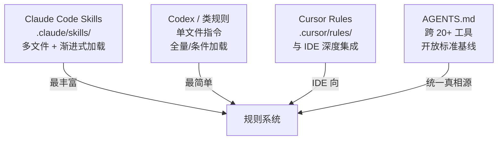

---

title: "对比工具 Skill 系统"

tags:

  - agent方法论

  - skill-engineering

  - 建立认知

created: "2026-07-21"

---

# 对比工具 Skill 系统：Claude Code Skills vs Codex vs Cursor

> 本条目是「Skill Engineering」的第 3 部分，对应学习清单条目 4.1.3。

>

> **前置依赖**：[[01-读外部Skills|读外部Skills]]、[[02-分析优秀skill|分析优秀skill]]

> **为以下铺垫**：[[04-九要素结构|九要素结构]]、CLAUDE.md与AGENTS.md分工

---

## 一、核心观点

> **不同编码工具的「Skill / 规则系统」长得不一样，但 2026 年已经收敛到一个跨工具真相源：AGENTS.md。** 复杂场景用 Claude Code Skills，简单场景用单文件规则，多工具团队用 AGENTS.md 做基线。

给不同工具写「给 Agent 的说明书」，就像给不同品牌的咖啡机写使用手册——机器接口不同，但「放豆、加水、按开关」的底层逻辑一样。看懂差异，你才不会在一个工具里养出的习惯，换个工具就废掉。

---

## 二、定义 / 原理 / 实践 / 示例 / 优劣势
### 2.1 三大系统的结构对比



| 维度 | Claude Code Skills | Codex 类规则 | Cursor Rules | AGENTS.md（跨工具） |
|------|-------------------|-------------|-------------|---------------------|
| **位置** | `.claude/skills/` | 项目根规则文件 | `.cursor/rules/` | 仓库根 `AGENTS.md` |
| **结构** | 多文件（SKILL.md + references/ + scripts/） | 单文件 | 单文件（可条件加载） | 单文件 Markdown |
| **加载** | 渐进式（触发才读） | 全量/条件 | 条件加载 | 启动时读最近一份 |
| **复杂度** | 高（复杂场景） | 低（简单直接） | 中（IDE 集成） | 中（跨工具基线） |

> ⚠️ 工具生态变化极快：Codex / Cursor 的具体路径与格式会随版本变动，上面为当前常见形态；**跨工具请以 AGENTS.md 为可移植基线**（[agents.md](http://agents.md/)）。

### 2.2 原理：为什么收敛到 AGENTS.md

每种工具早期都发明自己的配置文件，结果团队要维护 8 份彼此打架的「真相源」。AGENTS.md 因为简单、开放、被主流工具原生解析，成了「写一份、处处可读」的事实标准。

### 2.3 实践：选型建议

- **单工具团队**：用 Claude Code Skills（功能最丰富，支持子 Agent、多文件、脚本）。

- **多工具团队**：用 AGENTS.md 做跨工具基线，需要工具专属能力时再补 `.claude/` 等。

- **特定 IDE 项目**：用 Cursor Rules 吃 IDE 集成红利，但核心规范仍放 AGENTS.md。

### 2.4 示例：混合使用

```markdown

# .claude/CLAUDE.md

@AGENTS.md

# Claude Code 专属：子 Agent、Skills 触发规则

```

### 2.5 优劣势

- ✅ AGENTS.md 一次编写、20+ 工具可读；Claude Code Skills 能力最强

- ❌ 多格式并存仍有维护成本；工具专属特性无法被 AGENTS.md 表达

---

## 三、最新研究与企业数据（2025–2026）

- **AGENTS.md 已成事实标准**：官方站声称已被 **超过 60,000 个开源项目**采用，并由 Linux Foundation 旗下的 Agentic AI Foundation 治理（[agents.md](http://agents.md/)）。

- **生态覆盖**：AGENTS.md 被 Codex（OpenAI）、Cursor、GitHub Copilot、Gemini CLI、Windsurf、Zed 等主流编码 Agent 原生解析（[agents.md](http://agents.md/)）。

- **Claude Code Skills 的官方定义**：Skill 是含 `SKILL.md` 的目录，支持 references/ 与 scripts/ 多文件架构与渐进式加载（[docs.anthropic.com](https://docs.anthropic.com/en/docs/agents-and-tools/agent-skills)）。

---

## 四、学习资源

- **一手**：[agents.md 开放标准](http://agents.md/) · [Anthropic Agent Skills 文档](https://docs.anthropic.com/en/docs/agents-and-tools/agent-skills)

- **延伸**：CLAUDE.md与AGENTS.md分工 —— 两种文件的精确分工

- **Harness 视角**：[HumanLayer Harness Engineering](https://www.humanlayer.dev/blog/skill-issue-harness-engineering-for-coding-agents)（Skill 是 Harness 的可复用组件）

---

## 五、相关链接

- 系列内：[[01-读外部Skills|读外部Skills]] · [[02-分析优秀skill|分析优秀skill]] · [[04-九要素结构|九要素结构]] · CLAUDE.md与AGENTS.md分工

- 跨系列：[[../01-认知升级/03-2026初HarnessEngineering|Harness Engineering]]

- 系列清单：[[学习路线图/Agent方法论与产品思维学习路线图|Agent 方法论与产品思维学习路线图]]

---

## 六、核心要点

- 🎯 三套系统差异在「结构 / 加载方式」，但 2026 年收敛到 AGENTS.md 做跨工具基线。

- 💡 选型：复杂用 Claude Code Skills，简单用单文件规则，多工具用 AGENTS.md。

- ⚠️ 工具路径会变，把不可移植的「真相源」收敛到 AGENTS.md，别在 8 个格式里重复造轮子。

---

## 参考来源（一手链接 · 可溯源深挖）

- **AGENTS.md 开放标准**（>60k 开源项目采用，Linux Foundation Agentic AI Foundation 治理）：[agents.md](http://agents.md/)

- **Anthropic Agent Skills 文档**（多文件架构 + 渐进式加载）：[docs.anthropic.com/en/docs/agents-and-tools/agent-skills](https://docs.anthropic.com/en/docs/agents-and-tools/agent-skills)

- **HumanLayer (2026)** Harness Engineering（Skill 是 Harness 可复用组件）：[humanlayer.dev/blog/skill-issue-harness-engineering-for-coding-agents](https://www.humanlayer.dev/blog/skill-issue-harness-engineering-for-coding-agents)

## 速记卡（面试闪卡）

**Q1：一句话讲清「对比工具 Skill 系统：Claude Code Skills vs Codex vs Cursor」到底是什么？**

A：不同工具的 Skill/规则系统长得不一样，但 2026 年收敛到跨工具真相源 AGENTS.md。

**Q2：一、核心观点 —— 怎么理解？**

A：像给不同品牌咖啡机写手册：机器接口不同，但"放豆、加水、按开关"的底层逻辑一样。看懂差异，你才不会在 Claude Code 养成的习惯，换个工具就废掉。真相是 AGENTS.md 成跨 20+ 工具基线。

**Q3：二、三大系统的结构与加载差异 —— 怎么理解？**

A：像三种工具箱：Claude Code Skills 是多文件大箱(渐进加载、最强)，Codex/Cursor 是单文件小包(全量/条件加载)，AGENTS.md 是通用说明书(单文件、处处可读)。复杂度 Skills>规则>AGENTS.md，可移植性反过来越大。

**Q4：三、为什么收敛到 AGENTS.md —— 怎么理解？**

A：像团队别维护 8 份打架的文档：每种工具早期各搞配置，结果彼此冲突。AGENTS.md 因简单开放、被主流原生解析，成"写一份处处读"事实标准，由 Linux Foundation 治理、6 万+ 项目采用。

**Q5：四、选型建议 —— 怎么理解？**

A：像按团队规模选工具：单工具用 Claude Code Skills(支持子 Agent/脚本)；多工具用 AGENTS.md 做基线、按需补专属；特定 IDE 用 Cursor Rules 吃集成，核心规范仍放 AGENTS.md。

**Q6：核心速记主线有哪些？**

- 核心观点：三套系统差异在结构/加载，2026 收敛到 AGENTS.md

- 三大系统：Claude Code Skills(多文件) vs Codex/Cursor(单文件) vs AGENTS.md

- 收敛原因：简单开放、写一份处处读，Linux Foundation 治理

- 选型：复杂用 Skills、简单用单文件、多工具用 AGENTS.md

**口诀**

A：三套规则各不同，二〇二六收敛 AGENTS；

复杂用 Skills，简单单文件；

多工具基线稳，一份写就处处读；

互补不替代，开放标准同条路。

## 相关链接

- [[笔记/AI与Agent/方法论/04-Skill Engineering/02-分析优秀skill|分析优秀 skill]]

- [[笔记/AI与Agent/方法论/04-Skill Engineering/01-读外部Skills|读外部 Skills 建立认知]]

- [[笔记/AI与Agent/方法论/04-Skill Engineering/13-Skill版本管理|Skill版本管理]]

- [[笔记/AI与Agent/方法论/04-Skill Engineering/10-Gotchas章节优先|Gotchas章节优先]]

- [[笔记/AI与Agent/方法论/04-Skill Engineering/08-CLAUDE.md与AGENTS.md分工|CLAUDE.md与AGENTS.md分工]]

