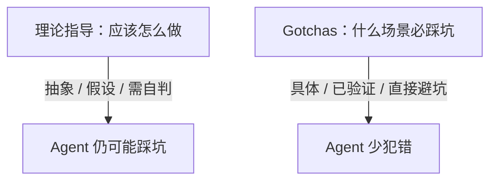

# Gotchas 优先：踩过的坑，比教科书值钱

> 本条目是「Skill Engineering」的第 5 部分，对应学习清单条目 4.2.2。
>
> **前置依赖**：[[04-九要素结构|九要素结构]]
> **为以下铺垫**：[[06-写第一个SKILL|写第一个SKILL]]、CLAUDE.md与AGENTS.md分工

---

## 一、核心观点

> **Skill 里最高价值的内容，是失败处理（Gotchas）：被验证过的「什么场景下一定会踩坑」。它比理论指导值钱。**

带新人最怕什么？不是他不懂「应该怎么做」，而是他不知道「哪个坑必踩」。你给他念十遍「注意性能」，不如在他第一次把上千个文件路径全塞进上下文、把窗口撑爆时，拍肩说一句「记住，超一千个文件先 `glob` 分批」。Gotchas 就是这份「老员工踩坑笔记」——Agent 和人类新人一样，知道避坑比背教条更少吃亏。

---

## 二、定义 / 原理 / 实践 / 示例 / 优劣势

### 2.1 定义

Gotchas（避坑点）= 经过实践验证的失败模式清单。它写「什么场景会出错」，而不是写「应该怎么做」。

### 2.2 原理：为什么经验 > 理论



- 理论是假设，Gotchas 是验证过的；
- 理论抽象，Gotchas 是具体场景；
- 理论要 Agent 自己判断，Gotchas 直接告诉它怎么躲。

### 2.3 实践：写法对比

- ❌ 不好：`请确保代码正确。`（太抽象，Agent 不知「不正确」长什么样）
- ✅ 好：
  ```markdown
  ## Gotchas
  - diff 为空时，通常是因为忘记 `git add`，先提醒而不是直接返回空报告
  - 解析超过 1000 个文件的目录，先 `glob` 分批，避免一次性把路径全塞进上下文
  - mypy / ruff 未安装时，降级为纯文本 review，不要报错中断
  ```

### 2.4 示例：code-review Skill 的 Gotchas 清单

```markdown
## Gotchas
- diff 为空 → 提示先 `git add`
- 文件超过 100 个 → 分批处理
- mypy 未装 → 跳过类型检查
- ruff 未装 → 跳过风格检查
- diff 含二进制文件 → 跳过该文件
```

### 2.5 优劣势

- ✅ 经过验证、具体、直接可执行；把隐性经验变成显性护栏
- ❌ 需要真实踩坑积累；没踩过就写不出真 Gotchas——所以先去 [[01-读外部Skills|读外部Skills]] 偷师别人的坑

---

## 三、最新研究与企业数据（2025–2026）

- **上下文是有限预算**：Anthropic 在《Claude Code Best Practices》中强调「上下文窗口填满后性能下降」，并建议把验证 / 兜底逻辑外置，而非全堆在 Prompt 里（[anthropic.com/engineering/claude-code-best-practices](https://www.anthropic.com/engineering/claude-code-best-practices)）。Gotchas 正是「把踩坑经验外置成确定性提醒」。
- **Skill 可承载失败知识**：Anthropic 的 Skill 架构允许把「历史 bug 清单、常见错误对照」放进 `references/`，按需加载（[docs.anthropic.com](https://docs.anthropic.com/en/docs/agents-and-tools/agent-skills)）。这与 Gotchas 优先一脉相承。
- 注：示例中的「通常 / 多数情况」为经验性表述，非精确统计值；写作时避免编造百分比。

---

## 四、学习资源

- **一手**：[Anthropic Claude Code Best Practices](https://www.anthropic.com/engineering/claude-code-best-practices) · [Agent Skills 文档](https://docs.anthropic.com/en/docs/agents-and-tools/agent-skills)
- **进阶**：[[10-Gotchas章节优先|Gotchas章节优先]]（把 Gotchas 提升为章节级优先级）

---

## 五、相关链接

- 系列内：[[04-九要素结构|九要素结构]] · [[06-写第一个SKILL|写第一个SKILL]] · [[10-Gotchas章节优先|Gotchas章节优先]]
- 跨系列：[[../01-认知升级/03-2026初 Harness Engineering|Harness Engineering]]
- 系列清单：[[学习路线图/Agent 方法论与产品思维学习清单|Agent 方法论与产品思维学习清单]]

---

## 六、核心要点

- 🎯 Skill 里最值钱的是 Gotchas：写「什么场景必踩坑」，比写「应该怎么做」有用。
- 💡 写法要具体可验证：场景 + 已发生 + 直接避坑动作，不要写「请注意性能」这种空话。
- ⚠️ 真 Gotchas 来自真实踩坑；没坑可写时，先读外部 Skill、先干活再回填。

---

## 参考来源（一手链接 · 可溯源深挖）

- **Anthropic**《Claude Code Best Practices》（上下文填满性能下降；兜底逻辑外置）：[anthropic.com/engineering/claude-code-best-practices](https://www.anthropic.com/engineering/claude-code-best-practices)
- **Anthropic Agent Skills 文档**（references/ 可放历史 bug 清单）：[docs.anthropic.com/en/docs/agents-and-tools/agent-skills](https://docs.anthropic.com/en/docs/agents-and-tools/agent-skills)

## 速记卡（面试闪卡）

**Q1：一句话讲清「Gotchas 优先：踩过的坑，比教科书值钱」到底是什么？**
A：**Skill 里最高价值的内容，是失败处理（Gotchas）：被验证过的「什么场景下一定会踩坑」。它比理论指导值钱。**
带新人最怕什么？不是他不懂「应该怎么做」，而是他不知道「哪个坑必踩」。你给他念十遍「注意性能」，不如在他第一次把上千个文件路径全塞进上下文、把窗口撑爆时，拍肩说一句「记住，超一千个文件先  分批」。

**Q2：一、核心观点 —— 怎么理解？**
A：**Skill 里最高价值的内容，是失败处理（Gotchas）：被验证过的「什么场景下一定会踩坑」。它比理论指导值钱。**
带新人最怕什么？不是他不懂「应该怎么做」，而是他不知道「哪个坑必踩」。你给他念十遍「注意性能」，不如在他第一次把上千个文件路径全塞进上下文、把窗口撑爆时，拍肩说一句「记住，超一千个文件先  分批」。Gotchas 就是这份「老员工踩坑笔记」——Agent 和人类新人一样，知道避坑比背教条更少吃亏。
---

**Q3：二、定义 / 原理 / 实践 / 示例 / 优劣势 —— 怎么理解？**
A：Gotchas（避坑点）= 经过实践验证的失败模式清单。它写「什么场景会出错」，而不是写「应该怎么做」。
理论是假设，Gotchas 是验证过的；
理论抽象，Gotchas 是具体场景；
理论要 Agent 自己判断，Gotchas 直接告诉它怎么躲。
❌ 不好：（太抽象，Agent 不知「不正确」长什么样）
✅ 好：
  
`markdown

**Q4：Gotchas —— 怎么理解？**
A：diff 为空 → 提示先 
文件超过 100 个 → 分批处理
mypy 未装 → 跳过类型检查
ruff 未装 → 跳过风格检查
diff 含二进制文件 → 跳过该文件
`
✅ 经过验证、具体、直接可执行；把隐性经验变成显性护栏
❌ 需要真实踩坑积累；没踩过就写不出真 Gotchas——所以先去  偷师别人的坑
---

**Q5：三、最新研究与企业数据（2025–2026） —— 怎么理解？**
A：**上下文是有限预算**：Anthropic 在《Claude Code Best Practices》中强调「上下文窗口填满后性能下降」，并建议把验证 / 兜底逻辑外置，而非全堆在 Prompt 里（）。Gotchas 正是「把踩坑经验外置成确定性提醒」。
**Skill 可承载失败知识**：Anthropic 的 Skill 架构允许把「历史 bug 清单、常见错误对照」放进 ，按需加载（）。这与 Gotchas 优先一脉相承。

**Q6：核心速记主线有哪些？**
A：抓住这几根：一、核心观点、二、定义 / 原理 / 实践 / 示例 / 优劣势、Gotchas、三、最新研究与企业数据（2025–2026）、四、学习资源、五、相关链接。

