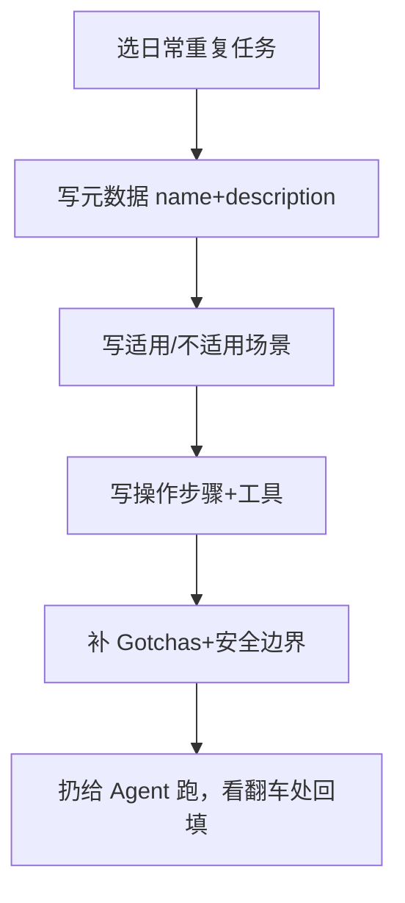

# 写第一个 SKILL.md：从「读」到「造」

> 本条目是「Skill Engineering」的第 6 部分，对应学习清单条目 4.3.1。
>
> **前置依赖**：[[04-九要素结构|九要素结构]]、[[05-Gotchas优先|Gotchas优先]]
> **为以下铺垫**：[[07-压缩到500行|压缩到500行]]、CLAUDE.md与AGENTS.md分工

---

## 一、核心观点

> **选一个你每天重复做的任务，按九要素写出第一个 `SKILL.md`。** 别追求完美，先跑起来——Anthropic 说写 Skill 就像给新同事写入职手册，第一版手册也不需要是宝典。

学做饭的第一课不是读完《烹饪原理》，而是真炒糊一个蛋。Skill 也一样：挑个你天天干、步骤固定、结果能验证的活儿（比如 code review），照着九要素写一版，扔给 Agent 跑，看它翻车在哪，再补 Gotchas。这一圈下来，比看十篇教程都扎实。

---

## 二、定义 / 原理 / 实践 / 示例 / 优劣势

### 2.1 定义

写第一个 SKILL.md = 把某个重复任务，落成「元数据 + 九要素 + 可触发」的可复用模块。

### 2.2 原理：为什么「日常重复」是首选

Anthropic 在《How to create custom skills》里点明：最好的 Skill **解决一个具体、可重复的任务**（[support.anthropic.com](https://support.anthropic.com/en/articles/12512198-creating-custom-skills)）。日常重复的任务你最熟、最容易判断 Agent 做得对不对，回馈最快。

### 2.3 实践：五步法



### 2.4 示例：一个完整 code-review Skill

```markdown
---
name: code-review
description: 审查 git diff 并生成 Markdown 报告。当用户要求 review diff、改了 src 下 .py 文件、或说「审查代码」时触发。
---

# Code Review Skill

## 适用场景
- 用户要求 review diff
- 修改了 src/ 下的 .py 文件

## 不适用场景
- 不对测试文件做风格审查
- 不审查未提交的临时文件

## 输入要求
- 输入是 git diff 或 PR 描述，须含变更文件列表

## 操作步骤
1. 解析 diff，提取变更文件
2. 按风险等级分类（高/中/低）
3. 给出具体行级评论
4. 生成 Markdown 报告

## 工具使用
- `git diff`：获取变更
- `mypy`：类型检查
- `ruff`：风格检查

## 输出格式
Markdown 报告，每条评论含：文件名 / 行号 / 风险等级 / 问题描述 / 改进建议

## 质量标准
- 评论必须附代码证据，禁写「这里写得不好」这类空话

## 失败处理
- 空 diff：提示先提交变更
- 检查工具未装：降级纯文本 review

## 安全边界
- 禁止任何修改命令；破坏性操作必须人确认
```

### 2.5 优劣势

- ✅ 立刻拥有可复用模块；在真实跑动中验证九要素；积累个人 Skill 仓库
- ❌ 第一版常漏 Gotchas / 安全边界；需要迭代，别指望一次写对

---

## 三、最新研究与企业数据（2025–2026）

- **官方「好 Skill」标准**：Anthropic 建议最佳的 Skill 解决具体可重复任务、指令清晰、有用时给示例、明确何时使用、聚焦单一工作流（[support.anthropic.com](https://support.anthropic.com/en/articles/12512198-creating-custom-skills)）。上面示例即按此落地。
- **元数据是触发开关**：`description` 字段是 Claude 判断「何时调用」的依据，官方建议写清触发时机与不触发时机（[docs.anthropic.com](https://docs.anthropic.com/en/docs/agents-and-tools/agent-skills)）。

---

## 四、学习资源

- **一手**：[How to create custom skills](https://support.anthropic.com/en/articles/12512198-creating-custom-skills) · [Agent Skills 文档](https://docs.anthropic.com/en/docs/agents-and-tools/agent-skills)
- **进阶**：[[07-压缩到500行|压缩到500行]]（写完就优化体积）

---

## 五、相关链接

- 系列内：[[04-九要素结构|九要素结构]] · [[05-Gotchas优先|Gotchas优先]] · [[07-压缩到500行|压缩到500行]]
- 跨系列：[[../01-认知升级/03-2026初 Harness Engineering|Harness Engineering]]
- 系列清单：[[学习路线图/Agent 方法论与产品思维学习清单|Agent 方法论与产品思维学习清单]]

---

## 六、核心要点

- 🎯 第一版 Skill：选日常重复任务 → 九要素 → 跑起来看翻车 → 回填 Gotchas。
- 💡 `description` 是触发开关：写清「什么时候用 / 什么时候不用」，Claude 才调得准。
- ⚠️ 别追求完美，先写完再优化；体积与分层见 [[07-压缩到500行|压缩到 500 行]]。

---

## 参考来源（一手链接 · 可溯源深挖）

- **Anthropic**《How to create custom skills》（最佳 Skill 五特征；description 是触发依据）：[support.anthropic.com/en/articles/12512198-creating-custom-skills](https://support.anthropic.com/en/articles/12512198-creating-custom-skills)
- **Anthropic Agent Skills 文档**（SKILL.md 结构与触发机制）：[docs.anthropic.com/en/docs/agents-and-tools/agent-skills](https://docs.anthropic.com/en/docs/agents-and-tools/agent-skills)
- **Anthropic (2025-12-18)**《Equipping agents for the real world with Agent Skills》（写 Skill 如写入职手册）：[anthropic.com/engineering/equipping-agents-for-the-real-world-with-agent-skills](https://www.anthropic.com/engineering/equipping-agents-for-the-real-world-with-agent-skills)

## 速记卡（面试闪卡）

**Q1：一句话讲清「写第一个 SKILL.md：从「读」到「造」」到底是什么？**
A：**选一个你每天重复做的任务，按九要素写出第一个 。** 别追求完美，先跑起来——Anthropic 说写 Skill 就像给新同事写入职手册，第一版手册也不需要是宝典。
学做饭的第一课不是读完《烹饪原理》，而是真炒糊一个蛋。Skill 也一样：挑个你天天干、步骤固定、结果能验证的活儿（比如 code review），照着九要素写一版，扔给 Agent 跑，看它翻车在哪，再补 Gotchas。

**Q2：一、核心观点 —— 怎么理解？**
A：**选一个你每天重复做的任务，按九要素写出第一个 。** 别追求完美，先跑起来——Anthropic 说写 Skill 就像给新同事写入职手册，第一版手册也不需要是宝典。
学做饭的第一课不是读完《烹饪原理》，而是真炒糊一个蛋。Skill 也一样：挑个你天天干、步骤固定、结果能验证的活儿（比如 code review），照着九要素写一版，扔给 Agent 跑，看它翻车在哪，再补 Gotchas。这一圈下来，比看十篇教程都扎实。
---

**Q3：二、定义 / 原理 / 实践 / 示例 / 优劣势 —— 怎么理解？**
A：写第一个 SKILL.md = 把某个重复任务，落成「元数据 + 九要素 + 可触发」的可复用模块。
Anthropic 在《How to create custom skills》里点明：最好的 Skill **解决一个具体、可重复的任务**（）。日常重复的任务你最熟、最容易判断 Agent 做得对不对，回馈最快。

**Q4：适用场景 —— 怎么理解？**
A：用户要求 review diff
修改了 src/ 下的 .py 文件

**Q5：不适用场景 —— 怎么理解？**
A：不对测试文件做风格审查
不审查未提交的临时文件

**Q6：核心速记主线有哪些？**
A：抓住这几根：一、核心观点、二、定义 / 原理 / 实践 / 示例 / 优劣势、适用场景、不适用场景、输入要求、操作步骤。

