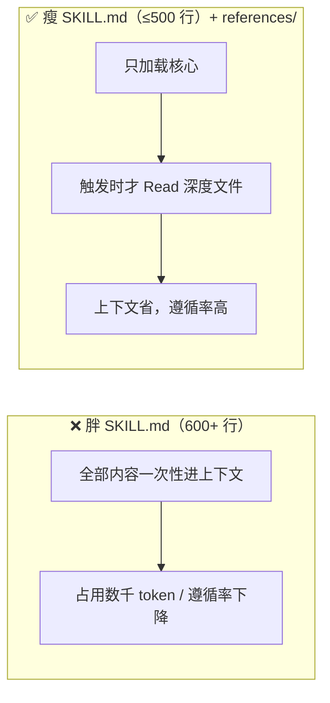

# 压缩到 500 行：把「深度」请出正文，按需再叫它

> 本条目是「Skill Engineering」的第 7 部分，对应学习清单条目 4.3.2。
>
> **前置依赖**：[[06-写第一个SKILL|写第一个SKILL]]
> **为以下铺垫**：CLAUDE.md与AGENTS.md分工、[[10-Gotchas章节优先|Gotchas章节优先]]

---

## 一、核心观点

> **`SKILL.md` 正文控制在数百行以内（业界常用 500 行作经验上限），把深度内容搬进 `references/`，按需加载。** 上下文窗口是 Agent 的「办公桌」——桌上堆越多，越找不到重点。

你给实习生发手册，会把他这辈子可能用到的所有 SOP 全打印塞他工位吗？不会。你给一本薄的「常用操作」，附录放柜子里，需要时再翻。SKILL.md 就是那本薄手册：核心是触发后能立刻用上的；长篇示例、完整规范、工具详解，统统请进 `references/`，Agent 真遇到对应场景才去读。

---

## 二、定义 / 原理 / 实践 / 示例 / 优劣势

### 2.1 定义

压缩到 500 行 = 把 `SKILL.md` 正文收敛到「核心指令」，深度材料外置到 `references/`，遵循渐进式披露（progressive disclosure）。

### 2.2 原理：上下文成本



- **官方额度**：Anthropic 文档给出 Skill 三层加载的 token 成本——Level 1 元数据每次启动约 **100 token/个**；Level 2 正文「**5k token 以内**」；Level 3 资源「实质无限」（[docs.anthropic.com](https://docs.anthropic.com/en/docs/agents-and-tools/agent-skills)）。500 行 ≈ 几 k token，正是 Level 2 上限的实操翻译。
- **窗口会满**：Anthropic 在最佳实践里强调「上下文窗口填满后性能下降」，堆料越多越拖慢、越易错（[anthropic.com/engineering/claude-code-best-practices](https://www.anthropic.com/engineering/claude-code-best-practices)）。

### 2.3 实践：识别与迁移

- **留在 SKILL.md**：适用场景、核心操作步骤、Gotchas、安全边界。
- **搬进 `references/`**：详细示例 → `references/examples.md`；完整规范 → `references/conventions.md`；工具详解 → `references/tools.md`。
- **引用方式**：正文写「详细步骤见 `references/steps.md`」，Agent 按需 Read。

### 2.4 示例：目录结构

```text
my-skill/
├── SKILL.md          # 核心（≤500 行）
├── references/       # 深度内容，按需加载
│   ├── examples.md
│   ├── conventions.md
│   └── tools.md
└── scripts/          # 可执行脚本
    ├── check.py
    └── fix.sh
```

### 2.5 优劣势

- ✅ 上下文占用低、遵循率高、维护易（核心与深度分离）
- ❌ 需要想清楚「什么算核心」；过度拆分也会增加跳转成本

---

## 三、最新研究与企业数据（2025–2026）

- **三层 token 成本（一手）**：Level 1 元数据约 100 token/个 Skill；Level 2 正文 <5k token；Level 3 资源实质无限（[docs.anthropic.com](https://docs.anthropic.com/en/docs/agents-and-tools/agent-skills)）。
- **上下文预算原则（一手）**：Claude Code 最佳实践明确「上下文窗口填满后性能下降」，给出 `Keep CLAUDE.md lean` 等建议（[anthropic.com/engineering/claude-code-best-practices](https://www.anthropic.com/engineering/claude-code-best-practices)）。
- 注：「500 行」为社区常用经验上限，非 Anthropic 硬性规定；其依据是官方「Level 2 <5k token」额度，按中文排版约合数百行。

---

## 四、学习资源

- **一手**：[Anthropic Agent Skills 文档](https://docs.anthropic.com/en/docs/agents-and-tools/agent-skills) · [Claude Code Best Practices](https://www.anthropic.com/engineering/claude-code-best-practices)
- **进阶**：[[12-多文件架构|多文件架构]]（references/ 与 scripts/ 的完整三层）

---

## 五、相关链接

- 系列内：[[06-写第一个SKILL|写第一个SKILL]] · [[12-多文件架构|多文件架构]] · [[10-Gotchas章节优先|Gotchas章节优先]]
- 跨系列：[[../01-认知升级/03-2026初 Harness Engineering|Harness Engineering]]
- 系列清单：[[学习路线图/Agent 方法论与产品思维学习清单|Agent 方法论与产品思维学习清单]]

---

## 六、核心要点

- 🎯 SKILL.md 正文压到数百行（经验上限 ~500 行），深度内容搬进 `references/`。
- 💡 依据：官方 Level 2 正文 <5k token、Level 3 资源无限；上下文满则性能降。
- ⚠️ 留核心（场景/步骤/Gotchas/安全），搬深度（示例/规范/工具详解）。

---

## 参考来源（一手链接 · 可溯源深挖）

- **Anthropic Agent Skills 文档**（Level 1 ~100 token；Level 2 <5k token；Level 3 无限）：[docs.anthropic.com/en/docs/agents-and-tools/agent-skills](https://docs.anthropic.com/en/docs/agents-and-tools/agent-skills)
- **Anthropic**《Claude Code Best Practices》（上下文填满性能下降；Keep CLAUDE.md lean）：[anthropic.com/engineering/claude-code-best-practices](https://www.anthropic.com/engineering/claude-code-best-practices)

## 速记卡（面试闪卡）

**Q1：一句话讲清「压缩到 500 行：把「深度」请出正文，按需再叫它」到底是什么？**
A：** 正文控制在数百行以内（业界常用 500 行作经验上限），把深度内容搬进 ，按需加载。** 上下文窗口是 Agent 的「办公桌」——桌上堆越多，越找不到重点。
你给实习生发手册，会把他这辈子可能用到的所有 SOP 全打印塞他工位吗？不会。你给一本薄的「常用操作」，附录放柜子里，需要时再翻。

**Q2：一、核心观点 —— 怎么理解？**
A：** 正文控制在数百行以内（业界常用 500 行作经验上限），把深度内容搬进 ，按需加载。** 上下文窗口是 Agent 的「办公桌」——桌上堆越多，越找不到重点。
你给实习生发手册，会把他这辈子可能用到的所有 SOP 全打印塞他工位吗？不会。你给一本薄的「常用操作」，附录放柜子里，需要时再翻。SKILL.md 就是那本薄手册：核心是触发后能立刻用上的；长篇示例、完整规范、工具详解，统统请进 ，Agent 真遇到对应场景才去读。
---

**Q3：二、定义 / 原理 / 实践 / 示例 / 优劣势 —— 怎么理解？**
A：压缩到 500 行 = 把  正文收敛到「核心指令」，深度材料外置到 ，遵循渐进式披露（progressive disclosure）。
**官方额度**：Anthropic 文档给出 Skill 三层加载的 token 成本——Level 1 元数据每次启动约 **100 token/个**；Level 2 正文「**5k token 以内**」；Level 3 资源「实质无限」（）。

**Q4：三、最新研究与企业数据（2025–2026） —— 怎么理解？**
A：**三层 token 成本（一手）**：Level 1 元数据约 100 token/个 Skill；Level 2 正文 <5k token；Level 3 资源实质无限（）。
**上下文预算原则（一手）**：Claude Code 最佳实践明确「上下文窗口填满后性能下降」，给出  等建议（）。

**Q5：四、学习资源 —— 怎么理解？**
A：**一手**： · 
**进阶**：（references/ 与 scripts/ 的完整三层）
---

**Q6：核心速记主线有哪些？**
A：抓住这几根：一、核心观点、二、定义 / 原理 / 实践 / 示例 / 优劣势、三、最新研究与企业数据（2025–2026）、四、学习资源、五、相关链接、六、核心要点。

