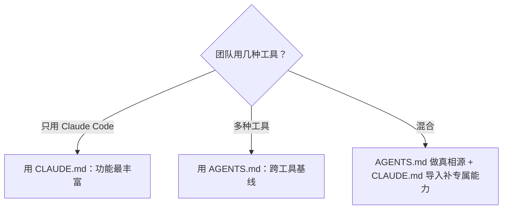

---

title: "CLAUDE.md与AGENTS.md分工"

tags:

  - agent方法论

  - skill-engineering

  - 编写哲学

created: "2026-07-21"

---

# CLAUDE.md 与 AGENTS.md 分工：公司内网手册 vs 行业通用手册

> 本条目是「Skill Engineering」的第 8 部分，对应学习清单条目 4.4.1。

>

> **前置依赖**：[[04-九要素结构|九要素结构]]、[[06-写第一个SKILL|写第一个SKILL]]、[[07-压缩到500行|压缩到500行]]

> **为以下铺垫**：[[09-编写黄金规则|编写黄金规则]]、[[10-Gotchas章节优先|Gotchas章节优先]]

---

## 一、核心观点

> **CLAUDE.md 是「Claude Code 专属内网手册」（功能最丰富）；AGENTS.md 是「跨 20+ 工具的行业通用手册」（开放基线）。单工具用前者，多工具用后者，混合时让 AGENTS.md 做唯一真相源。**

一个人公司可以只发内部 Wiki；但当你和外包、合作方、各种 AI 工具一起干活，你就想要一份「谁都能读的通用手册」。CLAUDE.md 像公司内网——功能强但只有自家系统进得去；AGENTS.md 像贴在门上的行业标准牌——简单、开放、各家工具都认。

---

## 二、定义 / 原理 / 实践 / 示例 / 优劣势
### 2.1 两者对比



| 维度 | CLAUDE.md | AGENTS.md |
|------|-----------|-----------|
| **适用范围** | 仅 Claude Code | 20+ 工具（Codex/Cursor/Copilot/Zed…） |
| **能力** | 丰富：分层、子 Agent、Skills、条件加载 | 简单：单一 Markdown 基线 |
| **治理** | Anthropic 产品文件 | Linux Foundation Agentic AI Foundation 开放标准 |
| **劣势** | 绑定单一工具（vendor lock-in） | 表达不了工具专属能力 |

### 2.2 原理：为什么「一份通用」胜「八份专属」

早期每种工具各搞配置文件，团队要维护多份彼此打架的「真相源」。AGENTS.md 因简单开放、被主流工具原生解析，成了「写一份、处处可读」的事实标准（[agents.md](http://agents.md/)）。

### 2.3 实践：混合用法

```markdown

# .claude/CLAUDE.md

@AGENTS.md

# Claude Code 专属：子 Agent、Skills 触发、条件加载规则

```

### 2.4 优劣势

- ✅ AGENTS.md 一次编写处处可读；CLAUDE.md 能力最强、深度集成

- ❌ 多格式仍有维护成本；AGENTS.md 表达不了工具专属特性（需回退 CLAUDE.md）

---

## 三、最新研究与企业数据（2025–2026）

- **采用规模（一手）**：AGENTS.md 官方站称已被 **超过 60,000 个开源项目**采用，并由 Linux Foundation 旗下 Agentic AI Foundation 治理，被 Codex、Cursor、Copilot、Gemini CLI、Windsurf、Zed 等原生解析（[agents.md](http://agents.md/)）。

- **写臃肿反而有害（二手汇总，原始研究待核实）**：据 rywalker.com 对一项 ETH Zurich 2026 研究（覆盖 138 个仓库、5,694 个 PR）的汇总，把 AGENTS.md 写成「README 式复述」会让 Agent 性能下降 **2–3%**、token 成本上升 **20%+**；真正有用的反而是「窄而不可推断的指令」（确切构建/测试命令、Gotchas、验证步骤）。(来源待核实：ETH Zurich 2026 研究报告原文链接)

- **CLAUDE.md 体量（一手）**：Anthropic 建议 CLAUDE.md 控制在约 **200 行**以内，过长人与 Agent 都会 skim-read（[anthropic.com/engineering/claude-code-best-practices](https://www.anthropic.com/engineering/claude-code-best-practices)；亦见 [[09-编写黄金规则|编写黄金规则]]）。

---

## 四、学习资源

- **一手**：[agents.md 开放标准](http://agents.md/) · [Anthropic Claude Code Best Practices](https://www.anthropic.com/engineering/claude-code-best-practices)

- **延伸（二手研究）**：[rywalker.com Agent Skills / AGENTS.md 研究](https://rywalker.com/research/agents-md-standard)

- **进阶**：[[09-编写黄金规则|编写黄金规则]]（两条文件共同遵守的写法纪律）

---

## 五、相关链接

- 系列内：[[03-对比工具Skill系统|对比工具Skill系统]] · [[09-编写黄金规则|编写黄金规则]] · [[07-压缩到500行|压缩到500行]]

- 跨系列：[[../01-认知升级/03-2026初HarnessEngineering|Harness Engineering]]

- 系列清单：[[学习路线图/Agent方法论与产品思维学习路线图|Agent 方法论与产品思维学习路线图]]

---

## 六、核心要点

- 🎯 CLAUDE.md = Claude Code 专属（强）；AGENTS.md = 跨工具基线（开放）。

- 💡 单工具用 CLAUDE.md；多工具用 AGENTS.md；混合时 AGENTS.md 做真相源，CLAUDE.md `@` 导入补专属。

- ⚠️ 两条都别写臃肿：AGENTS.md 写「窄而不可推断的指令」才有用，复述 README 反而伤性能。

---

## 参考来源（一手链接 · 可溯源深挖）

- **AGENTS.md 开放标准**（>60k 开源项目采用，Linux Foundation Agentic AI Foundation）：[agents.md](http://agents.md/)

- **Anthropic**《Claude Code Best Practices》（CLAUDE.md ~200 行）：[anthropic.com/engineering/claude-code-best-practices](https://www.anthropic.com/engineering/claude-code-best-practices)

- **rywalker.com (2026)** 对 ETH Zurich 研究的汇总（臃肿 AGENTS.md 性能 -2~3%、token +20%；原始论文链接待核实）：[rywalker.com/research/agents-md-standard](https://rywalker.com/research/agents-md-standard)

## 速记卡（面试闪卡）

**Q1：一句话讲清「CLAUDE.md 与 AGENTS.md 分工：公司内网手册 vs 行业通用手册」到底是什么？**

A：CLAUDE.md 是 Claude Code 专属内网手册，AGENTS.md 是跨 20+ 工具的行业通用基线，混合时后者做唯一真相源。

**Q2：一、核心观点 —— 怎么理解？**

A：像公司内网 vs 行业招牌：CLAUDE.md 是只有自家系统进得去的「内网」（功能最丰富），AGENTS.md 是各家工具都认的「通用牌」（开放基线 Open Standard）。单工具用前者，多工具用后者，混合时让 AGENTS.md 做唯一真相源。

**Q3：二、定义 / 原理 / 实践 / 示例 / 优劣势 —— 怎么理解？**

A：像对比两份手册的「内容厚度」：CLAUDE.md 能分层、挂子 Agent、调 Skills（能力最强）；AGENTS.md 只是单一 Markdown 基线（简单但开放）。一张对比表看懂谁适合啥场景。

**Q4：三、最新研究与企业数据（2025–2026） —— 怎么理解？**

A：像看「采用率成绩单」：AGENTS.md 已被超 6 万开源项目采用、由 Linux Foundation 治理；而把它写成 README 复述反而让 Agent 性能降 2–3%、token 涨 20%+——指令要窄而不可推断。

**Q5：四、学习资源 —— 怎么理解？**

A：像备考书单：一手看 agents.md 开放标准与 Anthropic 最佳实践；二手看 rywalker 对 ETH 研究的汇总；进阶接「编写黄金规则」。记住窄指令才有效。

**Q6：核心速记主线有哪些？**

- CLAUDE.md = Claude Code 专属（强）；AGENTS.md = 跨工具基线（开放）

- 单工具用 CLAUDE.md；多工具用 AGENTS.md；混合时后者做真相源

- AGENTS.md 写「窄而不可推断的指令」才有用，复述 README 反伤性能

- 60k+ 项目采用、Linux Foundation 治理，成事实标准

**口诀**

A：CLAUDE 内网强，AGENTS 通用广；

单用前者多后者，真相源不撞；

六万项目同认账，开源治理稳当；

窄指令才顶用，开放标准共航。

## 相关链接

- [[笔记/AI与Agent/方法论/04-Skill Engineering/10-Gotchas章节优先|Gotchas章节优先]]

- [[笔记/AI与Agent/方法论/04-Skill Engineering/09-编写黄金规则|编写黄金规则]]

- [[笔记/AI与Agent/方法论/04-Skill Engineering/05-Gotchas优先|Gotchas优先]]

- [[笔记/AI与Agent/方法论/04-Skill Engineering/13-Skill版本管理|Skill版本管理]]

- [[笔记/AI与Agent/方法论/04-Skill Engineering/06-写第一个SKILL|写第一个SKILL.md]]

