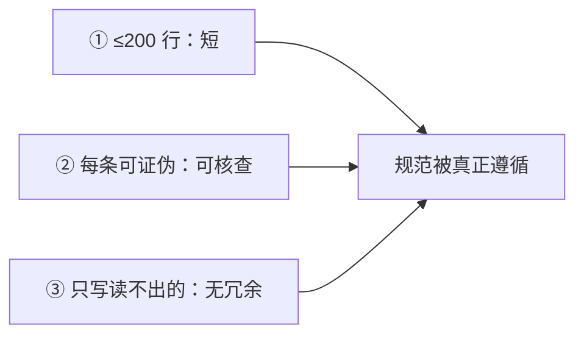

---

title: "编写黄金规则"

tags:

  - agent方法论

  - skill-engineering

  - 编写哲学

created: "2026-07-21"

---

# 编写黄金规则：三条铁律，让规范不被当耳旁风

> 本条目是「Skill Engineering」的第 9 部分，对应学习清单条目 4.4.2。

>

> **前置依赖**：CLAUDE.md与AGENTS.md分工

> **为以下铺垫**：[[10-Gotchas章节优先|Gotchas章节优先]]、[[11-延迟加载机制|延迟加载机制]]

---

## 一、核心观点

> **给 Agent 的规范文件（CLAUDE.md / AGENTS.md / Skill）遵守三条黄金规则：① 控制在 200 行以内；② 每条规则必须可证伪；③ 只写 Agent 自己读不出来的事。**

定家规最怕两件事：列满一墙没人看（包括 Agent），以及写一堆「要整洁」这种等于没说的空话。真正管用的得像「周一到周五 10 点前倒垃圾」——短、可核查、且是 Agent 翻遍仓库也猜不到的隐性知识。第三条最关键：Agent 能从代码读出的事你别唠叨。

---

## 二、定义 / 原理 / 实践 / 示例 / 优劣势
### 2.1 规则一：控制在 200 行以内

- **原因**：超过 200 行，人和 Agent 都会 skim-read（略读），遵循率下降。这是 Anthropic 官方建议——CLAUDE.md 控制在约 200 行（[anthropic.com/engineering/claude-code-best-practices](https://www.anthropic.com/engineering/claude-code-best-practices)）。

- **实践**：根文件超了就拆分 + 渐进式加载（见 [[07-压缩到500行|压缩到 500 行]]）。

### 2.2 规则二：每条规则必须可证伪

- **原因**：不可证伪 = 无法验证 = Agent 不知算不算遵守 = 形同虚设。

- **示例**：❌「写干净代码」 → ✅「所有 async 函数必须设 timeout」。

### 2.3 规则三：只写 Agent 自己读不出来的事

- **原因**：Agent 能从代码 / 文档读出的信息不必写（纯浪费上下文）；只写隐性知识——为什么当初这么选型、历史决策、隐含约束。

- **示例**：❌「项目用 TypeScript」（`tsconfig.json` 会告诉它） → ✅「为什么选 async/await 而非回调：历史上吃过回调地狱的亏」。

### 2.4 三条规则的关系

### 2.5 优劣势

- ✅ 短、可核查、无冗余；Agent 遵循率高

- ❌ 写之前要判断「这条 Agent 能不能自己读出来」，有思考成本

---

## 三、最新研究与企业数据（2025–2026）

- **200 行上限（一手）**：Anthropic《Claude Code Best Practices》建议 CLAUDE.md 控制在约 200 行，过长人与 Agent 都会略读（[anthropic.com/engineering/claude-code-best-practices](https://www.anthropic.com/engineering/claude-code-best-practices)）。

- **「窄而不可推断的指令」才有效（二手汇总，原始研究待核实）**：据 rywalker.com 对 ETH Zurich 2026 研究（138 仓库、5,694 PR）的汇总，把规范写成 README 式复述反而让性能下降 2–3%、token 成本 +20%；真正有用的是确切的构建/测试命令、Gotchas、验证步骤——这正是规则二、三的实证支撑。(来源待核实：ETH Zurich 2026 研究报告原文链接)

- **官方口径一致**：AGENTS.md 规范本身也建议放「exact build/test commands, gotchas, verification steps」，而非泛泛背景（[agents.md](http://agents.md/)）。

---

## 四、学习资源

- **一手**：[Anthropic Claude Code Best Practices](https://www.anthropic.com/engineering/claude-code-best-practices) · [agents.md](http://agents.md/)

- **延伸（二手研究）**：[rywalker.com Agent Skills / AGENTS.md 研究](https://rywalker.com/research/agents-md-standard)

- **进阶**：[[10-Gotchas章节优先|Gotchas章节优先]]（把可证伪的避坑点摆到 C 位）

---

## 五、相关链接

- 系列内：CLAUDE.md与AGENTS.md分工 · [[10-Gotchas章节优先|Gotchas章节优先]] · [[07-压缩到500行|压缩到500行]]

- 跨系列：[[../01-认知升级/03-2026初HarnessEngineering|Harness Engineering]]

- 系列清单：[[学习路线图/Agent方法论与产品思维学习路线图|Agent 方法论与产品思维学习路线图]]

---

## 六、核心要点

- 🎯 三条黄金规则：① ≤200 行；② 每条可证伪；③ 只写 Agent 读不出来的事。

- 💡 空话（「写干净代码」）和冗余（「用 TypeScript」）是两大毒：一个不可核查，一个 Agent 自己能读。

- ⚠️ 第三条最反直觉：克制不写，比多写更难也更重要。

---

## 参考来源（一手链接 · 可溯源深挖）

- **Anthropic**《Claude Code Best Practices》（CLAUDE.md ~200 行；过长被略读）：[anthropic.com/engineering/claude-code-best-practices](https://www.anthropic.com/engineering/claude-code-best-practices)

- **AGENTS.md 开放标准**（建议放确切构建/测试命令、Gotchas）：[agents.md](http://agents.md/)

- **rywalker.com (2026)** 对 ETH Zurich 研究的汇总（窄指令有效、复述有害；原始论文链接待核实）：[rywalker.com/research/agents-md-standard](https://rywalker.com/research/agents-md-standard)

## 速记卡（面试闪卡）

**Q1：一句话讲清「编写黄金规则：三条铁律，让规范不被当耳旁风」到底是什么？**

A：给 Agent 的规范要≤200行、每条可证伪、只写它读不出的隐性知识。

**Q2：一、核心观点 —— 怎么理解？**

A：像定家规：列满一墙没人看，写"要整洁"等于没说。好规范得像"周一到五点前倒垃圾"——短、可核查、且是 Agent 翻遍仓库也猜不到的隐性知识。

**Q3：二、定义 / 原理 / 实践 / 示例 / 优劣势 —— 怎么理解？**

A：三条铁律像三道关：①≤200 行（过长人和 Agent 都略读）；②每条可证伪（❌"写干净代码"→✅"async 必设 timeout"）；③只写 Agent 读不出的事（❌"用 TS"→✅"为何选 async"）。

**Q4：三、最新研究与企业数据（2025–2026） —— 怎么理解？**

A：像有官方背书：Anthropic 建议 CLAUDE.md 约 200 行，过长被略读；二手汇总称把规范写成 README 复述反降 2–3% 性能、token +20%，窄而不可推断的指令才有效。

**Q5：四、学习资源 —— 怎么理解？**

A：像查一手出处：Anthropic《Claude Code Best Practices》与 agents.md 标准主张放确切构建/测试命令与 Gotchas；rywalker 对 ETH 研究的汇总（原始待核实）作延伸。

**Q6：核心速记主线有哪些？**

- 铁律①：规范控制在 200 行以内，避免略读

- 铁律②：每条规则必须可证伪、可核查

- 铁律③：只写 Agent 读不出的隐性知识，不冗余

- 空话与冗余是两大毒，第三条最反直觉

**口诀**

A：规范三条铁律记，控在二百行；

每条可证伪，空话不顶用；

只写读不出，冗余是大忌；

克制不写难，隐性才有力。

## 相关链接

- [[笔记/AI与Agent/方法论/04-Skill Engineering/10-Gotchas章节优先|Gotchas章节优先]]

- [[笔记/AI与Agent/方法论/04-Skill Engineering/08-CLAUDE.md与AGENTS.md分工|CLAUDE.md与AGENTS.md分工]]

- [[笔记/AI与Agent/方法论/04-Skill Engineering/07-压缩到500行|压缩到500行]]

- [[笔记/AI与Agent/方法论/04-Skill Engineering/13-Skill版本管理|Skill版本管理]]

- [[笔记/AI与Agent/方法论/04-Skill Engineering/05-Gotchas优先|Gotchas优先]]

