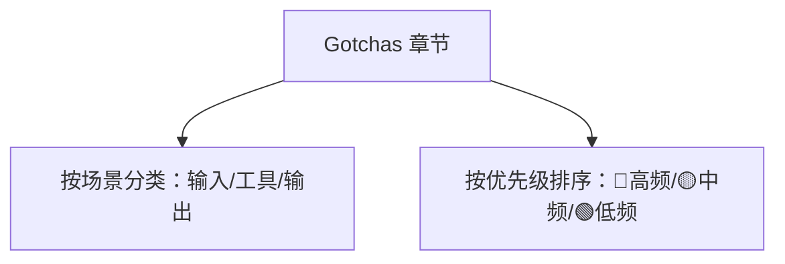

---

title: "Gotchas章节优先"

tags:

  - agent方法论

  - skill-engineering

  - 编写哲学

created: "2026-07-21"

---

# Gotchas 章节优先：把避坑清单钉在工位正对面

> 本条目是「Skill Engineering」的第 10 部分，对应学习清单条目 4.5.1。

>

> **前置依赖**：[[09-编写黄金规则|编写黄金规则]]

> **为以下铺垫**：[[11-延迟加载机制|延迟加载机制]]、[[12-多文件架构|多文件架构]]

---

## 一、核心观点

> **在 Skill 文档里，Gotchas（已验证的失败模式）应作为一等章节、放在靠前位置**——经验证实的避坑知识，权重高于理论指导。

[[05-Gotchas优先|上一章]]讲「Gotchas 为什么值钱」，这章讲「把它摆到 C 位」。就像工厂把安全须知贴在机器正对面、而不是夹在操作手册第 20 页——Agent 一打开 Skill 先看到坑在哪，比读完一长串「应该怎么做」再凭记忆躲坑靠谱得多。

---

## 二、定义 / 原理 / 实践 / 示例 / 优劣势
### 2.1 定义

Gotchas 章节优先 = 在 Skill 结构里，把「失败处理」提升为靠前的一等章节，且按场景 / 优先级组织，而非塞在文末的附录。

### 2.2 原理：为什么「靠前」且「优先」

- Agent 是概率性的：开头的强提醒比结尾的附录更容易被「带进上下文」并执行；

- 经验 > 理论：验证过的坑比抽象教条更防错（见 [[05-Gotchas优先|Gotchas优先]]）。

### 2.3 实践：两种组织法



- **按场景**：输入相关（空 diff）、工具相关（mypy 未装）、输出相关（报告脱敏）。

- **按优先级**：🔴 高频必放最前，🟢 低频可后置甚至移入 `references/`。

### 2.4 示例

```markdown

### 🔴 高频

- diff 为空：通常因忘记 git add，先提醒而非返空报告

- 文件 >100 个：分批处理

### 🟡 中频

- mypy 未装：跳过类型检查

- ruff 未装：跳过风格检查

### 🟢 低频

- 报告过长：分页

- 含敏感信息：脱敏

```

### 2.5 优劣势

- ✅ 强提醒先入上下文；按优先级分配注意力；高频坑零遗漏

- ❌ 需维护优先级（坑的频率会变）；过度堆砌也占上下文

---

## 三、最新研究与企业数据（2025–2026）

- **上下文是预算（一手）**：Anthropic 在《Claude Code Best Practices》强调「上下文窗口填满后性能下降」，把高频、确定性提醒前置，正是对有限预算的优化（[anthropic.com/engineering/claude-code-best-practices](https://www.anthropic.com/engineering/claude-code-best-practices)）。

- **让错误「结构性不可能」（一手）**：HumanLayer 在 Harness Engineering 中给出核心原则——「每次 Agent 犯错，就把它工程化成永不重犯的结构」。Gotchas 章节优先正是这一原则的 Skill 层落地（[humanlayer.dev](https://www.humanlayer.dev/blog/skill-issue-harness-engineering-for-coding-agents)）。

- **Skill 可承载失败知识（一手）**：Anthropic 文档允许把「历史 bug 清单、常见错误对照」放进 `references/`（[docs.anthropic.com](https://docs.anthropic.com/en/docs/agents-and-tools/agent-skills)）。

---

## 四、学习资源

- **一手**：[Anthropic Claude Code Best Practices](https://www.anthropic.com/engineering/claude-code-best-practices) · [HumanLayer Harness Engineering](https://www.humanlayer.dev/blog/skill-issue-harness-engineering-for-coding-agents) · [Agent Skills 文档](https://docs.anthropic.com/en/docs/agents-and-tools/agent-skills)

- **关联**：[[05-Gotchas优先|Gotchas优先]] · [[12-多文件架构|多文件架构]]（低频 Gotchas 移 references/）

---

## 五、相关链接

- 系列内：[[05-Gotchas优先|Gotchas优先]] · [[09-编写黄金规则|编写黄金规则]] · [[12-多文件架构|多文件架构]]

- 跨系列：[[../01-认知升级/03-2026初HarnessEngineering|Harness Engineering]]

- 系列清单：[[学习路线图/Agent方法论与产品思维学习路线图|Agent 方法论与产品思维学习路线图]]

---

## 六、核心要点

- 🎯 Gotchas 不是附录，是 C 位一等章节，放在 Skill 靠前位置。

- 💡 两种组织：按场景（输入/工具/输出）+ 按优先级（🔴高频 → 🟢低频）。

- ⚠️ 高频坑零遗漏前置；低频坑可下沉到 `references/`，别占正文上下文。

---

## 参考来源（一手链接 · 可溯源深挖）

- **Anthropic**《Claude Code Best Practices》（上下文填满性能下降）：[anthropic.com/engineering/claude-code-best-practices](https://www.anthropic.com/engineering/claude-code-best-practices)

- **HumanLayer (2026)** Harness Engineering（让错误结构性不可能）：[humanlayer.dev/blog/skill-issue-harness-engineering-for-coding-agents](https://www.humanlayer.dev/blog/skill-issue-harness-engineering-for-coding-agents)

- **Anthropic Agent Skills 文档**（references/ 可放历史 bug 清单）：[docs.anthropic.com/en/docs/agents-and-tools/agent-skills](https://docs.anthropic.com/en/docs/agents-and-tools/agent-skills)

## 速记卡（面试闪卡）

**Q1：一句话讲清「Gotchas 章节优先：把避坑清单钉在工位正对面」到底是什么？**

A：在 Skill 文档里把 Gotchas(已验证的失败模式)提为靠前的一等章节，权重高于理论。

**Q2：一、核心观点 —— 怎么理解？**

A：像工厂把安全须知贴在机器正对面，而非夹在操作手册第 20 页。Agent 一开 Skill 先见坑，比读完一长串"该怎么做"再凭记忆躲坑靠谱得多。

**Q3：二、定义 / 原理 / 实践 / 示例 / 优劣势 —— 怎么理解？**

A：Gotchas 章节优先=把"失败处理"提为靠前一等章节，按场景(输入/工具/输出)或优先级(🔴高频→🟢低频)组织。原理：Agent 是概率性的，开头强提醒比结尾附录更易进上下文；经验>理论更防错。

**Q4：三、最新研究与企业数据（2025–2026） —— 怎么理解？**

A：Anthropic 说上下文填满性能下降，把高频提醒前置正是对有限预算的优化。HumanLayer 原则：每次 Agent 犯错就工程化成永不重犯的结构——Gotchas 优先正是这原则的 Skill 层落地。

**Q5：六、核心要点 —— 怎么理解？**

A：三句：Gotchas 不是附录是 C 位一等章节；两种组织(场景+优先级)，高频零遗漏前置、低频沉 references/；强提醒先入上下文、按优先级分配注意力。

**Q6：核心速记主线有哪些？**

- Gotchas 是 C 位一等章节，靠前不藏附录

- 两法组织：按场景(输入/工具/输出)+ 按优先级

- 高频坑前置零遗漏，低频沉 references/

- 代价：要维护优先级，过度堆砌占上下文

**口诀**

A：避坑清单钉对面，别藏手册第二十页

高频红标最前置，低频沉进 references

经验胜过空理论，强提醒先进上下文

Skill 写好少踩雷，面试不怯场

## 相关链接

- [[笔记/AI与Agent/方法论/04-Skill Engineering/08-CLAUDE.md与AGENTS.md分工|CLAUDE.md与AGENTS.md分工]]

- [[笔记/AI与Agent/方法论/04-Skill Engineering/09-编写黄金规则|编写黄金规则]]

- [[笔记/AI与Agent/方法论/04-Skill Engineering/05-Gotchas优先|Gotchas优先]]

- [[笔记/AI与Agent/方法论/04-Skill Engineering/13-Skill版本管理|Skill版本管理]]

- [[笔记/AI与Agent/方法论/04-Skill Engineering/06-写第一个SKILL|写第一个SKILL.md]]

