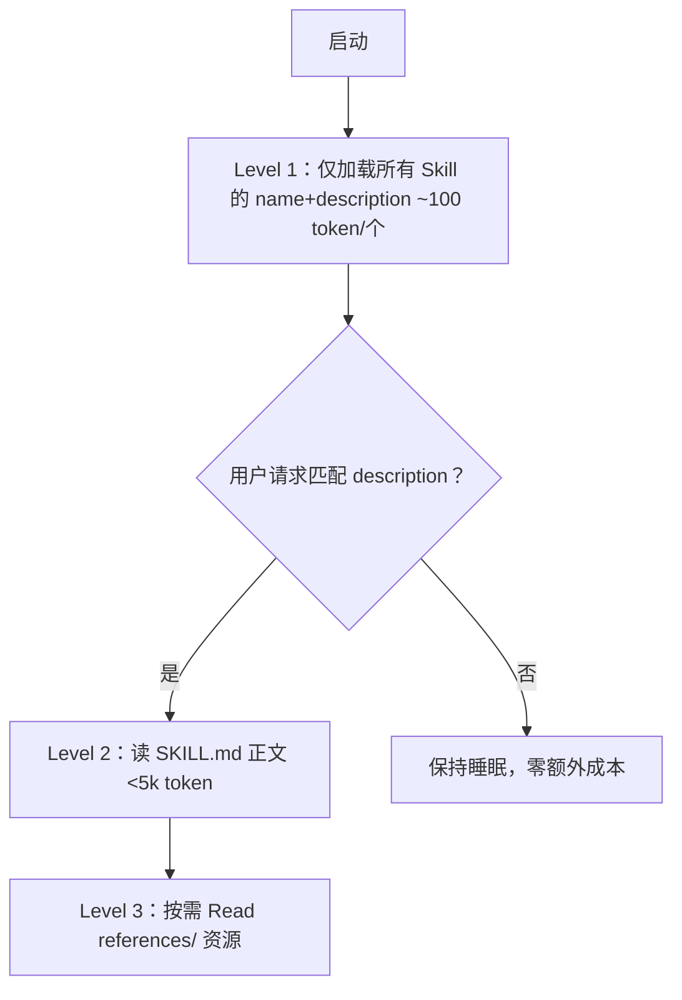

---

title: "延迟加载机制"

tags:

  - agent方法论

  - skill-engineering

  - 生命周期管理

created: "2026-07-21"

---

# 延迟加载机制：平时不扰民，用时再现身

> 本条目是「Skill Engineering」的第 11 部分，对应学习清单条目 4.6.1。

>

> **前置依赖**：[[09-编写黄金规则|编写黄金规则]]、[[10-Gotchas章节优先|Gotchas章节优先]]

> **为以下铺垫**：[[12-多文件架构|多文件架构]]、[[13-Skill版本管理|Skill版本管理]]

---

## 一、核心观点

> **Skill 默认「睡着了」：只在被触发时才加载进上下文，而不是启动时全量灌入。** 两种触发方式——`description` 自动匹配 vs 用户显式 `/skill-name` 调用。

办公室里的专家平时不在会上刷存在感，你一提到相关问题他才进来；你也可以直接点名叫他。Skill 就是这位专家：启动时只有它的「简历摘要」（name+description）在系统提示里挂着，正文和深度资料都睡在硬盘上，触发才醒。这就是为什么你装 50 个 Skill 也不会把上下文撑爆。

---

## 二、定义 / 原理 / 实践 / 示例 / 优劣势
### 2.1 定义

延迟加载（Lazy Loading）= Skill 仅在触发时读取 `SKILL.md` 乃至 `references/`，平时只占极小的元数据额度。

### 2.2 原理：三层渐进式披露



- **官方额度**：Level 1 元数据约 **100 token/个**；Level 2 正文 **<5k token**；Level 3 资源实质无限（[docs.anthropic.com](https://docs.anthropic.com/en/docs/agents-and-tools/agent-skills)）。

- **触发本质**：Agent 启动时把每个 Skill 的 name+description 读进 system prompt，据此判断相关性；命中才用 Bash 读 `SKILL.md`（[anthropic.com/engineering/equipping-agents-for-the-real-world-with-agent-skills](https://www.anthropic.com/engineering/equipping-agents-for-the-real-world-with-agent-skills)）。

### 2.3 实践：两种触发方式

| 方式 | 触发条件 | 优点 | 缺点 |
|------|----------|------|------|
| **description 匹配** | 用户请求命中 description | 自动、免记忆 | 可能误触发 |
| **显式 `/skill-name`** | 用户主动调用 | 精准、无误触发 | 需记住 Skill 名 |

### 2.4 示例：写好 description 防误触发

```yaml

---

name: code-review

description: 审查 git diff 并生成报告。当用户要求 review diff、改了 src 下 .py、或说「审查代码」时触发；不要对测试文件做风格审查，不要审查未提交临时文件。

---

```

### 2.5 优劣势

- ✅ 装得多也不撑爆上下文；自动触发省心

- ❌ description 写糊会漏触发或误触发；需调教

---

## 三、最新研究与企业数据（2025–2026）

- **三层 token 成本（一手）**：Level 1 元数据约 100 token/个 Skill；Level 2 正文 <5k token；Level 3 资源无限（[docs.anthropic.com](https://docs.anthropic.com/en/docs/agents-and-tools/agent-skills)）。这解释了「为什么装 50 个 Skill 也不爆上下文」。

- **渐进式披露是核心设计原则（一手）**：Anthropic 在发布 Agent Skills 时明确，progressive disclosure 让 Skill 可承载「实质无限」的上下文，因为只在使用时才读（[anthropic.com/engineering/equipping-agents-for-the-real-world-with-agent-skills](https://www.anthropic.com/engineering/equipping-agents-for-the-real-world-with-agent-skills)）。

---

## 四、学习资源

- **一手**：[Anthropic Agent Skills 文档](https://docs.anthropic.com/en/docs/agents-and-tools/agent-skills) · [Equipping agents for the real world with Agent Skills](https://www.anthropic.com/engineering/equipping-agents-for-the-real-world-with-agent-skills)

- **进阶**：[[12-多文件架构|多文件架构]]（Level 3 资源怎么组织）

---

## 五、相关链接

- 系列内：[[10-Gotchas章节优先|Gotchas章节优先]] · [[12-多文件架构|多文件架构]] · [[13-Skill版本管理|Skill版本管理]]

- 跨系列：[[../01-认知升级/03-2026初HarnessEngineering|Harness Engineering]]

- 系列清单：[[学习路线图/Agent方法论与产品思维学习路线图|Agent 方法论与产品思维学习路线图]]

---

## 六、核心要点

- 🎯 Skill 默认睡眠，触发才醒：启动时只挂 name+description（~100 token/个）。

- 💡 两种触发：description 自动匹配（省心但可能误触发）/ 显式 `/skill-name`（精准但要记名）。

- ⚠️ description 写清「用 / 不用」的场景，是触发准不准的命门。

---

## 参考来源（一手链接 · 可溯源深挖）

- **Anthropic Agent Skills 文档**（Level 1 ~100 token；Level 2 <5k token；Level 3 无限）：[docs.anthropic.com/en/docs/agents-and-tools/agent-skills](https://docs.anthropic.com/en/docs/agents-and-tools/agent-skills)

- **Anthropic (2025-12-18)**《Equipping agents for the real world with Agent Skills》（progressive disclosure 为核心原则）：[anthropic.com/engineering/equipping-agents-for-the-real-world-with-agent-skills](https://www.anthropic.com/engineering/equipping-agents-for-the-real-world-with-agent-skills)

## 速记卡（面试闪卡）

**Q1：一句话讲清「延迟加载机制：平时不扰民，用时再现身」到底是什么？**

A：Skill 默认睡眠，仅被触发时才加载进上下文，而非启动时全量灌入，省上下文。

**Q2：一、核心观点 —— 怎么理解？**

A：像办公室专家：平时不在会上刷存在感，你一提相关问题他才进来，也可直接点名。Skill 就是这位专家——启动时只有"简历摘要"（name+description）挂系统提示，正文睡硬盘，触发才醒，所以装 50 个也不爆上下文。

**Q3：二、定义 / 原理 / 实践 / 示例 / 优劣势 —— 怎么理解？**

A：像三层渐进式披露：Level 1 启动只加载所有 Skill 的 name+description（~100 token/个）；命中才 Level 2 读 SKILL.md 正文（<5k token）；再按需 Level 3 读 references/。Lazy Loading（延迟加载）让装得多也不撑爆。

**Q4：三、最新研究与企业数据（2025–2026） —— 怎么理解？**

A：像官方盖章：Anthropic 给出三层 token 成本（L1 ~100、L2 <5k、L3 无限），解释了"装 50 个 Skill 不爆上下文"；并明确 progressive disclosure（渐进式披露）是 Agent Skills 核心设计原则，因只用时才读。

**Q5：六、核心要点 —— 怎么理解？**

A：像三条备忘：Skill 默认睡眠、触发才醒，启动只挂 name+description；两种触发——description 自动匹配（省心但可能误触发）vs 显式 `/skill-name`（精准但要记名）；description 写清"用/不用"是触发准不准的命门。

**Q6：核心速记主线有哪些？**

- 核心：Skill 默认睡眠，触发才加载，不启动时全量灌

- 原理：三层渐进披露 L1 元数据 / L2 正文 / L3 资源

- 触发：description 自动匹配 vs 显式 /skill-name 调用

- 要点：description 写清场景，防漏触发或误触发

**口诀**

A：Skill 平时在睡觉，触发才把正文叫；

简历百 token 挂，三层披露莫误召；

自动匹配省心，显式精准到；

description 写清，触发才可靠。

## 相关链接

- [[笔记/AI与Agent/方法论/04-Skill Engineering/13-Skill版本管理|Skill版本管理]]

- [[笔记/AI与Agent/方法论/04-Skill Engineering/12-多文件架构|多文件架构]]

- [[笔记/AI与Agent/方法论/04-Skill Engineering/10-Gotchas章节优先|Gotchas章节优先]]

- [[笔记/AI与Agent/方法论/04-Skill Engineering/07-压缩到500行|压缩到500行]]

- [[笔记/AI与Agent/方法论/04-Skill Engineering/05-Gotchas优先|Gotchas优先]]

