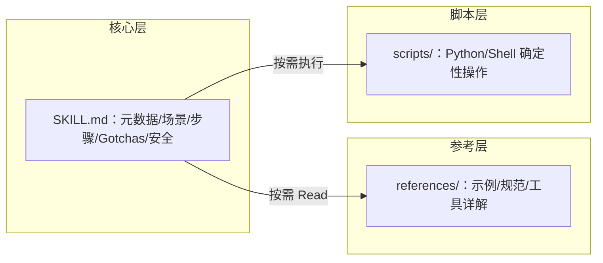

---

title: "多文件架构"

tags:

  - agent方法论

  - skill-engineering

  - 生命周期管理

created: "2026-07-21"

---

# 多文件架构：目录卡、书架空卷与手边电动工具

> 本条目是「Skill Engineering」的第 12 部分，对应学习清单条目 4.6.2。

>

> **前置依赖**：[[11-延迟加载机制|延迟加载机制]]

> **为以下铺垫**：[[13-Skill版本管理|Skill版本管理]]

---

## 一、核心观点

> **成熟的 Skill 是三层架构：`SKILL.md`（核心指令）+ `references/`（深度资料）+ `scripts/`（可执行脚本）。** 目录卡常备，详卷和工具用时才取。

`SKILL.md` 像图书馆的目录卡——常备、薄、够你决定要不要深入；`references/` 是书架空深处的详卷，只有真遇到对应章节才抽出来；`scripts/` 是手边的电动工具，交给代码 deterministic（确定性）地干，比让模型「生成排序代码」又快又稳。三者配合，Skill 才能既轻又强。

---

## 二、定义 / 原理 / 实践 / 示例 / 优劣势
### 2.1 三层职责



| 层 | 内容类型 | 加载时机 | 官方额度 |
|----|----------|----------|----------|
| **SKILL.md** | 指令（instructions） | 触发时 | Level 2 <5k token |
| **references/** | 资源（resources） | 按需 | Level 3 实质无限 |
| **scripts/** | 代码（code） | 按需执行 | 不进上下文 |

### 2.2 原理：为什么代码比「让模型生成」更靠谱

Anthropic 明确指出：某些操作（如排序、解析 PDF）用传统代码执行远比用 token 生成可靠，且脚本运行时不占上下文（[anthropic.com/engineering/equipping-agents-for-the-real-world-with-agent-skills](https://www.anthropic.com/engineering/equipping-agents-for-the-real-world-with-agent-skills)）。确定性 = 可复现，这正是 Skill 要的稳定性。

### 2.3 实践：目录结构

```text

my-skill/

├── SKILL.md          # 核心层（≤500 行）

├── references/       # 参考层（按需 Read）

│   ├── examples.md

│   ├── conventions.md

│   └── tools.md

└── scripts/          # 脚本层（按需执行）

    ├── check.py

    └── fix.sh

```

### 2.4 示例：引用与调用

```markdown

## 操作步骤

1. 解析 diff → 2. 分级 → 3. 出报告（详细步骤见 references/steps.md）

## 工具使用

- 运行 `scripts/check.py` 做类型检查

- 运行 `scripts/fix.sh` 自动修复

```

### 2.5 优劣势

- ✅ 渐进式加载省上下文；核心/深度分离易维护；脚本给确定性

- ❌ 拆分需设计；过度拆分增加跳转成本

---

## 三、最新研究与企业数据（2025–2026）

- **三层内容类型（一手）**：Anthropic 文档将 Skill 内容分为指令 / 代码 / 资源三类，分别在 Level 2 / Level 3 加载，各自优势不同——指令灵活、代码可靠、资源供查证（[docs.anthropic.com](https://docs.anthropic.com/en/docs/agents-and-tools/agent-skills)）。

- **代码即确定性（一手）**：Anthropic 在发布 Agent Skills 时以 PDF 技能为例，脚本读 PDF、抽表单字段「不把脚本或 PDF 载入上下文」，且「因为代码是确定性的，流程一致可复现」（[anthropic.com/engineering/equipping-agents-for-the-real-world-with-agent-skills](https://www.anthropic.com/engineering/equipping-agents-for-the-real-world-with-agent-skills)）。

---

## 四、学习资源

- **一手**：[Anthropic Agent Skills 文档](https://docs.anthropic.com/en/docs/agents-and-tools/agent-skills) · [Equipping agents for the real world with Agent Skills](https://www.anthropic.com/engineering/equipping-agents-for-the-real-world-with-agent-skills)

- **关联**：[[07-压缩到500行|压缩到500行]] · [[11-延迟加载机制|延迟加载机制]]

---

## 五、相关链接

- 系列内：[[11-延迟加载机制|延迟加载机制]] · [[07-压缩到500行|压缩到500行]] · [[13-Skill版本管理|Skill版本管理]]

- 跨系列：[[../01-认知升级/03-2026初HarnessEngineering|Harness Engineering]]

- 系列清单：[[学习路线图/Agent方法论与产品思维学习路线图|Agent 方法论与产品思维学习路线图]]

---

## 六、核心要点

- 🎯 三层：SKILL.md（指令）+ references/（资源）+ scripts/（代码）。

- 💡 目录卡常备、详卷按需 Read、脚本确定性执行且不占上下文。

- ⚠️ 能用脚本确定性搞定的（排序/解析），别让模型现编 token。

---

## 参考来源（一手链接 · 可溯源深挖）

- **Anthropic Agent Skills 文档**（指令/代码/资源三类内容，分层加载）：[docs.anthropic.com/en/docs/agents-and-tools/agent-skills](https://docs.anthropic.com/en/docs/agents-and-tools/agent-skills)

- **Anthropic (2025-12-18)**《Equipping agents for the real world with Agent Skills》（代码执行确定性、不占上下文）：[anthropic.com/engineering/equipping-agents-for-the-real-world-with-agent-skills](https://www.anthropic.com/engineering/equipping-agents-for-the-real-world-with-agent-skills)

## 速记卡（面试闪卡）

**Q1：一句话讲清「多文件架构：目录卡、书架空卷与手边电动工具」到底是什么？**

A：成熟 Skill 用三层架构：SKILL.md 核心指令 + references/ 深度资料 + scripts/ 可执行脚本。

**Q2：一、核心观点 —— 怎么理解？**

A：像图书馆三件套：目录卡常备、书架空卷按需抽、手边电动工具现用现取（Skill Multi-file Architecture，技能多文件架构）。

**Q3：二、定义 / 原理 / 实践 / 示例 / 优劣势 —— 怎么理解？**

A：像分工明确的车间：SKILL.md 触发时加载、references 按需 Read、scripts 执行不占上下文（Progressive Loading，渐进式加载）。

**Q4：三、最新研究与企业数据（2025–2026） —— 怎么理解？**

A：像官方认证分层：Anthropic 把内容分指令/代码/资源三类分别加载，代码确定性可复现（Agent Skills，智能体技能）。

**Q5：四、学习资源 —— 怎么理解？**

A：像查官方手册：Anthropic Agent Skills 文档与 Equipping agents 博客是权威一手来源（Documentation，文档）。

**Q6：核心速记主线有哪些？**

- 核心观点：三层 SKILL.md 加 references/ 加 scripts/

- 加载：核心常备、详卷按需 Read、脚本确定性执行不占上下文

- 原理：代码比让模型生成更稳更快可复现

- 权衡：拆太碎增加跳转成本

**口诀**

A：目录卡常备，详卷按需抽；

脚本干确定的，模型别硬凑。

三层分得清，上下文不愁；

拆太碎反累，度要拿捏熟。

## 相关链接

- [[笔记/AI与Agent/方法论/04-Skill Engineering/13-Skill版本管理|Skill版本管理]]

- [[笔记/AI与Agent/方法论/04-Skill Engineering/11-延迟加载机制|延迟加载机制]]

- [[笔记/AI与Agent/方法论/04-Skill Engineering/07-压缩到500行|压缩到500行]]

- [[笔记/AI与Agent/方法论/04-Skill Engineering/10-Gotchas章节优先|Gotchas章节优先]]

- [[笔记/AI与Agent/方法论/04-Skill Engineering/05-Gotchas优先|Gotchas优先]]

