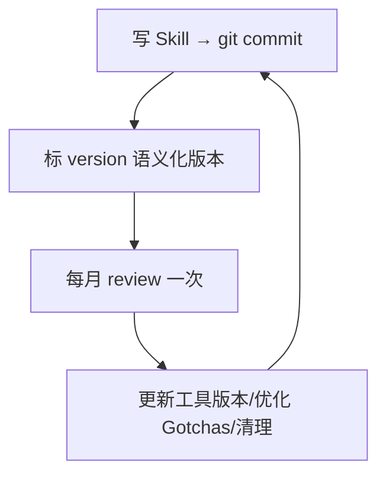

# Skill 版本管理：团队共享的菜谱，也要进 git

> 本条目是「Skill Engineering」的第 13 部分，对应学习清单条目 4.6.3。
>
> **前置依赖**：[[11-延迟加载机制|延迟加载机制]]、[[12-多文件架构|多文件架构]]
> **为以下铺垫**：多工具协同、Loop Engineering

---

## 一、核心观点

> **Skill 落地 git，写版本号，每月 review 一次。** 一条过时的 Skill 规则，比没有 Skill 还害人——它会在你不知情时，稳定地教 Agent 做错事。

Skill 像团队共享的菜谱：改了要 commit，要标版本，要定期尝尝还合不合口味。没人想照着一份写着「加盐两勺」、但厨房三年前就换了低钠盐的菜谱做菜。模型、工具、项目都在变，Skill 不维护就会悄悄变成「精确的谬误」。

---

## 二、定义 / 原理 / 实践 / 示例 / 优劣势

### 2.1 定义

Skill 版本管理 = 用 git 追踪变更、用语义化版本号标记演进、定期 review 清理过时内容。

### 2.2 原理：为什么「过时 Skill」比「没有」更糟

没有 Skill，Agent 靠通用能力；有一条过时 Skill，Agent 会被「权威文件」带偏且你难以察觉。所以 review 不是锦上添花，是安全绳。

### 2.3 实践：四步法



- **落地 git**：`git add .claude/skills/ && git commit -m "feat: 添加 code-review skill"`
- **版本号**：`version: 1.2.0`（主.次.修订 = 重大.功能.bug 修复）
- **每月 review**：查过时内容、更新工具版本（mypy/ruff）、优化 Gotchas、清理无用 Skill
- **引用其他 Skill**：用纯文本 Skill 名，不用 markdown 链接（跨 Skill 调用解析易错）

### 2.4 示例：review 清单

```markdown
# Skill Review 清单（每月）
- [ ] 检查过时内容（模型/工具/项目已变？）
- [ ] 更新工具版本（mypy、ruff 等）
- [ ] 优化 Gotchas（新踩的坑补进去）
- [ ] 清理无用 Skill
- [ ] 更新 version
```

### 2.5 优劣势

- ✅ 可回滚、可协作、能发现过时；Skill 随时间变强而非变朽
- ❌ 需要纪律（每月 review 容易被拖）

---

## 三、最新研究与企业数据（2025–2026）

- **官方支持 Skill 版本化（一手）**：Anthropic 在发布 Agent Skills 时同步推出 `/v1/skills` 端点，给开发者「对自定义 Skill 进行程序化版本控制与管理」的能力（[anthropic.com/news/skills](https://www.anthropic.com/news/skills)）。这说明版本管理是官方一等公民，而非野路子。
- **开放分发需版本（一手）**：Agent Skills 已作为开放标准跨工具分发，版本号是跨工具消费 Skill 时的兼容性契约（[skill.md](http://skill.md/)）。

---

## 四、学习资源

- **一手**：[Anthropic Introducing Agent Skills（含 /v1/skills 版本管理）](https://www.anthropic.com/news/skills) · [Agent Skills 开放标准 skill.md](http://skill.md/)
- **关联**：[[12-多文件架构|多文件架构]] · [[09-编写黄金规则|编写黄金规则]]

---

## 五、相关链接

- 系列内：[[11-延迟加载机制|延迟加载机制]] · [[12-多文件架构|多文件架构]] · [[09-编写黄金规则|编写黄金规则]]
- 跨系列（收尾）：[[../01-认知升级/03-2026初 Harness Engineering|Harness Engineering]]（Skill 是 Harness 层组件）· [[../01-认知升级/07-四层嵌套关系|四层嵌套关系]]
- 系列清单：[[学习路线图/Agent 方法论与产品思维学习清单|Agent 方法论与产品思维学习清单]]

---

## 六、核心要点

- 🎯 Skill 落地 git + 语义化版本号 + 每月 review；过时 Skill 比没有更糟。
- 💡 引用其他 Skill 用纯文本名，别用 markdown 链接（跨 Skill 解析易错）。
- ⚠️ review 是安全绳不是装饰：模型/工具/项目在变，Skill 不维护就变「精确谬误」。

---

## 参考来源（一手链接 · 可溯源深挖）

- **Anthropic (2025-12-18)**《Introducing Agent Skills》（`/v1/skills` 端点支持程序化版本管理）：[anthropic.com/news/skills](https://www.anthropic.com/news/skills)
- **Agent Skills 开放标准**（跨工具分发需版本契约）：[skill.md](http://skill.md/)
- **Anthropic Agent Skills 文档**：[docs.anthropic.com/en/docs/agents-and-tools/agent-skills](https://docs.anthropic.com/en/docs/agents-and-tools/agent-skills)

## 速记卡（面试闪卡）

**Q1：一句话讲清「Skill 版本管理：团队共享的菜谱，也要进 git」到底是什么？**
A：**Skill 落地 git，写版本号，每月 review 一次。** 一条过时的 Skill 规则，比没有 Skill 还害人——它会在你不知情时，稳定地教 Agent 做错事。
Skill 像团队共享的菜谱：改了要 commit，要标版本，要定期尝尝还合不合口味。没人想照着一份写着「加盐两勺」、但厨房三年前就换了低钠盐的菜谱做菜。

**Q2：一、核心观点 —— 怎么理解？**
A：**Skill 落地 git，写版本号，每月 review 一次。** 一条过时的 Skill 规则，比没有 Skill 还害人——它会在你不知情时，稳定地教 Agent 做错事。
Skill 像团队共享的菜谱：改了要 commit，要标版本，要定期尝尝还合不合口味。没人想照着一份写着「加盐两勺」、但厨房三年前就换了低钠盐的菜谱做菜。模型、工具、项目都在变，Skill 不维护就会悄悄变成「精确的谬误」。
---

**Q3：二、定义 / 原理 / 实践 / 示例 / 优劣势 —— 怎么理解？**
A：Skill 版本管理 = 用 git 追踪变更、用语义化版本号标记演进、定期 review 清理过时内容。
没有 Skill，Agent 靠通用能力；有一条过时 Skill，Agent 会被「权威文件」带偏且你难以察觉。所以 review 不是锦上添花，是安全绳。

**Q4：三、最新研究与企业数据（2025–2026） —— 怎么理解？**
A：**官方支持 Skill 版本化（一手）**：Anthropic 在发布 Agent Skills 时同步推出  端点，给开发者「对自定义 Skill 进行程序化版本控制与管理」的能力（）。这说明版本管理是官方一等公民，而非野路子。
**开放分发需版本（一手）**：Agent Skills 已作为开放标准跨工具分发，版本号是跨工具消费 Skill 时的兼容性契约（）。
---

**Q5：四、学习资源 —— 怎么理解？**
A：**一手**： · 
**关联**： · 
---

**Q6：核心速记主线有哪些？**
A：抓住这几根：一、核心观点、二、定义 / 原理 / 实践 / 示例 / 优劣势、三、最新研究与企业数据（2025–2026）、四、学习资源、五、相关链接、六、核心要点。

