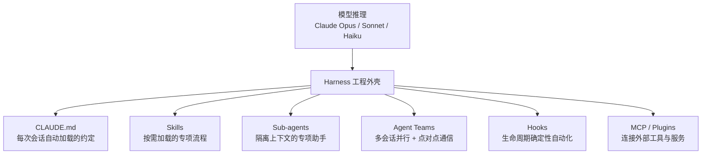

# Claude Code：把"实习生"养成能自己跑全流程的同事

> 本条目是「多工具协同方法论」的第 1 部分，对应学习清单条目 5.1.1。
>
> **前置依赖**：认知升级·四层模型、Skill Engineering
> **为以下铺垫**：OpenCode特性、Codex特性、工具选型原则

---

## 一、核心观点

> **Claude Code 是 Anthropic 官方的终端原生 Agent，强在 Loop Engineering（自校正循环）、Skills 生态、Hook 系统。**
> 如果普通补全工具是个"只在你敲键盘时递一句话"的助手，Claude Code 更像你招了个**能读代码、跑测试、提 PR、还会自我纠错的全流程同事**——你派活，他交付。

---

## 二、定义与原理

### 2.1 是什么

- **Claude Code**：Anthropic 官方出品的 AI 编程 Agent，跑在终端 / VS Code / JetBrains / Web / 手机上
- **核心模型**：Claude 系列（Opus / Sonnet / Haiku）
- **定位**：终端原生、全流程 Agent——不是补全插件，而是能独立推进任务的"同事"

### 2.2 类比：派活给"能跑全流程的同事"

给新人的典型指令是："去把登录模块的 bug 修了，顺手补测试、跑通 CI、提个 PR。" 普通补全工具听不懂这种长指令；Claude Code 能自己拆解：读代码 → 定位 → 改 → 测 → 提交。这就是 **Loop Engineering** 的直观体现——它会"干一步、验证一步、不对就改"，而不是一口气糊到底。

### 2.3 扩展层全景（Mermaid）

Claude Code 的能力分两层：**模型推理** + **harness（工程外壳）**。harness 里又按触发方式分层加载：



> 类比：CLAUDE.md 是"员工手册"，Skills 是"操作 SOP 手册"，Sub-agents 是"外包给专家"，Hooks 是"每次必做的质检关卡"，MCP 是"外接设备接口"。

---

## 三、实践：三个杀手锏

### 3.1 Loop Engineering 最强

- 支持 **自校正循环**：干一步验证一步（见 [[../01-认知升级/04-2026中 Loop Engineering 爆发|Loop Engineering]]）
- **Agent Teams**：spawn 多个 Claude Code 并行处理不同子任务，由 lead agent 协调、合并结果
- **`/loop`**：在 CLI 会话内重复某个 prompt，适合轮询式任务
- **后台 agent / 定时任务**：在云端按计划跑 PR 评审、CI 失败分析

### 3.2 Skills 生态

- Skill 是"包含指令、脚本、资源的文件夹"，Claude 只在相关时才加载——**按需加载、省上下文**
- 2025-12 Anthropic 把 Agent Skills 发布为**开放标准**，可跨 Claude 应用 / Claude Code / API 复用
- 社区与官方 Skills 市场（anthropics/skills）丰富

### 3.3 Hook 系统（确定性，不靠模型记忆）

```json
{
  "hooks": {
    "PostToolUse": [{ "matcher": "Edit|Write",
      "hooks": [{ "type": "command", "command": "npx prettier --write" }] }],
    "PreToolUse": [{ "matcher": "Bash",
      "hooks": [{ "type": "command", "command": ".claude/hooks/pre-bash-firewall.sh" }] }]
  }
}
```

> 铁律：凡是"每次都必须执行"的事（格式化、lint、防火墙）用 Hook，**别用 Prompt 提醒**。Hook 退出码 `0` = 放行，`2` = 阻断。Hook 是确定性的，Skill 是概率性的。

---

## 四、典型场景

| 维度 | 适合 ✅ | 不太适合 ⚠️ |
|------|---------|-------------|
| 任务 | 多文件重构、issue→PR 全闭环、复杂项目 | 纯 UI/CSS 所见即所得拖拽 |
| 模式 | 需要 Loop Engineering 的自校正 | 批量异步、彼此独立的任务 |
| 角色 | 个人深度开发、架构师 | 只想快速补全一两行 |

> 一句话：要"派活给能跑全流程的同事"，用 Claude Code；要"下工单给并行团队"，看 [[03-Codex特性|Codex]]；要"轻量、可换模型的辅助"，看 [[02-OpenCode特性|OpenCode]]。

---

## 五、优劣势

- ✅ **Loop Engineering 最强**：自校正、Agent Teams、定时任务
- ✅ **Skills 生态 + 开放标准**，可移植、可团队共享
- ✅ **Hook 系统**把"会犯的错误"变成"结构上不可能的错误"
- ❌ 绑定 Anthropic 模型（不像 OpenCode 那样可随意换模型）
- ❌ 云端异步"下工单"体验不如 Codex 顺滑
- ❌ 纯 UI 拖拽类工作仍偏弱

---

## 六、最新研究与企业数据（2024–2026）

- **Skills 成为开放标准（2025-12）**：Anthropic 将 Agent Skills 发布为跨平台可移植的开放标准，并上线组织级管理与 Skills 目录——你写的 Skill 能在 Claude 应用、Claude Code、API 三处通用。
- **Harness 决定排名**：同一模型（Opus 4.6）在 Terminal Bench 2.0 上用默认 harness 排第 40，用优化过的 harness 排**第 1**——"不是模型，是 harness 决定排名"。Claude Code 的 Hook / Sub-agent / Skills 体系正是这种 harness 的工程实现。
- **`/loop` 与定时任务**：Claude Code 支持会话内循环与云端定时任务，把 Loop Engineering 从"概念"变成"可编排的生产力"。

---

## 七、学习资源

- **官方**：[Claude Code 概览与最佳实务](https://www.anthropic.com/engineering/claude-code-best-practices)
- **扩展层指南**：[CLAUDE.md / Skills / Sub-agents / Hooks / MCP / Plugins 怎么选](https://code.claude.com/docs/en/features-overview)
- **Sub-agents 文档**：[docs.anthropic.com](https://docs.anthropic.com/en/docs/claude-code/sub-agents)
- **Agent Skills 发布**：[Anthropic News · Skills](https://www.anthropic.com/news/skills)
- **进阶**：[[../01-认知升级/03-2026初 Harness Engineering|Harness Engineering]]——Claude Code 是 Harness 的参考实现

---

## 核心要点

- **一句话**：Claude Code = 终端原生的全流程 Agent，强在 Loop Engineering / Skills / Hooks。
- **类比**：派活给"能读代码、跑测试、提 PR、自我纠错"的同事，不是递一句话的补全插件。
- **三件套**：Skills（按需 SOP）＋ Sub-agents（隔离专家）＋ Hooks（确定性质检）。
- **选型口诀**：多文件重构 / 全闭环 → Claude Code；批量异步 → Codex；轻量可换模型 → OpenCode。
- **铁律**：每次必做的事用 Hook（确定性），别用 Prompt（概率性）。

---

## 参考来源（一手链接 · 可溯源深挖）

- **Anthropic (2025)**《Claude Code 概览与最佳实务》：[anthropic.com/engineering/claude-code-best-practices](https://www.anthropic.com/engineering/claude-code-best-practices)
- **Anthropic** 扩展层指南（CLAUDE.md/Skills/Sub-agents/Hooks/MCP/Plugins）：[code.claude.com/docs/en/features-overview](https://code.claude.com/docs/en/features-overview)
- **Anthropic (2025-12)**《Introducing Agent Skills》（开放标准）：[anthropic.com/news/skills](https://www.anthropic.com/news/skills)
- **Anthropic** Sub-agents 文档：[docs.anthropic.com/en/docs/claude-code/sub-agents](https://docs.anthropic.com/en/docs/claude-code/sub-agents)
- **LangChain (2026-02)** Terminal Bench 2.0 harness 实验（"不是模型，是 harness 决定排名"）：[langchain.com/blog/the-anatomy-of-an-agent-harness](https://www.langchain.com/blog/the-anatomy-of-an-agent-harness)

**相关链接**：
- 系列清单：[[学习路线图/Agent 方法论与产品思维学习清单|Agent 方法论与产品思维学习清单]]
- 上一层级：[[00-Agent 方法论与产品思维|多工具协同方法论 · 索引]]
- 下一篇：[[02-OpenCode特性|OpenCode 特性]]——开源、可换模型、中文友好的轻量替代
- 同主题：[[03-Codex特性|Codex 特性]] · [[04-工具选型原则|工具选型原则]] · [[07-MCP协议|MCP 协议]]

## 速记卡（面试闪卡）

**Q1：一句话讲清「Claude Code：把"实习生"养成能自己跑全流程的同事」到底是什么？**
A：**Claude Code 是 Anthropic 官方的终端原生 Agent，强在 Loop Engineering（自校正循环）、Skills 生态、Hook 系统。**
如果普通补全工具是个"只在你敲键盘时递一句话"的助手，Claude Code 更像你招了个**能读代码、跑测试、提 PR、还会自我纠错的全流程同事**——你派活，他交付。
---

**Q2：一、核心观点 —— 怎么理解？**
A：**Claude Code 是 Anthropic 官方的终端原生 Agent，强在 Loop Engineering（自校正循环）、Skills 生态、Hook 系统。**
如果普通补全工具是个"只在你敲键盘时递一句话"的助手，Claude Code 更像你招了个**能读代码、跑测试、提 PR、还会自我纠错的全流程同事**——你派活，他交付。
---

**Q3：二、定义与原理 —— 怎么理解？**
A：**Claude Code**：Anthropic 官方出品的 AI 编程 Agent，跑在终端 / VS Code / JetBrains / Web / 手机上
**核心模型**：Claude 系列（Opus / Sonnet / Haiku）
**定位**：终端原生、全流程 Agent——不是补全插件，而是能独立推进任务的"同事"
给新人的典型指令是："去把登录模块的 bug 修了，顺手补测试、跑通 CI、提个 PR。

**Q4：三、实践：三个杀手锏 —— 怎么理解？**
A：支持 **自校正循环**：干一步验证一步（见 ）
**Agent Teams**：spawn 多个 Claude Code 并行处理不同子任务，由 lead agent 协调、合并结果
****：在 CLI 会话内重复某个 prompt，适合轮询式任务
**后台 agent / 定时任务**：在云端按计划跑 PR 评审、CI 失败分析

**Q5：四、典型场景 —— 怎么理解？**
A：| 维度 | 适合 ✅ | 不太适合 ⚠️ |
|------|---------|-------------|
| 任务 | 多文件重构、issue→PR 全闭环、复杂项目 | 纯 UI/CSS 所见即所得拖拽 |
| 模式 | 需要 Loop Engineering 的自校正 | 批量异步、彼此独立的任务 |
| 角色 | 个人深度开发、架构师 | 只想快速补全一两行 |

**Q6：核心速记主线有哪些？**
A：抓住这几根：一、核心观点、二、定义与原理、三、实践：三个杀手锏、四、典型场景、五、优劣势、六、最新研究与企业数据（2024–2026）。

