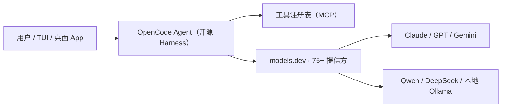
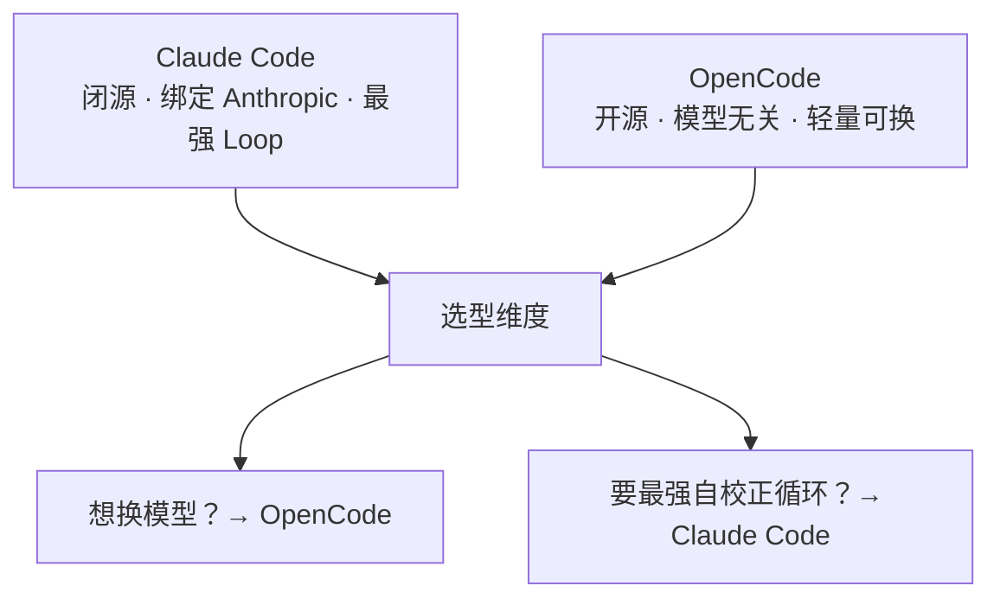

---

title: "OpenCode 特性"

tags:

  - agent方法论

  - 多工具协同

  - 工具对比

  - opencode

created: "2026-07-21"

---

# OpenCode：不挑模型、不挑厂的开源"乐高扳手"

> 本条目是「多工具协同方法论」的第 2 部分，对应学习清单条目 5.1.2。

>

> **前置依赖**：Claude Code特性

> **为以下铺垫**：Codex特性、工具选型原则

---

## 一、核心观点

> **OpenCode 是开源、模型无关（model-agnostic）的终端 AI 编程 Agent，强在"harness、工具、模型三层解耦"。**

> 如果说 Claude Code 是"绑定某家厂牌的旗舰机"，OpenCode 就是一把**能换任何品牌钻头的乐高扳手**——壳子是你自己的，钻头随便挑（Claude / GPT / Gemini / 本地模型）。

---

## 二、定义与原理
### 2.1 是什么

- **OpenCode**：由 Anomaly（即原来的 SST 团队）维护的开源终端 AI 编程 Agent，MIT 许可

- **运行方式**：终端 TUI（Bubble Tea 风格）、桌面 App，也可通过其他界面驱动

- **核心特点**：**模型无关**——通过 models.dev 接入 75+ LLM 提供方（Claude、GPT、Gemini、DeepSeek、Qwen、本地 Ollama 等）

### 2.2 类比：三层解耦的"乐高扳手"

普通闭源工具把"扳手壳 + 钻头品牌"焊死；OpenCode 把三件事正交拆开：

1. **Harness（工具层）**：文件读写、Shell、测试收集——开源、你保留

2. **工具注册表**：走 **MCP**（和所有 2026 年的 Agent 说同一种语言）

3. **模型层**：从 models.dev 任意换，今天 Claude、明天 Qwen，同一壳子无缝切

> 对中文团队的意义：中文项目可直接接 Qwen / DeepSeek / GLM 等本地或国产模型，**不必被某家闭源模型锁死**，数据还可留在本地。

### 2.3 架构解耦（Mermaid）

---

## 三、实践：中文与轻量场景怎么用
### 3.1 Plan / Build 双模式

- **Build 模式**：默认全权限开发

- **Plan 模式**：只读、默认拒绝改文件，先探索/规划再动手——适合接手陌生仓库

### 3.2 自带"轻量"与"中文友好"的来源

- **轻量**：终端优先、零配置启动、安装即用

- **中文友好**不是玄学，而是**模型可换**带来的：中文注释 / 中文文档生成效果取决于你选的模型——接 Qwen / DeepSeek 时中文体验直接拉满

- **AGENTS.md**：项目规则写进 AGENTS.md，从 Claude Code 迁移可回退到 CLAUDE.md

### 3.3 与 Claude Code 的差异（Mermaid 对比）

---

## 四、典型场景

| 维度 | 适合 ✅ | 不太适合 ⚠️ |

|------|---------|-------------|

| 模型 | 想自由换 Claude/GPT/本地模型 | 只认一家闭源模型、要最省心 |

| 场景 | 中文项目、隐私优先（本地模型）、快速原型 | 复杂多文件重构需最强 Loop |

| 团队 | 国内团队、成本敏感、避免厂商锁定 | 需要官方 SLA / 企业托管 |

> 一句话：要"可换模型的开源轻量助手"，用 OpenCode；要"派活给能跑全流程的同事"，看 [[01-ClaudeCode特性|Claude Code]]；要"下工单给并行团队"，看 [[03-Codex特性|Codex]]。

---

## 五、优劣势

- ✅ **模型无关**：75+ 提供方，今天 Claude 明天 Qwen，无厂商锁定

- ✅ **开源 + 隐私优先**：MIT，不存你的代码/上下文，可纯本地跑

- ✅ **轻量、零配置、MCP 原生**，与 2026 年生态同语言

- ❌ 自有模型能力取决于你选的底座，弱模型 = 弱 Agent

- ❌ Loop Engineering / Agent Teams 的成熟度不及 Claude Code

- ❌ 社区版数据（月活开发者数等）多为官网口径，需自行判断

---

## 六、最新研究与企业数据（2024–2026）

- **增长飞快（2026）**：OpenCode 在 GitHub 达约 **17–18 万 stars**，月活开发者据官网称超 **750 万**；2026-01-16 起因 GitHub Copilot 订阅可直接登录 OpenCode，等于白捡一个付费分发渠道。

- **"克隆 Claude Code 形态"成了赛道共识**：分析普遍认为 Anthropic 2025-03 发布 Claude Code 验证了"终端 Agent"形态后，OpenCode（SST/Anomaly）借此快速崛起，成为最火的开源终端 Agent 之一。

- **AGENTS.md 成共识**：Agent 约定文件 AGENTS.md 已被 GitHub Copilot、Cursor、VS Code 等广泛采纳（Linux Foundation AAIF 将其列为创始项目之一），OpenCode 原生支持并回退到 CLAUDE.md。

---

## 七、学习资源

- **官方站 / 安装**：[opencode.ai](https://opencode.ai)

- **GitHub（SST/Anomaly）**：[github.com/sst/opencode](https://github.com/sst/opencode)

- **深度解析（2026）**：[env.dev · OpenCode](https://env.dev/ai/opencode) · [nerdleveltech · OpenCode](https://nerdleveltech.com/opencode-open-source-ai-coding-agent-explained)

- **进阶**：[[07-MCP协议|MCP 协议]]——OpenCode 的工具层走 MCP；[[01-ClaudeCode特性|Claude Code 特性]]——对比闭源旗舰

---

## 核心要点

- **一句话**：OpenCode = 开源、模型无关的终端 Agent，强在 harness/工具/模型三层解耦。

- **类比**：能换任何品牌钻头的乐高扳手，壳子是你自己的，钻头随便挑。

- **中文友好从哪来**：不是内置魔法，而是"可换模型"——接 Qwen/DeepSeek 时中文体验拉满。

- **选型口诀**：想换模型 / 怕厂商锁定 / 要本地隐私 → OpenCode；要最强 Loop → Claude Code。

- **注意**：月活、star 等多为官网/社区口径，引用时注明来源。

---

## 参考来源（一手链接 · 可溯源深挖）

- **OpenCode 官网**：[opencode.ai](https://opencode.ai)

- **GitHub（SST / Anomaly）**：[github.com/sst/opencode](https://github.com/sst/opencode)

- **env.dev (2026)**《OpenCode》深度解析（stars / Copilot 集成 / 架构）：[env.dev/ai/opencode](https://env.dev/ai/opencode)

- **nerdleveltech (2026)**《OpenCode: The Open-Source AI Coding Agent Explained》：[nerdleveltech.com/opencode-open-source-ai-coding-agent-explained](https://nerdleveltech.com/opencode-open-source-ai-coding-agent-explained)

- **Linux Foundation AAIF**（AGENTS.md 列为创始项目）：[linuxfoundation.org](https://www.linuxfoundation.org)（待核实具体页面）

## 速记卡（面试闪卡）

**Q1：一句话讲清「OpenCode：不挑模型、不挑厂的开源"乐高扳手"」到底是什么？**

A：OpenCode 是开源、模型无关（model-agnostic）的终端 AI 编程 Agent，强在 harness、工具、模型三层解耦。

**Q2：三层解耦像什么 —— 怎么理解？**

A：像一把能换钻头的乐高扳手。harness（工具层：读写 Shell）是你自己的壳，工具层走 MCP 说所有 Agent 的通用语言，模型层从 models.dev 任意换——今天 Claude 明天 Qwen，壳子不动。

**Q3：中文友好从哪来 —— 怎么理解？**

A：不是内置魔法，而是「可换模型」带来的。中文注释与文档效果取决于你选的底座；接 Qwen / DeepSeek 时中文直接拉满，且代码数据可留本地、不被闭源锁死。

**Q4：和 Claude Code 怎么选 —— 怎么理解？**

A：像租车 vs 买车：Claude Code 是绑定厂牌的旗舰机，Loop 最强但挑模型；OpenCode 是开源乐高扳手，轻量零配置、模型随便换，但最强自校正循环不及前者。

**Q5：有什么坑 —— 怎么理解？**

A：像便宜扳手配错钻头也白搭。弱模型等于弱 Agent；Loop Engineering 与 Agent Teams 成熟度不及 Claude Code；star、月活多为官网口径，引用要注明来源。

**Q6：核心速记主线有哪些？**

- 开源模型无关，75+ 提供方随便换

- 三层解耦：harness / 工具(MCP) / 模型

- 中文友好来自可换模型，非玄学

- 弱点：弱模型即弱 Agent，Loop 不成熟

**口诀**

A：开源乐高扳手，壳子你的钻头换

三层解耦 M C P，模型任意不挑厂

中文靠换 Qwen 顶，本地隐私不外流

弱模即弱 Agent，旗舰 Loop 仍占先

## 相关链接

- 系列清单：[[学习路线图/Agent方法论与产品思维学习路线图|Agent 方法论与产品思维学习路线图]]

- 上一层级：[[00-Agent方法论与产品思维|多工具协同方法论 · 索引]]

- 下一篇：[[03-Codex特性|Codex 特性]]——云端异步、批量并行的"下工单"模式

- 同主题：[[01-ClaudeCode特性|Claude Code 特性]] · [[07-MCP协议|MCP 协议]]

