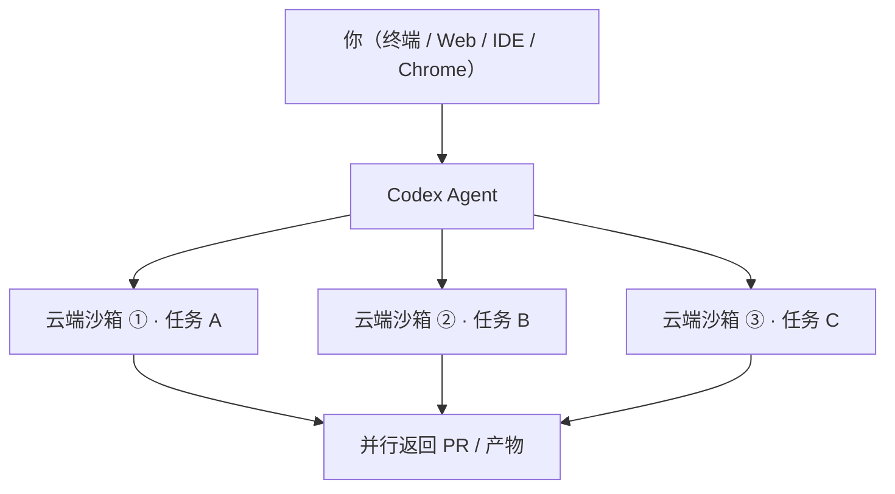

---

title: "Codex 特性"

tags:

  - agent方法论

  - 多工具协同

  - 工具对比

  - codex

created: "2026-07-21"

---

# Codex：下工单给"在云端并行的外包团队"

> 本条目是「多工具协同方法论」的第 3 部分，对应学习清单条目 5.1.3。

>

> **前置依赖**：Claude Code特性、OpenCode特性

> **为以下铺垫**：工具选型原则

---

## 一、核心观点

> **Codex 是 OpenAI 的云端异步 Agent，强在"云沙箱 + 并行批处理"——你一次下发多个任务，它在隔离沙箱里并行跑，干完把 PR 还给你。**

> 如果 Claude Code 是"坐你旁边的全流程同事"，Codex 更像**下工单给一个在云端并行干活的外包团队**：你不用盯着每一步，等 PR 回来验收就行。

---

## 二、定义与原理
### 2.1 是什么

- **Codex**：OpenAI 的 AI 编程 Agent，包含 **Codex CLI**（本地终端）、**Codex 云环境**（云端沙箱）、**IDE 扩展**、**Web App（codex.app）**、**Chrome 扩展**

- **运行方式**：云端沙箱（默认）／ 本地终端 ／ Web ／ IDE

- **核心模型**：`codex-1`（基于 o3、在真实 PR 上 RL 训练）、`codex-mini`（基于 o4-mini、CLI 默认）；也可切 `GPT-5-Codex`、`GPT-5.3-Codex`、`GPT-5.4` 等

### 2.2 类比：下工单给"并行外包团队"

Claude Code 是"你指着屏幕和他一起改"；Codex 是"你写好三张工单（迁移 A、修 B、加测试 C），扔进云端，三个沙箱同时开工，你去做别的事，回来验收三个 PR"。关键差异：**它在隔离的云沙箱里跑你的仓库副本，不占用你本地环境**。

### 2.3 多表面一体（Mermaid）



> 每个任务跑在自己独立的沙箱里，这正是"并行批处理"的工程基础。

---

## 三、实践：怎么把 Codex 用出"快"
### 3.1 云沙箱默认开启

- 默认在**隔离云沙箱**里操作你仓库的副本，本地照常写代码，它并行干

- PR 在任务完成时回来，不用阻塞等待

### 3.2 批处理与并行

- ``codex cloud exec --env ENV_ID --attempts 3 "..."`` 可一次要多个候选方案（best-of-N）

- 适合"做这三处迁移"这类彼此独立、本地串行会卡住的模式

### 3.3 自带评审 + 工具

- **Code review agent**：开 PR 前先自己审一遍（基于 GPT-5-Codex，专为抓关键缺陷训练）

- 支持 **web search + MCP**，可接数据库 / GitHub / Slack 等外部系统

- 容器缓存把新任务与后续任务的中位完成时间**砍掉 90%**

```bash

# 脚本化批处理：把重复工作交给 Codex

codex exec "fix the CI failure"

codex cloud exec --env ENV_ID --attempts 3 "Summarize open bugs"

```

---

## 四、典型场景

| 维度 | 适合 ✅ | 不太适合 ⚠️ |

|------|---------|-------------|

| 任务 | 批量、定义明确的任务、大规模重构 | 日常随手写业务代码（脱离 IDE 体验骤降） |

| 模式 | 异步并行、下工单式 | 需要实时盯着每一步交互 |

| 角色 | 需要"同时推进很多独立任务" | 只想写两行并立刻看结果 |

> 一句话：要"下工单给并行团队"，用 Codex；要"派活给能跑全流程的同事"，看 [[01-ClaudeCode特性|Claude Code]]；要"轻量可换模型"，看 [[02-OpenCode特性|OpenCode]]。

---

## 五、优劣势

- ✅ **执行快**：云端资源充足 + 容器缓存，中位完成时间降 90%

- ✅ **批处理 / 并行**：多个隔离沙箱同时跑，互不阻塞

- ✅ **多文件 / 大规模重构**：云端上下文不受本地限制

- ❌ 日常写业务代码、实时交互体验不如终端原生工具

- ❌ 需要联网与云沙箱，离线/内网场景受限

- ❌ 模型绑定 OpenAI 体系（CLI 开源，但模型与运行时为专有）

---

## 六、最新研究与企业数据（2024–2026）

- **GA 时间线**：Codex CLI 于 **2025-05-16** 以研究预览发布，**2025-06-03** 在 ChatGPT Plus 中全面开放（GA）。

- **性能数据（一手）**：OpenAI 称通过**容器缓存**，新任务与后续任务的**中位完成时间降低 90%**（来源：OpenAI Codex 升级公告，2026）。

- **模型专业化**：`GPT-5-Codex` 专为 Codex CLI / IDE 扩展 / 云环境训练，主打代码评审与前端任务；在开源仓库近期 commit 的评审评测中，其评论"更不容易错误或无关"。

- **Code review agent**：可自动在 GitHub PR 从 draft 到 ready 的过程中评审，贴分析结论——把"最较真的评审"前置到每次 PR。

---

## 七、学习资源

- **OpenAI** Codex 升级公告（含 90% 性能数据）：[openai.com/index/introducing-upgrades-to-codex](https://openai.com/index/introducing-upgrades-to-codex)

- **OpenAI** Codex 全面开放：[openai.com/index/codex-now-general-available](https://openai.com/index/codex-now-general-available)

- **OpenAI Developers** Codex CLI 功能：[developers.openai.com/codex/cli/features](https://developers.openai.com/codex/cli/features)

- **OpenAI Help** Codex CLI 入门：[help.openai.com](https://help.openai.com/en/articles/11096431-openai-codex-cli-getting-started)

- **进阶**：[[04-工具选型原则|工具选型原则]]——按协作姿势选型；[[10-混用Agent策略|混用 Agent 策略]]

---

## 核心要点

- **一句话**：Codex = 云端异步 Agent，强在云沙箱 + 并行批处理。

- **类比**：下工单给"在云端并行干活的外包团队"，回来验收 PR。

- **核心模型**：codex-1（o3 系，专为 PR 训练）/ codex-mini（o4-mini，CLI 默认）/ GPT-5-Codex。

- **性能点**：容器缓存使中位完成时间降 90%（OpenAI 一手数据）。

- **选型口诀**：批量、定义明确、异步并行 → Codex；实时全闭环 → Claude Code。

---

## 参考来源（一手链接 · 可溯源深挖）

- **OpenAI (2026)**《Introducing upgrades to Codex》（含 90% 中位完成时间、GPT-5-Codex）：[openai.com/index/introducing-upgrades-to-codex](https://openai.com/index/introducing-upgrades-to-codex)

- **OpenAI (2025)**《Codex 现已全面开放》（GA 时间线、SDK）：[openai.com/index/codex-now-general-available](https://openai.com/index/codex-now-general-available)

- **OpenAI Developers** Codex CLI 功能（MCP / 审批模式 / 子代理）：[developers.openai.com/codex/cli/features](https://developers.openai.com/codex/cli/features)

- **OpenAI Help** Codex CLI 入门：[help.openai.com/en/articles/11096431-openai-codex-cli-getting-started](https://help.openai.com/en/articles/11096431-openai-codex-cli-getting-started)

## 速记卡（面试闪卡）

**Q1：一句话讲清「Codex：下工单给"在云端并行的外包团队"」到底是什么？**

A：Codex 是 OpenAI 的云端异步 Agent，强在云沙箱+并行批处理——下发多个任务，隔离沙箱并行跑，干完还你 PR。

**Q2：一、核心观点：下工单给外包团队 —— 怎么理解？**

A：Claude Code 是坐你旁边的同事，Codex 像下工单给云端并行外包：写好三张工单扔进去，三个沙箱同时开工，回来验收 PR，不占用本地。

**Q3：二、定义：多表面一体 —— 怎么理解？**

A：Codex 含 CLI、云环境、IDE 扩展、Web/Chrome 多入口，背后是同一 Agent。像一家外包公司，你从微信、邮件、电话都能派活，干的都是同一批人。

**Q4：三、实践：批处理与并行 —— 怎么理解？**

A：默认在隔离云沙箱跑仓库副本，本地照常写；codex cloud exec --attempts 3 一次要多个候选（best-of-N）。像把重复活批量发包，回来挑最好的。

**Q5：四、典型场景与优劣势 —— 怎么理解？**

A：批量、定义明确、异步并行 → Codex；实时全闭环 → Claude Code。优在快（容器缓存中位时间降 90%）、并行；弱在实时交互与离线受限。

**Q6：核心速记主线有哪些？**

- 本质：云端异步 Agent，并行批处理

- 类比：下工单给并行外包团队

- 核心模型：codex-1 / codex-mini / GPT-5-Codex

- 选型：批量异步用 Codex，实时用 Claude Code

**口诀**

A：下工单给云端队，

隔离沙箱并行飞；

批量明确它最稳，

回来验收 PR 归。

## 相关链接

- 系列清单：[[学习路线图/Agent方法论与产品思维学习路线图|Agent 方法论与产品思维学习路线图]]

- 上一层级：[[00-Agent方法论与产品思维|多工具协同方法论 · 索引]]

- 下一篇：[[04-工具选型原则|工具选型原则]]——三大工具讲完，建立你的选型原则

- 同主题：[[01-ClaudeCode特性|Claude Code 特性]] · [[02-OpenCode特性|OpenCode 特性]]

