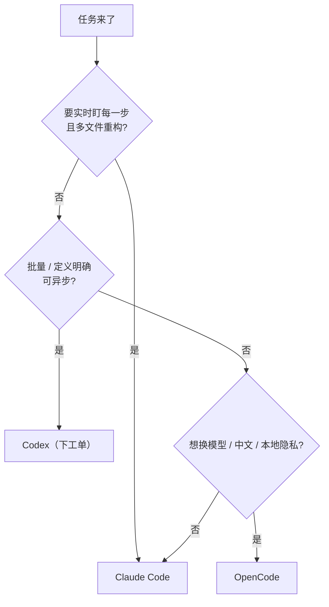

# 工具选型原则：别看广告，看"协作姿势"

> 本条目是「多工具协同方法论」的第 4 部分，对应学习清单条目 5.1.4。
>
> **前置依赖**：Claude Code特性、OpenCode特性、Codex特性
> **为以下铺垫**：MCP工具选型、工具箱管理

---

## 一、核心观点

> **选型不是"哪个最强"，而是"哪个协作姿势最贴你的任务"。**
> 三个工具本质是三种**委派姿势**：Claude Code = 派活给能跑全流程的同事；Codex = 下工单给并行团队；OpenCode = 用可换钻头的乐高扳手。选错姿势，比不用 AI 还费时间。

---

## 二、按"协作姿势"选型

| 工具 | 协作姿势 | 最贴的场景 |
|------|----------|------------|
| **Claude Code** | 派活给「能跑全流程的同事」 | 多文件重构、issue→PR 全闭环、复杂项目 |
| **OpenCode** | 轻量辅助 + 模型可换 | 中文场景、快速原型、怕厂商锁定 |
| **Codex** | 下工单给「并行团队」 | 批量明确定义任务、异步并行、大规模重构 |

> 类比：你不会用挖掘机去拧螺丝，也不会用螺丝刀去挖地基。**工具的形状要匹配任务的形状**。

---

## 三、按任务复杂度 / 团队规模选型

### 3.1 复杂度

| 复杂度 | 推荐 | 原因 |
|--------|------|------|
| 简单 | OpenCode（或纯补全） | 轻量、快速、无需重 harness |
| 中等 | Claude Code | 功能全、能自校正 |
| 复杂 | Claude Code + Codex 混用 | Claude 跑闭环，Codex 并行批处理 |

### 3.2 团队规模

| 团队 | 推荐 | 原因 |
|------|------|------|
| 个人 | Claude Code | 功能最全、闭环最强 |
| 小团队 | Claude Code + AGENTS.md | 跨工具统一约定 |
| 大团队 | AGENTS.md + 多工具 | 统一管理、避免各自为政 |

---

## 四、选型决策树（Mermaid）

> 经验法则：**默认从最简方案起步**。Anthropic 在《Building Effective Agents》里反复强调——能不用 Agent 就不用，只有在更简单的方法失败时才上 Agent 系统。

---

## 五、优劣势与常见坑

- ✅ 按姿势选型 → 上手快、返工少
- ✅ 混用取长补短 → 整体效率与成本最优
- ❌ 坑 1：""听说某某更强"就换 → 切换成本 > 收益
- ❌ 坑 2：用 Codex 干日常业务代码 → 脱离 IDE 体验骤降
- ❌ 坑 3：所有任务都上最重的 Claude Code → 轻任务也背重 harness

---

## 六、最新研究与企业数据（2024–2026）

- **"从最简方案起步"成工程铁律**：Anthropic《Building Effective Agents》明确建议——先尝试最简单的方案，仅在更简单的手段不够时才引入 Agent 工作流（workflow / agent）。这直接支撑"按复杂度选型"而非"无脑上最重工具"。
- **权重从 Prompt 转向 Loop（2026）**：行业共识从"写 Prompt"转向"设计 Loop / Harness"。Stanford HAI（2026-04）AI Index 显示，已部署 AI 的企业在软件开发上获得约 **26%** 生产率提升——主要来自系统化（Context/Harness/Loop），而非单点 Prompt 优化。

---

## 七、学习资源

- **Anthropic (2024-12)**《Building Effective Agents》：[anthropic.com/engineering/building-effective-agents](https://www.anthropic.com/engineering/building-effective-agents)
- **Stanford HAI (2026-04)** AI Index：[hai.stanford.edu/ai-index](https://hai.stanford.edu/ai-index)
- **进阶**：[[01-Claude Code特性|Claude Code]] · [[02-OpenCode特性|OpenCode]] · [[03-Codex特性|Codex]] · [[10-混用Agent策略|混用 Agent 策略]]

---

## 核心要点

- **一句话**：选型看"协作姿势"，不是看"谁最强"。
- **三姿势**：Claude Code=派活给同事；Codex=下工单给并行团队；OpenCode=可换钻头的乐高扳手。
- **决策口诀**：实时闭环→Claude Code；批量异步→Codex；换模型/中文/隐私→OpenCode。
- **铁律**：从最简方案起步（Anthropic）；别为"听说更强"频繁换工具。
- **大团队**：用 AGENTS.md 统一约定，再混用多工具。

---

## 参考来源（一手链接 · 可溯源深挖）

- **Anthropic (2024-12)**《Building Effective Agents》（从最简方案起步）：[anthropic.com/engineering/building-effective-agents](https://www.anthropic.com/engineering/building-effective-agents)
- **Stanford HAI (2026-04)** AI Index（已部署 AI 企业软件开发 +26%）：[hai.stanford.edu/ai-index](https://hai.stanford.edu/ai-index)

**相关链接**：
- 系列清单：[[学习路线图/Agent 方法论与产品思维学习清单|Agent 方法论与产品思维学习清单]]
- 上一层级：[[00-Agent 方法论与产品思维|多工具协同方法论 · 索引]]
- 下一篇：[[05-MCP工具选型|MCP 工具选型]]——工具对比讲完，进入工具链深度
- 同主题：[[10-混用Agent策略|混用 Agent 策略]] · [[11-工具切换成本|工具切换成本]]

## 速记卡（面试闪卡）

**Q1：一句话讲清「工具选型原则：别看广告，看"协作姿势"」到底是什么？**
A：**选型不是"哪个最强"，而是"哪个协作姿势最贴你的任务"。**
三个工具本质是三种**委派姿势**：Claude Code = 派活给能跑全流程的同事；Codex = 下工单给并行团队；OpenCode = 用可换钻头的乐高扳手。选错姿势，比不用 AI 还费时间。
---

**Q2：一、核心观点 —— 怎么理解？**
A：**选型不是"哪个最强"，而是"哪个协作姿势最贴你的任务"。**
三个工具本质是三种**委派姿势**：Claude Code = 派活给能跑全流程的同事；Codex = 下工单给并行团队；OpenCode = 用可换钻头的乐高扳手。选错姿势，比不用 AI 还费时间。
---

**Q3：二、按"协作姿势"选型 —— 怎么理解？**
A：| 工具 | 协作姿势 | 最贴的场景 |
|------|----------|------------|
| **Claude Code** | 派活给「能跑全流程的同事」 | 多文件重构、issue→PR 全闭环、复杂项目 |
| **OpenCode** | 轻量辅助 + 模型可换 | 中文场景、快速原型、怕厂商锁定 |
| **Codex** | 下工单给「并行团队」 | 批量明确定义任务、异步并行、大规模重构 |

**Q4：三、按任务复杂度 / 团队规模选型 —— 怎么理解？**
A：| 复杂度 | 推荐 | 原因 |
|--------|------|------|
| 简单 | OpenCode（或纯补全） | 轻量、快速、无需重 harness |
| 中等 | Claude Code | 功能全、能自校正 |
| 复杂 | Claude Code + Codex 混用 | Claude 跑闭环，Codex 并行批处理 |
| 团队 | 推荐 | 原因 |
|------|------|------|

**Q5：四、选型决策树（Mermaid） —— 怎么理解？**
A：经验法则：**默认从最简方案起步**。Anthropic 在《Building Effective Agents》里反复强调——能不用 Agent 就不用，只有在更简单的方法失败时才上 Agent 系统。
---

**Q6：核心速记主线有哪些？**
A：抓住这几根：一、核心观点、二、按"协作姿势"选型、三、按任务复杂度 / 团队规模选型、四、选型决策树（Mermaid）、五、优劣势与常见坑、六、最新研究与企业数据（2024–2026）。

