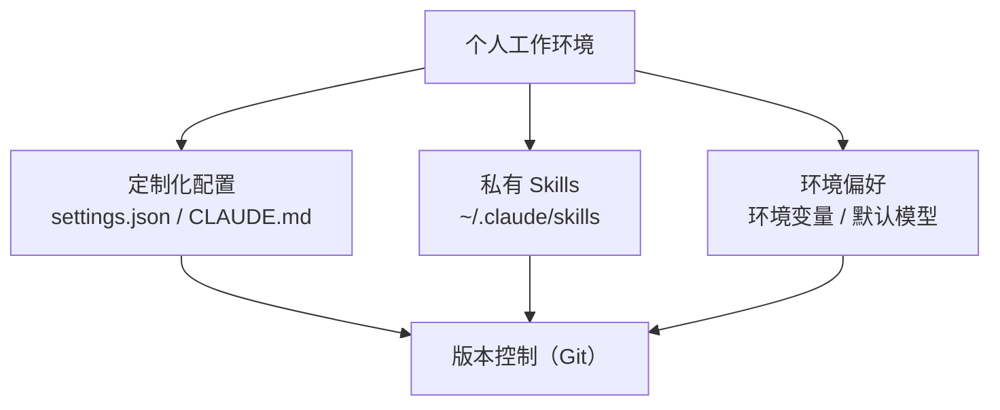

# 工具箱管理：把"顺手的环境"焊进肌肉记忆

> 本条目是「多工具协同方法论」的第 6 部分，对应学习清单条目 5.2.2。
>
> **前置依赖**：MCP工具选型
> **为以下铺垫**：MCP协议、A2A协议

---

## 一、核心观点

> **工具箱管理 = 把"顺手的工作环境"固化下来：定制化配置 + 私有 Skills + 环境偏好，再用版本控制锁住。**
> 就像老木匠的工具箱——锤子摆哪、哪把锯好用、墨线怎么调，全是肌肉记忆。Agent 也一样：你的 CLAUDE.md / settings / 私有 Skills，就是它的"肌肉记忆"。

---

## 二、什么是工具箱管理

### 2.1 定义

- **工具箱管理**：管理你的工具配置、Skills、环境偏好，形成**个人化、可复用**的工作环境
- **目标**：减少重复配置、跨项目/跨机器一致、团队可共享

### 2.2 类比：木匠的工具箱

| 木匠的工具箱 | Agent 的工具箱 |
|--------------|----------------|
| 常用锤/锯摆固定位置 | CLAUDE.md 约定、settings 权限 |
| 私藏的小夹具 | 私有 Skills（code-review / doc-gen） |
| 个人手感偏好 | 环境变量、默认模型、max_tokens |

### 2.3 分层（Mermaid）



---

## 三、工具箱里该放什么

### 3.1 定制化配置（示例）

```json
// .claude/settings.json（示例，模型名按你实际订阅填写）
{
  "permissions": {
    "allow": ["Read", "Write", "Bash"],
    "deny": ["WebSearch"]
  },
  "model": "claude-opus-4",
  "max_tokens": 8192
}
```

### 3.2 私有 Skills

```bash
# 个人 Skills 目录
~/.claude/skills/
├── code-review/      # 复用评审清单
├── doc-generation/   # 一键出文档
└── test-generation/  # 按改动补测试
```

### 3.3 环境偏好

```bash
# 环境变量（示例）
export CLAUDE_MODEL=claude-opus-4
export CLAUDE_MAX_TOKENS=8192
```

---

## 四、最佳实践

### 4.1 版本控制

- 把配置加入 git，记录变更历史，方便回滚
- CLAUDE.md 别太长：**保持在 200 行以内**——超过此长度人和 Agent 都会 skim-read，其余移入 Skills
- **Progressive Disclosure**：不要把所有指令塞进 System Prompt，用 Skills 按需加载，省上下文

### 4.2 分享配置

- 团队共享 CLAUDE.md / Skills，统一开发环境，减少差异
- 用 Plugins 打包（skills + hooks + subagents + MCP），一次安装多处复用

### 4.3 定期更新

- 定期检查配置、更新工具版本、迭代 Skills
- 每次 Agent 犯同类错 → 改进成"结构上不可能再犯"的 Hook/Skill，而非口头提醒

---

## 五、优劣势

- ✅ 跨项目一致、上手即"顺手"，新人秒接老环境
- ✅ 把经验沉淀为可复用资产，团队知识可累积
- ❌ 初始搭建有一次性的成本
- ❌ 配置过多反而增加认知负担，需持续迭代

---

## 六、最新研究与企业数据（2024–2026）

- **CLAUDE.md < 200 行成经验法则**：Harness Engineering 实践普遍建议 CLAUDE.md 控制在 200 行内，超出后人与 Agent 都会 skim-read，多余内容应移入 Skills（按需加载）。
- **"让错误永远不再发生"**：HumanLayer 提出的核心原则——每次 Agent 犯错，就工程化地让该错误**结构上不可能再发生**（用 Hook / 规则固化），而非一次次 Prompt 提醒。这正是工具箱管理的价值所在。
- **Skills 成开放标准（2025-12）**：私有 Skills 现在可跨 Claude 应用 / Claude Code / API 复用，工具箱第一次能"带着走"。

---

## 七、学习资源

- **Anthropic** 扩展层指南（CLAUDE.md/Skills/Plugins）：[code.claude.com/docs/en/features-overview](https://code.claude.com/docs/en/features-overview)
- **HumanLayer (2026)** Harness Engineering（200 行原则、"让错误不再发生"）：[humanlayer.dev/blog/skill-issue-harness-engineering-for-coding-agents](https://www.humanlayer.dev/blog/skill-issue-harness-engineering-for-coding-agents)
- **进阶**：[[../01-认知升级/03-2026初 Harness Engineering|Harness Engineering]] · [[05-MCP工具选型|MCP 工具选型]]

---

## 核心要点

- **一句话**：工具箱管理 = 把顺手环境固化（配置＋私有 Skills＋环境偏好）并用 Git 锁住。
- **类比**：老木匠的工具箱——锤子摆哪、私藏夹具、个人手感，全是肌肉记忆。
- **铁律**：CLAUDE.md < 200 行；超出的移进 Skills（Progressive Disclosure）。
- **原则**：每次 Agent 犯错 → 用 Hook/Skill 让错误结构上不可能再犯。
- **团队**：用 Plugins 打包配置一次安装、多处复用。

---

## 参考来源（一手链接 · 可溯源深挖）

- **Anthropic** 扩展层指南（CLAUDE.md/Skills/Plugins 怎么选）：[code.claude.com/docs/en/features-overview](https://code.claude.com/docs/en/features-overview)
- **HumanLayer (2026)**《Harness Engineering for Coding Agents》（200 行原则、"让错误不再发生"）：[humanlayer.dev/blog/skill-issue-harness-engineering-for-coding-agents](https://www.humanlayer.dev/blog/skill-issue-harness-engineering-for-coding-agents)
- **martinfowler.com** Harness Engineering 文章（同上原则）：[martinfowler.com/articles/harness-engineering.html](https://martinfowler.com/articles/harness-engineering.html)

**相关链接**：
- 系列清单：[[学习路线图/Agent 方法论与产品思维学习清单|Agent 方法论与产品思维学习清单]]
- 上一层级：[[00-Agent 方法论与产品思维|多工具协同方法论 · 索引]]
- 下一篇：[[07-MCP协议|MCP 协议]]——工具箱讲完，进入协议层
- 同主题：[[05-MCP工具选型|MCP 工具选型]] · [[../01-认知升级/03-2026初 Harness Engineering|Harness Engineering]]

## 速记卡（面试闪卡）

**Q1：一句话讲清「工具箱管理：把"顺手的环境"焊进肌肉记忆」到底是什么？**
A：**工具箱管理 = 把"顺手的工作环境"固化下来：定制化配置 + 私有 Skills + 环境偏好，再用版本控制锁住。**
就像老木匠的工具箱——锤子摆哪、哪把锯好用、墨线怎么调，全是肌肉记忆。Agent 也一样：你的 CLAUDE.md / settings / 私有 Skills，就是它的"肌肉记忆"。
---

**Q2：一、核心观点 —— 怎么理解？**
A：**工具箱管理 = 把"顺手的工作环境"固化下来：定制化配置 + 私有 Skills + 环境偏好，再用版本控制锁住。**
就像老木匠的工具箱——锤子摆哪、哪把锯好用、墨线怎么调，全是肌肉记忆。Agent 也一样：你的 CLAUDE.md / settings / 私有 Skills，就是它的"肌肉记忆"。
---

**Q3：二、什么是工具箱管理 —— 怎么理解？**
A：**工具箱管理**：管理你的工具配置、Skills、环境偏好，形成**个人化、可复用**的工作环境
**目标**：减少重复配置、跨项目/跨机器一致、团队可共享
| 木匠的工具箱 | Agent 的工具箱 |
|--------------|----------------|
| 常用锤/锯摆固定位置 | CLAUDE.

**Q4：三、工具箱里该放什么 —— 怎么理解？**
A：---

**Q5：四、最佳实践 —— 怎么理解？**
A：把配置加入 git，记录变更历史，方便回滚
CLAUDE.md 别太长：**保持在 200 行以内**——超过此长度人和 Agent 都会 skim-read，其余移入 Skills
**Progressive Disclosure**：不要把所有指令塞进 System Prompt，用 Skills 按需加载，省上下文
团队共享 CLAUDE.

**Q6：核心速记主线有哪些？**
A：抓住这几根：一、核心观点、二、什么是工具箱管理、三、工具箱里该放什么、四、最佳实践、五、优劣势、六、最新研究与企业数据（2024–2026）。

