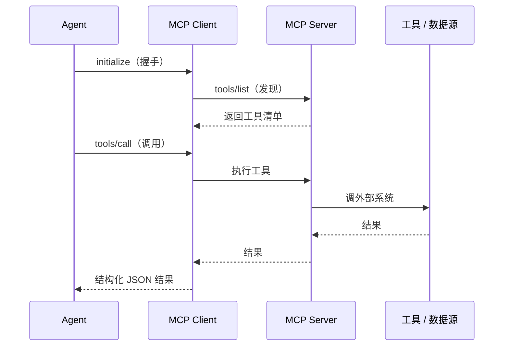

# MCP 协议：Agent 的"USB 接口"

> 本条目是「多工具协同方法论」的第 7 部分，对应学习清单条目 5.3.1。
>
> **前置依赖**：工具选型原则、MCP工具选型
> **为以下铺垫**：A2A协议、ACP协议

---

## 一、核心观点

> **MCP（Model Context Protocol，模型上下文协议）是 Agent 的「USB 接口」——它解决"Agent 怎么标准化地调外部工具/数据源"，把 N×M 的对接成本压成 N+M。**
> 没有它，每接一个工具都要写一套胶水代码；有了它，写一个 Server，任何兼容 Agent 都能用。

---

## 二、定义与原理

### 2.1 是什么

- **MCP（Model Context Protocol，模型上下文协议）**：Anthropic 于 **2024-11** 开源，2025-12 捐赠给 Linux Foundation 的 **AAIF**（Agentic AI Foundation）
- **作用**：统一 Agent 与外部工具/数据源的通信格式
- **地位**：OpenAI / Google / Microsoft / AWS / Cloudflare 全部原生支持，已成事实标准

### 2.2 类比：USB 接口

就像 USB 让电脑统一接键盘、硬盘、摄像头，MCP 让 Agent 统一接数据库、GitHub、Slack——**不用为每个外设单独焊接口**。

### 2.3 三类原语（primitives）

| 原语 | 谁控制 | 作用 |
|------|--------|------|
| **tools** | 模型控制 | 可调用的动作（API 调用、写文件） |
| **resources** | 应用控制 | 只读数据（文件、数据库内容） |
| **prompts** | 用户触发 | 模板化工作流 |

> 这种区分是**有意的安全设计**：把"能自动发起什么"和"需要人/应用批准什么"分开。

---

## 三、工作原理（Mermaid）

- **传输**：本地用 **stdio**，远程/企业用 **Streamable HTTP**（2025-06 生产可用），认证走 **OAuth 2.1 + PKCE**
- **核心循环**：`initialize` → `tools/list` → `tools/call`，一切走结构化 JSON

---

## 四、优势

- ✅ **标准化**：一次实现，处处可用（N+M 而非 N×M）
- ✅ **生态丰富**：1 万+ 生产 Server，覆盖开发工具/业务应用/数据库/CRM/云
- ✅ **安全**：OAuth/OIDC、mTLS、细粒度授权 scope、输入校验、审计日志
- ❌ 远程 Streamable HTTP 与负载均衡在"有状态会话 + 水平扩展"上仍有张力（2026 路线图在解）

---

## 五、优劣势小结

> 一句话：MCP 管"Agent 调工具"，是 agent-to-tool 层。**和 A2A（agent-to-agent）互补，不是替代**（见 [[08-A2A协议|A2A 协议]]）。维修厂比喻：MCP 管"员工用扳手"，A2A 管"员工之间沟通"。

---

## 六、最新研究与企业数据（2024–2026）

- **9700 万次月下载（2026-03）**：从 2024-11 的约 200 万涨到 9700 万，16 个月约 **4750%**，比 React 当年快得多。
- **生产规模**：Uber 内部有 1500+ 月活 Agent、6 万+ 周执行，用内部 MCP 网关把 1 万+ 服务自动变成 Agent 可查询目录；Bloomberg、PwC 等也已生产部署。
- **安全现实**：2026 年初 30+ 个 CVE（含 CVSS 9.6 RCE）；Equixly 研究发现约 **43%** 被测 MCP 实现存在命令注入——接社区 Server 必须限权限 + 审计。

---

## 七、学习资源

- **官方**：[modelcontextprotocol.io](https://modelcontextprotocol.io)
- **采用数据（2026-03）**：[ai2.work · 97M installs](https://ai2.work/blog/mcp-crosses-97-million-installs-as-protocol-war-ends)
- **进阶**：[[05-MCP工具选型|MCP 工具选型]] · [[08-A2A协议|A2A 协议]] · [[09-ACP协议|ACP 协议]]

---

## 核心要点

- **一句话**：MCP = Agent 的 USB 接口，统一"Agent 调工具"，把 N×M 压成 N+M。
- **三类原语**：tools（模型控）/ resources（应用控）/ prompts（用户触发）——安全隔离。
- **传输**：本地 stdio，远程 Streamable HTTP + OAuth 2.1。
- **规模锚点**：9700 万月下载（2026-03），1 万+ 生产 Server，已归 Linux Foundation。
- **互补**：MCP 管工具，A2A 管 Agent 间通信。

---

## 参考来源（一手链接 · 可溯源深挖）

- **官方**：[modelcontextprotocol.io](https://modelcontextprotocol.io)
- **Digital Applied Analysis / ai2.work (2026-03)**《MCP Crosses 97 Million Installs》（9700 万月下载、Uber 生产规模、安全 CVE）：[ai2.work/blog/mcp-crosses-97-million-installs-as-protocol-war-ends](https://ai2.work/blog/mcp-crosses-97-million-installs-as-protocol-war-ends)
- **agentmarketcap.ai (2026-04)** MCP Dev Summit（网关模式、1.7 万+ 公共 Server）：[agentmarketcap.ai/blog/2026/04/24/aaif-mcp-dev-summit-protocol-inflection-point](https://agentmarketcap.ai/blog/2026/04/24/aaif-mcp-dev-summit-protocol-inflection-point)
- **MCP 安全（43% 命令注入）**：来源待核实——Equixly 对 MCP 实现的研究，未检索到一手永久链接，建议以 modelcontextprotocol.io 安全指南为准。

**相关链接**：
- 系列清单：[[学习路线图/Agent 方法论与产品思维学习清单|Agent 方法论与产品思维学习清单]]
- 上一层级：[[00-Agent 方法论与产品思维|多工具协同方法论 · 索引]]
- 下一篇：[[08-A2A协议|A2A 协议]]——Agent 的"互联网协议"
- 同主题：[[05-MCP工具选型|MCP 工具选型]] · [[09-ACP协议|ACP 协议]]

## 速记卡（面试闪卡）

**Q1：一句话讲清「MCP 协议：Agent 的"USB 接口"」到底是什么？**
A：**MCP（Model Context Protocol，模型上下文协议）是 Agent 的「USB 接口」——它解决"Agent 怎么标准化地调外部工具/数据源"，把 N×M 的对接成本压成 N+M。**
没有它，每接一个工具都要写一套胶水代码；有了它，写一个 Server，任何兼容 Agent 都能用。
---

**Q2：一、核心观点 —— 怎么理解？**
A：**MCP（Model Context Protocol，模型上下文协议）是 Agent 的「USB 接口」——它解决"Agent 怎么标准化地调外部工具/数据源"，把 N×M 的对接成本压成 N+M。**
没有它，每接一个工具都要写一套胶水代码；有了它，写一个 Server，任何兼容 Agent 都能用。
---

**Q3：二、定义与原理 —— 怎么理解？**
A：**MCP（Model Context Protocol，模型上下文协议）**：Anthropic 于 **2024-11** 开源，2025-12 捐赠给 Linux Foundation 的 **AAIF**（Agentic AI Foundation）
**作用**：统一 Agent 与外部工具/数据源的通信格式

**Q4：三、工作原理（Mermaid） —— 怎么理解？**
A：**传输**：本地用 **stdio**，远程/企业用 **Streamable HTTP**（2025-06 生产可用），认证走 **OAuth 2.1 + PKCE**
**核心循环**： →  → ，一切走结构化 JSON
---

**Q5：四、优势 —— 怎么理解？**
A：✅ **标准化**：一次实现，处处可用（N+M 而非 N×M）
✅ **生态丰富**：1 万+ 生产 Server，覆盖开发工具/业务应用/数据库/CRM/云
✅ **安全**：OAuth/OIDC、mTLS、细粒度授权 scope、输入校验、审计日志
❌ 远程 Streamable HTTP 与负载均衡在"有状态会话 + 水平扩展"上仍有张力（2026 路线图在解）
---

**Q6：核心速记主线有哪些？**
A：抓住这几根：一、核心观点、二、定义与原理、三、工作原理（Mermaid）、四、优势、五、优劣势小结、六、最新研究与企业数据（2024–2026）。

