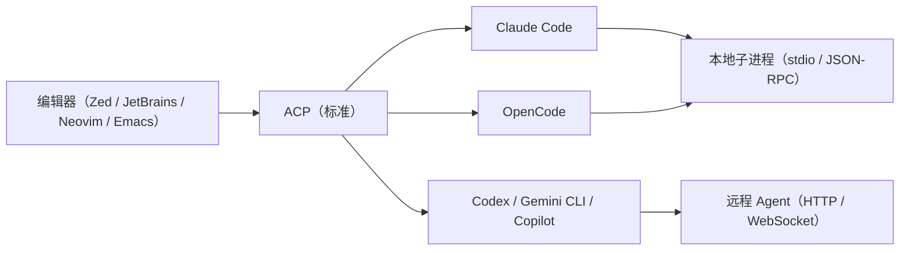

---

title: "ACP 协议"

tags:

  - agent方法论

  - 多工具协同

  - 协议层

  - acp

created: "2026-07-21"

---

# ACP 协议：Agent 的"进程管理器"

> 本条目是「多工具协同方法论」的第 9 部分，对应学习清单条目 5.3.3。

>

> **前置依赖**：MCP协议、A2A协议

> **为以下铺垫**：混用Agent策略、工具切换成本

---

## 一、核心观点

> **ACP（Agent Client Protocol，智能体客户端协议）是 Agent 的「LSP（语言服务器协议）」——它标准化"IDE / 编辑器 怎么统一管理和驱动 Coding Agent"，让你挑编辑器、挑 Agent 都能自由组合。**

> 如果说 MCP 是"员工用工具"、A2A 是"员工间沟通"，ACP 就是"厂长怎么给员工派活、看进度、叫停"。

---

## 二、定义与原理
### 2.1 是什么

- **ACP（Agent Client Protocol，智能体客户端协议）**：由 **Zed** 发起、**JetBrains 于 2025-12 宣布联合共建**的开放标准（2026-01 上线 ACP Agent Registry）

- **作用**：标准化 **IDE / 编辑器 与 Coding Agent 之间**的通信——启动、发消息、取消、看进度

- **定位**：像 **LSP（Language Server Protocol，语言服务器协议）** 之于语言支持，ACP 之于 Agent——实现一次，处处可接入

### 2.2 类比：进程管理器 / LSP

没有 LSP 时，每个编辑器要给每种语言写一套支持；没有 ACP 时，每个 IDE 要给每个 Agent 写一套集成。**ACP 把"编辑器"和"Agent"解耦**：Agent 实现一次协议，就能进 Zed / JetBrains / Neovim / Emacs；编辑器实现一次，就能接所有 Agent。

### 2.3 解耦（Mermaid）

---

## 三、工作原理
### 3.1 核心功能

- **启动 Agent**：在编辑器里拉起 Agent

- **发消息**：向 Agent 下达指令

- **取消 / 暂停**：中断或暂停任务

- **看进度**：查看执行状态与产出

### 3.2 两种形态

| 形态 | 传输 | 说明 |

|------|------|------|

| 本地 Agent | JSON-RPC over stdio | 作为编辑器子进程运行 |

| 远程 Agent | HTTP / WebSocket | 云或独立基础设施（演进中） |

### 3.3 Agent Registry（2026-01）

JetBrains + Zed 上线 **ACP Agent Registry**：在 IDE 里浏览 Agent、一键安装、按任务切换——把"技术可行"变成"随手可用"。

---

## 四、优势

- ✅ **统一管理**：一个 IDE 接所有 ACP 兼容 Agent，不切工具

- ✅ **进程控制**：启动/取消/暂停/进度，生命周期可控

- ✅ **零锁定**：挑编辑器、挑 Agent 自由组合，竞争力在质量不在独家绑定

- ❌ 远程 Agent 支持仍在演进中

- ❌ VS Code 原生支持弱于 Zed / JetBrains（靠社区插件补）

---

## 五、优劣势小结

> 三协议拼图：MCP = Agent 调工具；A2A = Agent 间通信；ACP = 编辑器管 Agent。**ACP 是"人机界面层"，让前面两层的能力真正落到你每天用的编辑器里。**

---

## 六、最新研究与企业数据（2024–2026）

- **联合共建（2025-12）**：JetBrains 宣布与 Zed 共同开发 ACP，把支持带向整个 IDE 产品线（IntelliJ / PyCharm / WebStorm 等）。

- **Agent Registry 上线（2026-01）**：官方目录直接集成进 JetBrains IDE 与 Zed，首批含 OpenCode、Gemini CLI、GitHub Copilot、Codex、Mistral Vibe、Qwen Code 等——"实现一个协议，触达数百万用户"。

- **生态扩张**：除 Zed / JetBrains，Neovim、Emacs、Sidequery 等也在接入；Agent 侧已出现 Junie、goose、Cline、Kiro 等实现。

---

## 七、学习资源

- **官方**：[agentclientprotocol.com](https://agentclientprotocol.com/)

- **JetBrains (2025-12)**《Bring your own AI agent to JetBrains IDEs》：[blog.jetbrains.com/ai/2025/12/bring-your-own-ai-agent-to-jetbrains-ides](https://blog.jetbrains.com/ai/2025/12/bring-your-own-ai-agent-to-jetbrains-ides/)

- **JetBrains (2026-01)**《ACP Agent Registry Is Live》：[blog.jetbrains.com/ai/2026/01/acp-agent-registry](https://blog.jetbrains.com/ai/2026/01/acp-agent-registry/)

- **Zed**《ACP Brings JetBrains on Board》：[zed.dev/blog/jetbrains-on-acp](https://zed.dev/blog/jetbrains-on-acp)

- **进阶**：[[07-MCP协议|MCP 协议]] · [[08-A2A协议|A2A 协议]] · [[10-混用Agent策略|混用 Agent 策略]]

---

## 核心要点

- **一句话**：ACP = Agent 的 LSP，标准化"IDE 怎么管 Coding Agent"。

- **类比**：像 LSP 之于语言支持，ACP 之于 Agent——实现一次，处处接入。

- **解耦**：编辑器 ↔ ACP ↔ Agent，挑编辑器、挑 Agent 都自由。

- **三件套能力**：启动 / 发消息 / 取消 + 看进度（进程管理）。

- **Registry（2026-01）**：IDE 内一键装 Agent，零厂商锁定。

---

## 参考来源（一手链接 · 可溯源深挖）

- **官方**：[agentclientprotocol.com](https://agentclientprotocol.com/)

- **JetBrains (2025-12)**《Bring your own AI agent to JetBrains IDEs》（ACP 定义、与 Zed 共建）：[blog.jetbrains.com/ai/2025/12/bring-your-own-ai-agent-to-jetbrains-ides](https://blog.jetbrains.com/ai/2025/12/bring-your-own-ai-agent-to-jetbrains-ides/)

- **JetBrains (2026-01)**《ACP Agent Registry Is Live》（Registry、首批 Agent 列表）：[blog.jetbrains.com/ai/2026/01/acp-agent-registry](https://blog.jetbrains.com/ai/2026/01/acp-agent-registry/)

- **Zed**《ACP Brings JetBrains on Board》：[zed.dev/blog/jetbrains-on-acp](https://zed.dev/blog/jetbrains-on-acp)

- **JetBrains ACP 页**：[jetbrains.com/acp](https://www.jetbrains.com/acp/)

## 速记卡（面试闪卡）

**Q1：一句话讲清「ACP 协议：Agent 的"进程管理器"」到底是什么？**

A：ACP 是 Agent 的 LSP：标准化 IDE 怎么统一启动、发消息、取消、看进度地驱动 Coding Agent，让挑编辑器挑 Agent 自由组合、零锁定。

**Q2：核心观点：ACP = Agent 的 LSP —— 怎么理解？ —— 怎么理解？**

A：ACP（Agent Client Protocol）是 Agent 的"语言服务器协议"——标准化 IDE/编辑器怎么统一管理和驱动 Coding Agent。三协议拼图：MCP 是"员工用工具"、A2A 是"员工间沟通"、ACP 是"厂长怎么给员工派活、看进度、叫停"。生活类比：像 LSP 之于语言支持，ACP 之于 Agent——实现一次，处处可接入。英文术语：LSP（Language Server Protocol）、Agent Client Protocol。

**Q3：定义与解耦：像进程管理器 —— 怎么理解？ —— 怎么理解？**

A：没有 LSP 时，每个编辑器要给每种语言写一套支持；没有 ACP 时，每个 IDE 要给每个 Agent 写一套集成。ACP 把"编辑器"和"Agent"解耦：Agent 实现一次协议，就能进 Zed/JetBrains/Neovim/Emacs；编辑器实现一次，就能接所有 Agent。生活类比：像统一插座标准，插头和插座各做一遍，互相随便插。英文术语：decoupling（解耦）、open standard（开放标准）。

**Q4：工作原理：启动/消息/取消/进度 —— 怎么理解？ —— 怎么理解？**

A：ACP 管 Agent 的生命周期：启动、发消息、取消/暂停、看进度。两种形态：本地 Agent 走 JSON-RPC over stdio（作编辑器子进程），远程 Agent 走 HTTP/WebSocket（云/独立基建，演进中）。2026-01 上线 ACP Agent Registry，在 IDE 里浏览、一键安装、按任务切换 Agent。生活类比：像进程管理器，进程的生杀予夺和状态一目了然。英文术语：JSON-RPC、stdio、Agent Registry（Agent 注册表）。

**Q5：优势：统一管理 + 零锁定 —— 怎么理解？ —— 怎么理解？**

A：✅ 统一管理：一个 IDE 接所有 ACP 兼容 Agent，不切工具；✅ 进程控制：启动/取消/暂停/进度，生命周期可控；✅ 零锁定：挑编辑器、挑 Agent 自由组合，竞争力在质量不在独家绑定。代价：远程 Agent 支持仍在演进，VS Code 原生支持弱于 Zed/JetBrains（靠社区插件补）。生活类比：像安卓开放生态，不绑厂商。英文术语：vendor lock-in（厂商锁定）、lifecycle management（生命周期管理）。

**Q6：核心速记主线有哪些？**

- 定位：ACP = Agent 的 LSP，标准化 IDE 驱动 Agent

- 解耦：编辑器 ↔ ACP ↔ Agent，挑谁都自由

- 能力：启动/发消息/取消/看进度（进程管理）

- 生态：Registry 一键装，Zed/JetBrains 共建零锁定

**口诀**

A：ACP 是 Agent 的 LSP，IDE 驱动统一管；

编辑器 Agent 解耦，挑谁组合随心愿；

启动发信可取消，看进度如进程监；

Registry 一键装 Agent，零锁定不绑厂商链。

## 相关链接

- 系列清单：[[学习路线图/Agent方法论与产品思维学习路线图|Agent 方法论与产品思维学习路线图]]

- 上一层级：[[00-Agent方法论与产品思维|多工具协同方法论 · 索引]]

- 下一篇：[[10-混用Agent策略|混用 Agent 策略]]——协议层讲完，讲跨工具协作

- 同主题：[[07-MCP协议|MCP 协议]] · [[08-A2A协议|A2A 协议]]

