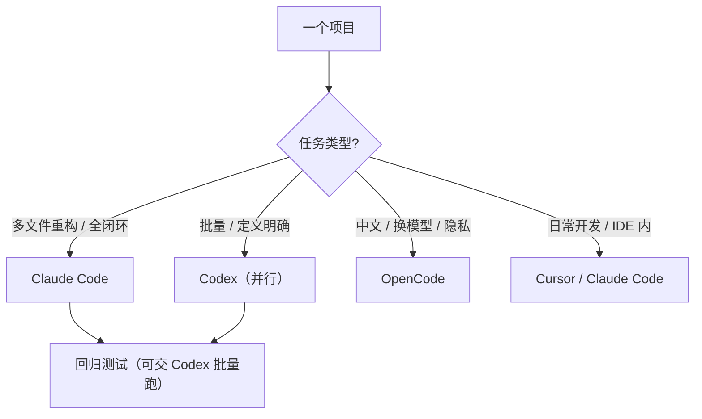

---

title: "混用 Agent 策略"

tags:

  - agent方法论

  - 多工具协同

  - 跨工具协作

  - 混用

created: "2026-07-21"

---

# 混用 Agent 策略：别让一个员工干所有活

> 本条目是「多工具协同方法论」的第 10 部分，对应学习清单条目 5.4.1。

>

> **前置依赖**：MCP协议、A2A协议、ACP协议

> **为以下铺垫**：工具切换成本

---

## 一、核心观点

> **一个项目里混用多种 Agent，本质是"按长处分工"——让每个工具干它最擅长的那段，整体效率最高。**

> 就像装修不会让水电工去刷墙：Claude Code 做复杂重构、Codex 跑批量并行、OpenCode 做中文/可换模型场景。混用取长补短，但也要付"协调成本"。

---

## 二、为什么混用
### 2.1 各工具长处不同

- **Claude Code**：Loop Engineering 最强（自校正、Agent Teams）

- **Codex**：云端并行、批处理最快

- **OpenCode**：模型可换、中文/本地隐私友好

### 2.2 取长补短

- 用 Claude Code 跑"需要边干边验证"的复杂重构

- 用 Codex 把"彼此独立的批量任务"并行扔进云沙箱

- 用 OpenCode 接 Qwen/DeepSeek 做中文密集场景

### 2.3 整体最优

- 各干各擅长的 → 总耗时最短、成本最优

- 但：上下文要在工具间"接力"，协调不能白费

---

## 三、混用策略（Mermaid）

### 3.1 按任务类型

| 任务类型 | 分配 | 原因 |

|----------|------|------|

| 多文件重构 | Claude Code | Loop Engineering 最强 |

| 批量任务 | Codex | 云端并行最快 |

| 中文场景 | OpenCode | 模型可换、中文友好 |

| 日常开发 | Cursor + Claude Code | IDE 集成 + 全闭环 |

### 3.2 按阶段 / 角色

| 阶段 | 分配 |

|------|------|

| 设计 | Claude Code（全局理解强） |

| 实现 | Cursor + Claude Code（实时补全 + 闭环） |

| 测试 | Codex（批量执行快） |

| 部署 | Claude Code（全流程管理） |

---

## 四、混用的挑战

- **上下文切换**：不同工具上下文不同，接力时可能丢信息 → 用 AGENTS.md / CLAUDE.md 固化约定

- **配置管理**：不同工具配置不同 → 用 Plugins / 版本控制统一

- **学习成本**：团队要学多个工具 → 用 ACP Registry 在一个 IDE 内切换，降低门槛

---

## 五、优劣势小结

- ✅ 取长补短，整体效率/成本最优

- ✅ 风险分散：不把鸡蛋放一个模型/工具

- ❌ 协调成本（上下文、配置、学习）

- ❌ 混用不当 = 比单工具更乱

---

## 六、最新研究与企业数据（2024–2026）

- **"组合优于单打"成 Agent 设计范式**：Anthropic《Building Effective Agents》给出 workflow / agent 的组合模式（如"编排者+工作者"），正是混用 Claude Code（lead）+ Codex（并行 worker）的理论依据。

- **并行是真实能力**：OpenAI Codex 支持在独立云沙箱里**并行跑多任务**并 best-of-N；Claude Code 的 **Agent Teams** 可 spawn 多个会话并行——两者都是"混用并行批处理"的工程底座。

- **切换门槛在降低**：ACP Agent Registry（2026-01）让你在同一个 IDE 里一键切换 Agent，直接缓解"混用导致的学习/切换成本"。

---

## 七、学习资源

- **Anthropic (2024-12)**《Building Effective Agents》（workflow / agent 组合）：[anthropic.com/engineering/building-effective-agents](https://www.anthropic.com/engineering/building-effective-agents)

- **OpenAI** Codex 并行 / best-of-N：[developers.openai.com/codex/cli/features](https://developers.openai.com/codex/cli/features)

- **进阶**：[[01-ClaudeCode特性|Claude Code]] · [[02-OpenCode特性|OpenCode]] · [[03-Codex特性|Codex]] · [[11-工具切换成本|工具切换成本]]

---

## 核心要点

- **一句话**：混用 = 按长处分工，整体最优，但要付协调成本。

- **分工口诀**：重构→Claude Code；批量→Codex；中文/换模型→OpenCode；日常→Cursor+Claude Code。

- **按阶段**：设计/部署→Claude Code；实现→Cursor+Claude Code；测试→Codex。

- **挑战三连**：上下文切换 / 配置管理 / 学习成本——用 AGENTS.md、Plugins、ACP Registry 缓解。

- **理论依据**：Anthropic "编排者+工作者"组合模式。

---

## 参考来源（一手链接 · 可溯源深挖）

- **Anthropic (2024-12)**《Building Effective Agents》（workflow / agent 组合模式）：[anthropic.com/engineering/building-effective-agents](https://www.anthropic.com/engineering/building-effective-agents)

- **OpenAI Developers** Codex CLI 功能（并行任务、best-of-N、--attempts）：[developers.openai.com/codex/cli/features](https://developers.openai.com/codex/cli/features)

- **JetBrains (2026-01)** ACP Agent Registry（同 IDE 切换 Agent）：[blog.jetbrains.com/ai/2026/01/acp-agent-registry](https://blog.jetbrains.com/ai/2026/01/acp-agent-registry/)

## 速记卡（面试闪卡）

**Q1：一句话讲清「混用 Agent 策略：别让一个员工干所有活」到底是什么？**

A：一个项目混用多种 Agent，本质是"按长处分工"，整体效率最高但要付协调成本。

**Q2：一、核心观点 —— 怎么理解？**

A：像装修不会让水电工去刷墙：Claude Code 做复杂重构（自校正强）、Codex 跑批量并行（云沙箱快）、OpenCode 做中文/可换模型（隐私友好）。各干各擅长，取长补短，但协调要成本。

**Q3：二、为什么混用（各工具长处） —— 怎么理解？**

A：像组球队按位置挑人：Claude Code Loop Engineering 最强（适合边干边验的重构）；Codex 云端并行批处理最快（独立任务并行扔沙箱）；OpenCode 模型可换、接 Qwen/DeepSeek 做中文密集场景。

**Q4：三、混用策略 —— 怎么理解？**

A：像按工种派活：多文件重构→Claude Code，批量任务→Codex，中文/换模型→OpenCode，日常开发→Cursor+Claude Code；按阶段也分：设计/部署给 Claude Code，实现给 Cursor，测试批量给 Codex。

**Q5：四、混用的挑战 —— 怎么理解？**

A：像多支队伍联合作战的后勤：上下文切换（接力丢信息→用 AGENTS.md/CLAUDE.md 固化约定）、配置管理（各工具不同→Plugins+版本控制）、学习成本（团队学多个→ACP Registry 同 IDE 一键切）三连击。

**Q6：核心速记主线有哪些？**

- 本质：按长处分工，整体最优但付协调成本

- 分工：重构→Claude Code；批量→Codex；中文→OpenCode

- 按阶段：设计/部署→CC；实现→Cursor+CC；测试→Codex

- 挑战三连：上下文切换 / 配置管理 / 学习成本

**口诀**

A：一个项目莫独扛，按长分工效率强；

重构Codex各得所，中文OpenCode担当；

上下文接莫丢档，配置统一插件帮；

混用得当全局优，协调成本记心房。

## 相关链接

- 系列清单：[[学习路线图/Agent方法论与产品思维学习路线图|Agent 方法论与产品思维学习路线图]]

- 上一层级：[[00-Agent方法论与产品思维|多工具协同方法论 · 索引]]

- 下一篇：[[11-工具切换成本|工具切换成本]]——混用讲完，讲切换成本管理

- 同主题：[[04-工具选型原则|工具选型原则]] · [[09-ACP协议|ACP 协议]]

