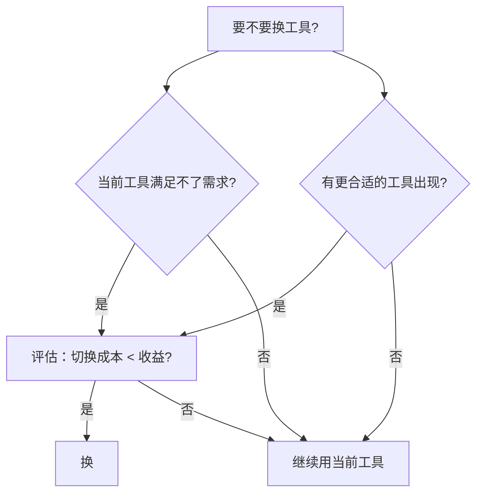

---

title: "工具切换成本"

tags:

  - agent方法论

  - 多工具协同

  - 跨工具协作

  - 切换成本

created: "2026-07-21"

---

# 工具切换成本：换工具不是换衣服，是要付"搬家费"的

> 本条目是「多工具协同方法论」的第 11 部分，对应学习清单条目 5.4.2。

>

> **前置依赖**：混用Agent策略

> **为以下铺垫**：Loop Engineering

---

## 一、核心观点

> **工具切换成本 = 从一个工具切到另一个的代价（学习 + 配置 + 上下文丢失 + 效率损失）。管理它的原则只有一句——不要频繁换，但要清楚"什么时候该换"。**

> 换工具像换工作：要学新环境、适应新工具、可能丢掉旧积累。不是不能换，是**换的收益要盖过搬家的钱**。

---

## 二、什么是工具切换成本
### 2.1 定义

- **工具切换成本**：从工具 A 切到工具 B 的总代价

- **四类组成**：学习成本、配置成本、上下文丢失、效率损失

### 2.2 类比：换工作

| 换工作 | 工具切换 |
|--------|----------|
| 学新公司流程 | 学新工具的操作/心智模型 |
| 重配开发环境 | 重配 settings / MCP / Skills |
| 丢失旧同事关系 | 丢失旧工具的上下文与积累 |
| 试用期效率下降 | 适应期生产力暂时下滑 |

---

## 三、切换成本的四种类型

| 类型 | 表现 |
|------|------|
| **学习成本** | 新工具学习曲线、团队培训、生产力暂时下降 |
| **配置成本** | 重配环境、接 MCP、与现有工具集成 |
| **上下文丢失** | 不同工具上下文不同，切换可能丢信息，需重载 |
| **效率损失** | 切换过程的时间损耗、适应期效率下降 |

---

## 四、什么时候该换 / 不该换（Mermaid）

### 4.1 该换的信号

- 当前工具**确实**满足不了需求（不是"听说更好"）

- 出现明显更合适的工具，且切换收益 > 成本

- 团队需求发生结构性变化

### 4.2 不该换的信号

- 只是"听说某某更强" → 多半是 FOMO

- 没有明确切换理由

- 切换成本（学习+配置+上下文）高于收益

---

## 五、优劣势小结

- ✅ 管得好：该换就换，避免被单一工具拖累

- ✅ 管得差：频繁跳槽 → 一直在"试用期"，总效率最低

- ❌ 极端 1：永不换 → 抱着过时工具

- ❌ 极端 2：月月换 → 永远在交搬家费

---

## 六、最新研究与企业数据（2024–2026）

- **切换门槛正在被协议拉低**：ACP Agent Registry（2026-01）让你在**同一个 IDE** 里一键安装/切换 Agent，不必为换 Agent 重配整套环境——直接压低"配置成本 + 学习成本"两项。

- **统一约定降低上下文丢失**：AGENTS.md 被 GitHub Copilot、Cursor、VS Code、OpenCode 等广泛采纳（Linux Foundation AAIF 创始项目），意味着换工具时"团队约定"不用重写，上下文接力更顺。

- **"从最简方案起步"反向约束切换**：Anthropic《Building Effective Agents》强调先简单后复杂——频繁为"更强"而切换，往往违背这一铁律，收益未必覆盖成本。

---

## 七、学习资源

- **JetBrains (2026-01)** ACP Agent Registry（同 IDE 切换 Agent，降低切换成本）：[blog.jetbrains.com/ai/2026/01/acp-agent-registry](https://blog.jetbrains.com/ai/2026/01/acp-agent-registry/)

- **Anthropic (2024-12)**《Building Effective Agents》（从最简方案起步）：[anthropic.com/engineering/building-effective-agents](https://www.anthropic.com/engineering/building-effective-agents)

- **进阶**：[[10-混用Agent策略|混用 Agent 策略]] · [[09-ACP协议|ACP 协议]] · [[../06-Loop Engineering/01-Automations|Loop Engineering]]

---

## 核心要点

- **一句话**：切换成本 = 学习 + 配置 + 上下文丢失 + 效率损失；不频繁换，但要知道何时该换。

- **类比**：换工具像换工作，要付"搬家费"。

- **该换**：需求真满足不了 / 更合适且收益>成本 / 团队需求结构性变化。

- **不该换**：只因"听说更强" / 无明确理由 / 成本>收益。

- **好消息**：ACP Registry + AGENTS.md 正在拉低切换成本。

---

## 参考来源（一手链接 · 可溯源深挖）

- **JetBrains (2026-01)**《ACP Agent Registry Is Live》（同 IDE 一键切换 Agent，降低切换成本）：[blog.jetbrains.com/ai/2026/01/acp-agent-registry](https://blog.jetbrains.com/ai/2026/01/acp-agent-registry/)

- **Anthropic (2024-12)**《Building Effective Agents》（从最简方案起步，约束无谓切换）：[anthropic.com/engineering/building-effective-agents](https://www.anthropic.com/engineering/building-effective-agents)

- **Linux Foundation AAIF**（AGENTS.md 为创始项目，跨工具统一约定）：[linuxfoundation.org](https://www.linuxfoundation.org)（待核实具体页面）

## 速记卡（面试闪卡）

**Q1：一句话讲清「工具切换成本：换工具不是换衣服，是要付"搬家费"的」到底是什么？**

A：工具切换成本是换工具时付出的学习、配置与效率代价总和。

**Q2：一、核心观点 —— 怎么理解？ —— 怎么理解？**

A：像换工作：要学新环境、适应新流程、可能丢掉旧人脉，不是不能换，是收益要盖过"搬家费"。英语：switching cost（切换成本）。

**Q3：二、四类组成 —— 怎么理解？ —— 怎么理解？**

A：换工具的总代价拆成四笔账：学新操作（学习成本）、重配环境（配置成本）、丢旧上下文（上下文丢失）、适应期低效（效率损失）。英语：context loss（上下文丢失）。

**Q4：三、该换还是不该换 —— 怎么理解？ —— 怎么理解？**

A：像谈恋爱别乱换：需求真满足不了才换，只因"听说更强"多半是 FOMO；收益盖过成本才动手。英语：FOMO（错失恐惧症）。

**Q5：四、好消息：成本正在被压低 —— 怎么理解？ —— 怎么理解？**

A：像搬家出了"一键搬家"服务：ACP Registry 同 IDE 切换 Agent，AGENTS.md 让团队约定不用重写，配置与上下文丢失双降。英语：ACP Agent Registry / AGENTS.md。

**Q6：核心速记主线有哪些？**

- 切换成本=学习+配置+上下文丢失+效率损失

- 像换工作，收益要盖过"搬家费"

- 该换看需求/收益，FOMO 别乱跳

- ACP+AGENTS.md 正拉低切换成本

**口诀**

A：工具别乱换，搬家要付钱；

四类成本算，收益盖过前；

该换看需求，FOMO 莫上弦；

ACP 减负担，切换路更宽。

## 相关链接

- 系列清单：[[学习路线图/Agent方法论与产品思维学习路线图|Agent 方法论与产品思维学习路线图]]

- 上一层级：[[00-Agent方法论与产品思维|多工具协同方法论 · 索引]]

- 下一篇：[[../06-Loop Engineering/01-Automations|Loop Engineering]]——多工具协同讲完，进入 Loop 层

- 同主题：[[10-混用Agent策略|混用 Agent 策略]] · [[04-工具选型原则|工具选型原则]]

