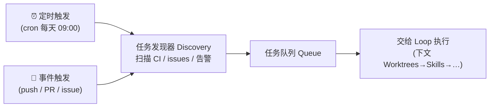

# Automations（自动化心跳）

> 本条目是「Loop Engineering」的第 1 部分，对应学习清单条目 6.1.1。
>
> **前置依赖**：认知升级：四层模型、Context Engineering、Harness Engineering
> **为以下铺垫**：Worktrees、Skills、Connectors、Sub-agents、State

---

## 一、核心观点

> **Automations（自动化心跳） = 定时 / 事件触发的「任务发现器」**：人还没醒，系统已经把昨晚的 CI 失败、新开的 issue、过期的 PR 扫了一遍，并把活儿摆到桌上了。
>
> 没有它，你的 Agent 就是个「等你手动喊才动」的社畜；有了它，Agent 变成「到点自己开工」的扫地机器人。

---

## 二、定义与原理

**Automations** 是 Loop 的「启动器」。它解决一个朴素问题：**谁来决定 Agent 现在该干啥？** 答案是——不让人决定，让时钟和事件决定。

- **定时触发（cron）**：每天 9 点扫 CI、每周一理 open issues，像你手机里的闹钟。
- **事件触发（event）**：代码一 push 就审查、PR 一开就跑测试，像门口的感应灯，人一走近就亮。
- **混合触发**：定时兜底 + 事件即时，像「每天巡楼 + 烟感报警」双保险。



> **铁律**：Automations 只负责「发现问题」，不负责「解决问题」。它把任务喂进 Loop，真正干活的链条在后面五大构件。

---

## 三、实践与示例

概念极简，先看一个 cron 风格的扫描器（伪代码，重在结构）：

```python
# 自动化心跳：定时扫描 + 事件hook，把任务丢进队列
def automation_heartbeat():
    failures = scan_ci_failures()          # 定时：每天扫一遍
    stale_prs = find_stale_pull_requests()  # 定时：找快过期的 PR
    for item in failures + stale_prs:
        enqueue(task=item, priority="p2")   # 进队列，等 Loop 认领

# 事件触发：push 即审查
on_event("push", lambda commit: enqueue(task=review_task(commit)))
```

工程上真正落地，通常借助现有调度器（GitHub Actions、cron、CI 的 scheduled workflows）而非自己造轮子。Anthropic 在《Building Effective Agents》里也强调：**先判断要不要 Agent**，大多数「定时跑一段确定性脚本」根本不需要 LLM——只有任务发现后是「开放、难预测」的才交给 Loop（[anthropic.com/engineering/building-effective-agents](https://www.anthropic.com/engineering/building-effective-agents)）。

---

## 四、优势与局限

- ✅ **零人工启动**：闭环真正「自主」的前提，没有它后面全是空谈。
- ✅ **覆盖盲区**：人睡觉 / 摸鱼时，CI 挂了也有人盯着。
- ❌ **垃圾进垃圾出**：发现器扫到的「任务」若没过滤，会把 Agent 喂成一头吃草的牛——需要一个判定「这事值不值得跑」的阈值。
- ❌ **触发风暴**：一个事件被错误配置成「每次都触发」，会瞬间打爆预算（见 [[08-预算护栏必设]]）。

---

## 五、最新研究与企业数据（2024–2026）

- **「先别上 Agent」是 2024–2026 的共识**：Anthropic《Building Effective Agents》明确把「workflow（确定性编排）」和「agent（模型自主驱动循环）」分开——Automations 这一层，凡能被 cron + 脚本搞定的，就别劳烦 LLM（[anthropic.com/engineering/building-effective-agents](https://www.anthropic.com/engineering/building-effective-agents)）。
- **Loop Engineering 总览**：tosea.ai 的 2026 综述把「Automations 作为 Loop 的触发入口」列为六大构件之首，强调「心跳」是自主系统的生命体征（[tosea.ai blog](https://tosea.ai/blog/loop-engineering-ai-agents-complete-guide-2026)）。
- 具体「企业里多少团队跑了定时 Agent」的量化数据，目前缺少一手统计——**(来源待核实：若有 Gartner / 各大厂 DevEx 报告中的采纳率数据，此处应引用)**。

---

## 六、学习资源

- **Anthropic (2024-12)**《Building Effective Agents》—— workflow vs agent 选型（何时该用 Automations 而非 Agent）
- **tosea.ai (2026)**《Loop Engineering: AI Agents Complete Guide》—— 六大构件总览
- **进阶**：[[02-Worktrees|Worktrees]]（任务进了队列后怎么并行不打架）· [[07-终止条件必须机器可检查|终止条件必须机器可检查]]

---

## 核心要点

- **一句话**：Automations = Loop 的「闹钟 + 感应灯」，负责自动发现任务，不负责解决任务。
- **三类触发**：定时（cron）/ 事件（push·PR·issue）/ 混合。
- **铁律**：只发现、不解决；能被确定性脚本搞定的就别用 LLM。
- **坑**：触发风暴会打爆预算，发现器要有「值不值得跑」的阈值。

---

## 参考来源（一手链接 · 可溯源深挖）

- **Anthropic (2024-12)**《Building Effective Agents》：[anthropic.com/engineering/building-effective-agents](https://www.anthropic.com/engineering/building-effective-agents)
- **tosea.ai (2026)**《Loop Engineering: The Complete Guide》：[tosea.ai/blog/loop-engineering-ai-agents-complete-guide-2026](https://tosea.ai/blog/loop-engineering-ai-agents-complete-guide-2026)

**相关链接**：
- 系列清单：[[学习路线图/Agent 方法论与产品思维学习清单|Agent 方法论与产品思维学习清单]]
- 上一层级：[[00-Agent 方法论与产品思维|Loop Engineering · 索引]]
- 同系列：[[02-Worktrees|Worktrees]] · [[03-Skills|Skills]] · [[04-Connectors|Connectors]] · [[05-Sub-agents|Sub-agents]] · [[06-State|State]]

## 速记卡（面试闪卡）

**Q1：一句话讲清「Automations（自动化心跳）」到底是什么？**
A：**Automations（自动化心跳） = 定时 / 事件触发的「任务发现器」**：人还没醒，系统已经把昨晚的 CI 失败、新开的 issue、过期的 PR 扫了一遍，并把活儿摆到桌上了。
没有它，你的 Agent 就是个「等你手动喊才动」的社畜；有了它，Agent 变成「到点自己开工」的扫地机器人。
---

**Q2：一、核心观点 —— 怎么理解？**
A：**Automations（自动化心跳） = 定时 / 事件触发的「任务发现器」**：人还没醒，系统已经把昨晚的 CI 失败、新开的 issue、过期的 PR 扫了一遍，并把活儿摆到桌上了。
没有它，你的 Agent 就是个「等你手动喊才动」的社畜；有了它，Agent 变成「到点自己开工」的扫地机器人。
---

**Q3：二、定义与原理 —— 怎么理解？**
A：**Automations** 是 Loop 的「启动器」。它解决一个朴素问题：**谁来决定 Agent 现在该干啥？** 答案是——不让人决定，让时钟和事件决定。
**定时触发（cron）**：每天 9 点扫 CI、每周一理 open issues，像你手机里的闹钟。
**事件触发（event）**：代码一 push 就审查、PR 一开就跑测试，像门口的感应灯，人一走近就亮。

**Q4：三、实践与示例 —— 怎么理解？**
A：概念极简，先看一个 cron 风格的扫描器（伪代码，重在结构）：
工程上真正落地，通常借助现有调度器（GitHub Actions、cron、CI 的 scheduled workflows）而非自己造轮子。Anthropic 在《Building Effective Agents》里也强调：**先判断要不要 Agent**，大多数「定时跑一段确定性脚本」根本不需要 LLM——只有任务发现后是「开放、难预测」的才交给 Loop（）。

**Q5：四、优势与局限 —— 怎么理解？**
A：✅ **零人工启动**：闭环真正「自主」的前提，没有它后面全是空谈。
✅ **覆盖盲区**：人睡觉 / 摸鱼时，CI 挂了也有人盯着。
❌ **垃圾进垃圾出**：发现器扫到的「任务」若没过滤，会把 Agent 喂成一头吃草的牛——需要一个判定「这事值不值得跑」的阈值。
❌ **触发风暴**：一个事件被错误配置成「每次都触发」，会瞬间打爆预算（见 ）。
---

**Q6：核心速记主线有哪些？**
A：抓住这几根：一、核心观点、二、定义与原理、三、实践与示例、四、优势与局限、五、最新研究与企业数据（2024–2026）、六、学习资源。

