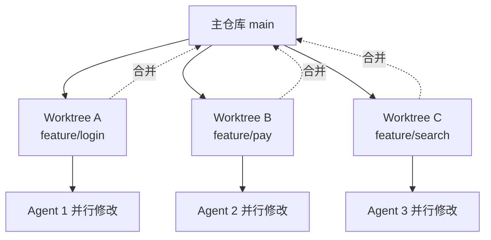

# Worktrees（工作树隔离）

> 本条目是「Loop Engineering」的第 2 部分，对应学习清单条目 6.1.2。
>
> **前置依赖**：Automations
> **为以下铺垫**：Skills、Connectors、Sub-agents、State

---

## 一、核心观点

> **Worktrees（工作树隔离） = 给每个 Agent 发一张独立工位桌**：多 Agent 并行跑，谁也碰不到谁的文件，最后再把成果合并。
>
> 没有它，三个 Agent 同时改 `main`，就像三个人在同一张草稿纸上抢着写字——最后那页纸没人认得。

---

## 二、定义与原理

**Worktree** 借用 Git 的能力，让同一个仓库同时检出多个分支、各自放在独立目录。每个 Agent 领一个 worktree，等于拥有「隔离的工作副本」：

- **隔离工作目录**：A 改 `feature/login`，B 改 `feature/pay`，互不踩脚。
- **并行不阻塞**：A 跑飞了，不影响 B 的交付。
- **可丢弃**：实验失败，直接 `git worktree remove`，主仓库干干净净。



> 容器 / 沙箱（Docker、Codespace）是更重的「整间办公室隔离」，worktree 是「同一办公室里的隔断桌」——按隔离粒度选型。

---

## 三、实践与示例

Git worktree 本身就是 Git 原生能力，零依赖：

```bash
# 给一个新任务开一张独立工位
git worktree add ../agent-task-login -b feature/login

# Agent 在隔离目录里干活
cd ../agent-task-login
# 干完合并、撤掉工位
git worktree remove ../agent-task-login
```

工程要点（来自 Harness 实践）：worktree 必须配合**权限边界**才安全——Agent 在 worktree 内可读可写，worktree 外只读（见 [[11-爆炸半径|爆炸半径]]）。HumanLayer 在 Harness Engineering 中把「隔离执行环境」列为可靠 Agent 的底座之一（[humanlayer.dev](https://www.humanlayer.dev/blog/skill-issue-harness-engineering-for-coding-agents)）。

---

## 四、优势与局限

- ✅ **并行提速**：N 个 Agent 同时开干，吞吐近似线性增长。
- ✅ **故障隔离**：一个 worktree 炸了，主仓库和其它 Agent 不受影响。
- ✅ **干净回滚**：去掉 worktree 即撤销实验，不留尾巴。
- ❌ **合并冲突仍可能发生**：worktree 防的是「运行中互踩」，不防「合并时冲突」——交叉改同一文件迟早要解冲突。
- ❌ **资源开销**：每个 worktree 占一份磁盘 / 进程，开太多 Agent 会撑爆机器。

---

## 五、最新研究与企业数据（2024–2026）

- **隔离 = 可靠 Agent 的前提**：HumanLayer《Harness Engineering》(2026) 将隔离执行环境（worktree / sandbox）列为让 coding agent 在生产环境可靠运行的核心组件（[humanlayer.dev](https://www.humanlayer.dev/blog/skill-issue-harness-engineering-for-coding-agents)）。
- **LangChain 的 Deep Agents 实践**：把长任务委托给**隔离上下文的子 Agent**，主 Agent 只收最终结果而非中间 20 次工具调用——本质也是「隔离」思想（[langchain.com blog](https://www.langchain.com/blog/the-anatomy-of-an-agent-harness)）。
- 关于「worktree 并行带来的具体提速倍数」的量化数据，缺少一手基准——**(来源待核实：若有各大厂 multi-agent 并行吞吐的 benchmark，此处应引用)**。

---

## 六、学习资源

- **Git 官方文档** `git worktree`：[git-scm.com/docs/git-worktree](https://git-scm.com/docs/git-worktree)
- **HumanLayer (2026)**《Harness Engineering for Coding Agents》
- **进阶**：[[11-爆炸半径|爆炸半径]]（worktree 外的只读边界）· [[05-Sub-agents|Sub-agents]]（隔离后的协作模式）

---

## 核心要点

- **一句话**：Worktrees = 给每个 Agent 一张独立工位，并行不踩脚，最后合并。
- **本质**：Git 多分支多目录隔离，可丢弃、可回滚。
- **配套**：必须配权限边界（worktree 外只读），否则隔离白搭。
- **坑**：防运行中互踩，不防合并冲突；开太多会撑爆资源。

---

## 参考来源（一手链接 · 可溯源深挖）

- **HumanLayer (2026)**《Harness Engineering for Coding Agents》：[humanlayer.dev/blog/skill-issue-harness-engineering-for-coding-agents](https://www.humanlayer.dev/blog/skill-issue-harness-engineering-for-coding-agents)
- **Git 官方文档** `git worktree`：[git-scm.com/docs/git-worktree](https://git-scm.com/docs/git-worktree)
- **LangChain (2026)**《The Anatomy of an Agent Harness》：[langchain.com/blog/the-anatomy-of-an-agent-harness](https://www.langchain.com/blog/the-anatomy-of-an-agent-harness)


## 速记卡（面试闪卡）

**Q1：一句话讲清「Worktrees（工作树隔离）」到底是什么？**
A：Worktrees 借用 Git 多分支多目录，给每个 Agent 一张隔离工位，并行不踩脚、失败可丢弃、最后合并。

**Q2：一、核心观点 —— 怎么理解？**
A：像给每个 Agent 发一张独立工位桌：三个 Agent 同时改文件，互不踩脚；没有它就像三人抢同一张草稿纸写字，谁都看不懂。最后把成果合并回主仓库（Worktree）。

**Q3：二、定义与原理 —— 怎么理解？**
A：像同一办公室里的「隔断桌」：Worktree 借 Git 能力让同仓库检出多个分支到独立目录，A 改 login、B 改 pay 互不干扰；容器/沙箱是更重的整间办公室隔离。

**Q4：三、实践与示例 —— 怎么理解？**
A：像开一张临时工位：`git worktree add` 开新分支目录，Agent 在隔离目录干活，完事 `git worktree remove` 撤掉。必须配权限边界（worktree 外只读），否则隔离白搭。

**Q5：四、优势与局限 —— 怎么理解？**
A：像并行开店的利弊：✅ 并行提速（吞吐近线性）、故障隔离、干净回滚；❌ 合并冲突仍会发生（防运行中互踩不防合并冲突）、开太多撑爆资源。

**Q6：核心速记主线有哪些？**
- Worktrees = 给每个 Agent 独立工位，并行不踩脚，最后合并
- 本质：Git 多分支多目录隔离，可丢弃、可回滚
- 配套：必须配权限边界（worktree 外只读），否则隔离失效
- 坑：防运行中互踩，不防合并冲突；开太多撑爆资源

**口诀**
A：Worktree 隔断桌，Agent 各忙活；
并行提速不互踩，回滚干净没拖；
权限边界要划好，外只读才稳妥；
合并冲突仍可能，资源别开太多。

## 相关链接
- 系列清单：[[学习路线图/Agent方法论与产品思维学习路线图|Agent 方法论与产品思维学习路线图]]
- 上一层级：[[00-Agent方法论与产品思维|Loop Engineering · 索引]]
- 同系列：[[01-Automations|Automations]] · [[03-Skills|Skills]] · [[11-爆炸半径|爆炸半径]]

