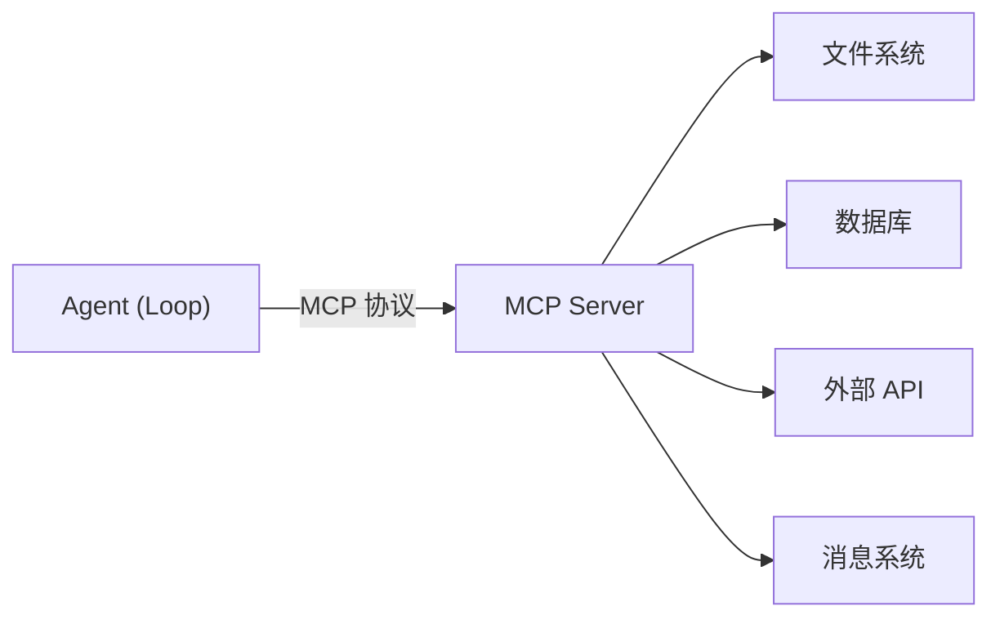

# Connectors（MCP 协议接入真实工具）

> 本条目是「Loop Engineering」的第 4 部分，对应学习清单条目 6.1.4。
>
> **前置依赖**：Automations、Worktrees、Skills
> **为以下铺垫**：Sub-agents、State

---

## 一、核心观点

> **Connectors（连接器） = 给 Agent 安上「能干活的手」**：通过 MCP（Model Context Protocol，模型上下文协议）把真实世界的工具——读营收、改 DNS、发消息——接到 Loop 上。
>
> 没有它，Agent 就是个「嘴强王者」：能跟你聊怎么修水管，但扳手不在手里，拧不动一个螺丝。

---

## 二、定义与原理

**Connector** 是 Agent 与外部工具 / 数据源之间的适配器，工业标准就是 **MCP（Model Context Protocol，模型上下文协议）**——它定义了一套「工具长什么样、怎么调用」的统一接口，让 Agent 不用为每个系统写一套私有对接。

- **文件系统**：读 / 写 / 搜文件
- **数据库**：查 / 改 / 管表
- **API**：调外部服务、拉数据、发请求
- **消息系统**：发 / 收 / 排队



> **类比**：MCP 像 USB-C 接口——不管插的是显示器还是硬盘，口子一样，Agent 不用为每件外设重新学一遍接线。

---

## 三、实践与示例

一个 MCP tool 的最小形态（概念极简，重在 schema 约定）：

```python
@mcp.tool()
def read_file(path: str) -> str:
    """读取文件内容并返回文本"""
    return open(path, "r", encoding="utf-8").read()

@mcp.tool()
def query_db(sql: str) -> list:
    """执行只读查询，返回行"""
    return db.readonly(sql)
```

工程要点（来自 Harness 实践）：**MCP 只接必要项**。连接器越多，token 浪费与「选错工具」的概率越高；用不上的就断开（见 [[../01-认知升级/03-2026初HarnessEngineering|Harness Engineering]]）。MCP 官方规范与 SDK 见 modelcontextprotocol.io（[modelcontextprotocol.io](https://modelcontextprotocol.io)）。

---

## 四、优势与局限

- ✅ **标准化**：一套 MCP 接口对接一切，告别「每系统一坨胶水代码」。
- ✅ **可组合**：文件系统 + 数据库 + API 串起来，Agent 才真正「能动真实世界」。
- ✅ **权限可管**：每个 connector 可单独授权 / 限权（见 [[11-爆炸半径|爆炸半径]]）。
- ❌ **工具过多反成负担**：工具描述本身占上下文，多了模型会「工具混淆」（见 [[../01-认知升级/03-2026初HarnessEngineering|Harness Engineering]] 的 Context Rot 表）。
- ❌ **信任边界**：Agent 一旦有「改 DNS」的 connector，炸起来就是生产事故——必须配预算与护栏。

---

## 五、最新研究与企业数据（2024–2026）

- **MCP 成为互联互通标准**：Anthropic 在 2024 末推出 MCP，到 2026 已成为 Agent 接外部工具的事实协议；Kusireddy 的事后复盘也指出，A2A 与 MCP 解决了「通信」问题，但**安全生产所需的基础设施（护栏 / 预算）尚缺**（[supervaize.com](https://supervaize.com/fr/blog/20251016-47k-agent-loop)）。
- **Harness 实验**：Opus 4.6 用默认 harness 在 Terminal-Bench 2.0 排第 40，换优化 harness（含更合理的工具连接）排**第 1**——"The harness, not the model, determined the ranking"（[langchain.com](https://www.langchain.com/blog/the-anatomy-of-an-agent-harness)）。
- connector 数量与「选错工具率」的量化关系，缺少一手测量——**(来源待核实：若有工具数量 vs 任务成功率的曲线数据，此处应引用)**。

---

## 六、学习资源

- **MCP 官方站点与规范**：[modelcontextprotocol.io](https://modelcontextprotocol.io)
- **Anthropic MCP 文档**：[docs.anthropic.com/en/docs/agents-and-tools/mcp](https://docs.anthropic.com/en/docs/agents-and-tools/mcp)
- **进阶**：[[05-Sub-agents|Sub-agents]]（谁来决定调哪个工具）· [[11-爆炸半径|爆炸半径]]（connector 的权限边界）

---

## 核心要点

- **一句话**：Connectors = 通过 MCP 给 Agent 安上「能干活的手」，接真实工具。
- **本质**：MCP 是 Agent 世界的 USB-C，统一工具接口。
- **铁律**：只接必要 connector，多了会工具混淆 + 烧 token。
- **坑**：有「改生产」权限的 connector 必须配护栏，否则炸的是真系统。

---

## 参考来源（一手链接 · 可溯源深挖）

- **MCP 官方站点**：[modelcontextprotocol.io](https://modelcontextprotocol.io)
- **Anthropic MCP 文档**：[docs.anthropic.com/en/docs/agents-and-tools/mcp](https://docs.anthropic.com/en/docs/agents-and-tools/mcp)
- **LangChain (2026)**《The Anatomy of an Agent Harness》(Terminal-Bench 2.0 排名实验)：[langchain.com/blog/the-anatomy-of-an-agent-harness](https://www.langchain.com/blog/the-anatomy-of-an-agent-harness)
- **Supervaize (2025-10)** $47K loop 复盘（MCP / A2A 解决通信但缺安全基础设施）：[supervaize.com/fr/blog/20251016-47k-agent-loop](https://supervaize.com/fr/blog/20251016-47k-agent-loop)


## 速记卡（面试闪卡）

**Q1：一句话讲清「Connectors（MCP 协议接入真实工具）」到底是什么？**
A：Connectors 通过 MCP 协议把真实世界的工具接到 Agent 的 Loop 上，给它"能干活的手"。

**Q2：一、核心观点 —— 怎么理解？**
A：像给 Agent 安上能干活的"手"——没它只是嘴强王者：聊得头头是道却拧不动一个螺丝。MCP(Model Context Protocol)像 USB-C 接口，不管插显示器还是硬盘，口子一样，Agent 不用为每件外设重学接线。

**Q3：二、定义与原理 —— 怎么理解？**
A：Connector 是 Agent 与外部工具/数据源间的适配器，工业标准就是 MCP——定义"工具长啥样、怎么调"的统一接口，免去为每个系统写私有对接。四类能力：文件系统(读写搜)、数据库(查改管)、API(调服务)、消息系统(收发排队)。

**Q4：三、实践与示例 —— 怎么理解？**
A：MCP tool 最小形态就是带 schema 的函数：@mcp.tool() 修饰 read_file(path) 返回文本、query_db(sql) 返回行。铁律(来自 Harness 实践)：MCP 只接必要项——连接器越多，token 浪费与"选错工具"概率越高，用不上的就断开。

**Q5：四、优势与局限 —— 怎么理解？**
A：三优：标准化(一套接口对接一切)、可组合(文件+数据库+API 串起 Agent 真能动真实世界)、权限可管(每个 connector 单独授权)。两坑：工具过多反成负担(描述占上下文→工具混淆)、信任边界(有"改 DNS"权限的 connector 炸了是生产事故，必配护栏)。

**Q6：核心速记主线有哪些？**
- 本质：MCP 是 Agent 世界的 USB-C，统一工具接口
- 铁律：只接必要 connector，多了会工具混淆+烧 token
- 优势：标准化、可组合、权限可单独管
- 坑：有生产权限的 connector 必须配预算与护栏

**口诀**
A：Connector 是手，MCP 当 USB
只接必要的，多了会混淆
权限单独给，危险要护栏
手再能干话，乱伸会出事

## 相关链接
- 系列清单：[[学习路线图/Agent方法论与产品思维学习路线图|Agent 方法论与产品思维学习路线图]]
- 上一层级：[[00-Agent方法论与产品思维|Loop Engineering · 索引]]
- 同系列：[[03-Skills|Skills]] · [[05-Sub-agents|Sub-agents]] · [[11-爆炸半径|爆炸半径]]

