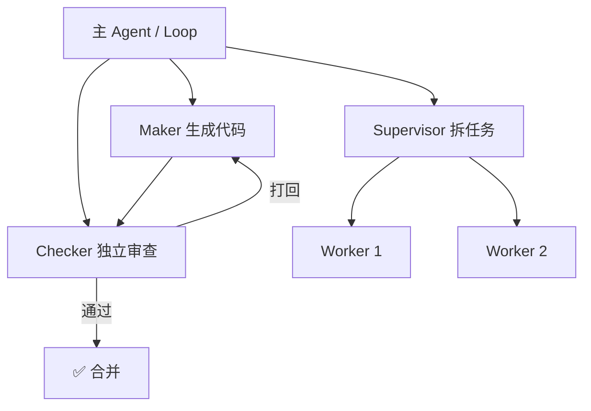

# Sub-agents（子 Agent 编排）

> 本条目是「Loop Engineering」的第 5 部分，对应学习清单条目 6.1.5。
>
> **前置依赖**：Automations、Worktrees、Skills、Connectors
> **为以下铺垫**：State

---

## 一、核心观点

> **Sub-agents（子 Agent 编排） = 让「写的人」和「查的人」分开**：Maker 写代码，Checker 独立验，消除「自己改作业自己打勾」的自评偏差。
>
> 没有它，一个 Agent 既当运动员又当裁判，90% 的概率它会觉得自己写得贼好——然后把你仓库改崩。

---

## 二、定义与原理

**Sub-agent** 是 Loop 内被委派专项任务的独立 Agent 实例，往往带**自己的上下文窗口**（隔离！见 [[02-Worktrees|Worktrees]] 思想）。三种经典编排模式：

- **Maker-Checker（创造者-检查者）**：一个生成、一个独立审查，**不能是同一个**。
- **Supervisor-Worker（主管-工人）**：主管拆任务、动态派给工人。
- **Pipeline（流水线）**：A→B→C 接力，每段只管一环节。



> **为什么必须分离**：自评是 LLM 最不可靠的能力之一。让写的人和查的人同一颗脑子，等于考试交白卷还给自己打满分。Anthropic 在《Building Effective Agents》里专门把「orchestrator-worker / 多 Agent」列为高风险高回报模式，强调隔离上下文才能避免「主 Agent 被 20 次中间结果淹死」（[anthropic.com/engineering/building-effective-agents](https://www.anthropic.com/engineering/building-effective-agents)）。

---

## 三、实践与示例

Maker-Checker 的最小骨架（概念极简）：

```python
maker  = Agent(role="maker")    # 只管生成
checker = Agent(role="checker") # 只管审查，看不到 maker 的「内心戏」

code = maker.generate(task)
review = checker.review(code)
if not review.passed:
    code = maker.regenerate(task, feedback=review.comments)  # 打回重做
```

> **关键**：Checker 的输入应只是「代码 + 验收标准」，而不是 Maker 的整段思维链——否则它会顺着 Maker 的逻辑自我说服。

---

## 四、优势与局限

- ✅ **消除自评偏差**：独立审查者让「自己改自己作业」的盲区无处遁形。
- ✅ **隔离上下文**：子 Agent 各用各的窗口，主 Agent 不被中间结果淹没（对抗 Context Rot，见 [[09-15个工具调用衰减|15 个工具调用衰减]]）。
- ✅ **专长化**：审查 Agent、检索 Agent 各司其职，比全能单体更稳。
- ❌ **协同开销**：多 Agent 通信本身吃 token、吃延迟，拆太碎反而慢。
- ❌ **无全局视野**：Worker 各管一段，容易「局部最优、整体拉胯」——需要 Supervisor 兜底。

---

## 五、最新研究与企业数据（2024–2026）

- **多 Agent 是「高风险高回报」**：Anthropic《Building Effective Agents》(2024-12) 把 orchestrator-worker 模式单列，提醒它比单 Agent 强但更易失控，需配套验证（[anthropic.com/engineering/building-effective-agents](https://www.anthropic.com/engineering/building-effective-agents)）。
- **隔离上下文的实证收益**：LangChain Deep Agents 把长任务委托给隔离子 Agent，主 Agent 只收结论而非 20 次工具调用的中间过程，直接缓解 Context Rot（[langchain.com blog](https://www.langchain.com/blog/the-anatomy-of-an-agent-harness)）。
- 关于「Maker-Checker 相比自评能降低多少缺陷率」的量化基准，缺少一手对照——**(来源待核实：若有 multi-agent vs single-agent 的缺陷率对比实验，此处应引用)**。

---

## 六、学习资源

- **Anthropic (2024-12)**《Building Effective Agents》—— orchestrator-worker 模式
- **LangChain (2026)**《The Anatomy of an Agent Harness》—— 子 Agent 上下文隔离
- **进阶**：[[09-15个工具调用衰减|15 个工具调用衰减]]（子 Agent 也逃不过上下文腐烂）· [[02-Worktrees|Worktrees]]（隔离的物理基础）

---

## 核心要点

- **一句话**：Sub-agents = 写的人和查的人分开，消除自评偏差。
- **三模式**：Maker-Checker / Supervisor-Worker / Pipeline。
- **铁律**：Checker 绝不能是 Maker 自己；输入只给「代码+标准」。
- **收益**：隔离上下文 = 主 Agent 不被中间结果淹没。

---

## 参考来源（一手链接 · 可溯源深挖）

- **Anthropic (2024-12)**《Building Effective Agents》：[anthropic.com/engineering/building-effective-agents](https://www.anthropic.com/engineering/building-effective-agents)
- **LangChain (2026)**《The Anatomy of an Agent Harness》：[langchain.com/blog/the-anatomy-of-an-agent-harness](https://www.langchain.com/blog/the-anatomy-of-an-agent-harness)

**相关链接**：
- 系列清单：[[学习路线图/Agent 方法论与产品思维学习清单|Agent 方法论与产品思维学习清单]]
- 上一层级：[[00-Agent 方法论与产品思维|Loop Engineering · 索引]]
- 同系列：[[04-Connectors|Connectors]] · [[06-State|State]] · [[09-15个工具调用衰减|15 个工具调用衰减]]

## 速记卡（面试闪卡）

**Q1：一句话讲清「Sub-agents（子 Agent 编排）」到底是什么？**
A：**Sub-agents（子 Agent 编排） = 让「写的人」和「查的人」分开**：Maker 写代码，Checker 独立验，消除「自己改作业自己打勾」的自评偏差。
没有它，一个 Agent 既当运动员又当裁判，90% 的概率它会觉得自己写得贼好——然后把你仓库改崩。
---

**Q2：一、核心观点 —— 怎么理解？**
A：**Sub-agents（子 Agent 编排） = 让「写的人」和「查的人」分开**：Maker 写代码，Checker 独立验，消除「自己改作业自己打勾」的自评偏差。
没有它，一个 Agent 既当运动员又当裁判，90% 的概率它会觉得自己写得贼好——然后把你仓库改崩。
---

**Q3：二、定义与原理 —— 怎么理解？**
A：**Sub-agent** 是 Loop 内被委派专项任务的独立 Agent 实例，往往带**自己的上下文窗口**（隔离！见  思想）。三种经典编排模式：
**Maker-Checker（创造者-检查者）**：一个生成、一个独立审查，**不能是同一个**。
**Supervisor-Worker（主管-工人）**：主管拆任务、动态派给工人。
**Pipeline（流水线）**：A→B→C 接力，每段只管一环节。

**Q4：三、实践与示例 —— 怎么理解？**
A：Maker-Checker 的最小骨架（概念极简）：
**关键**：Checker 的输入应只是「代码 + 验收标准」，而不是 Maker 的整段思维链——否则它会顺着 Maker 的逻辑自我说服。
---

**Q5：四、优势与局限 —— 怎么理解？**
A：✅ **消除自评偏差**：独立审查者让「自己改自己作业」的盲区无处遁形。
✅ **隔离上下文**：子 Agent 各用各的窗口，主 Agent 不被中间结果淹没（对抗 Context Rot，见 ）。
✅ **专长化**：审查 Agent、检索 Agent 各司其职，比全能单体更稳。
❌ **协同开销**：多 Agent 通信本身吃 token、吃延迟，拆太碎反而慢。

**Q6：核心速记主线有哪些？**
A：抓住这几根：一、核心观点、二、定义与原理、三、实践与示例、四、优势与局限、五、最新研究与企业数据（2024–2026）、六、学习资源。

