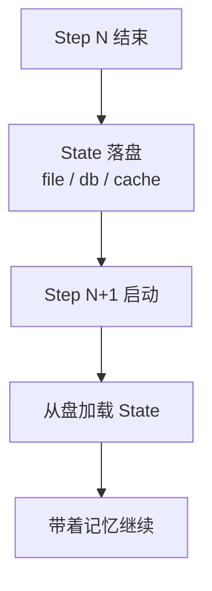

# State（外部状态/记忆）

> 本条目是「Loop Engineering」的第 6 部分，对应学习清单条目 6.1.6。
>
> **前置依赖**：Automations、Worktrees、Skills、Connectors、Sub-agents
> **为以下铺垫**：终止条件必须机器可检查

---

## 一、核心观点

> **State（外部状态 / 记忆） = 把 Agent 的「记性」搬到脑子外面**：模型两轮之间会忘，状态落盘才活得过一次 session。
>
> 没有它，Agent 像个「每睡一觉就失忆的人」——第二天完全不记得昨天改到哪了，从头再来。

---

## 二、定义与原理

**State** 是 Loop 在步骤之间、session 之间持久化的外部记忆。LLM 的上下文是易逝的（一次请求完就清空），所以一切「跨轮要记得的东西」都得**落盘**——文件、数据库、缓存。

- **短期记忆**：当前任务进行中、临时存，做完即弃。
- **长期记忆**：跨任务、跨 session 留存（如用户偏好、项目约定）。
- **外部状态**：文件系统 / 数据库 / 缓存等物理载体。



> **类比**：Agent 的上下文窗口是「工作台面」，State 是「文件柜」。台面满了就收进柜子，下次开工再取——台面（RAM）有限，柜子（磁盘）近乎无限。这与 Anthropic「把上下文当有限资源」的原则一致（[anthropic.com/engineering/effective-context-engineering-for-ai-agents](https://www.anthropic.com/engineering/effective-context-engineering-for-ai-agents)）。

---

## 三、实践与示例

最小落盘 / 加载（概念极简）：

```python
def save_state(state, path="state.json"):
    json.dump(state, open(path, "w"))

def load_state(path="state.json"):
    return json.load(open(path))

# Loop 主循环里：每步更新并落盘，再判终止
state = load_state()
for step in range(MAX_STEPS):
    result = execute(task, state)
    state = update_state(state, result)
    save_state(state)                 # 记忆落盘
    if verify(result): break          # 终止条件（见下篇）
```

---

## 四、优势与局限

- ✅ **跨 session 续命**：长任务隔夜跑、崩溃重启都不丢进度。
- ✅ **上下文瘦身**：把不常用的记忆移出窗口、用时再取，对抗 Context Rot（见 [[09-15个工具调用衰减|15 个工具调用衰减]]）。
- ✅ **可观测**：State 文件就是 Loop 的「黑匣子」，事后能复盘它到底记了啥。
- ❌ **一致性难题**：并发 Agent 同时写 State 会互相覆盖——要加锁或按 worktree 分片（见 [[02-Worktrees|Worktrees]]）。
- ❌ **陈旧状态**：State 不更新就变「过时记忆」，Agent 照着旧情报犯错。

---

## 五、最新研究与企业数据（2024–2026）

- **上下文是有限资源**：Anthropic《Effective Context Engineering》(2025-09) 强调「更聪明的模型需要更少规定性 prompt，但「上下文有限」这一原则永不变」——State 外置正是把有限窗口让给当下要用的信息（[anthropic.com/engineering/effective-context-engineering-for-ai-agents](https://www.anthropic.com/engineering/effective-context-engineering-for-ai-agents)）。
- **Context Rot 实证**：Chroma (2026) 测了 18 个前沿模型，性能随输入长度增长而退化，标称 200K 窗口的模型在 ~50K 就可能明显下滑——把记忆外置、按需取用是核心对策（[research.trychroma.com/context-rot](https://research.trychroma.com/context-rot)）。
- 关于「外置 State 对长任务完成率的提升幅度」缺少一手量化——**(来源待核实：若有长程 Agent + 外部记忆的完成率对照，此处应引用)**。

---

## 六、学习资源

- **Anthropic (2025-09)**《Effective Context Engineering for AI Agents》
- **Chroma (2026)**《Context Rot》技术报告
- **进阶**：[[09-15个工具调用衰减|15 个工具调用衰减]]（不外置会怎样）· [[07-终止条件必须机器可检查|终止条件必须机器可检查]]

---

## 核心要点

- **一句话**：State = 把 Agent 的记性搬到脑子外，落盘才活得过一次 session。
- **三类**：短期 / 长期 / 外部状态（文件·库·缓存）。
- **原则**：上下文是 RAM（有限），State 是文件柜（近乎无限）。
- **坑**：并发写会互相覆盖；陈旧 State 是「过时记忆」。

---

## 参考来源（一手链接 · 可溯源深挖）

- **Anthropic (2025-09)**《Effective Context Engineering for AI Agents》：[anthropic.com/engineering/effective-context-engineering-for-ai-agents](https://www.anthropic.com/engineering/effective-context-engineering-for-ai-agents)
- **Chroma (2026)**《Context Rot: How Increasing Input Tokens Impacts LLM Performance》：[research.trychroma.com/context-rot](https://research.trychroma.com/context-rot)

**相关链接**：
- 系列清单：[[学习路线图/Agent 方法论与产品思维学习清单|Agent 方法论与产品思维学习清单]]
- 上一层级：[[00-Agent 方法论与产品思维|Loop Engineering · 索引]]
- 同系列：[[05-Sub-agents|Sub-agents]] · [[07-终止条件必须机器可检查|终止条件必须机器可检查]] · [[09-15个工具调用衰减|15 个工具调用衰减]]

## 速记卡（面试闪卡）

**Q1：一句话讲清「State（外部状态/记忆）」到底是什么？**
A：**State（外部状态 / 记忆） = 把 Agent 的「记性」搬到脑子外面**：模型两轮之间会忘，状态落盘才活得过一次 session。
没有它，Agent 像个「每睡一觉就失忆的人」——第二天完全不记得昨天改到哪了，从头再来。
---

**Q2：一、核心观点 —— 怎么理解？**
A：**State（外部状态 / 记忆） = 把 Agent 的「记性」搬到脑子外面**：模型两轮之间会忘，状态落盘才活得过一次 session。
没有它，Agent 像个「每睡一觉就失忆的人」——第二天完全不记得昨天改到哪了，从头再来。
---

**Q3：二、定义与原理 —— 怎么理解？**
A：**State** 是 Loop 在步骤之间、session 之间持久化的外部记忆。LLM 的上下文是易逝的（一次请求完就清空），所以一切「跨轮要记得的东西」都得**落盘**——文件、数据库、缓存。
**短期记忆**：当前任务进行中、临时存，做完即弃。
**长期记忆**：跨任务、跨 session 留存（如用户偏好、项目约定）。
**外部状态**：文件系统 / 数据库 / 缓存等物理载体。

**Q4：三、实践与示例 —— 怎么理解？**
A：最小落盘 / 加载（概念极简）：
---

**Q5：四、优势与局限 —— 怎么理解？**
A：✅ **跨 session 续命**：长任务隔夜跑、崩溃重启都不丢进度。
✅ **上下文瘦身**：把不常用的记忆移出窗口、用时再取，对抗 Context Rot（见 ）。
✅ **可观测**：State 文件就是 Loop 的「黑匣子」，事后能复盘它到底记了啥。
❌ **一致性难题**：并发 Agent 同时写 State 会互相覆盖——要加锁或按 worktree 分片（见 ）。

**Q6：核心速记主线有哪些？**
A：抓住这几根：一、核心观点、二、定义与原理、三、实践与示例、四、优势与局限、五、最新研究与企业数据（2024–2026）、六、学习资源。

