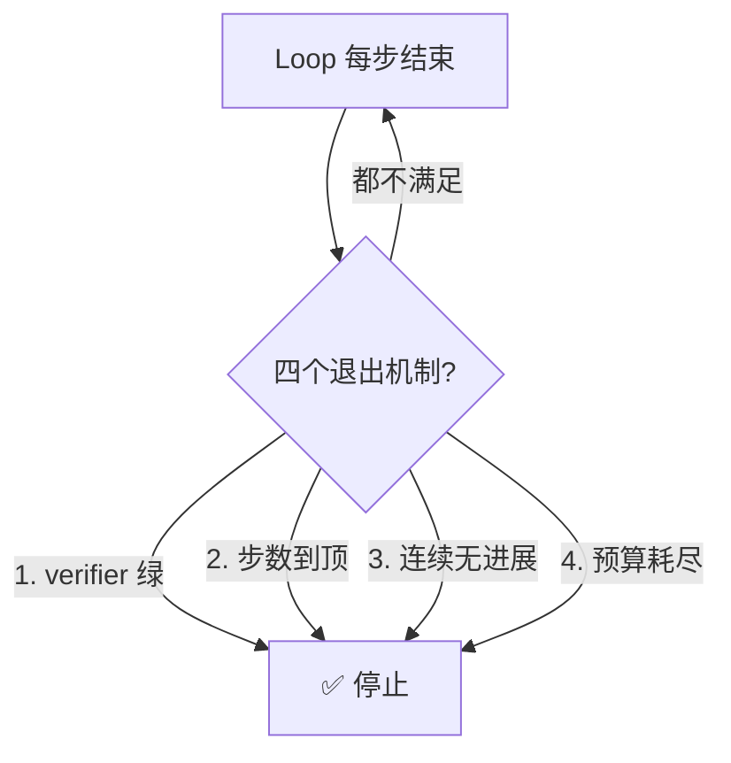

# 终止条件必须机器可检查

> 本条目是「Loop Engineering」的第 7 部分，对应学习清单条目 6.2.1。
>
> **前置依赖**：六大构件（Automations、Worktrees、Skills、Connectors、Sub-agents、State）
> **为以下铺垫**：预算护栏必设、15个工具调用衰减、Loop高风险警告

---

## 一、核心观点

> **终止条件必须机器可检查**：别信 Agent 那句「我做好啦」——它说完这句话的下一秒，可能还在原地打转。
>
> 把「该不该停」交给 LLM 判断，等于让醉汉自己决定「我还清醒吗」。答案永远是「清醒，再来一杯」。

---

## 二、定义与原理

**终止条件（termination condition）** 是 Loop 何时停下来的判定标准。它的铁律只有一条：**必须是 Loop 状态的确定性属性，绝不能问模型自己。**

为什么？因为 LLM 没有「自我怀疑」的可靠开关——你问它「干完了吗」，它会顺着你的期待说「干完了」。唯一可信的 pass 信号来自**代码**。

> **四种独立的退出机制**（来自 Loop Engineering 社区共识，2026）：
> 1. **确定性验证器（verifier）**：测试 / lint / typecheck 通过，不是「我觉得好了」。
> 2. **步骤上限（MAX_STEPS）**：硬迭代次数，没例外。
> 3. **无进展检测（no-progress）**：最近若干步产出相同错误 / 状态无变化。
> 4. **成本 / 时间上限（budget）**：token / 美元 / 墙钟到顶，没收敛也停。

---

## 三、核心金句

> **「只要你的终止条件是『问 LLM 该不该停』，loop 就回到了 vibes（凭感觉）。所有终止条件必须是 loop 状态的确定性属性——verifier 绿、步数到顶、预算耗尽、连续无进展。这四个没有一个是问模型的。」**
> —— datarekha (2026)，经 tosea.ai 综述收录（[tosea.ai](https://tosea.ai/blog/loop-engineering-ai-agents-complete-guide-2026)）

---

## 四、为什么「问模型」必然翻车

- **自评不可靠**：让 Agent 判断自己的产出，等于考试自己改自己卷。
- **会「伪收敛」**：它可能在第 3 步就卡住，但每步都自信地说「快好了」。
- **无进展检测兜底**：即使 verifier 设计得松，连续 N 步状态不变也能强制停——这是「不问模型」的最后一道闸。

---

## 五、最新研究与企业数据（2024–2026）

- **$47K 事故的元凶就是「没终止条件」**：Kusireddy 的多 Agent 系统两个 Agent 互相要澄清，跑了 11 天烧 `$47,000`，根因清单第一条就是「No termination condition beyond 'the workflow completes'」（[supervaize.com](https://supervaize.com/fr/blog/20251016-47k-agent-loop)）。
- **「观测 ≠ 刹车」**：事后复盘指出，该团队有日志、有监控，但「没有一个硬上限」——观测是目击者，不是断路器（[dev.to 47k 复盘](https://dev.to/prashar32/the-47k-agent-loop-why-logging-monitoring-and-maxtokens-all-failed-to-stop-it-19ch)）。
- Loop Engineering 综述将「四个机器可检查退出机制」列为护栏基石（[tosea.ai](https://tosea.ai/blog/loop-engineering-ai-agents-complete-guide-2026)）。

---

## 六、学习资源

- **tosea.ai (2026)**《Loop Engineering: The Complete Guide》—— 四个退出机制
- **Anthropic (2024-12)**《Building Effective Agents》—— 验证与终止设计
- **进阶**：[[08-预算护栏必设|预算护栏必设]] · [[10-Loop高风险警告|Loop 高风险警告]]

---

## 核心要点

- **一句话**：终止条件必须机器可检查，别问 LLM「你干完了吗」。
- **四机制**：verifier 绿 / 步数到顶 / 无进展 / 预算耗尽——全都不问模型。
- **金句**：问模型 = 回到 vibes（凭感觉）。
- **血的教训**：$47K 事故第一条根因就是「没有终止条件」。

---

## 参考来源（一手链接 · 可溯源深挖）

- **tosea.ai (2026)**《Loop Engineering: The Complete Guide》：[tosea.ai/blog/loop-engineering-ai-agents-complete-guide-2026](https://tosea.ai/blog/loop-engineering-ai-agents-complete-guide-2026)
- **Supervaize (2025-10)** $47K Agent Loop 复盘（根因：无终止条件）：[supervaize.com/fr/blog/20251016-47k-agent-loop](https://supervaize.com/fr/blog/20251016-47k-agent-loop)
- **dev.to (2025)**《The $47K agent loop: why logging, monitoring, max_tokens all failed》：[dev.to/prashar32/the-47k-agent-loop-why-logging-monitoring-and-maxtokens-all-failed-to-stop-it-19ch](https://dev.to/prashar32/the-47k-agent-loop-why-logging-monitoring-and-maxtokens-all-failed-to-stop-it-19ch)
- **Anthropic (2024-12)**《Building Effective Agents》：[anthropic.com/engineering/building-effective-agents](https://www.anthropic.com/engineering/building-effective-agents)

**相关链接**：
- 系列清单：[[学习路线图/Agent 方法论与产品思维学习清单|Agent 方法论与产品思维学习清单]]
- 上一层级：[[00-Agent 方法论与产品思维|Loop Engineering · 索引]]
- 同系列：[[08-预算护栏必设|预算护栏必设]] · [[10-Loop高风险警告|Loop 高风险警告]] · [[12-断路器|断路器]]

## 速记卡（面试闪卡）

**Q1：一句话讲清「终止条件必须机器可检查」到底是什么？**
A：**终止条件必须机器可检查**：别信 Agent 那句「我做好啦」——它说完这句话的下一秒，可能还在原地打转。
把「该不该停」交给 LLM 判断，等于让醉汉自己决定「我还清醒吗」。答案永远是「清醒，再来一杯」。
---

**Q2：一、核心观点 —— 怎么理解？**
A：**终止条件必须机器可检查**：别信 Agent 那句「我做好啦」——它说完这句话的下一秒，可能还在原地打转。
把「该不该停」交给 LLM 判断，等于让醉汉自己决定「我还清醒吗」。答案永远是「清醒，再来一杯」。
---

**Q3：二、定义与原理 —— 怎么理解？**
A：**终止条件（termination condition）** 是 Loop 何时停下来的判定标准。它的铁律只有一条：**必须是 Loop 状态的确定性属性，绝不能问模型自己。**
为什么？因为 LLM 没有「自我怀疑」的可靠开关——你问它「干完了吗」，它会顺着你的期待说「干完了」。唯一可信的 pass 信号来自**代码**。

**Q4：三、核心金句 —— 怎么理解？**
A：**「只要你的终止条件是『问 LLM 该不该停』，loop 就回到了 vibes（凭感觉）。所有终止条件必须是 loop 状态的确定性属性——verifier 绿、步数到顶、预算耗尽、连续无进展。这四个没有一个是问模型的。」**
—— datarekha (2026)，经 tosea.ai 综述收录（）
---

**Q5：四、为什么「问模型」必然翻车 —— 怎么理解？**
A：**自评不可靠**：让 Agent 判断自己的产出，等于考试自己改自己卷。
**会「伪收敛」**：它可能在第 3 步就卡住，但每步都自信地说「快好了」。
**无进展检测兜底**：即使 verifier 设计得松，连续 N 步状态不变也能强制停——这是「不问模型」的最后一道闸。
---

**Q6：核心速记主线有哪些？**
A：抓住这几根：一、核心观点、二、定义与原理、三、核心金句、四、为什么「问模型」必然翻车、五、最新研究与企业数据（2024–2026）、六、学习资源。

