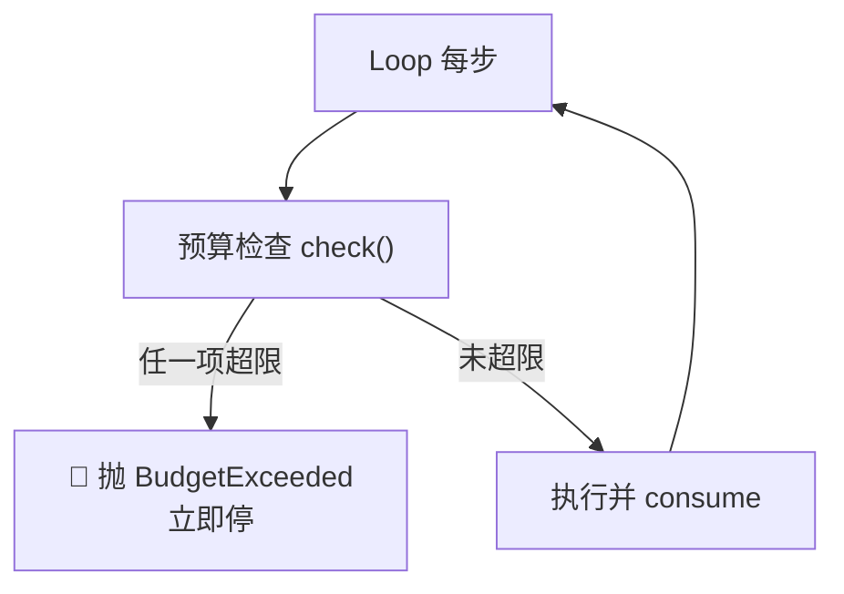

# 预算护栏必设

> 本条目是「Loop Engineering」的第 8 部分，对应学习清单条目 6.2.2。
>
> **前置依赖**：终止条件必须机器可检查
> **为以下铺垫**：15个工具调用衰减、Loop高风险警告

---

## 一、核心观点

> **预算护栏必设 = 先装刹车，再交付引擎**：`MAX_STEPS` + token 上限 + 重试上限 + 成本上限，四道硬闸一个都不能少。
>
> 没护栏的 Loop，就像一辆没有刹车的跑车——加速很爽，第一次下坡就是终点。

---

## 二、定义与原理

**预算护栏（budget guard）** 是限制 Loop 资源消耗的硬上限。它与「终止条件」互补：终止条件管「目标达成没」，预算管「多少钱我都不干了」。

- **步骤上限（MAX_STEPS）**：硬迭代次数，没例外。
- **Token 上限**：单次 / 总 token 封顶，控成本。
- **重试上限**：同一动作重试次数封顶，防死循环。
- **成本上限**：单次 / 总费用封顶，真金白银的闸。



> **执行必须在「信任边界之外」**：Kusireddy 复盘指出，本地 step/token 上限可被同一个 bug 绕过；真正的硬闸要放在 Agent 进程之外（如钱包级 / 网关级限额）（[binary.ph 分析](https://binary.ph/2026/03/21/ai-api-cost-control-how-ampersend-prevents-47k-agent-loop-overruns)）。

---

## 三、实践与示例

预算护栏骨架（概念极简）：

```python
class BudgetGuard:
    def __init__(self, max_steps=50, max_tokens=100_000, max_cost=5.0):
        self.steps = self.tokens = 0; self.cost = 0.0
        self.caps = (max_steps, max_tokens, max_cost)
    def check(self):
        if self.steps  >= self.caps[0]: raise BudgetExceeded("步骤上限")
        if self.tokens >= self.caps[1]: raise BudgetExceeded("Token 上限")
        if self.cost   >= self.caps[2]: raise BudgetExceeded("费用上限")
    def consume(self, tokens, cost):
        self.steps += 1; self.tokens += tokens; self.cost += cost
```

> **组合陷阱**：多 Agent 互相调用时，每个 Agent 各自的 cap 会叠加成更大的总消耗——$47K 事故里「per-agent cap 在组合下失效」是关键教训（[binary.ph](https://binary.ph/2026/03/21/ai-api-cost-control-how-ampersend-prevents-47k-agent-loop-overruns)）。

---

## 四、优势与局限

- ✅ **成本可控**：无论 Loop 多疯，钱花到顶就停，老板睡得着。
- ✅ **组合安全**：与终止条件、断路器（见 [[12-断路器|断路器]]）构成多层防御。
- ❌ **阈值难定**：太松没用、太紧误杀正常任务——要靠压测调参。
- ❌ **本地上限可被绕过**：Agent 进程内的计数器，和出 bug 的是同一信任边界；生产环境应放到进程外（网关 / 钱包级）。

---

## 五、最新研究与企业数据（2024–2026）

- **$47K 事故的反面教材**：该系统的成本失控，根因是「No cost ceiling」+「per-agent cap 在组合下失效」；任何一道硬上限本可在第一天拦住（[supervaize.com](https://supervaize.com/fr/blog/20251016-47k-agent-loop)，[binary.ph](https://binary.ph/2026/03/21/ai-api-cost-control-how-ampersend-prevents-47k-agent-loop-overruns)）。
- **「外部强制」优于「应用内计数」**：把每次 LLM 调用绑成一次经济交易、在钱包级设硬限，即使 Agent 逻辑还在跑，钱花光就停（[binary.ph](https://binary.ph/2026/03/21/ai-api-cost-control-how-ampersend-prevents-47k-agent-loop-overruns)）。
- Loop Engineering 综述将预算护栏列为交付自主 Loop 的前提（[tosea.ai](https://tosea.ai/blog/loop-engineering-ai-agents-complete-guide-2026)）。

---

## 六、学习资源

- **tosea.ai (2026)**《Loop Engineering: The Complete Guide》
- **binary.ph (2026-03)**《How ampersend Prevents $47K Agent Loop Overruns》—— 外部强制预算
- **进阶**：[[07-终止条件必须机器可检查|终止条件必须机器可检查]] · [[12-断路器|断路器]] · [[10-Loop高风险警告|Loop 高风险警告]]

---

## 核心要点

- **一句话**：预算护栏必设——先装刹车再交付引擎：MAX_STEPS + token + 重试 + 成本上限。
- **四类上限**：步骤 / token / 重试 / 费用，全是硬闸、没例外。
- **铁律**：本地计数器可被同一 bug 绕过；生产要放进程外（网关 / 钱包级）。
- **组合陷阱**：多 Agent 的 per-agent cap 会叠加成更大的总消耗。

---

## 参考来源（一手链接 · 可溯源深挖）

- **tosea.ai (2026)**《Loop Engineering: The Complete Guide》：[tosea.ai/blog/loop-engineering-ai-agents-complete-guide-2026](https://tosea.ai/blog/loop-engineering-ai-agents-complete-guide-2026)
- **Supervaize (2025-10)** $47K Agent Loop 复盘（无成本上限）：[supervaize.com/fr/blog/20251016-47k-agent-loop](https://supervaize.com/fr/blog/20251016-47k-agent-loop)
- **binary.ph (2026-03)**《How ampersend Prevents $47K Agent Loop Overruns》（外部强制预算）：[binary.ph/2026/03/21/ai-api-cost-control-how-ampersend-prevents-47k-agent-loop-overruns](https://binary.ph/2026/03/21/ai-api-cost-control-how-ampersend-prevents-47k-agent-loop-overruns)


## 速记卡（面试闪卡）

**Q1：一句话讲清「预算护栏必设」到底是什么？**
A：预算护栏是给自主 Loop 装的四道硬闸：步骤/token/重试/成本上限，没护栏的 Loop 像没刹车跑车。

**Q2：先装刹车再交引擎 —— 怎么理解？**
A：没护栏的 Loop 像没刹车的跑车——加速很爽，第一次下坡就是终点。预算护栏（budget guard）和终止条件互补：终止条件管"目标达成没"，预算管"多少钱我都不干了"。四类上限全是硬闸、没例外：MAX_STEPS 步骤、token 封顶、重试封顶、成本封顶。

**Q3：骨架与「信任边界外」 —— 怎么理解？**
A：每步先 check()——任一项超限就抛 BudgetExceeded 立即停，未超限才 consume 执行。关键铁律：本地 step/token 计数器可被同一个 bug 绕过，真正的硬闸要放进程外（钱包级/网关级限额）。$47K 事故的教训就是"无成本上限 + per-agent cap 在组合下失效"。

**Q4：组合陷阱像「叠buff」 —— 怎么理解？**
A：多 Agent 互相调用时，每个 Agent 各自的 cap 会叠加成更大的总消耗——47K 事故里 per-agent 上限在组合下失效是关键。所以护栏要和终止条件、断路器（Circuit Breaker）构成多层防御。阈值难定：太松没用、太紧误杀正常任务，靠压测调参。

**Q5：外部强制优于应用内计数 —— 怎么理解？**
A：把每次 LLM 调用绑成一次经济交易、在钱包级设硬限，即使 Agent 逻辑还在跑，钱花光就停——这是 binary.ph 从 47K 事故总结的反面教材。Loop Engineering 综述把预算护栏列为交付自主 Loop 的前提。本地计数只是"自家账本"，进程外限额才是"银行冻结"。

**Q6：核心速记主线有哪些？**
- 四道闸：MAX_STEPS + token + 重试 + 成本上限，全是硬闸
- 互补：终止条件管目标，预算管"多少钱不干"
- 铁律：本地计数可被同 bug 绕过，硬闸放进程外
- 组合陷阱：多 Agent 的 cap 叠加，配断路器多层防

**口诀**
A：预算护栏先刹车，四道硬闸不能少；
步骤 token 加成本，超限就停不商量；
本地计数会绕过，进程外设才牢靠；
组合叠加 cap 爆，断路器来多层防。

## 相关链接
- 系列清单：[[学习路线图/Agent方法论与产品思维学习路线图|Agent 方法论与产品思维学习路线图]]
- 上一层级：[[00-Agent方法论与产品思维|Loop Engineering · 索引]]
- 同系列：[[07-终止条件必须机器可检查|终止条件必须机器可检查]] · [[12-断路器|断路器]] · [[10-Loop高风险警告|Loop 高风险警告]]

