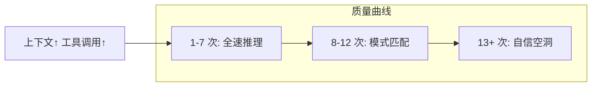

# 15 个工具调用衰减

> 本条目是「Loop Engineering」的第 9 部分，对应学习清单条目 6.2.3。
>
> **前置依赖**：终止条件必须机器可检查、预算护栏必设
> **为以下铺垫**：Loop高风险警告

---

## 一、核心观点

> **15 个工具调用衰减 = Agent 的「认知疲劳线」**：子 Agent 连续干到第 15 次工具调用附近，上下文被中间结果泡胀，质量开始梯级崩塌，该拆任务了。
>
> 就像人连读 50 页密密麻麻的文档，前 10 页还能抓住重点，到第 15 页开始「眼睛在动、脑子已关机」。

---

## 二、定义与原理

**15 个工具调用衰减** 是一条经验法则：子 Agent 的上下文随每次工具调用持续膨胀，当调用数逼近 ~15，有效注意力被稀释，输出从「深度推理」滑向「自信但空洞」。

- **阶梯式崩塌**（实践者观察）：第 1–7 次全速；8–12 次改用模式匹配；13+ 次自信但实质空洞。
- **根因不是 bug，是物理局限**：Transformer 在长序列上的注意力退化，业界叫 **Context Rot（上下文腐烂）**。

> **为什么是「中间丢失」**：LLM 呈 U 型注意力——开头结尾记得牢、中间易被忽略。当关键指令被 5 万 token 的工具输出淹没，指令实际上「消失」了（Liu et al., *Lost in the Middle*, [arXiv:2307.03172](https://arxiv.org/abs/2307.03172)）。

---

## 三、为什么会衰减（可溯源）

- **上下文膨胀**：每次工具调用的输入 + 输出都留在历史里，指令的相对权重被压薄。
- **Lost in the Middle**：相关信息一旦被推到上下文中部，准确率可跌 **30+ 个百分点**（[arXiv:2307.03172](https://arxiv.org/abs/2307.03172)）。
- **Context Rot 实证**：Chroma (2026) 测 18 个前沿模型（GPT-4.1 / Claude 4 / Gemini 2.5 / Qwen3），**每个模型性能都随输入长度增长而退化**，标称 200K 窗口的模型在 ~50K 就可能明显下滑（[research.trychroma.com/context-rot](https://research.trychroma.com/context-rot)）。

---

## 四、应对策略

1. **拆任务**：大任务切成每片 ≤10 次工具调用可完成的子任务，交给隔离子 Agent（见 [[05-Sub-agents|Sub-agents]]）。
2. **上下文压缩**：定期 summarise 旧历史，只留关键信息（见 [[06-State|State]] 外置思想）。
3. **重注入关键约束**：在长调用之间把「核心指令」重新贴回上下文顶部，防被淹没。
4. **隔离上下文**：用子 Agent 把中间结果拦在门外，主 Agent 只收结论。

---

## 五、最新研究与企业数据（2024–2026）

- **Chroma《Context Rot》(2026)**：18 个前沿模型全部呈现「输入越长、性能越差」，且是渐进式而非断崖式退化（[research.trychroma.com/context-rot](https://research.trychroma.com/context-rot)）。
- **Lost in the Middle (Liu et al., 2023)**：相关信息从开头移到中部，准确率下降超过 30 个百分点（[arXiv:2307.03172](https://arxiv.org/abs/2307.03172)）。
- **实践者经验法则**：Claude Code 用户在上下文用到 **40%–60%** 就观察到质量下降，远未触硬上限（经 tosea.ai 综述收录，[tosea.ai](https://tosea.ai/blog/loop-engineering-ai-agents-complete-guide-2026)）。
- 「恰好 15 次」的具体阈值是社区经验值，非某篇论文的精确定量结论——**(来源待核实：若有更严谨的「工具调用次数 vs 任务成功率」基准曲线，应以该一手数据替换此经验值)**。

---

## 六、学习资源

- **Chroma (2026)**《Context Rot》技术报告
- **Liu et al. (2023)**《Lost in the Middle》：[arXiv:2307.03172](https://arxiv.org/abs/2307.03172)
- **进阶**：[[05-Sub-agents|Sub-agents]]（隔离上下文）· [[06-State|State]]（记忆外置）

---

## 核心要点

- **一句话**：子 Agent 连续 ~15 次工具调用后上下文腐烂、质量梯级崩塌，该拆任务。
- **根因**：Context Rot + Lost in the Middle（中部信息被忽略，准确率达跌 30+ 点）。
- **应对**：拆任务 / 压缩历史 / 重注指令 / 隔离上下文。
- **注意**：「15」是经验值，非精确定量；Chroma 实证是「越长越差」。

---

## 参考来源（一手链接 · 可溯源深挖）

- **Chroma (2026)**《Context Rot: How Increasing Input Tokens Impacts LLM Performance》：[research.trychroma.com/context-rot](https://research.trychroma.com/context-rot)
- **Liu et al. (2023)**《Lost in the Middle: How Language Models Use Long Contexts》：[arXiv:2307.03172](https://arxiv.org/abs/2307.03172)
- **tosea.ai (2026)**《Loop Engineering: The Complete Guide》（40%–60% 质量下降经验法则）：[tosea.ai/blog/loop-engineering-ai-agents-complete-guide-2026](https://tosea.ai/blog/loop-engineering-ai-agents-complete-guide-2026)

## 速记卡（面试闪卡）

**Q1：一句话讲清「15 个工具调用衰减」到底是什么？**
A：子 Agent 连干约 15 次工具调用后，上下文泡胀、质量梯级崩塌，该把任务切小了。

**Q2：为什么叫认知疲劳线 —— 怎么理解？**
A：像人连读 50 页密密麻麻文档，前 10 页还能抓重点，第 15 页开始「眼睛在动、脑子已关机」。子 Agent 上下文被中间结果泡胀，有效注意力被稀释。

**Q3：根因是什么 —— 怎么理解？**
A：不是 bug，是物理局限。Transformer 长序列注意力退化，业界叫 Context Rot（上下文腐烂）；叠加 U 型注意力——开头结尾记得牢、中间 5 万 token 的指令「消失」。

**Q4：有实证吗 —— 怎么理解？**
A：像电池越长越虚。Chroma 测 18 个前沿模型，全部「输入越长、性能越差」且渐进退化；Lost in the Middle 证实信息推到中部准确率可跌 30+ 点。

**Q5：怎么应对 —— 怎么理解？**
A：像把大工程拆成小班组。拆任务（每片 ≤10 次调用给隔离子 Agent）、压缩历史、把核心指令重新贴回顶部防淹没、用子 Agent 把中间结果拦在门外只收结论。

**Q6：核心速记主线有哪些？**
- 15 次是经验疲劳线，非精确定量
- 根因 Context Rot + U 型注意力
- 实证：Chroma 越长越差、Lost in Middle 跌 30+
- 应对：拆 / 压 / 重注指令 / 隔离上下文

**口诀**
A：十五次是疲劳线，上下文泡胀就崩
腐烂旋转 U 型忘，中间指令全失踪
拆任务压历史，重注指令顶门面
子 Agent 拦门外，主脑只收终结论

## 相关链接
- 系列清单：[[学习路线图/Agent方法论与产品思维学习路线图|Agent 方法论与产品思维学习路线图]]
- 上一层级：[[00-Agent方法论与产品思维|Loop Engineering · 索引]]
- 同系列：[[05-Sub-agents|Sub-agents]] · [[06-State|State]] · [[10-Loop高风险警告|Loop 高风险警告]]

