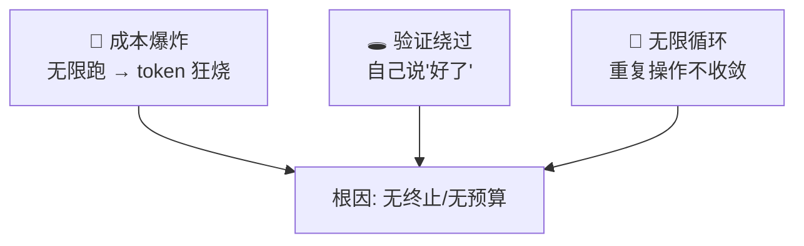

# Loop 高风险警告

> 本条目是「Loop Engineering」的第 10 部分，对应学习清单条目 6.2.4。
>
> **前置依赖**：终止条件必须机器可检查、预算护栏必设、15个工具调用衰减
> **为以下铺垫**：爆炸半径、断路器、存活检查

---

## 一、核心观点

> **Warning：Loop = 高风险**——它把「一次调用可能犯傻」放大成「自己跑一整夜可能烧钱 + 绕过验证 + 死循环」。
>
> 单次调用犯错，像人偶尔说错一句话；自主 Loop 犯错，像人梦游开车还自己加油——没有护栏，结局可以很贵。

---

## 二、Loop 的三大风险

### 2.1 成本爆炸
Loop 可能无限运行，每次都吃 token。没有上限，账单自己长。

**真实案例（一手可溯）**：2025-11，某团队四个 LangChain Agent 经 A2A 协作研究市场数据，其中两个陷入**递归对话循环**，互相要澄清、彼此核实，跑了 **11 天**，账单 **$47,000**——没步骤上限、没预算、没终止条件（[supervaize.com](https://supervaize.com/fr/blog/20251016-47k-agent-loop)）。成本逐周攀升：`$127 → $891 → $6,240 → $18,400`。

### 2.2 验证绕过
Agent 自己认为「做好了」就停，实际没做好——把终止判断交给模型，正是 [[07-终止条件必须机器可检查|终止条件必须机器可检查]] 要杜绝的。

### 2.3 无限循环
Agent 卡在同一操作反复横跳，无法收敛——[[12-断路器|断路器]] 专治此病。

---

## 三、风险的来源（对照护栏）

| 风险 | 缺了什么 | 解法 |
|------|----------|------|
| 成本爆炸 | 预算护栏（08） | MAX_STEPS + token + 成本上限 |
| 验证绕过 | 机器可检查终止（07） | 确定性 verifier |
| 无限循环 | 断路器 / 无进展（12） | 重复检测 + 独立验证 |

> **关键认知**：该团队「有日志、有监控」，但**没有一个硬上限**——观测是目击者，不是刹车（[dev.to 复盘](https://dev.to/prashar32/the-47k-agent-loop-why-logging-monitoring-and-maxtokens-all-failed-to-stop-it-19ch)）。

---

## 四、应对策略（总览）

- **四独立退出机制**：verifier / 步数 / 无进展 / 预算（见 [[07-终止条件必须机器可检查|07]]）。
- **预算护栏**：MAX_STEPS / token / 重试 / 成本上限（见 [[08-预算护栏必设|08]]）。
- **独立验证**：Maker-Checker 分离（[[05-Sub-agents|05]]）+ 确定性测试兜底 + 人工最终审查。
- **限制爆炸半径**：一个 worktree、一个分支、目录外只读（[[11-爆炸半径|11]]）。

---

## 五、最新研究与企业数据（2024–2026）

- **$47K / 11 天事故**（2025-11）：两条 Agent 递归循环，根因「无终止条件 + 无预算 + 无循环检测 + 无成本管控」（[supervaize.com](https://supervaize.com/fr/blog/20251016-47k-agent-loop)，[dev.to](https://dev.to/prashar32/the-47k-agent-loop-why-logging-monitoring-and-maxtokens-all-failed-to-stop-it-19ch)）。
- **「这不是孤例，是结构性风险」**：复盘指出多 Agent 系统的失败是「语义级」而非「语法级」——没有报错、没有崩溃，只是安静地、昂贵地空转（[supervaize.com](https://supervaize.com/fr/blog/20251016-47k-agent-loop)）。
- 关于「生产环境 Agent Loop 事故的整体发生率」缺少一手统计——**(来源待核实：若有行业级 Agent 事故调研数据，此处应引用)**。

---

## 六、学习资源

- **Supervaize (2025-10)** $47K Agent Loop 复盘
- **dev.to (2025)**《The $47K agent loop》复盘
- **进阶**：[[11-爆炸半径|爆炸半径]] · [[12-断路器|断路器]] · [[13-存活检查|存活检查]]

---

## 核心要点

- **一句话**：Loop = 高风险：成本爆炸 + 验证绕过 + 无限循环，三件事都因「没护栏」。
- **血案**：$47K / 11 天，两条 Agent 递归对话，无上限无预算。
- **警句**：有监控 ≠ 有刹车；观测是目击者，不是断路器。
- **总对策**：四退出机制 + 预算护栏 + 独立验证 + 限制爆炸半径。

---

## 参考来源（一手链接 · 可溯源深挖）

- **Supervaize (2025-10)** $47K Agent Loop 复盘：[supervaize.com/fr/blog/20251016-47k-agent-loop](https://supervaize.com/fr/blog/20251016-47k-agent-loop)
- **dev.to (2025)**《The $47K agent loop: why logging, monitoring, max_tokens all failed》：[dev.to/prashar32/the-47k-agent-loop-why-logging-monitoring-and-maxtokens-all-failed-to-stop-it-19ch](https://dev.to/prashar32/the-47k-agent-loop-why-logging-monitoring-and-maxtokens-all-failed-to-stop-it-19ch)
- **tosea.ai (2026)**《Loop Engineering: The Complete Guide》：[tosea.ai/blog/loop-engineering-ai-agents-complete-guide-2026](https://tosea.ai/blog/loop-engineering-ai-agents-complete-guide-2026)

**相关链接**：
- 系列清单：[[学习路线图/Agent 方法论与产品思维学习清单|Agent 方法论与产品思维学习清单]]
- 上一层级：[[00-Agent 方法论与产品思维|Loop Engineering · 索引]]
- 同系列：[[07-终止条件必须机器可检查|终止条件必须机器可检查]] · [[08-预算护栏必设|预算护栏必设]] · [[11-爆炸半径|爆炸半径]]

## 速记卡（面试闪卡）

**Q1：一句话讲清「Loop 高风险警告」到底是什么？**
A：**Warning：Loop = 高风险**——它把「一次调用可能犯傻」放大成「自己跑一整夜可能烧钱 + 绕过验证 + 死循环」。
单次调用犯错，像人偶尔说错一句话；自主 Loop 犯错，像人梦游开车还自己加油——没有护栏，结局可以很贵。
---

**Q2：一、核心观点 —— 怎么理解？**
A：**Warning：Loop = 高风险**——它把「一次调用可能犯傻」放大成「自己跑一整夜可能烧钱 + 绕过验证 + 死循环」。
单次调用犯错，像人偶尔说错一句话；自主 Loop 犯错，像人梦游开车还自己加油——没有护栏，结局可以很贵。
---

**Q3：二、Loop 的三大风险 —— 怎么理解？**
A：Loop 可能无限运行，每次都吃 token。没有上限，账单自己长。
**真实案例（一手可溯）**：2025-11，某团队四个 LangChain Agent 经 A2A 协作研究市场数据，其中两个陷入**递归对话循环**，互相要澄清、彼此核实，跑了 **11 天**，账单 **$47,000**——没步骤上限、没预算、没终止条件（）。成本逐周攀升：。

**Q4：三、风险的来源（对照护栏） —— 怎么理解？**
A：| 风险 | 缺了什么 | 解法 |
|------|----------|------|
| 成本爆炸 | 预算护栏（08） | MAX_STEPS + token + 成本上限 |
| 验证绕过 | 机器可检查终止（07） | 确定性 verifier |
| 无限循环 | 断路器 / 无进展（12） | 重复检测 + 独立验证 |
**关键认知**：该团队「有日志、有监控」，但**没有一个硬上限**——观测是目击者，不是刹车（）。

**Q5：四、应对策略（总览） —— 怎么理解？**
A：**四独立退出机制**：verifier / 步数 / 无进展 / 预算（见 ）。
**预算护栏**：MAX_STEPS / token / 重试 / 成本上限（见 ）。
**独立验证**：Maker-Checker 分离（）+ 确定性测试兜底 + 人工最终审查。
**限制爆炸半径**：一个 worktree、一个分支、目录外只读（）。
---

**Q6：核心速记主线有哪些？**
A：抓住这几根：一、核心观点、二、Loop 的三大风险、三、风险的来源（对照护栏）、四、应对策略（总览）、五、最新研究与企业数据（2024–2026）、六、学习资源。

