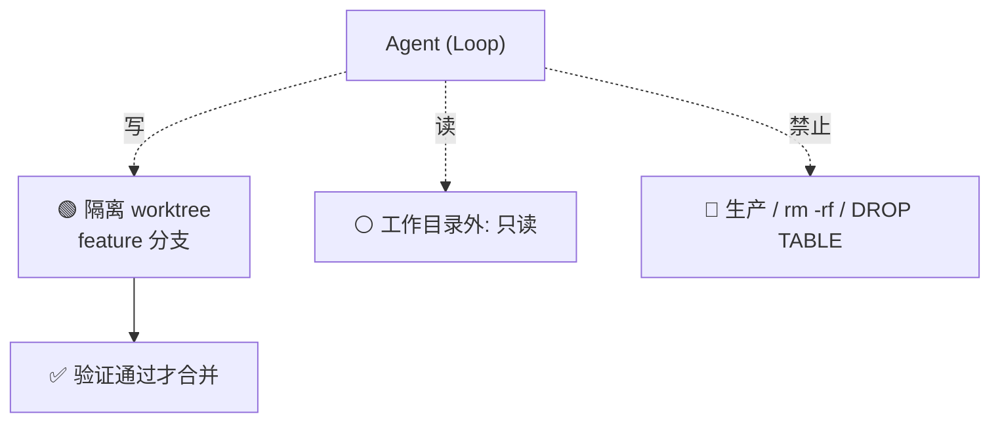

# 爆炸半径

> 本条目是「Loop Engineering」的第 11 部分，对应学习清单条目 6.3.1。
>
> **前置依赖**：Loop高风险警告
> **为以下铺垫**：断路器、存活检查

---

## 一、核心观点

> **爆炸半径（blast radius） = 给 Agent 画个「出错也炸不到要害」的圈**：一个 worktree、一个分支，工作目录外只读。
>
> 就像给熊孩子一盒 crayons，你只给他一张纸、而不是整面白墙——他画歪了，擦掉纸就行，墙还是干净的。

---

## 二、定义与原理

**爆炸半径（blast radius）** 是 Loop 出错时**能影响到的范围**。目标只有一个：限制 Loop 能破坏什么，让它就算发疯也只咬到一小块。

- **隔离工作目录**：一个 worktree、一个分支，目录外只读。
- **权限控制**：只能改特定目录，碰不到生产、碰不了破坏性操作。
- **备份 / 回滚**：改前备份，出错一键回退。

> **和 Worktrees 的关系**：worktree 是隔离的「物理房间」，爆炸半径是在这房间里再加的「权限栅栏」——两者配套，见 [[02-Worktrees|Worktrees]]。

---

## 三、控制爆炸半径的三板斧

1. **隔离工作目录**：git worktree 开分支，Agent 只在自己那片地写。
2. **权限白名单**：`read` / `write` / `execute` 显式声明，默认 deny 一切危险操作。
3. **备份 + 回滚**：关键操作前快照，出错 `git worktree remove` 或 `restore` 即可。

> **铁律**：Agent 永远不该拿到「改生产数据库」的 connector 权限，除非有人工审批闸门（HumanLayer 的 human-in-the-loop 思想，[humanlayer.dev](https://www.humanlayer.dev/blog/skill-issue-harness-engineering-for-coding-agents)）。

---

## 四、优势与局限

- ✅ **故障可控**：最坏情况 = 一个 worktree 报废，主仓库无损。
- ✅ **敢放手**：半径小了，才敢让 Loop 真去跑生产类任务。
- ❌ **过度隔离拖慢**：什么都只读，Agent 很多活干不了，要在「安全」与「能干活」间取平衡。
- ❌ **边界设计难**：划太大危险、划太小无能，需按任务调。

---

## 五、最新研究与企业数据（2024–2026）

- **HumanLayer 的 human-in-the-loop**：高风险动作（改生产、发外邮）应有人工审批闸门，正是「把爆炸半径锁在人工确认之后」（[humanlayer.dev](https://www.humanlayer.dev/blog/skill-issue-harness-engineering-for-coding-agents)）。
- **\$47K 事故对照**：那套系统「No shared state、No orchestrator、无成本管控」——本质上**爆炸半径无限大**，两个 Agent 的循环才敢烧到 `$47,000`（[supervaize.com](https://supervaize.com/fr/blog/20251016-47k-agent-loop)）。
- 关于「限制爆炸半径后事故损失下降的具体比例」缺少一手量化——**(来源待核实：若有权限隔离前后事故损失对比，此处应引用)**。

---

## 六、学习资源

- **HumanLayer (2026)**《Harness Engineering for Coding Agents》—— human-in-the-loop 与权限
- **Git 官方文档** `git worktree`：[git-scm.com/docs/git-worktree](https://git-scm.com/docs/git-worktree)
- **进阶**：[[02-Worktrees|Worktrees]] · [[12-断路器|断路器]] · [[08-预算护栏必设|预算护栏必设]]

---

## 核心要点

- **一句话**：爆炸半径 = 给 Agent 画个「出错也炸不到要害」的圈：一 worktree、一分支、外只读。
- **三板斧**：隔离目录 / 权限白名单 / 备份回滚。
- **铁律**：别给 Agent「改生产」的裸权限，除非有人工闸门。
- **对照**：$47K 事故的根因之一就是爆炸半径无限大。

---

## 参考来源（一手链接 · 可溯源深挖）

- **HumanLayer (2026)**《Harness Engineering for Coding Agents》：[humanlayer.dev/blog/skill-issue-harness-engineering-for-coding-agents](https://www.humanlayer.dev/blog/skill-issue-harness-engineering-for-coding-agents)
- **Supervaize (2025-10)** $47K Agent Loop 复盘（无限爆炸半径）：[supervaize.com/fr/blog/20251016-47k-agent-loop](https://supervaize.com/fr/blog/20251016-47k-agent-loop)
- **Git 官方文档** `git worktree`：[git-scm.com/docs/git-worktree](https://git-scm.com/docs/git-worktree)

## 速记卡（面试闪卡）

**Q1：一句话讲清「爆炸半径」到底是什么？**
A：爆炸半径就是给 Agent 画个圈，出错也只炸一小块、伤不到主仓要害。

**Q2：一、核心观点 —— 怎么理解？**
A：像给熊孩子一盒蜡笔只给一张纸，画歪了擦纸就行、墙还是干净的（Blast Radius 爆炸半径）。

**Q3：二、定义与原理 —— 怎么理解？**
A：爆炸半径 = 出错能波及的范围，等于在隔离房间里再加一道权限栅栏；worktree 是物理房间，栅栏是规则（Isolation 隔离）。

**Q4：三、控制三板斧 —— 怎么理解？**
A：隔离目录、权限白名单、备份回滚三板斧，像给危险车间上锁、装监控、备逃生门（Sandbox 沙箱 / Least Privilege 最小权限）。

**Q5：四、优势与局限 —— 怎么理解？**
A：半径小了才敢放手跑、故障只废一个 worktree；但隔离太狠 Agent 干不了活，边界要按任务调（Trade-off 权衡）。

**Q6：核心速记主线有哪些？**
- 一 worktree、一分支、目录外只读
- 权限白名单默认 deny 一切危险操作
- 铁律：别给 Agent「改生产」的裸权限
- 对照 $47K 事故：爆炸半径无限大

**口诀**
A：一画圈来二分支，目录外头全只读；
白名单收紧权限，快照回滚能救；
生产不给裸钥匙，人工闸门把守；
炸也只损一小块，主仓干净不用愁。

## 相关链接
- 系列清单：[[学习路线图/Agent方法论与产品思维学习路线图|Agent 方法论与产品思维学习路线图]]
- 上一层级：[[00-Agent方法论与产品思维|Loop Engineering · 索引]]
- 同系列：[[02-Worktrees|Worktrees]] · [[12-断路器|断路器]] · [[10-Loop高风险警告|Loop 高风险警告]]

