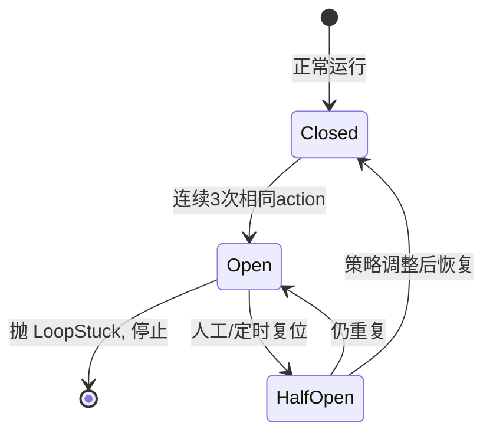

# 断路器

> 本条目是「Loop Engineering」的第 12 部分，对应学习清单条目 6.3.2。
>
> **前置依赖**：爆炸半径
> **为以下铺垫**：存活检查

---

## 一、核心观点

> **断路器（circuit breaker） = 检测到 Agent「卡死了」就跳闸**：连续 3 次用相同参数调相同工具，说明它陷入了死循环，立刻断电。
>
> 就像你家配电箱——电流过大自动跳闸，宁可让你摸黑，也不能把房子烧了。

---

## 二、定义与原理

**断路器（circuit breaker）** 借用分布式系统的老概念：持续观察到「重复、无进展」的模式就主动断开 Loop。这里的关键信号是——**连续 N 次（常取 3）相同的 action / 相同参数的工具调用**。

- **检测重复**：记录近期 action，判断是否连续相同。
- **触发断路**：命中阈值 → 抛异常、停 Loop、报警。
- **恢复**：人工或自动分析卡住原因，调策略后重试。



> **为什么是「连续 3 次」**：1–2 次重复可能是正常重试；连续 3 次用**完全相同参数**调**完全相同工具**，基本可判定为「它不知道自己在兜圈子」（社区经验阈值，详见 [[09-15个工具调用衰减|15 个工具调用衰减]] 的上下文衰减背景）。

---

## 三、实践与示例

断路器骨架（概念极简）：

```python
class CircuitBreaker:
    def __init__(self, threshold=3):
        self.threshold = threshold; self.history = []
    def check(self, action):
        self.history.append(action)
        recent = self.history[-self.threshold:]
        if len(recent) == self.threshold and len(set(recent)) == 1:
            raise LoopStuck("连续相同 action，可能卡住")
    def reset(self): self.history = []
```

---

## 四、优势与局限

- ✅ **专治死循环**：和「无进展检测」互补，直接抓「原地踏步」的 Agent。
- ✅ **便宜**：只看 action 历史，不消耗额外 LLM 调用。
- ❌ **阈值敏感**：太灵敏会误杀正常重试（如网络抖动重发），太迟钝则等它烧一阵才跳。
- ❌ **只看「相同」**：若 Agent 每次参数略变但仍在兜圈子，简单断路器看不出来——需配合无进展检测（见 [[07-终止条件必须机器可检查|07]]）。

---

## 五、最新研究与企业数据（2024–2026）

- **$47K 事故本可被断路器拦下**：那套系统「No loop detection」——若有「两 Agent 连续互发同类消息即跳闸」的机制，第一天就能断电（[supervaize.com](https://supervaize.com/fr/blog/20251016-47k-agent-loop)）。
- **外部强制优于应用内计数**：复盘建议把断路 / 成本管控放到 Agent 进程之外，否则同一 bug 能绕过本地计数器（[binary.ph](https://binary.ph/2026/03/21/ai-api-cost-control-how-ampersend-prevents-47k-agent-loop-overruns)）。
- 「连续 3 次」作为通用阈值的实证基准，缺少一手对照——**(来源待核实：若有不同阈值下误杀率 / 漏杀率的实验，此处应引用)**。

---

## 六、学习资源

- **Supervaize (2025-10)** $47K 复盘（缺 loop detection）
- **binary.ph (2026-03)** 外部强制预算与断路
- **进阶**：[[13-存活检查|存活检查]]（另一个「还活着吗」的信号）· [[07-终止条件必须机器可检查|终止条件必须机器可检查]]

---

## 核心要点

- **一句话**：断路器 = 连续 3 次相同参数调相同工具就跳闸，专治 Agent 卡死。
- **状态机**：Closed →（连续重复）→ Open → 停止 / 复位。
- **互补**：只看「完全相同」会漏「略变但仍兜圈」，需配无进展检测。
- **教训**：$47K 事故根因之一正是「没有 loop detection」。

---

## 参考来源（一手链接 · 可溯源深挖）

- **Supervaize (2025-10)** $47K Agent Loop 复盘（缺 loop detection）：[supervaize.com/fr/blog/20251016-47k-agent-loop](https://supervaize.com/fr/blog/20251016-47k-agent-loop)
- **binary.ph (2026-03)**《How ampersend Prevents $47K Agent Loop Overruns》：[binary.ph/2026/03/21/ai-api-cost-control-how-ampersend-prevents-47k-agent-loop-overruns](https://binary.ph/2026/03/21/ai-api-cost-control-how-ampersend-prevents-47k-agent-loop-overruns)


## 速记卡（面试闪卡）

**Q1：一句话讲清「断路器」到底是什么？**
A：断路器：Agent 连续 3 次用相同参数调相同工具，判定卡死立即跳闸断电，专治死循环。

**Q2：一、核心观点 —— 怎么理解？**
A：像你家配电箱：电流过大自动跳闸，宁可摸黑也不烧房子——Agent 卡死就断电（Circuit Breaker）。

**Q3：二、定义与原理 —— 怎么理解？**
A：借用分布式老概念：记录近期 action，连续 N 次（常取 3）相同就抛 LoopStuck 停 loop（Stuck Detection）。

**Q4：三、实践与示例 —— 怎么理解？**
A：断路器骨架只维护 action 历史，len(set(recent))==1 就 raise——不耗额外 LLM 调用（Cheap Guard）。

**Q5：四、优势与局限 —— 怎么理解？**
A：便宜、专治原地踏步；但阈值敏感（误杀重试）、只看"完全相同"会漏略变仍兜圈，需配无进展检测（Threshold Tuning）。

**Q6：核心速记主线有哪些？**
- 本质：连续 3 次相同 action 就跳闸
- 状态机：Closed→（重复）→Open→停止/复位
- 互补：只看相同会漏略变兜圈，配无进展检测
- 教训：$47K 事故根因正是缺 loop detection

**口诀**
A：Agent 卡死会烧房，配电跳闸莫手软；
连续三回同动作，断路断电不纠缠；
阈值太敏误杀重试，太钝烧一阵才断；
略变兜圈它看漏，无进展检测来补残。

## 相关链接
- 系列清单：[[学习路线图/Agent方法论与产品思维学习路线图|Agent 方法论与产品思维学习路线图]]
- 上一层级：[[00-Agent方法论与产品思维|Loop Engineering · 索引]]
- 同系列：[[11-爆炸半径|爆炸半径]] · [[13-存活检查|存活检查]] · [[07-终止条件必须机器可检查|终止条件必须机器可检查]]

