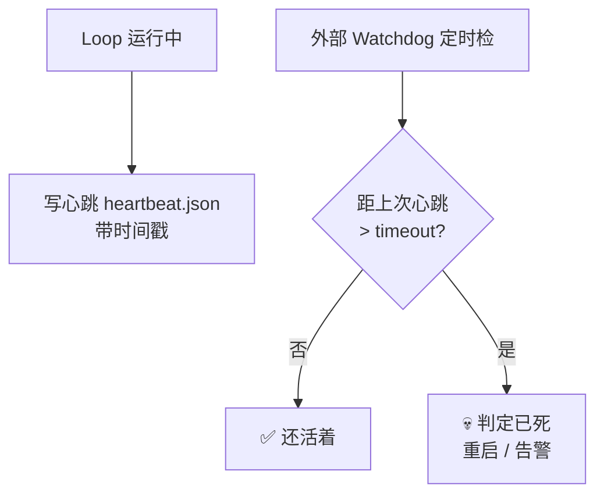

# 存活检查

> 本条目是「Loop Engineering」的第 13 部分，对应学习清单条目 6.3.3。
>
> **前置依赖**：爆炸半径、断路器
> **为以下铺垫**：Closed Loop脚本、看门狗熔断

---

## 一、核心观点

> **存活检查（heartbeat） = 让 Loop 定时「报平安」**：每次运行往状态文件写个带时间戳的心跳，长时间没更新 = 它已经死了（或卡死），该重启或告警。
>
> 就像ICU 的监护仪——没波浪线了，不是「病人很乖」，是「病人没气了」。

---

## 二、定义与原理

**存活检查（heartbeat）** 是检测 Loop 是否还「活着」的机制。它和断路器互补：断路器管「是不是在兜圈子」，存活检查管「是不是还动得了」。

- **写心跳**：每步/每轮向状态文件写 `{timestamp, status}`，证明「我还活着」。
- **检心跳**：外部 watchdog 定期检查，超过 `timeout` 没更新 → 判定已死。
- **恢复**：重启 Loop，或通知人工介入。



> **为什么必须「外部」检查**：心跳由 Loop 自己写，但**判死应由 Loop 之外的进程做**——否则 Loop 卡死时，连心跳都不会写了，自己查自己永远「活着」（呼应 [[08-预算护栏必设|预算护栏]] 的「进程外强制」原则）。

---

## 三、实践与示例

心跳读写骨架（概念极简）：

```python
def write_heartbeat(path="heartbeat.json"):
    json.dump({"ts": datetime.now().isoformat(), "status": "alive"},
              open(path, "w"))

def is_alive(path="heartbeat.json", timeout=300):
    if not os.path.exists(path): return False
    last = datetime.fromisoformat(json.load(open(path))["ts"])
    return (datetime.now() - last).seconds <= timeout
```

> **实战经验**：长程 Agent「跑了一夜到早上变敷衍」是 Context Rot 的典型表现（claudelab 田野笔记：历史跨过 ~150K token 后，违反顶部约束的回复明显变多，[claudelab.net](https://claudelab.net/en/articles/claude-ai/claude-long-running-agent-context-budget-compaction-notes)）——存活检查 + 上下文压缩要配合用。

---

## 四、优势与局限

- ✅ **静默失败可见**：Loop 卡死但不报错时，心跳是唯一会说话的哨兵。
- ✅ **可自治恢复**：配合看门狗（见 [[15-看门狗熔断|15]]）可自动重启。
- ❌ **假活**：Loop 可能「还在写心跳但已无进展」——心跳只证明在动，不证明在前进，需与无进展检测叠加。
- ❌ **timeout 难定**：太短误判、太长发现太晚。

---

## 五、最新研究与企业数据（2024–2026）

- **长程 Agent 的「清晨变傻」**：claudelab (2026) 田野笔记记录，Agent 跑通宵后 commit message 变敷衍、忽略前半段指令，根因是上下文稀释而非模型变差，需靠 compaction + 心跳式健康检查（[claudelab.net](https://claudelab.net/en/articles/claude-ai/claude-long-running-agent-context-budget-compaction-notes)）。
- **$47K 事故的对照**：那系统「无 loop detection、无成本异常告警」——若有存活 / 循环检测，11 天里早该有人 / 有狗来拔插头（[supervaize.com](https://supervaize.com/fr/blog/20251016-47k-agent-loop)）。
- 关于「心跳超时阈值与误判率」的量化基准，缺少一手数据——**(来源待核实：若有长程 Agent 健康检查阈值实验，此处应引用)**。

---

## 六、学习资源

- **claudelab (2026)**《When a Long-Running Agent's Context Quietly Decays》：[claudelab.net](https://claudelab.net/en/articles/claude-ai/claude-long-running-agent-context-budget-compaction-notes)
- **Supervaize (2025-10)** $47K 复盘
- **进阶**：[[15-看门狗熔断|看门狗熔断]]（带熔断的 watchdog）· [[12-断路器|断路器]]

---

## 核心要点

- **一句话**：存活检查 = 让 Loop 定时报平安，静默 = 已死，该重启 / 告警。
- **分工**：断路器管「兜圈子」，存活检查管「还动不动」。
- **铁律**：判死要在 Loop 进程外做，否则卡死时连心跳都不写。
- **坑**：假活——还在写心跳但已无进展，需叠无进展检测。

---

## 参考来源（一手链接 · 可溯源深挖）

- **claudelab (2026)**《When a Long-Running Agent's Context Quietly Decays》：[claudelab.net/en/articles/claude-ai/claude-long-running-agent-context-budget-compaction-notes](https://claudelab.net/en/articles/claude-ai/claude-long-running-agent-context-budget-compaction-notes)
- **Supervaize (2025-10)** $47K Agent Loop 复盘（缺 loop detection）：[supervaize.com/fr/blog/20251016-47k-agent-loop](https://supervaize.com/fr/blog/20251016-47k-agent-loop)

**相关链接**：
- 系列清单：[[学习路线图/Agent 方法论与产品思维学习清单|Agent 方法论与产品思维学习清单]]
- 上一层级：[[00-Agent 方法论与产品思维|Loop Engineering · 索引]]
- 同系列：[[12-断路器|断路器]] · [[15-看门狗熔断|看门狗熔断]] · [[14-Closed Loop脚本|Closed Loop 脚本]]

## 速记卡（面试闪卡）

**Q1：一句话讲清「存活检查」到底是什么？**
A：**存活检查（heartbeat） = 让 Loop 定时「报平安」**：每次运行往状态文件写个带时间戳的心跳，长时间没更新 = 它已经死了（或卡死），该重启或告警。
就像ICU 的监护仪——没波浪线了，不是「病人很乖」，是「病人没气了」。
---

**Q2：一、核心观点 —— 怎么理解？**
A：**存活检查（heartbeat） = 让 Loop 定时「报平安」**：每次运行往状态文件写个带时间戳的心跳，长时间没更新 = 它已经死了（或卡死），该重启或告警。
就像ICU 的监护仪——没波浪线了，不是「病人很乖」，是「病人没气了」。
---

**Q3：二、定义与原理 —— 怎么理解？**
A：**存活检查（heartbeat）** 是检测 Loop 是否还「活着」的机制。它和断路器互补：断路器管「是不是在兜圈子」，存活检查管「是不是还动得了」。
**写心跳**：每步/每轮向状态文件写 ，证明「我还活着」。
**检心跳**：外部 watchdog 定期检查，超过  没更新 → 判定已死。
**恢复**：重启 Loop，或通知人工介入。

**Q4：三、实践与示例 —— 怎么理解？**
A：心跳读写骨架（概念极简）：
**实战经验**：长程 Agent「跑了一夜到早上变敷衍」是 Context Rot 的典型表现（claudelab 田野笔记：历史跨过 ~150K token 后，违反顶部约束的回复明显变多，）——存活检查 + 上下文压缩要配合用。
---

**Q5：四、优势与局限 —— 怎么理解？**
A：✅ **静默失败可见**：Loop 卡死但不报错时，心跳是唯一会说话的哨兵。
✅ **可自治恢复**：配合看门狗（见 ）可自动重启。
❌ **假活**：Loop 可能「还在写心跳但已无进展」——心跳只证明在动，不证明在前进，需与无进展检测叠加。
❌ **timeout 难定**：太短误判、太长发现太晚。
---

**Q6：核心速记主线有哪些？**
A：抓住这几根：一、核心观点、二、定义与原理、三、实践与示例、四、优势与局限、五、最新研究与企业数据（2024–2026）、六、学习资源。

