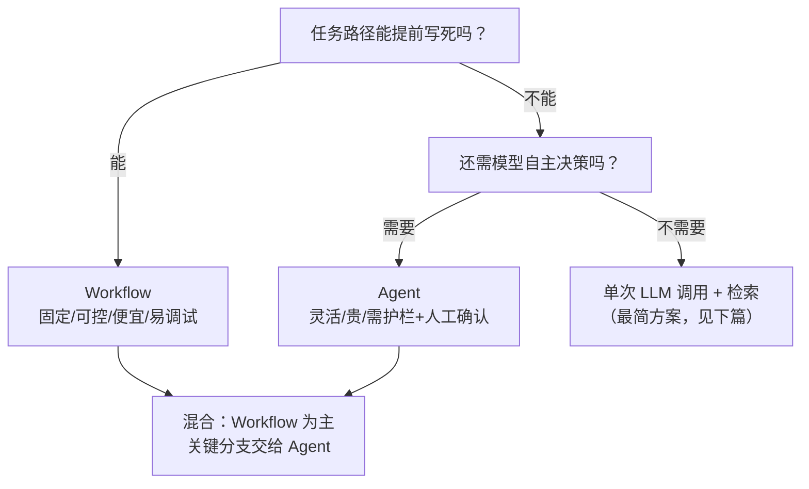
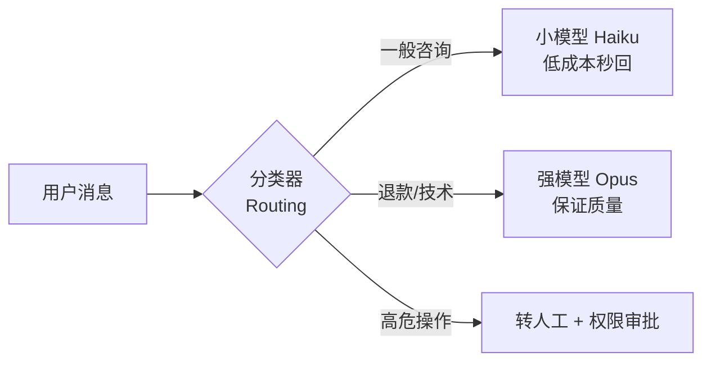

# Workflow vs Agent 选型判断

> 本条目是「Agent 产品化思维」的第 1 部分，对应学习清单条目 7.1.1。
>
> **前置依赖**：认知升级：四层模型、Context Engineering、Harness Engineering、Loop Engineering
> **为以下铺垫**：简单任务最简方案、幻觉递归陷阱

---

## 一、核心观点

> **选型口诀：路径固定用 Workflow，路径不确定用 Agent，拿不准就先 Workflow 再混合。**
> 别一上来就造一个"自主智能体"——那是给开放性问题准备的奢侈品，日常绝大多数活儿用 Workflow 就够，还更便宜、更可控。

---

### 2.1 Workflow 与 Agent 到底是什么

- **Workflow（工作流）**：LLM 和工具沿着**预定义的代码路径**编排运行。每一步走哪儿，代码说了算。
- **Agent（智能体）**：LLM **自己动态决定**下一步干什么、用哪个工具，直到任务完成。

> **类比**：Workflow 像商场里的**自动扶梯**——路线固定、稳稳当当，你只要站上去；Agent 像**出租车**——目的地相同，但司机（模型）得自己看路况选路，灵活但可能绕远、可能违章、还可能把你扔错地方。

Anthropic 把这两类统称为 **agentic systems（智能体化系统）**，但刻意区分了" workflows（写死路径）"和" agents（模型自主）"——这个区分是后面所有选型决策的基石。

### 2.2 选型决策树



> **铁律（Anthropic）**：**从最简单的方案开始，只在简单方案不够时才加复杂度。** 很多场景把单次 LLM 调用做好（加检索、加示例）就够，根本不需要 Agent。

---

## 三、实践：五大 Workflow 模式

当路径可写死时，Anthropic 总结了五种可组合的基础模式，从简单到灵活：

| 模式 | 一句话 | 适用 | 类比 |
|------|--------|------|------|
| **Prompt Chaining（提示链）** | 大任务拆成固定几步，步间可插检查 | 能干净拆步的任务 | 流水线工序 |
| **Routing（路由）** | 先分类输入，再分流到专门处理 | 输入类别分明 | 医院分诊台 |
| **Parallelization（并行）** | 分段并行或多次投票取共识 | 可并行 / 需多视角 | 多人同时审稿 |
| **Orchestrator-Workers（编排-工作者）** | 中央动态拆活派给 worker | 子任务事先未知 | 包工头派活 |
| **Evaluator-Optimizer（评估-优化）** | 一个写、一个挑刺、循环改到达标 | 标准清晰、迭代能提质 | 作者+责编 |

> **Routing 省钱小技巧**：简单问题路由给小模型（如 Claude Haiku），难题才给强模型（如 Opus）。把"分类"和"处理"解耦，比用一个 prompt 硬扛所有输入效果更好。

---

## 四、示例

**场景**：客服系统进来一条消息，怎么用 Routing 省成本？



**代码骨架（极简）**：

```python
def route(msg):
    kind = classifier(msg)          # 第一步：分类
    if kind == "trivial":
        return haiku.generate(msg)  # 便宜
    elif kind == "hard":
        return opus.generate(msg)   # 贵但准
    else:
        return escalate_to_human(msg)
```

---

## 五、优劣势

| 维度 | Workflow | Agent |
|------|----------|-------|
| **可控性** | 高，路径写死可调试 | 低，模型自主难预测 |
| **成本** | 低、可预估 | 高、易 token 爆表 |
| **灵活性** | 只适合已知路径 | 能应对开放问题 |
| **复合错误率** | 低（步数可控） | 高（错误会递归累积） |
| **适用** | 步骤可枚举的任务 | 路径无法预知的难题 |

> **一句话总结**：能写死的别交给模型自由发挥；Agent 是"不得不灵活"时的最后选择，不是默认选项。

---

## 六、核心要点

- 🎯 **选型第一问**：这条任务的路径能提前写死吗？能 → Workflow；不能 → Agent。
- 🪜 **加复杂度有次序**：单 LLM 调用 → Workflow → 混合 → 全自主 Agent，每一步都要"简单方案不够"才升级。
- 💰 **Routing 省钱**：分类后小模型干杂活、强模型攻难题，是性价比最高的模式之一。
- 🔗 **五大模式**：提示链、路由、并行、编排-工作者、评估-优化，按需组合。
- 🧱 **混合优先**：真实系统几乎都是 Workflow 打底、关键分支放 Agent，而非纯自主。

---

## 七、最新研究与企业数据

- **"从简单开始"是行业共识**：Anthropic 在《Building Effective Agents》(2024-12) 中明确建议——"找到最简单的可行方案，只在需要时才加复杂度"，并给出上述五种 Workflow 模式作为默认积木。
- **多 Agent 确实更强，但烧 token**：Anthropic 多 Agent 研究系统（2025）中，以 Opus 4 为主、Sonnet 4 为子 Agent 的架构，在内部研究评测上**比单 Agent Opus 4 高 90.2%**；但代价是多 Agent 系统 token 消耗约为聊天的 **15 倍**、普通 Agent 的约 **4 倍**——所以只有当任务价值够高才划算。

---

## 八、学习资源

- **权威一手**：Anthropic《Building Effective Agents》——五种模式 + Workflow/Agent 区分的源头
- **延伸**：[[02-简单任务最简方案|简单任务最简方案]]——下一步讲"别为翻译任务造四步 Agent"
- **进阶**：[[../01-认知升级/03-2026初HarnessEngineering|Harness Engineering]] 理解 Agent 运行环境

---

**下一篇**：[[02-简单任务最简方案|简单任务最简方案]]——选型讲完，下篇讲"简单任务就用最简方案，别过度设计"。

---

## 参考来源（一手链接 · 可溯源深挖）

- **Anthropic (2024-12)**《Building Effective Agents》：[anthropic.com/engineering/building-effective-agents](https://www.anthropic.com/engineering/building-effective-agents)（Workflow/Agent 区分、五种模式、start-simple 原则）
- **Anthropic (2025)**《How we built our multi-agent research system》：[anthropic.com/engineering/multi-agent-research-system](https://www.anthropic.com/engineering/multi-agent-research-system)（多 Agent +90.2%、token 15× 数据）
- **llmbestpractices (2026)** Agentic workflow patterns 汇总（五种模式对照）：[llmbestpractices.com/ai-agents/agentic-workflow-patterns](https://llmbestpractices.com/ai-agents/agentic-workflow-patterns)


## 速记卡（面试闪卡）

**Q1：一句话讲清「Workflow vs Agent 选型判断」到底是什么？**
A：选型口诀：路径固定用 Workflow，路径不确定用 Agent，拿不准先 Workflow 再混合——Agent 是开放难题的最后选择，不是默认项。

**Q2：核心观点：先 Workflow 再混合 —— 怎么理解？ —— 怎么理解？**
A：选型口诀：路径固定用 Workflow，路径不确定用 Agent，拿不准就先 Workflow 再混合。别一上来就造"自主智能体"——那是给开放性问题准备的奢侈品，日常绝大多数活儿用 Workflow 就够，还更便宜、更可控。生活类比：先用自动扶梯（Workflow）解决九成通勤，别动不动叫出租车（Agent）。英文术语：agentic systems（智能体化系统）、start simple（从简开始）。

**Q3：定义与决策树：扶梯 vs 出租车 —— 怎么理解？ —— 怎么理解？**
A：Workflow 是 LLM 和工具沿预定义代码路径编排，每步走哪代码说了算；Agent 是 LLM 自己动态决定下一步干啥、用啥工具。生活类比：Workflow 像商场自动扶梯——路线固定、稳稳当当，你只站上去；Agent 像出租车——目的地相同，但司机（模型）自己看路况选路，灵活但可能绕远、违章、把你扔错地方。决策树：能写死→Workflow；不能→还需自主决策→Agent。英文术语：predefined path（预定义路径）、dynamic decision（动态决策）。

**Q4：五大 Workflow 模式 —— 怎么理解？ —— 怎么理解？**
A：路径可写死时，Anthropic 总结五种可组合模式：Prompt Chaining（大任务拆固定几步，像流水线工序）、Routing（先分类再分流，像医院分诊台）、Parallelization（分段并行或投票，像多人同时审稿）、Orchestrator-Workers（中央动态派活，像包工头）、Evaluator-Optimizer（一个写一个挑刺循环改，像作者+责编）。生活类比：五种乐高积木，按需拼。英文术语：Prompt Chaining、Routing、Orchestrator-Workers、Evaluator-Optimizer。

**Q5：示例与优劣势：Routing 省钱 —— 怎么理解？ —— 怎么理解？**
A：客服消息进来用 Routing 分类：简单咨询给小模型 Haiku（便宜秒回）、难的技术/退款给强模型 Opus（保质量）、高危操作转人工+权限审批。优劣势：Workflow 可控、便宜、复合错误率低，但只适合已知路径；Agent 灵活能应对开放问题，但贵、易 token 爆表、错误会递归累积。生活类比：把"分类"和"处理"解耦，比一个大 prompt 硬扛所有输入更省。英文术语：Routing、model routing（模型路由）、compounding error（复合错误）。

**Q6：核心速记主线有哪些？**
- 口诀：路径固定 Workflow，不确定 Agent，拿不准先 Workflow 再混合
- 类比：Workflow 像扶梯固定，Agent 像出租车自主
- 五模式：提示链/路由/并行/编排-工作者/评估-优化
- 省钱：Routing 分类后小模型干杂活，强模型攻难题

**口诀**
A：选型先问路短长，固定 Workflow 稳又强；
路径不定上 Agent，灵活但贵需护栏防；
五大模式组合用，路由分诊省银两；
混合优先打底稿，关键分支放 Agent 上。

## 相关链接
- 系列清单：[[学习路线图/Agent方法论与产品思维学习路线图|Agent 方法论与产品思维学习路线图]]
- 上一层级：[[00-Agent方法论与产品思维|Agent 产品化思维 · 索引]]
- 同主题：[[02-简单任务最简方案|简单任务最简方案]] · [[03-幻觉递归陷阱|幻觉递归陷阱]]

