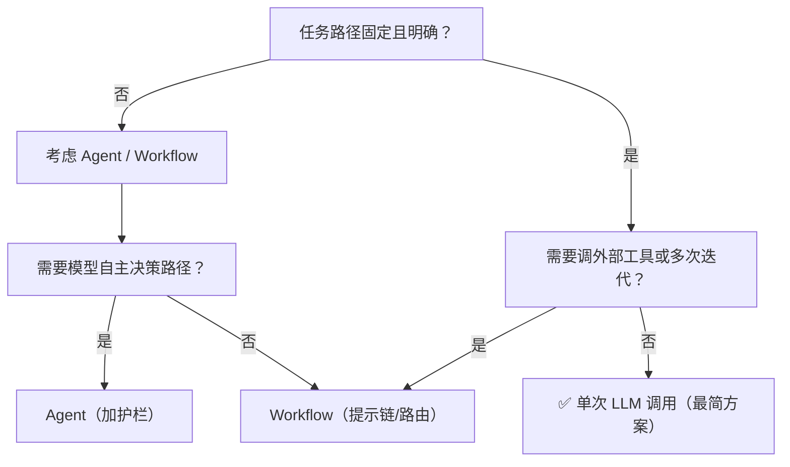

---

title: "简单任务最简方案"

tags:

  - agent方法论

  - agent产品化

  - 认知

created: "2026-07-21"

---

# 简单任务最简方案

> 本条目是「Agent 产品化思维」的第 2 部分，对应学习清单条目 7.1.2。

>

> **前置依赖**：Workflow vs Agent选型

> **为以下铺垫**：幻觉递归陷阱

---

## 一、核心观点

> **别为翻译任务设计四步 Agent。** 路径固定、步骤明确的简单任务，直接单次 LLM 调用搞定——上 Agent 是过度设计，徒增成本、延迟和出错面。

---

## 二、定义与原理
### 2.1 什么是简单任务

- **简单任务**：路径固定、步骤明确、不需要智能决策

- **典型例子**：翻译、格式转换、简单抽取、单轮问答

- **本质**：用规则或模板就能解决，LLM 只做一次"输入→输出"的映射

> **类比**：翻译一句话就像让同事把一张便签从英文翻成中文。你有必要给他配一个"先分析需求→再选策略→再翻译→再质检→再交付"的五人项目组吗？他自己动动笔就完了。Agent 是给"不知道下一步干啥"的开放问题准备的，不是给填空题准备的。

### 2.2 为什么用最简方案

- **成本低**：没有循环、没有多轮工具调用，一次调用结束

- **延迟小**：直接出结果，不用等 Agent 绕圈

- **可靠**：环节少，出错点少，易调试

---

## 三、实践

判断"该不该上 Agent"的三道闸：



---

## 四、示例

**任务**：把一段英文翻译成中文。

### ❌ 过度设计（原文件的反面教材）

```text

Agent：分析翻译需求 → 选择翻译策略 → 执行翻译 → 验证翻译质量 → 返回结果

```

问题：五步全靠 LLM 自己绕，每一步都有概率跑偏，且白白多花四轮 token。

### ✅ 最简方案

```python

# 直接一次调用，完事

result = llm.generate(f"请将以下英文翻译成中文：{text}")

```

> 优点：一行搞定、成本最低、延迟最小。如果还想要质量保障，最多加一道 **Prompt Chaining**（翻译完用规则/轻量检查格式），而不是上自主 Agent。

---

## 五、优劣势

| 方案 | 优点 | 缺点 | 何时用 |

|------|------|------|--------|

| 单次 LLM 调用 | 极简、便宜、快、稳 | 只能处理固定路径 | 翻译/转换/单轮问答 |

| Workflow | 可控、可加检查点 | 仍比单调用重 | 多步但路径固定 |

| Agent | 灵活自主 | 贵、慢、易跑偏 | 路径真不确定时 |

---

## 六、核心要点

- ✂️ **能一次调用就别加戏**：翻译、格式转换这类固定路径任务，单 LLM 调用是最优解。

- 🚫 **过度设计三宗罪**：成本高、延迟大、出错面多——全是无谓的。

- 🔍 **上 Agent 的三信号**：需要智能决策（路径不定）、需要工具调用（外部 API/DB）、需要循环迭代（多次尝试）。

- 📉 **默认从最简起步**：这是 Anthropic "start simple" 原则在单个任务上的落地。

---

## 七、最新研究与企业数据

- **"从简单开始"已被厂商定调**：Anthropic《Building Effective Agents》(2024-12) 明确指出，对许多应用而言，"优化单次 LLM 调用（加检索、加上下文示例）通常就够"，并不一定要构建 agentic system。

- **多 Agent 的 token 代价提醒**：Anthropic 多 Agent 研究显示多 Agent 架构 token 消耗约为聊天的 **15 倍**（见 [[01-WorkflowvsAgent选型|上篇]]）。这反向说明：能单调用解决的简单任务，强行 Agent 化是在白白烧钱。

---

## 八、学习资源

- **权威一手**：Anthropic《Building Effective Agents》：[anthropic.com/engineering/building-effective-agents](https://www.anthropic.com/engineering/building-effective-agents)

- **进阶**：[[03-幻觉递归陷阱|幻觉递归陷阱]]——为什么步骤越多越危险

---

**下一篇**：[[03-幻觉递归陷阱|幻觉递归陷阱]]——简单任务讲完，下篇讲"步骤越多误差越易累积，要设人工确认点"。

---

## 参考来源（一手链接 · 可溯源深挖）

- **Anthropic (2024-12)**《Building Effective Agents》：[anthropic.com/engineering/building-effective-agents](https://www.anthropic.com/engineering/building-effective-agents)（"优化单次 LLM 调用通常就够"）

- **Anthropic (2025)**《How we built our multi-agent research system》：[anthropic.com/engineering/multi-agent-research-system](https://www.anthropic.com/engineering/multi-agent-research-system)（多 Agent token 15× 代价）

## 速记卡（面试闪卡）

**Q1：一句话讲清「简单任务最简方案」到底是什么？**

A：路径固定步骤明确的简单任务，直接单次 LLM 调用搞定，上 Agent 是过度设计。

**Q2：一、核心观点 —— 怎么理解？**

A：像让同事翻张便签：你有必要给他配"分析需求→选策略→翻译→质检→交付"五人项目组吗？他自己动动笔就完。Agent 是给"不知下一步干啥"的开放问题准备的，不是给填空题准备的。

**Q3：二、定义与原理 —— 怎么理解？**

A：像判断题 vs 论述题：简单任务是路径固定、步骤明确、不需智能决策（翻译/格式转换/单轮问答），用规则或模板一次"输入→输出"映射就完；复杂开放问题才值得上 Agent 绕圈。

**Q4：三、实践（三道闸） —— 怎么理解？**

A：像过三道安检：路径固定且明确吗？否→考虑 Agent/Workflow。需要调外部工具或多轮迭代吗？是→Workflow（提示链/路由）；否→单次 LLM 调用（最简）。需模型自主决策路径？是→Agent 加护栏。

**Q5：四、示例与代价 —— 怎么理解？**

A：像打车 vs 包车：翻译一句话一行 llm.generate 搞定，成本最低延迟最小；硬上五步 Agent 每步都概率跑偏还白烧四轮 token。Anthropic 说多 Agent token 约聊天 15 倍——能单调用硬 Agent 化是烧钱。

**Q6：核心速记主线有哪些？**

- 原则：路径固定简单任务，单次 LLM 调用最优

- 过度设计三宗罪：成本高 / 延迟大 / 出错面多

- 三道闸：路径固定？需工具/迭代？需自主决策？

- 上 Agent 信号：智能决策 / 工具调用 / 循环迭代

**口诀**

A：简单任务莫加戏，一次调用最便宜；

五人组翻一张条，过度设计徒增迷；

三道闸前先自问，路径固定否迟疑；

能单调用别Agent，省钱省时少危机。

## 相关链接

- 系列清单：[[学习路线图/Agent方法论与产品思维学习路线图|Agent 方法论与产品思维学习路线图]]

- 上一层级：[[00-Agent方法论与产品思维|Agent 产品化思维 · 索引]]

- 同主题：[[01-WorkflowvsAgent选型|Workflow vs Agent 选型]] · [[03-幻觉递归陷阱|幻觉递归陷阱]]

