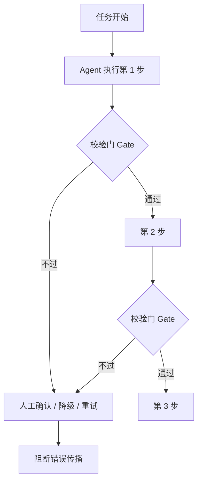

---

title: "幻觉递归陷阱"

tags:

  - agent方法论

  - agent产品化

  - 认知

created: "2026-07-21"

---

# 幻觉递归陷阱

> 本条目是「Agent 产品化思维」的第 3 部分，对应学习清单条目 7.1.3。

>

> **前置依赖**：Workflow vs Agent选型、简单任务最简方案

> **为以下铺垫**：四步翻译、失败模式预判

---

## 一、核心观点

> **幻觉递归陷阱（Recursive Hallucination Trap）**：Agent 每一步都可能产出错误，错误会顺着链路**乘式累积**——步骤越多，端到端成功率崩得越狠。对策是缩短链路 + 在关键节点设人工确认（HITL）。

---

## 二、定义与原理
### 2.1 什么叫"递归累积"

- 单步成功率就算高达 95%，串联 20 步后端到端成功率只剩 0.95²⁰ ≈ **35.8%**

- 换句话说：每步只错 5%，但 20 步串起来，有 **约 64% 的概率整条链路至少错一次**

- 这叫 **Lusser's Law（卢瑟定律）**：系统总可靠度 = 各环节可靠度的乘积，不是平均

> **类比——传话游戏**：第一个人悄声说一句，每传一个人可能掺一点错。传到第十个人，原话可能面目全非。Agent 的每一步就是一个人，幻觉就是那点被掺进去的错，而且**后面的人会把前面的错当真**，越传越歪。

### 2.2 为什么 Agent 特别严重

普通 Workflow 步数可控、每步确定性高；Agent 自主循环容易"为了完成任务硬编下去"，把前面的小错当成事实继续推演，错误被放大成灾难。

---

## 三、实践：把错误挡在放大之前

三类常用闸门：

1. **程序化 Gate**：步间加规则检查（格式、范围、工具返回码），不过就停

2. **人工确认点（HITL）**：关键步骤让人看一眼再放行

3. **独立验证**：用另一个模型/规则对输出做交叉校验

---

## 四、示例

假设单步可靠度 98%（已经很强），不同步数的端到端表现：

| 串联步数 | 端到端成功率 | 累计错误率 | 评估 |

|----------|--------------|------------|------|

| 1 | 98.0% | 2.0% | 可接受 |

| 5 | 90.4% | 9.6% | 需监控 |

| 10 | 81.7% | 18.3% | 高风险，需人工确认 |

| 20 | 66.8% | 33.2% | 不建议直接上生产 |

> 注意：这不是某模型的短板，而是**概率的数学必然**。再强的模型，只要链路够长又没校验，端到端就会塌。

---

## 五、优劣势

- ✅ 看清陷阱后，你会**主动砍步骤、加 Gate**，而不是盲目堆 Agent 能力

- ✅ 人工确认点花小钱避大灾

- ❌ 加 Gate / HITL 会牺牲一点延迟和自主性

- ❌ 很多人低估"每步 95%"的恐怖——Demo 跑得欢，生产一塌糊涂

---

## 六、核心要点

- 📐 **端到端 = 各环节可靠度的乘积**，不是平均。0.95 的 20 次方 ≈ 0.36。

- ✂️ **缩短链路是第一优先级**：能 5 步做完别拆 10 步；能并行的并行（并行不累积串联错误）。

- 🚧 **每步都加 Gate**：格式/范围/返回码校验，不过就停，fail fast。

- 🙋 **关键节点上 HITL**：高风险步骤让人确认，阻断错误向下传播。

- 🔁 **独立验证**：用另一模型或规则交叉校验，别让 Agent 自己给自己背书。

---

## 七、最新研究与企业数据

- **错误确实按乘积放大**：2026 年多家机构对生产 Agent 的复盘显示，即使单 Agent 成功率 98%，10 步链路端到端也只剩 **81.7%**（错误率 18.3%），20 步跌到 **66.8%**。带治理（校验门）的系统可把错误率从约 40% 压到约 10%（Arion Research，经 7T 汇总）。

- **Gartner 预警**：Gartner（2025-06）预测到 2027 年底 **超过 40% 的 agentic AI 项目将被取消**，主因是成本失控与治理缺失，而非模型能力——这正是错误累积与缺乏护栏的宏观后果。

- **行业共识**：多步 Agent 应被当作"可靠性工程"问题，而非"模型选择"问题（LangChain State of Agent Engineering 调研：68% 的生产 Agent 在需人工介入前执行不到 10 步）。

---

## 八、学习资源

- **数据一手**：7T Research《Agentic AI Error Rates》(2026)：[7t.ai/blog/agentic-ai-error-rate-7tt](https://7t.ai/blog/agentic-ai-error-rate-7tt)（错误率乘积表、治理前后对比）

- **延伸**：[[05-失败模式预判|失败模式预判]]——系统枚举会挂的场景；[[10-Human-in-the-Loop时机判断|HITL 时机判断]]——哪里该让人介入

---

**下一篇**：[[04-四步翻译|四步翻译]]——认知讲完，下篇讲"用户需求 → Agent 方案"的四步翻译：目标 → 约束 → 边界 → 评估。

---

## 参考来源（一手链接 · 可溯源深挖）

- **7T Research (2026)**《Agentic AI Error Rates and Mitigation Strategies》：[7t.ai/blog/agentic-ai-error-rate-7tt](https://7t.ai/blog/agentic-ai-error-rate-7tt)（98% 单步 → 10 步 81.7% / 20 步 66.8%；治理后 40%→10%）

- **Gartner (2025-06)** 预测 40% agentic AI 项目于 2027 年前取消——来源待核实：广泛二手报道（如 [agentmarketcap.ai 汇总](https://agentmarketcap.ai/blog/2026/04/07/gartner-40-percent-agentic-ai-failure-rate-enterprise-readiness)），未检索到 Gartner 原始新闻稿 URL

- **Anthropic (2025)**《How we built our multi-agent research system》：[anthropic.com/engineering/multi-agent-research-system](https://www.anthropic.com/engineering/multi-agent-research-system)

## 速记卡（面试闪卡）

**Q1：一句话讲清「幻觉递归陷阱」到底是什么？**

A：幻觉递归陷阱指 Agent 每步错误沿链路乘式累积、越串越崩。

**Q2：一、核心观点 —— 怎么理解？ —— 怎么理解？**

A：像传话游戏：每人悄声传一句，错一点后面当真越传越歪；20 步串起来错误爆表。英语：Lusser's Law（卢瑟定律）。

**Q3：二、定义与原理 —— 怎么理解？ —— 怎么理解？**

A：单步 95% 串 20 步只剩 35.8%——总可靠度是各环节乘积，不是平均。传话游戏里后面的人把错当真，越推越歪。英语：recursive error accumulation（递归错误累积）。

**Q4：三、三类闸门怎么拦 —— 怎么理解？ —— 怎么理解？**

A：像流水线装质检门：程序化 Gate 步间查格式、HITL 关键步让人看一眼、独立验证换模型交叉查，不让 Agent 自己给自己背书。英语：HITL（人工确认）/ Validation Gate。

**Q5：四、研究数据多吓人 —— 怎么理解？ —— 怎么理解？**

A：像纸包不住火：98% 单步的 10 步链路只剩 81.7%，带治理可把错误率 40% 压到 10%；Gartner 预警 40% agentic 项目将被取消。英语：Gartner forecast。

**Q6：核心速记主线有哪些？**

- 端到端可靠度=各环节乘积（卢瑟定律）

- 缩短链路是第一优先级，能并行就并行

- 步间加 Gate，关键节点上 HITL

- 独立验证，别让 Agent 自己给自己背书

**口诀**

A：步步错相乘，二十步剩三成；

卢瑟定律警，乘积非平均。

砍链加 Gate，关键上 HITL；

独立做校验，别自己背书。

## 相关链接

- 系列清单：[[学习路线图/Agent方法论与产品思维学习路线图|Agent 方法论与产品思维学习路线图]]

- 上一层级：[[00-Agent方法论与产品思维|Agent 产品化思维 · 索引]]

- 同主题：[[02-简单任务最简方案|简单任务最简方案]] · [[05-失败模式预判|失败模式预判]]

