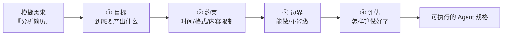

# 四步翻译

> 本条目是「Agent 产品化思维」的第 4 部分，对应学习清单条目 7.2.1。
>
> **前置依赖**：Workflow vs Agent选型、简单任务最简方案、幻觉递归陷阱
> **为以下铺垫**：失败模式预判、降级路径设计

---

## 一、核心观点

> **用户需求 → Agent 方案，必须经过"四步翻译"：目标（Goal）→ 约束（Constraints）→ 边界（Boundaries）→ 评估（Evaluation）。**
> 模糊的自然语言需求直接丢给 Agent，等于让一个新员工"看着办"——2026 年的教训是：**自然语言是漏水的抽象（leaky abstraction）**。

---

## 二、定义与原理

### 2.1 为什么要"翻译"

用户说的需求往往是模糊的："分析这份简历""帮我优化下供应链"。但 Agent 需要的是可执行的、带边界的、可判分的规格。

> **类比**：你跟厨师说"整点好吃的"，他无从下手；你说"做一份微辣、不要香菜、半小时出餐、成本控制在 30 元内的番茄炒蛋"，他才能稳定交付。四步翻译就是把"整点好吃的"变成"番茄炒蛋规格表"的过程。

### 2.2 四步是什么

---

## 三、实践：四步详解

| 步骤 | 要回答的问题 | 作用 |
|------|--------------|------|
| **① 目标 Goal** | 用户到底想要什么产出？ | 锁定交付物 |
| **② 约束 Constraints** | 时间、格式、内容有什么限制？ | 收窄解法空间 |
| **③ 边界 Boundaries** | 哪些能做、哪些绝对不能做？ | 防越权/防跑偏 |
| **④ 评估 Evaluation** | 用什么指标判断做好了？ | 可度量、可验收 |

> **关键心法**：第 ③ 步边界往往被忽略，但它恰恰决定 Agent 会不会"好心办坏事"（比如未经许可改了简历、发了邮件）。

---

## 四、示例

**模糊需求**：「分析这份简历，给出改进建议」

经过四步翻译：

1. **目标**：生成一份简历评估报告，含工作经历 / 技能 / 项目经验三段分析 + 改进建议
2. **约束**：30 秒内完成、Markdown 格式、含量化数据
3. **边界**：只分析不修改；不投递；不联系招聘方；不输出歧视性结论
4. **评估**：完成率 100%、建议可执行率 >90%、用户满意度 >4/5

→ 这四条一写清，无论是写 Prompt、搭 Workflow 还是上 Agent，都有据可依。

---

## 五、优劣势

- ✅ 把"玄学需求"变"工程规格"，下游设计、评估、验收全有了锚点
- ✅ 边界前置，直接降低 [[03-幻觉递归陷阱|幻觉递归]] 与越权风险
- ❌ 翻译本身要花时间，且需要和用户/业务方对齐
- ❌ 若评估指标定歪了，Agent 会"精准地做错事"

---

## 六、核心要点

- 🌉 **四步翻译 = 目标 → 约束 → 边界 → 评估**，把模糊需求变可执行规格。
- 🚧 **边界（第③步）最易被忽略也最关键**：明确"不能做"什么，防越权跑偏。
- 📏 **评估（第④步）要可度量**：完成率、准确率、满意度，否则无法验收。
- ⚠️ **自然语言是漏水的抽象**：需求说"优化供应链"，Agent 可能理解成"降成本"，业务其实要"降交付周期"——必须翻译清楚。

---

## 七、最新研究与企业数据

- **规格歧义是头号杀手**：2026 年对生产 Agent 的复盘显示，**41% 的多 Agent 失败可追溯到"规格歧义（Specification Ambiguity）"**——同一句自然语言，人和 Agent 的理解南辕北辙（如"优化"被理解为降成本而非降交付周期）。领先团队改用"类型化动作（Typed Actions）"把指令当 API 契约，将意图漂移降低约 70%。
- **这与 Context Engineering 同源**：Anthropic 强调把上下文当有限资源、把指令写清楚，正是四步翻译在单次调用层面的体现。

---

## 八、学习资源

- **数据**：The Tech Trends《Why 40% of Agentic Projects Fail》(2026)：[thetechtrends.tech/agentic-ai-project-failure-lessons](https://thetechtrends.tech/agentic-ai-project-failure-lessons)（41% 失败源于规格歧义、Typed Actions 降漂移 70%）
- **延伸**：[[05-失败模式预判|失败模式预判]]——翻译完就预判会挂的场景；[[../01-认知升级/02-2025 Context Engineering 兴起|Context Engineering]]——把指令写清楚

---

**下一篇**：[[05-失败模式预判|失败模式预判]]——需求翻译讲完，下篇讲"提前想清楚 Agent 在什么场景下必挂"。

---

## 参考来源（一手链接 · 可溯源深挖）

- **The Tech Trends (2026)**《Why 40% of Agentic Projects Fail: Lessons from the 2026 Leaders》：[thetechtrends.tech/agentic-ai-project-failure-lessons](https://thetechtrends.tech/agentic-ai-project-failure-lessons)（规格歧义占多 Agent 失败 41%；Typed Actions 降意图漂移 70%）
- **Anthropic (2025-09)**《Effective context engineering for AI agents》：[anthropic.com/engineering/effective-context-engineering-for-ai-agents](https://www.anthropic.com/engineering/effective-context-engineering-for-ai-agents)

**相关链接**：
- 系列清单：[[学习路线图/Agent 方法论与产品思维学习清单|Agent 方法论与产品思维学习清单]]
- 上一层级：[[00-Agent 方法论与产品思维|Agent 产品化思维 · 索引]]
- 同主题：[[03-幻觉递归陷阱|幻觉递归陷阱]] · [[05-失败模式预判|失败模式预判]]

## 速记卡（面试闪卡）

**Q1：一句话讲清「四步翻译」到底是什么？**
A：**用户需求 → Agent 方案，必须经过"四步翻译"：目标（Goal）→ 约束（Constraints）→ 边界（Boundaries）→ 评估（Evaluation）。**
模糊的自然语言需求直接丢给 Agent，等于让一个新员工"看着办"——2026 年的教训是：**自然语言是漏水的抽象（leaky abstraction）**。
---

**Q2：一、核心观点 —— 怎么理解？**
A：**用户需求 → Agent 方案，必须经过"四步翻译"：目标（Goal）→ 约束（Constraints）→ 边界（Boundaries）→ 评估（Evaluation）。**
模糊的自然语言需求直接丢给 Agent，等于让一个新员工"看着办"——2026 年的教训是：**自然语言是漏水的抽象（leaky abstraction）**。
---

**Q3：二、定义与原理 —— 怎么理解？**
A：用户说的需求往往是模糊的："分析这份简历""帮我优化下供应链"。但 Agent 需要的是可执行的、带边界的、可判分的规格。
**类比**：你跟厨师说"整点好吃的"，他无从下手；你说"做一份微辣、不要香菜、半小时出餐、成本控制在 30 元内的番茄炒蛋"，他才能稳定交付。四步翻译就是把"整点好吃的"变成"番茄炒蛋规格表"的过程。
---

**Q4：三、实践：四步详解 —— 怎么理解？**
A：| 步骤 | 要回答的问题 | 作用 |
|------|--------------|------|
| **① 目标 Goal** | 用户到底想要什么产出？ | 锁定交付物 |
| **② 约束 Constraints** | 时间、格式、内容有什么限制？ | 收窄解法空间 |
| **③ 边界 Boundaries** | 哪些能做、哪些绝对不能做？ | 防越权/防跑偏 |

**Q5：四、示例 —— 怎么理解？**
A：**模糊需求**：「分析这份简历，给出改进建议」
经过四步翻译：
**目标**：生成一份简历评估报告，含工作经历 / 技能 / 项目经验三段分析 + 改进建议
**约束**：30 秒内完成、Markdown 格式、含量化数据
**边界**：只分析不修改；不投递；不联系招聘方；

**Q6：核心速记主线有哪些？**
A：抓住这几根：一、核心观点、二、定义与原理、三、实践：四步详解、四、示例、五、优劣势、六、核心要点。

