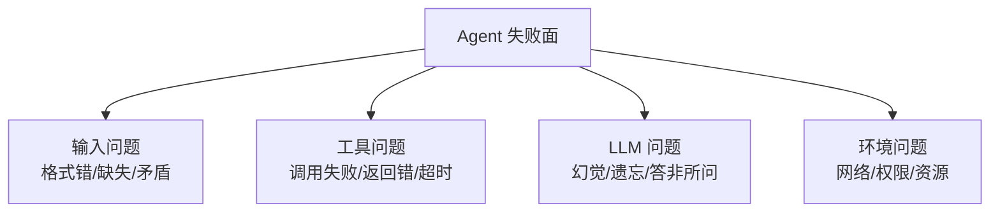

---

title: "失败模式预判"

tags:

  - agent方法论

  - agent产品化

  - 需求翻译

created: "2026-07-21"

---

# 失败模式预判

> 本条目是「Agent 产品化思维」的第 5 部分，对应学习清单条目 7.2.2。

>

> **前置依赖**：四步翻译

> **为以下铺垫**：降级路径设计

---

## 一、核心观点

> **失败模式预判（Failure Mode Pre-mortem）**：在设计阶段就穷举"Agent 会在什么场景下必挂"，按影响分级，高影响项必须有降级方案。别等线上炸了才想对策。

---

## 二、定义与原理
### 2.1 这是什么

- **失败模式预判**：动手写代码前，先假设"项目已经失败了"，倒推哪些地方会出事

- **核心**：把"未知的未知"尽量变成"已知的已知"

- **作用**：高影响失败提前备好降级，中低影响决定要不要管

> **类比——出门看天气预报**：你不会等被淋成落汤鸡才想起带伞。出发前先看一眼：下雨概率高不高？要带伞还是穿雨衣？Agent 上线前也该先"看天气"——把会挂的场景列个清单。

### 2.2 四类常见失败面



---

## 三、实践：预判四步法

1. **列清单**：把上面四类失败场景逐条铺开（见下）

2. **评影响**：高（任务失败）/ 中（质量下降）/ 低（体验差）

3. **配对策**：高影响→必须有降级；中影响→尽量避免；低影响→可接受

4. **埋埋点**：在易失败点加日志与监控，便于早发现

| 失败面 | 具体场景 | 影响 | 对策 |

|--------|----------|------|------|

| 输入 | 格式错、内容缺失、前后矛盾 | 高/中 | 入口校验 + 拒答/追问 |

| 工具 | 调用失败、返回错误、超时 | 高 | 重试 + 降级路径 |

| LLM | 幻觉、遗忘、答非所问 | 高 | 校验门 + HITL |

| 环境 | 网络、权限、资源不足 | 中/高 | 超时控制 + 人工接管 |

---

## 四、示例

一份极简的失败模式清单（直接进设计文档）：

```markdown

### 输入问题

- 格式错误 → 入口 schema 校验

- 内容缺失 → 触发追问或返回模板

### 工具问题

- 调用失败 → 重试 2 次后降级

- 超时（>30s）→ 转缓存/人工

### LLM 问题

- 幻觉 → 事实性 Gate + 来源标注

- 遗忘 → 关键信息写进 Context/记忆

### 环境问题

- 权限不足 → 报错并升级人工

- 资源满 → 限流 + 排队

```

---

## 五、优劣势

- ✅ 把救火变防火，线上事故率显著下降

- ✅ 降级方案有处安放，和 [[06-降级路径设计|下篇]] 自然衔接

- ❌ 列清单费脑子，且永远列不全（黑天鹅仍在）

- ❌ 过度防御会拖慢交付——所以要按影响分级，不是全防

---

## 六、核心要点

- 🔮 **Pre-mortem 思维**：先假设已失败，倒推哪会挂，比事后复盘便宜 100 倍。

- 🗂️ **四类失败面**：输入 / 工具 / LLM / 环境，逐类穷举。

- 🔺 **按影响分级**：高影响必须有降级，中影响尽量避免，低影响可忍。

- 🧩 **和下游咬合**：预判的结果直接喂给 [[06-降级路径设计|降级路径]] 与 [[10-Human-in-the-Loop时机判断|HITL]]。

---

## 七、最新研究与企业数据

- **失败多发生在集成层而非模型层**：Anthropic × Material 对 500+ 技术负责人的联合调研显示，已观测到可衡量 ROI 的达 80%，但上线 6 个月内失败率约 **40%**；最大障碍是**系统集成（46%）与数据质量（42%）**——模型能力本身排不进前二。这印证了"预判要重点盯工具与环境"。

- **错误放大是结构性问题**：见 [[03-幻觉递归陷阱|幻觉递归陷阱]]，多步链路端到端成功率按乘积崩塌——预判时必须把"步骤数"当成核心风险变量。

---

## 八、学习资源

- **延伸**：[[06-降级路径设计|降级路径设计]]——预判完就设计回退；[[13-错误恢复路径|错误恢复路径]]——出错后怎么自动拉回

- **框架**：Anthropic《Building Effective Agents》中"何时用 / 何时不用 Agent"的风险视角

---

**下一篇**：[[06-降级路径设计|降级路径设计]]——失败模式预判讲完，下篇讲"Agent 不行时怎么回退到可用状态"。

---

## 参考来源（一手链接 · 可溯源深挖）

- **Anthropic × Material (2026)** 联合调研（500+ 技术领导者）：生产使用率 86%、6 个月内失败率约 40%、最大障碍为系统集成与数据质量——来源待核实：经 36氪等二手报道（如 [mcp.csdn.net 汇总](https://mcp.csdn.net/6a2e336710ee7a33f27ccf1f.html)），未检索到 Anthropic 官方原始报告 URL

- **Anthropic (2024-12)**《Building Effective Agents》：[anthropic.com/engineering/building-effective-agents](https://www.anthropic.com/engineering/building-effective-agents)

- **7T Research (2026)** 错误率乘积分析：[7t.ai/blog/agentic-ai-error-rate-7tt](https://7t.ai/blog/agentic-ai-error-rate-7tt)

## 速记卡（面试闪卡）

**Q1：一句话讲清「失败模式预判」到底是什么？**

A：失败模式预判是在设计阶段就穷举 Agent 会挂的场景、按影响分级、高影响必须有降级方案的防火术。

**Q2：一、核心观点 —— 怎么理解？**

A：像出门前看天气预报：你不会等淋成落汤鸡才带伞。Pre-mortem（事前复盘）先假设「项目已失败」，倒推哪会挂，比事后救火便宜 100 倍。

**Q3：二、定义与原理 —— 怎么理解？**

A：像把「未知的未知」变「已知的已知」：动手前先假设已失败，倒推出事点；核心是四类失败面——输入/工具/LLM/环境，逐类穷举。

**Q4：三、实践：预判四步法 —— 怎么理解？**

A：像列一张风险清单四步走：① 列清单（四类失败铺开）② 评影响（高/中/低）③ 配对策（高影响必降级）④ 埋埋点（日志监控早发现）。

**Q5：四、示例 —— 怎么理解？**

A：像直接进设计文档的极简清单：输入错→schema 校验；调用失败→重试 2 次后降级；幻觉→事实 Gate + 来源标注；权限不足→升级人工。预判结果直接喂给降级路径。

**Q6：核心速记主线有哪些？**

- Pre-mortem 思维：先假设已失败，倒推哪会挂，比复盘便宜

- 四类失败面：输入 / 工具 / LLM / 环境，逐类穷举

- 按影响分级：高影响必有降级，中影响尽量避免，低影响可忍

- 和下游咬合：预判结果喂给降级路径与 HITL

**口诀**

A：失败先想已发生，倒推哪挂省百倍；

四类失败面列清，输入工具 LLM 环境；

高影必有降级路，中低按级定进退；

预判喂给下游用，防火胜于救火队。

## 相关链接

- 系列清单：[[学习路线图/Agent方法论与产品思维学习路线图|Agent 方法论与产品思维学习路线图]]

- 上一层级：[[00-Agent方法论与产品思维|Agent 产品化思维 · 索引]]

- 同主题：[[04-四步翻译|四步翻译]] · [[06-降级路径设计|降级路径设计]]

