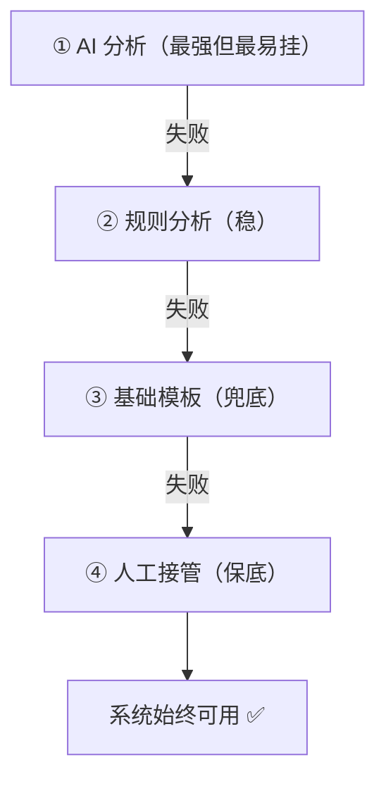

---

title: "降级路径设计"

tags:

  - agent方法论

  - agent产品化

  - 需求翻译

created: "2026-07-21"

---

# 降级路径设计

> 本条目是「Agent 产品化思维」的第 6 部分，对应学习清单条目 7.2.3。

>

> **前置依赖**：失败模式预判

> **为以下铺垫**：三维评估框架

---

## 一、核心观点

> **降级路径（Fallback / Degradation Path）**：Agent 不行时，系统仍能回退到一个"够用"的状态，而不是整体崩溃。设计原则是——永远留后路。

---

## 二、定义与原理
### 2.1 什么是降级

- **降级路径**：当主路径（AI 推理 / 工具调用）失败时，按顺序切换到的更稳但更弱的方案

- **核心**：保证"系统仍然可用"，哪怕体验打折

- **作用**：把"全盘崩溃"变成"优雅退化（graceful degradation）"

> **类比——开车的三道防线**：刹车失灵还有手刹，手刹也失灵还有安全带，安全带再不行至少车身吸能。你永远不会因为刹车坏了就直接车毁人亡，因为每一层都有后路。Agent 系统也该如此：AI 挂了 → 规则顶上 → 模板顶上 → 人工顶上。

### 2.2 四级降级阶梯



---

## 三、实践：四类降级策略

| 策略 | 做法 | 例子 |

|------|------|------|

| **功能降级** | 核心挂了保留次要功能 | AI 分析失败 → 返回基础模板 |

| **质量降级** | 高精度失败 → 放低要求 | 精确匹配失败 → 模糊匹配 |

| **人工接管** | Agent 搞不定 → 转人 | AI 客服无解 → 人工客服 |

| **缓存降级** | 实时取数失败 → 用旧数据 | API 挂 → 返回上次缓存 |

```python

def execute_with_fallback(task):

    try:

        return ai_analyze(task)        # ① 最强

    except AIFailed:

        try:

            return rule_analyze(task)  # ② 规则

        except RuleFailed:

            return basic_template(task)  # ③ 模板

    # ④ 极端情况转人工（由上层 HITL 处理）

```

---

## 四、示例

**配置化降级**（把阶梯写进配置，而非硬编码）：

```yaml

fallback:

  - ai_analyze      # 先试 AI

  - rule_analyze    # 再试规则

  - basic_template  # 最后模板

timeout: 30

max_retries: 2

```

> 好处：调降级顺序不用改代码；新人也能一眼看懂"挂了依次怎么办"。

---

## 五、优劣势

- ✅ 系统韧性拉满，单点故障不致命

- ✅ 和 [[05-失败模式预判|失败预判]] 一一对应：预判的高影响项直接配降级

- ❌ 多写几套方案，初期成本上升

- ❌ 降级路径本身也可能有 bug，要一起测

---

## 六、核心要点

- 🪜 **四级阶梯**：AI → 规则 → 模板 → 人工，逐层兜底。

- 💡 **优雅退化**：宁可体验打折，也不能整体崩。

- 🧱 **预判驱动降级**：[[05-失败模式预判|失败模式预判]] 里的高影响项，必须有对应降级。

- ⚙️ **配置化**：降级顺序写进 YAML，调顺序不动代码。

---

## 七、最新研究与企业数据

- **治理能把错误率砍 3/4**：Arion Research 复盘显示，带校验门与降级路径的"设计良好系统"，错误率可从约 **40% 降到约 10%**——降级 + 闸门是生产可用的分水岭。

- **上下文有限的现实约束**：Anthropic《Effective context engineering》提醒上下文是有限资源，降级时"返回缓存 / 基础模板"本质上是在稀缺上下文里保住最关键链路。

---

## 八、学习资源

- **数据**：7T Research《Agentic AI Error Rates》(2026)：[7t.ai/blog/agentic-ai-error-rate-7tt](https://7t.ai/blog/agentic-ai-error-rate-7tt)（治理后 40%→10%）

- **延伸**：[[07-三维评估框架|三维评估框架]]——怎么量化降级前后的效果；[[13-错误恢复路径|错误恢复路径]]——降级与自动恢复的关系

---

**下一篇**：[[07-三维评估框架|三维评估框架]]——需求翻译讲完，下篇讲"效果怎么度量：成功率 + 工具调用准确率 + Token 成本"。

---

## 参考来源（一手链接 · 可溯源深挖）

- **7T Research (2026)**《Agentic AI Error Rates》：[7t.ai/blog/agentic-ai-error-rate-7tt](https://7t.ai/blog/agentic-ai-error-rate-7tt)（治理后错误率 40%→10%）

- **Anthropic (2025-09)**《Effective context engineering for AI agents》：[anthropic.com/engineering/effective-context-engineering-for-ai-agents](https://www.anthropic.com/engineering/effective-context-engineering-for-ai-agents)

- **Anthropic (2024-12)**《Building Effective Agents》：[anthropic.com/engineering/building-effective-agents](https://www.anthropic.com/engineering/building-effective-agents)

## 速记卡（面试闪卡）

**Q1：一句话讲清「降级路径设计」到底是什么？**

A：Agent 主路径失败时，系统回退到更弱但可用的方案，而非整体崩。

**Q2：一、核心观点 —— 怎么理解？**

A：像永远留后路：降级路径（Fallback）让 Agent 不行时系统仍回到"够用"状态，把全盘崩溃变成优雅退化（graceful degradation）。设计原则：永远留后路。

**Q3：二、定义与原理 —— 怎么理解？**

A：像开车三道防线：刹车失灵还有手刹、手刹失灵还有安全带。AI 挂了→规则顶上→模板顶上→人工顶上，四级阶梯逐层兜底。优雅退化叫 Graceful Degradation。

**Q4：三、实践：四类降级策略 —— 怎么理解？**

A：像准备多套备胎：功能降级（核心挂保留次要）、质量降级（精确失败转模糊）、人工接管（无解转人）、缓存降级（实时挂用旧数据）。用 try/except 逐级回退。

**Q5：四、示例 —— 怎么理解？**

A：像把应急预案写进配置：把降级阶梯（ai→rule→template）放进 YAML，调顺序不动代码，新人一眼看懂"挂了依次怎么办"。配置化叫 Configuration-Driven。

**Q6：核心速记主线有哪些？**

- 核心：AI→规则→模板→人工 四级阶梯兜底

- 优雅退化：宁可体验打折也不整体崩

- 四类策略：功能/质量/人工/缓存降级

- 配置化：降级顺序写 YAML，调序不动码

**口诀**

A：降级永远留后路，四道防线层层兜；

AI 挂了规则上，模板人工保底收；

功能质量缓存降，配置写序不动手；

优雅退化不崩盘，预判高项必配兜。

## 相关链接

- 系列清单：[[学习路线图/Agent方法论与产品思维学习路线图|Agent 方法论与产品思维学习路线图]]

- 上一层级：[[00-Agent方法论与产品思维|Agent 产品化思维 · 索引]]

- 同主题：[[05-失败模式预判|失败模式预判]] · [[07-三维评估框架|三维评估框架]]

