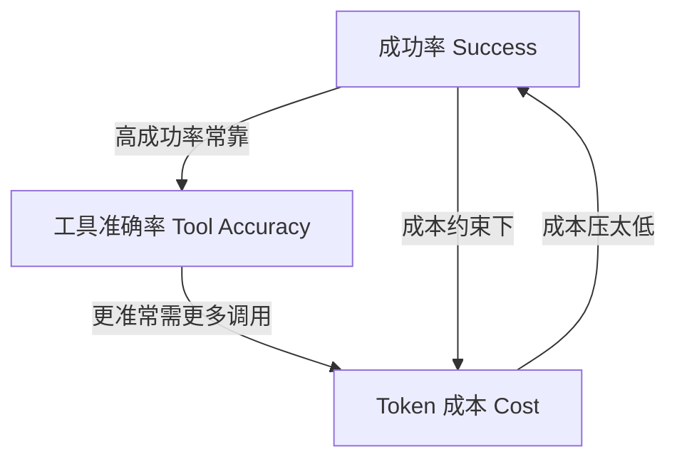

---

title: "三维评估框架"

tags:

  - agent方法论

  - agent产品化

  - 效果度量

created: "2026-07-21"

---

# 三维评估框架

> 本条目是「Agent 产品化思维」的第 7 部分，对应学习清单条目 7.3.1。

>

> **前置依赖**：四步翻译、失败模式预判、降级路径设计

> **为以下铺垫**：LLM-as-Judge、A/B测试对照

---

## 一、核心观点

> **三维评估框架**：评估一个 Agent 不能只看"答得对不对"，要同时看 **成功率（Success） + 工具调用准确率（Tool Accuracy） + Token 成本（Cost）**。三者缺一不可，且常常互相打架。

---

## 二、定义与原理
### 2.1 为什么是这三个维度

- **成功率**：任务到底完成了没有（结果维度）

- **工具调用准确率**：工具调对没、参数对没（过程维度）

- **Token 成本**：这一趟花了多少钱（效率维度）

> **类比——评判一个外卖骑手**：你不能只看"餐送到没"（成功率），还得看"有没有送错地址、有没有撒汤"（工具/操作准确率），更要看"为了送这单绕了多大远路、烧多少油"（成本）。只看一项都会被带偏：送达了但绕城三圈，老板也亏。

### 2.2 三角关系



三者是**此消彼长**的：为了提成功率常加调用（涨成本），为了压成本又可能牺牲准确率。

---

## 三、实践：三个维度怎么量

| 维度 | 核心指标 | 说明 |
|------|----------|------|
| **成功率** | 任务完成率、拒答率、用户满意度 | 端到端"办成了没" |
| **工具准确率** | 调用正确率、参数错误率、MCP 成功率 | 每一步"用对工具没" |
| **Token 成本** | 单次 token、总成本、成本效益比 | 每办成一件事花多少 |

```python

def evaluate_agent(agent, tasks):

    rows = []

    for task in tasks:

        r = agent.execute(task)

        rows.append({

            "success": eval_success(r),       # ① 结果

            "tool_acc": eval_tool_accuracy(r), # ② 过程

            "cost": eval_token_cost(r),        # ③ 效率

        })

    return rows

def composite(rows):

    # 成功率、准确率越高越好；成本越低越好 → 取倒数归一

    s = mean(r["success"] for r in rows)

    a = mean(r["tool_acc"] for r in rows)

    c = mean(r["cost"] for r in rows)

    return s*0.4 + a*0.4 + (1 - norm(c))*0.2

```

> 注：上表里的 95% / 98% / 1000 tokens 等都是**示意占位值**，真实阈值要按你的业务标定，不是行业常数。

---

## 四、示例

假设两个候选方案：

| 方案 | 成功率 | 工具准确率 | 单次成本 |
|------|--------|------------|----------|
| A（强模型） | 95% | 98% | $0.05 |
| B（小模型+路由） | 90% | 93% | $0.01 |

→ 若任务量大、容错高，B 可能更划算；若任务高危、错不起，A 更值。三维框架帮你把"值不值"摆到桌面上谈，而不是拍脑袋。

---

## 五、优劣势

- ✅ 把"Agent 好不好"从玄学变成可对比的三组数

- ✅ 直接暴露"为了准确率烧钱"的隐性代价

- ❌ 三个维度权重要人定，定歪了结论就歪

- ❌ 成功率本身难定义（见 [[04-四步翻译|四步翻译]] 的"评估"步）

---

## 六、核心要点

- 📊 **三维**：成功率（结果）+ 工具准确率（过程）+ Token 成本（效率）。

- ⚖️ **三者打架**：提成功率常涨成本；压成本常掉准确率——要按业务权衡权重。

- 🔢 **占位值非真理**：示例里的百分比是示意，阈值自己标定。

- 🧩 **配合评估方法**：维度怎么打分，看 [[08-LLM-as-Judge|LLM-as-Judge]] 与 [[09-A-B测试对照|A/B 测试]]。

---

## 七、最新研究与企业数据

- **Token 成本有数量级差异**：Anthropic 多 Agent 研究显示，普通 Agent 的 token 消耗约为聊天的 **4 倍**，多 Agent 系统约为 **15 倍**；在 BrowseComp 类评测中，token 用量单独解释了 **80%** 的性能方差。这说明"成本"维度绝不是配角，而是规模化成败的关键。

- **端到端成功率按乘积塌**：见 [[03-幻觉递归陷阱|幻觉递归陷阱]]，三维里的"成功率"必须放在多步链路的乘法视角下看，否则会严重高估。

---

## 八、学习资源

- **数据**：Anthropic《How we built our multi-agent research system》(2025)：[anthropic.com/engineering/multi-agent-research-system](https://www.anthropic.com/engineering/multi-agent-research-system)（token 4× / 15×、方差 80%）

- **延伸**：[[08-LLM-as-Judge|LLM-as-Judge]]——怎么自动打分；[[09-A-B测试对照|A/B 测试]]——怎么对比两版

---

**下一篇**：[[08-LLM-as-Judge|LLM-as-Judge]]——评估框架讲完，下篇讲"什么时候该用 LLM 当裁判、局限在哪"。

---

## 参考来源（一手链接 · 可溯源深挖）

- **Anthropic (2025)**《How we built our multi-agent research system》：[anthropic.com/engineering/multi-agent-research-system](https://www.anthropic.com/engineering/multi-agent-research-system)（token 4×/15×、BrowseComp 方差 80%）

- **Anthropic (2024-12)**《Building Effective Agents》：[anthropic.com/engineering/building-effective-agents](https://www.anthropic.com/engineering/building-effective-agents)

## 速记卡（面试闪卡）

**Q1：一句话讲清「三维评估框架」到底是什么？**

A：评估 Agent 要同时看成功率、工具调用准确率和 Token 成本三个常互相打架的维度。

**Q2：一、核心观点 —— 怎么理解？**

A：不能只看"答得对不对"。要同时盯成功率(Success)+工具调用准确率(Tool Accuracy)+Token 成本(Cost)三者，缺一不可且常此消彼长。

**Q3：二、定义与原理 —— 怎么理解？**

A：三个维度类比评外卖骑手：成功率=餐送到没(结果)；工具准确率=送错地址没、撒汤没(过程)；成本=绕多大远路烧多少油(效率)。只看一项被带偏：送达但绕城三圈老板也亏。三者此消彼长。

**Q4：三、实践：三个维度怎么量 —— 怎么理解？**

A：成功率看任务完成率/拒答率/满意度；工具准确率看调用正确率/参数错误率/MCP 成功率；Token 成本看单次 token/总成本/成本效益比。综合评分可加权：success*0.4+tool_acc*0.4+(1-norm cost)*0.2。

**Q5：四、示例 —— 怎么理解？**

A：方案 A(强模型)成功 95%/准确率 98%/\$0.05；方案 B(小模型+路由)90%/93%/\$0.01。任务量大容错高 B 更划算；任务高危错不起 A 更值。三维框架把"值不值"摆桌面谈而非拍脑袋。

**Q6：核心速记主线有哪些？**

- 三维：成功率(结果)+ 工具准确率(过程)+ Token 成本(效率)

- 三角：提成功率常涨成本，压成本常掉准确率

- 量法：完成率 / 调用正确率 / 单次 token 等指标

- 提醒：权重人定、占位值非真理，按业务标定

**口诀**

A：评估 Agent 三维看，成功工具加成本

光看送达会绕路，骑手比喻记心间

提率常伴成本涨，按压又掉准确率

权重自己来标定，值不值摆桌面

## 相关链接

- 系列清单：[[学习路线图/Agent方法论与产品思维学习路线图|Agent 方法论与产品思维学习路线图]]

- 上一层级：[[00-Agent方法论与产品思维|Agent 产品化思维 · 索引]]

- 同主题：[[06-降级路径设计|降级路径设计]] · [[08-LLM-as-Judge|LLM-as-Judge]]

