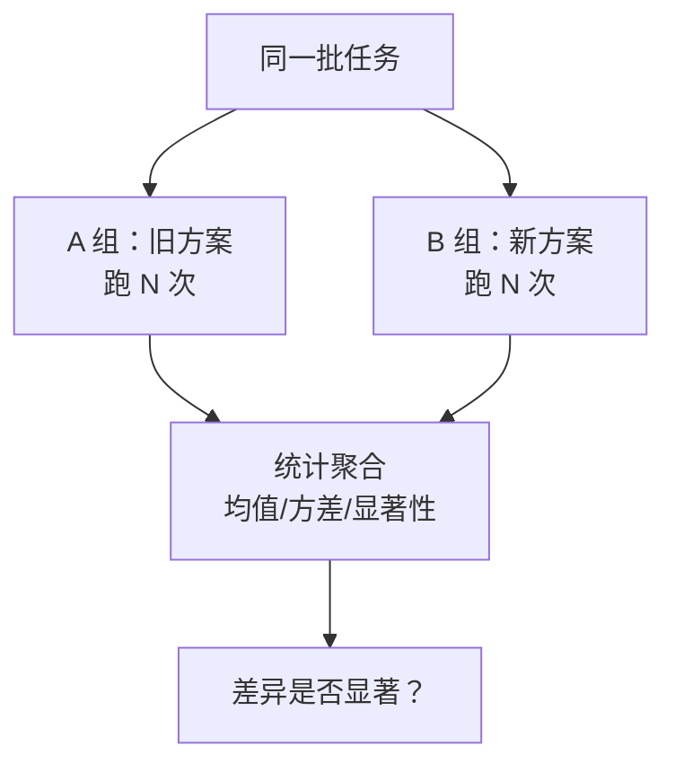

# A/B 测试对照

> 本条目是「Agent 产品化思维」的第 9 部分，对应学习清单条目 7.3.3。
>
> **前置依赖**：三维评估框架、LLM-as-Judge
> **为以下铺垫**：Human-in-the-Loop时机判断

---

## 一、核心观点

> **A/B 测试对照**：想证明"新方案更好"，就控制变量、只改一个东西、两组跑同一批任务对比。对 Agent 而言，因为模型本身有随机性，每组都要**跑多次取统计显著**，不能拿一次结果下结论。

---

## 二、定义与原理

### 2.1 是什么

- **A/B 测试**：把流量/任务分成两组，A 用旧方案、B 用新方案，对比效果差异
- **核心**：控制变量（只改你想验证的那一个），其余全相同
- **作用**：用数据回答"这波改动到底值不值"

> **类比——同一道菜换种盐**：你想知道"海盐是不是比精盐好"，就得用同一份菜谱、同一位厨子、同一批食材，只换盐，然后盲品打分。如果你同时换了厨子和火候，那就分不清是盐的功劳还是厨子的功劳。Agent 改版也是一样：只换"加载 Skill 与否"，别的都别动。

### 2.2 为什么 Agent 的 A/B 更娇气

模型输出有随机性（temperature > 0），单次结果会抖。所以：



每组跑 N 次，看均值和方差，确认差异不是运气。

---

## 三、实践：三类典型对照

| 场景 | A 组 | B 组 | 看什么 |
|------|------|------|--------|
| **加载 Skill 与否** | 不加载 | 加载 | 成功率/成本变化 |
| **旧 Skill vs 新 Skill** | 旧版 | 新版 | 质量是否真提升 |
| **不同模型** | Claude | GPT-4 | 哪个更适配本任务 |

```python
def ab_test(groups, tasks, runs=5):
    out = {}
    for name, agent in groups.items():
        scores = [evaluate_agent(agent, tasks) for _ in range(runs)]
        out[name] = mean_and_ci(scores)   # 均值 + 置信区间
    return compare_with_significance(out)
```

---

## 四、示例

验证"加载某 Skill 是否提升简历分析成功率"：
- A 组（不加载）：成功率 88% ± 3%
- B 组（加载）：成功率 93% ± 2%
- 置信区间基本不重叠 → 可以较有把握地说"加载真有用"，而不是单次 90% vs 92% 的假象。

---

## 五、优劣势

- ✅ 用证据替代直觉，避免"我觉得更好"的伪结论
- ✅ 和 [[07-三维评估框架|三维评估]]、[[08-LLM-as-Judge|LLM-as-Judge]] 天然配合（拿它们当指标）
- ❌ 每组多跑几次，token 成本成倍涨（见 [[07-三维评估框架|成本维度]]）
- ❌ 指标定义不清时，A/B 只会精确证明一件错事

---

## 六、核心要点

- 🧪 **A/B = 控制变量对照**：只改一个变量，两组跑同批任务。
- 🎲 **Agent 要跑多次**：模型有随机性，单次结果会骗人，必须取均值+置信区间。
- 🔁 **典型三场景**：加载 Skill 与否 / 旧 vs 新 Skill / 不同模型。
- 🤝 **指标来自上下游**：成功率、工具准确率、judge 分都能当 A/B 的因变量。

---

## 七、最新研究与企业数据

- **评测必须成体系才可信**：Anthropic 在《Building Effective Agents》中强调，agentic system 应配"real eval harness（真实评测台）"来校准 rubric，避免凭感觉判断改进有效——这正是 A/B 测试的方法论根基。
- **成本视角**：A/B 每组多跑几次直接放大 token 消耗，而 Anthropic 多 Agent 研究显示 token 本身可解释 80% 的性能方差，因此 A/B 的"样本量"和"成本"要一起权衡。

---

## 八、学习资源

- **一手**：Anthropic《Building Effective Agents》(2024-12)：[anthropic.com/engineering/building-effective-agents](https://www.anthropic.com/engineering/building-effective-agents)（real eval harness 视角）
- **延伸**：[[08-LLM-as-Judge|LLM-as-Judge]]——拿 judge 当评分器；[[07-三维评估框架|三维评估框架]]——定义对比指标

---

**下一篇**：[[10-Human-in-the-Loop时机判断|Human-in-the-Loop时机判断]]——效果度量讲完，下篇讲"哪些操作必须让人介入、标准是什么"。

---

## 参考来源（一手链接 · 可溯源深挖）

- **Anthropic (2024-12)**《Building Effective Agents》：[anthropic.com/engineering/building-effective-agents](https://www.anthropic.com/engineering/building-effective-agents)（real eval harness、度量改进有效性）
- **Anthropic (2025)**《How we built our multi-agent research system》：[anthropic.com/engineering/multi-agent-research-system](https://www.anthropic.com/engineering/multi-agent-research-system)（token 解释 80% 性能方差）

**相关链接**：
- 系列清单：[[学习路线图/Agent 方法论与产品思维学习清单|Agent 方法论与产品思维学习清单]]
- 上一层级：[[00-Agent 方法论与产品思维|Agent 产品化思维 · 索引]]
- 同主题：[[08-LLM-as-Judge|LLM-as-Judge]] · [[10-Human-in-the-Loop时机判断|HITL 时机判断]]

## 速记卡（面试闪卡）

**Q1：一句话讲清「A/B 测试对照」到底是什么？**
A：**A/B 测试对照**：想证明"新方案更好"，就控制变量、只改一个东西、两组跑同一批任务对比。对 Agent 而言，因为模型本身有随机性，每组都要**跑多次取统计显著**，不能拿一次结果下结论。
---

**Q2：一、核心观点 —— 怎么理解？**
A：**A/B 测试对照**：想证明"新方案更好"，就控制变量、只改一个东西、两组跑同一批任务对比。对 Agent 而言，因为模型本身有随机性，每组都要**跑多次取统计显著**，不能拿一次结果下结论。
---

**Q3：二、定义与原理 —— 怎么理解？**
A：**A/B 测试**：把流量/任务分成两组，A 用旧方案、B 用新方案，对比效果差异
**核心**：控制变量（只改你想验证的那一个），其余全相同
**作用**：用数据回答"这波改动到底值不值"
**类比——同一道菜换种盐**：你想知道"海盐是不是比精盐好"，就得用同一份菜谱、同一位厨子、同一批食材，只换盐，然后盲品打分。如果你同时换了厨子和火候，那就分不清是盐的功劳还是厨子的功劳。

**Q4：三、实践：三类典型对照 —— 怎么理解？**
A：| 场景 | A 组 | B 组 | 看什么 |
|------|------|------|--------|
| **加载 Skill 与否** | 不加载 | 加载 | 成功率/成本变化 |
| **旧 Skill vs 新 Skill** | 旧版 | 新版 | 质量是否真提升 |
| **不同模型** | Claude | GPT-4 | 哪个更适配本任务 |
---

**Q5：四、示例 —— 怎么理解？**
A：验证"加载某 Skill 是否提升简历分析成功率"：
A 组（不加载）：成功率 88% ± 3%
B 组（加载）：成功率 93% ± 2%
置信区间基本不重叠 → 可以较有把握地说"加载真有用"，而不是单次 90% vs 92% 的假象。
---

**Q6：核心速记主线有哪些？**
A：抓住这几根：一、核心观点、二、定义与原理、三、实践：三类典型对照、四、示例、五、优劣势、六、核心要点。

