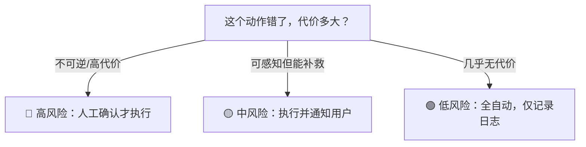

# Human-in-the-Loop 时机判断

> 本条目是「Agent 产品化思维」的第 10 部分，对应学习清单条目 7.4.1。
>
> **前置依赖**：三维评估框架、LLM-as-Judge、A/B测试对照
> **为以下铺垫**：权限分级、决策可追溯

---

## 一、核心观点

> **Human-in-the-Loop（HITL，人在回路）**：不是"每步都让人点确认"（那 Agent 就退化成慢 UI），而是**按风险分级**——低风险自动过，中风险通知，高风险才让人拍板。判断标准是"错了能不能挽回 + 错了代价多大"。

---

## 二、定义与原理

### 2.1 是什么

- **HITL**：关键决策点把人拉进回路，Agent 干粗活、人做最终裁决
- **核心**：用人的判断力兜住 Agent 的不确定性
- **作用**：保安全、提质量、建信任

> **类比——自动驾驶**：L2 辅助驾驶时，车自己跟车、变道，但关键时刻（高速汇入、恶劣天气）系统提示你接管。如果要求你每秒都握着方向盘点头确认，那还不如自己开。HITL 的精髓是"该管时管，不该管时放手"。

### 2.2 时机判断矩阵



---

## 三、实践：四类必介入时机

| 时机 | 例子 | 处理 |
|------|------|------|
| **破坏性操作** | 删文件、DROP TABLE、发不可撤回邮件 | 必须人工确认 |
| **高风险决策** | 资金、客户数据、合规、声誉 | 必须人工确认 |
| **Agent 不确定** | 证据不足、自相矛盾 | 升级人工 / 反问 |
| **用户主动要求** | 用户想介入/修改 | 提供干预入口 |

```python
def execute_with_hitl(action, risk):
    if risk == "high":
        return action if user_confirm(action) else abort()
    elif risk == "medium":
        notify_user(action); return execute(action)
    else:
        return execute(action)   # 低风险全自动
```

---

## 四、示例

**反模式 vs 正模式**（2026 年复盘）：

- ❌ **Rubber Stamp（橡皮图章）**：让人每天批 100 个动作 → 人麻木瞎点"同意" →  catastrophic failure 照样过。
- ✅ **Exception-Based（基于异常）**：置信度 95% 以上自动执行并留痕；只有 60% 才带着"我倾向 A，理由 X，要不要改？"去问人。人只处理真正需要判断的少数。

---

## 五、优劣势

- ✅ 把人放在"杠杆点"上，安全与效率兼得
- ✅ 和 [[11-权限分级|权限分级]]、[[12-决策可追溯|决策可追溯]] 是铁三角
- ❌ 确认点太多 → 橡皮图章，反而更危险
- ❌ 人工介入打断自主循环，延迟上升

---

## 六、核心要点

- 🔴🟡🟢 **三级介入**：高（确认）/ 中（通知）/ 低（全自动），按"错了代价多大"分级。
- 🚫 **别搞橡皮图章**：每步都让人点是反模式，人会麻木。
- 🎯 **Exception-Based**：高置信自动过，低置信才带选项问人。
- 🤝 **铁三角**：HITL + 权限分级 + 决策可追溯，缺一不可。

---

## 七、最新研究与企业数据

- **"每步确认"是陷阱**：2026 年对失败项目的复盘指出，把 HITL 做成简单"同意/拒绝"按钮会导致**橡皮图章效应**——人每天批上百个动作后停止阅读，直接点同意，灾难性错误照样放行。领先团队改用"基于异常的管控"：置信度 95% 自动执行，仅 60% 才带建议选项升级人工。
- **CISO 是隐形杀手**：同一复盘显示约 40% 项目因安全团队（CISO）叫停而失败，根因是 Agent 身份 sprawl 与缺审计。这进一步说明 HITL 必须和权限、审计绑定，而非孤立的确认框。

---

## 八、学习资源

- **数据/实践**：The Tech Trends《Why 40% of Agentic Projects Fail》(2026)：[thetechtrends.tech/agentic-ai-project-failure-lessons](https://thetechtrends.tech/agentic-ai-project-failure-lessons)（橡皮图章、Exception-Based、CISO 叫停 40%）
- **一手**：Anthropic《Building Effective Agents》：[anthropic.com/engineering/building-effective-agents](https://www.anthropic.com/engineering/building-effective-agents)（HITL 与 workflow 设计）
- **延伸**：[[11-权限分级|权限分级]] · [[12-决策可追溯|决策可追溯]]

---

**下一篇**：[[11-权限分级|权限分级]]——HITL 讲完，下篇讲"read-only / write / destructive 三级防护"。

---

## 参考来源（一手链接 · 可溯源深挖）

- **The Tech Trends (2026)**《Why 40% of Agentic Projects Fail》：[thetechtrends.tech/agentic-ai-project-failure-lessons](https://thetechtrends.tech/agentic-ai-project-failure-lessons)（橡皮图章效应、Exception-Based 管控、CISO 叫停约 40%）
- **Anthropic (2024-12)**《Building Effective Agents》：[anthropic.com/engineering/building-effective-agents](https://www.anthropic.com/engineering/building-effective-agents)

**相关链接**：
- 系列清单：[[学习路线图/Agent 方法论与产品思维学习清单|Agent 方法论与产品思维学习清单]]
- 上一层级：[[00-Agent 方法论与产品思维|Agent 产品化思维 · 索引]]
- 同主题：[[09-A-B测试对照|A/B 测试对照]] · [[11-权限分级|权限分级]]

## 速记卡（面试闪卡）

**Q1：一句话讲清「Human-in-the-Loop 时机判断」到底是什么？**
A：**Human-in-the-Loop（HITL，人在回路）**：不是"每步都让人点确认"（那 Agent 就退化成慢 UI），而是**按风险分级**——低风险自动过，中风险通知，高风险才让人拍板。判断标准是"错了能不能挽回 + 错了代价多大"。
---

**Q2：一、核心观点 —— 怎么理解？**
A：**Human-in-the-Loop（HITL，人在回路）**：不是"每步都让人点确认"（那 Agent 就退化成慢 UI），而是**按风险分级**——低风险自动过，中风险通知，高风险才让人拍板。判断标准是"错了能不能挽回 + 错了代价多大"。
---

**Q3：二、定义与原理 —— 怎么理解？**
A：**HITL**：关键决策点把人拉进回路，Agent 干粗活、人做最终裁决
**核心**：用人的判断力兜住 Agent 的不确定性
**作用**：保安全、提质量、建信任
**类比——自动驾驶**：L2 辅助驾驶时，车自己跟车、变道，但关键时刻（高速汇入、恶劣天气）系统提示你接管。如果要求你每秒都握着方向盘点头确认，那还不如自己开。HITL 的精髓是"该管时管，不该管时放手"。
---

**Q4：三、实践：四类必介入时机 —— 怎么理解？**
A：| 时机 | 例子 | 处理 |
|------|------|------|
| **破坏性操作** | 删文件、DROP TABLE、发不可撤回邮件 | 必须人工确认 |
| **高风险决策** | 资金、客户数据、合规、声誉 | 必须人工确认 |
| **Agent 不确定** | 证据不足、自相矛盾 | 升级人工 / 反问 |
| **用户主动要求** | 用户想介入/修改 | 提供干预入口 |
---

**Q5：四、示例 —— 怎么理解？**
A：**反模式 vs 正模式**（2026 年复盘）：
❌ **Rubber Stamp（橡皮图章）**：让人每天批 100 个动作 → 人麻木瞎点"同意" →  catastrophic failure 照样过。
✅ **Exception-Based（基于异常）**：置信度 95% 以上自动执行并留痕；只有 60% 才带着"我倾向 A，理由 X，要不要改？"去问人。人只处理真正需要判断的少数。
---

**Q6：核心速记主线有哪些？**
A：抓住这几根：一、核心观点、二、定义与原理、三、实践：四类必介入时机、四、示例、五、优劣势、六、核心要点。

