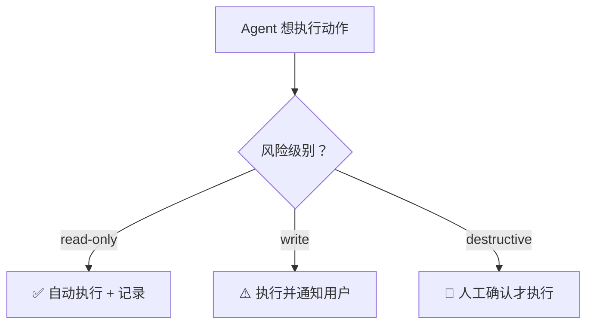

---

title: "权限分级"

tags:

  - agent方法论

  - agent产品化

  - 交互设计

created: "2026-07-21"

---

# 权限分级

> 本条目是「Agent 产品化思维」的第 11 部分，对应学习清单条目 7.4.2。

>

> **前置依赖**：Human-in-the-Loop时机判断

> **为以下铺垫**：决策可追溯、错误恢复路径

---

## 一、核心观点

> **权限分级（Permission Tiers）**：把 Agent 能做的操作按风险分成 **read-only（只读）/ write（写入）/ destructive（破坏性）** 三级，级别越高越要确认、越要留痕。这是 Agent 安全的地基。

---

## 二、定义与原理
### 2.1 三级是什么

- **read-only（只读）**：只能看，不能改。风险最低，无需确认

- **write（写入）**：能改能发，但不能删。风险中等，需通知

- **destructive（破坏性）**：删、DROP、发不可撤回消息。风险最高，必须人工确认

> **类比——公司门禁**：实习生只能进办公区看资料（read-only）；正式员工能改文档、发邮件（write）；只有总监能删库、关停服务（destructive）。不是谁都能碰红色按钮，红色按钮天然该有额外审批。Agent 也该有自己的"工牌级别"。

### 2.2 与 HITL 的关系



权限分级是 HITL 的"自动化前置过滤器"：先分级，再决定要不要拉人。

---

## 三、实践：三级详解

| 级别 | 能做什么 | 风险 | 控制 |

|------|----------|------|------|

| **read-only** | 读文件、查库、看日志 | 低 | 全自动，仅记日志 |

| **write** | 改文件、更新库、发消息 | 中 | 通知用户 + 留痕 |

| **destructive** | 删文件、DROP、发不可撤回邮件 | 高 | 人工确认 + 审计 |

```python

PERMISSIONS = {

    "read-only":   ["read", "query", "list"],

    "write":       ["update", "modify", "send"],

    "destructive": ["delete", "drop", "execute"],

}

def execute_with_permission(action, level):

    if level == "destructive" and not user_confirm(action):

        return None          # 高危：无确认不执行

    if level == "write":

        notify_user(action)  # 中危：告知

    return execute(action)   # 低危：直接干

```

---

## 四、示例

**最小权限原则（Least Privilege）**：给 Agent 的默认级别永远是 read-only，只有明确需要的任务才临时提升到 write；destructive 永远不自动给。这能挡掉绝大多数"Agent 抽风删库"的事故。

---

## 五、优劣势

- ✅ 把"能不能做"变成系统强制，不靠 Prompt 提醒（见 [[../01-认知升级/03-2026初HarnessEngineering|Harness]]：该用 Hook 的别用 Prompt）

- ✅ 和 HITL、审计天然咬合

- ❌ 分级要先梳理动作清单，前期有成本

- ❌ 分太细会摩擦大，分太粗形同虚设

---

## 六、核心要点

- 🔐 **三级防护**：read-only（看）/ write（改）/ destructive（删），级别越高越严。

- 🛡️ **最小权限**：默认 read-only，按需临时提级，destructive 永不自动。

- 🤖 **系统强制 > Prompt 提醒**：权限用代码/Hook 卡死，别指望模型"自觉"。

- 🧩 **铁三角一环**：与 [[10-Human-in-the-Loop时机判断|HITL]]、[[12-决策可追溯|决策可追溯]] 共同构成 Agent 安全底座。

---

## 七、最新研究与企业数据

- **Agent 应被当作"身份"而非"应用"**：2026 年复盘显示约 **40% 的 Agent 项目被安全团队（CISO）叫停**，根因是 Agent 的"身份 sprawl（身份蔓延）"与缺乏审计。领先组织给每个 Agent 独立的服务账号，按 **RBAC（基于角色的访问控制）** 实施最小权限，并把每次决策写入防篡改的 Reasoning Trace。

- **权限失控是生产头号坑**：同年"生产环境踩坑实录"将"权限失控"列为与"错误放大"并列的两大塌方式故障之一，进一步佐证权限分级不是可选项。

---

## 八、学习资源

- **数据/实践**：The Tech Trends《Why 40% of Agentic Projects Fail》(2026)：[thetechtrends.tech/agentic-ai-project-failure-lessons](https://thetechtrends.tech/agentic-ai-project-failure-lessons)（CISO 叫停 40%、RBAC、Reasoning Trace）

- **一手**：Anthropic《Building Effective Agents》：[anthropic.com/engineering/building-effective-agents](https://www.anthropic.com/engineering/building-effective-agents)

- **延伸**：[[12-决策可追溯|决策可追溯]]——权限动作也要留痕

---

**下一篇**：[[12-决策可追溯|决策可追溯]]——权限分级讲完，下篇讲"Agent 决策过程可追溯，不是黑盒"。

---

## 参考来源（一手链接 · 可溯源深挖）

- **The Tech Trends (2026)**《Why 40% of Agentic Projects Fail》：[thetechtrends.tech/agentic-ai-project-failure-lessons](https://thetechtrends.tech/agentic-ai-project-failure-lessons)（CISO 叫停约 40%、RBAC for Agents、Reasoning Trace 审计）

- **Anthropic (2024-12)**《Building Effective Agents》：[anthropic.com/engineering/building-effective-agents](https://www.anthropic.com/engineering/building-effective-agents)

## 速记卡（面试闪卡）

**Q1：一句话讲清「权限分级」到底是什么？**

A：权限分级把 Agent 操作按风险分三级：只读/写入/破坏性，级别越高越要确认、越要留痕。

**Q2：公司门禁类比 —— 怎么理解？**

A：实习生只能进办公区看资料（read-only 只读）；正式员工能改文档发邮件（write 写入）；只有总监能删库关停服务（destructive 破坏性）。不是谁都能碰红色按钮，红色按钮天然该有额外审批。Agent 也该有自己的"工牌级别"——这是 Agent 安全的地基。

**Q3：三级详解与 HITL 关系 —— 怎么理解？**

A：read-only 只读风险最低全自动仅记日志；write 写入能改能发不能删，需通知用户+留痕；destructive 破坏性删/DROP/发不可撤回消息，必须人工确认+审计。权限分级是 HITL（Human-in-the-Loop 人在环，拉人把关）的自动化前置过滤器：先分级，再决定要不要拉人。

**Q4：最小权限原则 —— 怎么理解？**

A：给 Agent 的默认级别永远是 read-only，只有明确需要的任务才临时提升到 write；destructive 永远不自动给。这能挡掉绝大多数"Agent 抽风删库"事故。系统强制>Prompt 提醒：权限用代码/Hook 卡死，别指望模型"自觉"。

**Q5：40% 项目被 CISO 叫停 —— 怎么理解？**

A：2026 复盘：约 40% 的 Agent 项目被安全团队叫停，根因是"身份蔓延"与缺乏审计。领先组织给每个 Agent 独立服务账号，按 RBAC（基于角色的访问控制）实施最小权限，每次决策写入防篡改 Reasoning Trace（推理轨迹）。权限失控与生产"错误放大"并列两大塌方式故障。

**Q6：核心速记主线有哪些？**

- 三级：read-only 看 / write 改 / destructive 删，越高越严

- 最小权限：默认只读，按需提级，destructive 永不自动

- 系统强制 > Prompt 提醒，用 Hook/代码卡死

- 与 HITL、审计、RBAC 共筑 Agent 安全底座

**口诀**

A：权限分作三等级，只读写入破坏离；

默认只读按需提，红按钮前多审批；

系统强制胜提醒，工牌级别代码系；

CISO 叫停四成，审计留痕莫迟疑。

## 相关链接

- 系列清单：[[学习路线图/Agent方法论与产品思维学习路线图|Agent 方法论与产品思维学习路线图]]

- 上一层级：[[00-Agent方法论与产品思维|Agent 产品化思维 · 索引]]

- 同主题：[[10-Human-in-the-Loop时机判断|HITL 时机判断]] · [[12-决策可追溯|决策可追溯]]

