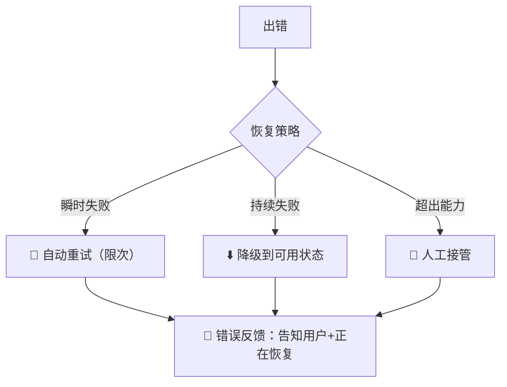

---

title: "错误恢复路径"

tags:

  - agent方法论

  - agent产品化

  - 交互设计

created: "2026-07-21"

---

# 错误恢复路径

> 本条目是「Agent 产品化思维」的第 13 部分，对应学习清单条目 7.4.4。

>

> **前置依赖**：决策可追溯

> **为以下铺垫**：四维乘积模型

---

## 一、核心观点

> **错误恢复路径（Error Recovery Path）**：Agent 出错时不仅要能自动拉回可用状态，还要让用户**看得见**错误、知道正在恢复。看不见的恢复等于没恢复——用户会以为它还在好好干活。

---

## 二、定义与原理
### 2.1 是什么

- **错误恢复**：出错后自动回到可用状态的一整套机制

- **核心**：可见（用户知情）+ 可恢复（系统兜底）

- **作用**：保体验、保可用、防"静默失败（silent failure）"

> **类比——汽车故障灯**：好车不是"永远不坏"，而是坏了仪表盘亮灯、系统尝试自救（限速、切换备用模式），驾驶员清楚发生了什么。最可怕的不是车坏，是车坏了还假装正常把你往沟里带——Agent 的"静默失败"就是这个。

### 2.2 恢复四策略与可见性



---

## 三、实践：四类策略

| 策略 | 做法 | 适用 |

|------|------|------|

| **自动重试** | 出错重试 N 次，仍失败则降级 | 瞬时/偶发错误 |

| **降级恢复** | 回退到缓存 / 基础模板 | 实时取数失败 |

| **人工接管** | 转人工 + 通知 | 超出 Agent 能力 |

| **错误反馈** | 明确告诉用户"错哪了、在恢复" | 所有失败都该有 |

```python

def execute_with_recovery(task, max_retries=3):

    for i in range(max_retries):

        try:

            return execute(task)

        except Exception as e:

            log_error(task, e)

            if i < max_retries - 1:

                continue            # 重试

            return fallback(task)   # 降级

    # 通知用户（错误反馈）

```

---

## 四、示例

**Token 护栏（2026 实践）**：给单次任务设"Agentic Budget"，比如单任务超 **$2.00** 就自动暂停并升级人工——既防无限递归烧钱，又让用户感知到"这活儿 Agent 兜不住了"。这与 [[03-幻觉递归陷阱|递归陷阱]] 里"给循环设硬上限"同源。

---

## 五、优劣势

- ✅ 把"崩溃"变"可感知的可恢复"，信任不崩

- ✅ 和 [[06-降级路径设计|降级路径]]、[[12-决策可追溯|可追溯]] 共用底层能力

- ❌ 重试/降级本身要测，否则恢复路径也会挂

- ❌ 反馈太啰嗦会烦用户，太简略又像没发生

---

## 六、核心要点

- 👁️ **可见 > 静默**：用户必须知道出错了、在恢复，否则"假装正常"最致命。

- 🔁 **四策略**：自动重试（限次）/ 降级恢复 / 人工接管 / 错误反馈。

- 💰 **Token 护栏**：单次任务设成本上限（如 $2），超了暂停升级人工。

- 🔗 **站在前篇肩上**：恢复依赖 [[06-降级路径设计|降级]] 与 [[12-决策可追溯|追溯]]。

---

## 七、最新研究与企业数据

- **硬上限是必选项**：Anthropic 在多 Agent 实践中强调"bound every loop with a step or token budget（用步数或 token 预算约束每个循环）"——无硬限的 retry 会陷入推理死循环，单次任务烧掉 \$10 却只省了 \$0.15 人力。

- **Token 护栏成 2026 标准**：领先团队对单任务设 Agentic Budget，超阈值自动暂停并升级人工，直接切断"无限递归 + token  bleed"这条最烧钱的故障链。

---

## 八、学习资源

- **一手**：Anthropic《How we built our multi-agent research system》(2025)：[anthropic.com/engineering/multi-agent-research-system](https://www.anthropic.com/engineering/multi-agent-research-system)（约束每个循环、token 预算）

- **数据/实践**：The Tech Trends《Why 40% of Agentic Projects Fail》(2026)：[thetechtrends.tech/agentic-ai-project-failure-lessons](https://thetechtrends.tech/agentic-ai-project-failure-lessons)（Token Guardrails / Agentic Budget）

- **延伸**：[[06-降级路径设计|降级路径设计]] · [[12-决策可追溯|决策可追溯]]

---

**下一篇**：[[14-四维乘积模型|四维乘积模型]]——交互设计讲完，下篇讲"产品价值 = 意图清晰度 × 控制可见性 × 摩擦最小化 × 执行可信度"。

---

## 参考来源（一手链接 · 可溯源深挖）

- **Anthropic (2025)**《How we built our multi-agent research system》：[anthropic.com/engineering/multi-agent-research-system](https://www.anthropic.com/engineering/multi-agent-research-system)（bound every loop with step/token budget）

- **The Tech Trends (2026)**《Why 40% of Agentic Projects Fail》：[thetechtrends.tech/agentic-ai-project-failure-lessons](https://thetechtrends.tech/agentic-ai-project-failure-lessons)（Token Guardrails / Agentic Budget 实践）

- **7T Research (2026)** 错误率与治理：[7t.ai/blog/agentic-ai-error-rate-7tt](https://7t.ai/blog/agentic-ai-error-rate-7tt)

## 速记卡（面试闪卡）

**Q1：一句话讲清「错误恢复路径」到底是什么？**

A：错误恢复路径让 Agent 出错时自动拉回可用状态，还要让用户看得见错误、知道在恢复。

**Q2：一、核心观点：可见>静默 —— 怎么理解？**

A：看不见的恢复等于没恢复——用户以为它还在好好干活，实则已跑偏。像车坏不可怕，可怕的是车坏还假装正常把你往沟里带。

**Q3：二、定义：汽车故障灯类比 —— 怎么理解？**

A：好车不是永远不坏，而是坏了仪表盘亮灯、系统自救（限速、切备用模式）。Agent 也该「故障灯亮+尝试恢复」，而非静默失败（silent failure）。

**Q4：三、实践：四类恢复策略 —— 怎么理解？**

A：自动重试（限次）/ 降级恢复（回退缓存或模板）/ 人工接管（超能力时）/ 错误反馈（所有失败都该告诉用户）。像四种应急预案层层兜底。

**Q5：四、示例：Token 护栏 —— 怎么理解？**

A：单任务设 Agentic Budget（如超 $2 自动暂停升级人工），既防无限递归烧钱，又让用户感知「这活 Agent 兜不住了」。硬上限是必选项。

**Q6：核心速记主线有哪些？**

- 核心：可见 + 可恢复，防静默失败

- 类比：汽车故障灯亮+自救

- 四策略：重试/降级/人工/反馈

- 护栏：单任务成本上限，超了升人工

**口诀**

A：出错要可见，

静默最致命；

重试降级人接管，

预算设上限。

## 相关链接

- 系列清单：[[学习路线图/Agent方法论与产品思维学习路线图|Agent 方法论与产品思维学习路线图]]

- 上一层级：[[00-Agent方法论与产品思维|Agent 产品化思维 · 索引]]

- 同主题：[[12-决策可追溯|决策可追溯]] · [[14-四维乘积模型|四维乘积模型]]

