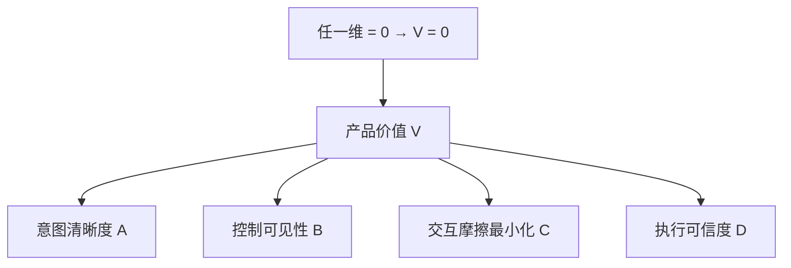

---

title: "四维乘积模型"

tags:

  - agent方法论

  - agent产品化

  - 产品定义

created: "2026-07-21"

---

# 四维乘积模型

> 本条目是「Agent 产品化思维」的第 14 部分，对应学习清单条目 7.5.1。

>

> **前置依赖**：Workflow vs Agent选型、需求翻译、效果度量、交互设计

> **为以下铺垫**：（系列收尾）

---

## 一、核心观点

> **产品价值 = 意图清晰度 × 控制可见性 × 交互摩擦最小化 × 执行可信度。**

> 是**乘积**不是求和——任何一维趋近于 0，整个产品价值塌成 0。四个维度必须均衡发展，长短板木桶装不了水。

---

## 二、定义与原理
### 2.1 四维是什么

| 维度 | 核心问题 | 对应本系列哪篇 |

|------|----------|----------------|

| **意图清晰度 Clarity** | "完成"的定义权在谁？意图能拆解度量吗？ | 四步翻译 |

| **控制可见性 Visibility** | 用户有知情/确认/否决权吗？ | HITL · 可追溯 |

| **交互摩擦最小化 Friction** | Agent 干活还需要人介入多少？ | 错误恢复 |

| **执行可信度 Trust** | 出错了能溯源、能回滚吗？ | 降级 · 权限分级 |

> **类比——四人抬轿**：产品价值是四个人抬的轿子。一个人撒手（维度=0），轿子直接翻，另外三个再强壮也白搭。所以别在一个维度卷到极致，而放任另一维度归零——那叫"在错误的地方努力"。

### 2.2 为什么是乘积

求和模型会让你误以为"三维满分、一维零分 = 75 分"；乘积模型告诉你：**那是 0 分**。这解释了为什么很多 Demo 惊艳、上线即死的 Agent，往往在"可信度"或"意图清晰度"上悄悄归了零。

---

## 三、实践：四维怎么补

- **意图清晰度**：用 [[04-四步翻译|四步翻译]] 把模糊需求变规格；用 Typed Actions 替代自然语言

- **控制可见性**：SSE 流式 + 结构化日志让用户看见进度；关键动作给否决权

- **交互摩擦最小化**：React 前端 + 自然语言交互；能自动绝不打断人

- **执行可信度**：三层防幻觉 + 来源可溯源 + 出错可回滚

---

## 四、示例

两个候选 Agent：

| 维度 | A（能力强但黑盒） | B（均衡） |

|------|-------------------|-----------|

| 意图清晰度 | 0.9 | 0.8 |

| 控制可见性 | 0.2 ⚠️ | 0.8 |

| 交互摩擦 | 0.9 | 0.7 |

| 执行可信度 | 0.3 ⚠️ | 0.8 |

| **乘积** | **0.048** | **0.358** |

→ A 单维很强，但可信度与可见性接近 0，乘积惨败；B 每项都不极致却稳赢。这正是乘积思维的价值。

---

## 五、优劣势

- ✅ 一针见血解释"为什么 Demo 好用上线崩"

- ✅ 给产品定义一个可核查的四维清单

- ❌ 四个权重没给死，需按场景定（但"任一维归零即崩"是硬约束）

- ❌ 维度本身要靠前面各篇的方法落地，不是空话

---

## 六、核心要点

- ✖️ **乘积不是求和**：意图清晰度 × 控制可见性 × 摩擦最小化 × 执行可信度。

- 🪨 **木桶效应**：任一维趋零，整体归零——别在长板死卷。

- 🧩 **四维都有出处**：分别由 [[04-四步翻译|四步翻译]]、[[10-Human-in-the-Loop时机判断|HITL]]、[[13-错误恢复路径|错误恢复]]、[[06-降级路径设计|降级]] 等方法托底。

- 🎯 **均衡 > 极致**：Demo 惊艳上线死，多半是某维偷偷归零。

---

## 七、最新研究与企业数据

- **模型能力不是瓶颈**：Anthropic × Material 调研显示，生产失败的最大障碍是**系统集成（46%）与数据质量（42%）**，模型能力排不进前二——这正对应"执行可信度"与"意图清晰度"两维，而非模型维度。

- **信任是落地头号门槛**：Gartner 预警中"信任（trust）被列为首要障碍"，与四维模型的"执行可信度"维度互相印证——可信度归零，产品价值直接坍塌。

---

## 八、学习资源

- **模型来源**：luweiqing《2026 Agent 落地主范式》（2026）——提出"四维乘积"框架——来源待核实：为二手引述，未检索到作者原始发布 URL，建议以一手文章核实后补链

- **一手支撑**：Anthropic × Material 调研（系统集成/数据质量为首要障碍，见 [[05-失败模式预判|失败模式预判]] 参考来源）

- **回顾**：本系列 01–13 各篇即四维的落地方法

---

**下一篇**：[[../00-Agent方法论与产品思维|系列索引]]——Agent 产品化讲完，进入表达与差异化层。

---

## 参考来源（一手链接 · 可溯源深挖）

- **luweiqing (2026)**《2026 Agent 落地主范式》"四维乘积模型"——来源待核实：仅见二手引述，未检索到作者一手 URL，建议核实后补链

- **Anthropic × Material (2026)** 联合调研（系统集成 46% / 数据质量 42% 为首要障碍）——来源待核实：经二手报道（如 [mcp.csdn.net 汇总](https://mcp.csdn.net/6a2e336710ee7a33f27ccf1f.html)），未检索到官方原始报告 URL

- **Gartner (2025-06)** agentic AI 项目取消预测（信任为首要障碍）——来源待核实：二手报道，见 [agentmarketcap.ai 汇总](https://agentmarketcap.ai/blog/2026/04/07/gartner-40-percent-agentic-ai-failure-rate-enterprise-readiness)

## 相关链接

- 系列清单：[[学习路线图/Agent方法论与产品思维学习路线图|Agent 方法论与产品思维学习路线图]]

- 上一层级：[[00-Agent方法论与产品思维|Agent 产品化思维 · 索引]]

- 同主题：[[04-四步翻译|四步翻译]] · [[10-Human-in-the-Loop时机判断|HITL 时机判断]] · [[13-错误恢复路径|错误恢复路径]]

## 速记卡（面试闪卡）

**Q1：一句话讲清「四维乘积模型」到底是什么？**

A：产品价值 = 意图清晰度 × 控制可见性 × 交互摩擦最小化 × 执行可信度。是乘积不是求和——任何一维趋近 0，整个产品价值塌成 0。四个维度必须均衡发展，长短板木桶装不了水。

**Q2：一、核心观点 —— 怎么理解？**

A：核心公式：产品价值 = 意图清晰度 × 控制可见性 × 交互摩擦最小化 × 执行可信度，是乘积不是求和，任一维趋零整体归零。四人抬轿类比：一个人撒手轿子直接翻，另外三个再强壮也白搭。别在一个维度卷到极致却放任另一维归零——那叫在错误的地方努力。

**Q3：二、定义与原理 —— 怎么理解？**

A：四维各管一件事：意图清晰度（「完成」定义权在谁、意图能拆解度量吗）、控制可见性（用户有知情 / 确认 / 否决权吗）、交互摩擦最小化（Agent 干活还需人介入多少）、执行可信度（出错了能溯源能回滚吗）。求和模型会骗你「三维满分一维零分 = 75 分」，乘积模型告诉你那是 0 分——很多 Demo 惊艳上线即死，往往在可信度或意图清晰度上悄悄归零。

**Q4：三、实践：四维怎么补 —— 怎么理解？**

A：补法：意图清晰度用四步翻译把模糊需求变规格、用 Typed Actions 替代自然语言；控制可见性用 SSE 流式 + 结构化日志让用户看见进度、关键动作给否决权；交互摩擦最小化用 React 前端 + 自然语言、能自动绝不打断人；执行可信度用三层防幻觉 + 来源可溯源 + 出错可回滚。

**Q5：四、示例 —— 怎么理解？**

A：两个候选 Agent：A 能力强但黑盒（意图 0.9 / 可见 0.2⚠ / 摩擦 0.9 / 可信 0.3⚠，乘积 0.048），B 均衡（0.8 / 0.8 / 0.7 / 0.8，乘积 0.358）。A 单维很强但可信度与可见性近零，乘积惨败；B 每项不极致却稳赢——这正是乘积思维的价值。

**Q6：五、优劣势 / 七、最新研究与企业数据 —— 怎么理解？**

A：优势：一针见血解释「为什么 Demo 好用上线崩」，给产品可核查的四维清单。劣势：四权重没给死需按场景定（但任一维归零即崩是硬约束），维度本身靠前面各篇方法落地。Anthropic × Material 调研：生产失败最大障碍是系统集成 (46%) 与数据质量 (42%)，模型能力排不进前二，正对应执行可信度与意图清晰度两维；Gartner 把信任列为首要障碍，与执行可信度互相印证。

**Q7：核心速记主线有哪些？**

A：抓住这几根：一、核心观点（乘积非求和、木桶效应）、二、定义与原理（四维各管什么、求和陷阱）、三、实践（四维怎么补）、四、示例（A 黑盒 vs B 均衡）、五、优劣势与 Anthropic × Material 调研。

**口诀**

A：四维乘积非求和，一维归零全塌方；

意图可见摩擦可信，四轮抬轿才稳当。

别在长板死卷，短板要补强；

Demo 惊艳上线死，定是某维藏零。

