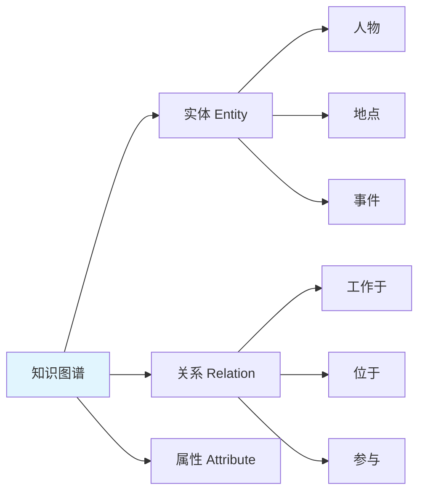
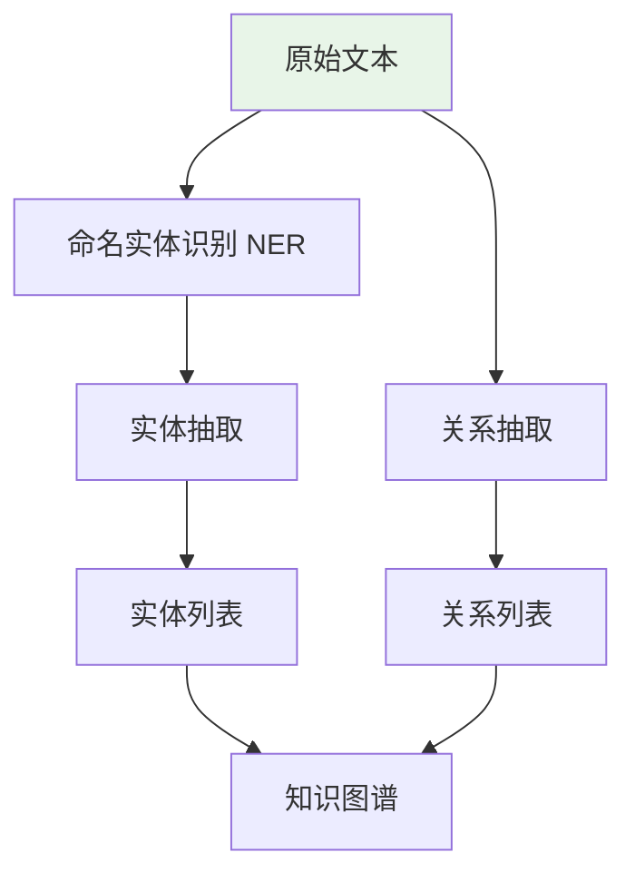
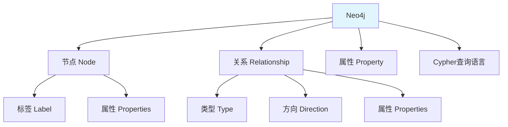
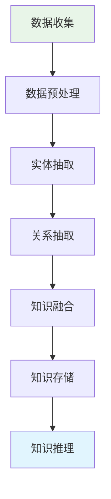

# 知识图谱构建基础：实体-关系抽取 + Neo4j 图数据库

> **一句话**：知识图谱是一种用图结构表示知识和实体之间关系的技术。Neo4j是流行的图数据库，用于存储和查询知识图谱。在AI应用中，知识图谱可以增强RAG的检索能力。

## 1. 知识图谱基础

### 1.1 什么是知识图谱？



**知识图谱**：一种用图结构表示知识的技术，其中节点表示实体，边表示实体之间的关系。

**核心元素**：
- **实体（Entity）**：现实世界中的对象，如人物、地点、组织
- **关系（Relation）**：实体之间的连接，如“工作于”、“位于”
- **属性（Attribute）**：实体或关系的特征，如“姓名”、“创建时间”

### 1.2 知识图谱 vs 传统数据库

| 特性 | 传统关系数据库 | 知识图谱 |
|------|----------------|----------|
| 数据模型 | 表、行、列 | 节点、边、属性 |
| 关系处理 | 外键、JOIN | 直接遍历 |
| 查询语言 | SQL | Cypher、SPARQL |
| 适用场景 | 结构化数据 | 复杂关系数据 |

## 2. 实体-关系抽取

### 2.1 什么是实体-关系抽取？



**实体-关系抽取**：从非结构化文本中自动识别实体和它们之间的关系。

### 2.2 实体类型

| 实体类型 | 说明 | 示例 |
|----------|------|------|
| PERSON | 人物 | 张三、李四 |
| ORG | 组织 | 腾讯、阿里巴巴 |
| LOC | 地点 | 北京、上海 |
| TIME | 时间 | 2026年、今天 |
| EVENT | 事件 | 求职、 |

### 2.3 关系类型

| 关系类型 | 说明 | 示例 |
|----------|------|------|
| WORKS_AT | 工作于 | 张三 工作于 腾讯 |
| LOCATED_IN | 位于 | 北京 位于 中国 |
| PARTICIPATED_IN | 参与 | 张三 参与 求职 |
| CREATED | 创建 | 张三 创建 项目 |

### 2.4 抽取方法

```python
# 使用spaCy进行实体抽取
import spacy

nlp = spacy.load("zh_core_web_sm")

text = "张三是腾讯的工程师，他在北京工作。"
doc = nlp(text)

# 提取实体
for ent in doc.ents:
    print(f"实体: {ent.text}, 类型: {ent.label_}")

# 输出：
# 实体: 张三, 类型: PERSON
# 实体: 腾讯, 类型: ORG
# 实体: 北京, 类型: LOC
```

## 3. Neo4j 图数据库

### 3.1 什么是Neo4j？



**Neo4j**：一种基于图的NoSQL数据库，使用节点、关系和属性来存储数据。

### 3.2 安装和使用

```bash
# Docker安装Neo4j
docker run -d \
  --name neo4j \
  -p 7474:7474 -p 7687:7687 \
  -e NEO4J_AUTH=neo4j/password \
  neo4j:latest

# Python驱动安装
pip install neo4j
```

### 3.3 基础操作

```python
from neo4j import GraphDatabase

# 连接Neo4j
driver = GraphDatabase.driver("bolt://localhost:7687", auth=("neo4j", "password"))

# 创建节点
def create_person(tx, name, age):
    tx.run("CREATE (p:Person {name: $name, age: $age})", name=name, age=age)

# 创建关系
def create_works_at(tx, person_name, company_name):
    tx.run("""
        MATCH (p:Person {name: $person_name})
        MATCH (c:Company {name: $company_name})
        CREATE (p)-[:WORKS_AT]->(c)
    """, person_name=person_name, company_name=company_name)

# 查询
def find_person(tx, name):
    result = tx.run("MATCH (p:Person {name: $name}) RETURN p", name=name)
    return result.single()

# 使用
with driver.session() as session:
    session.write_transaction(create_person, "张三", 30)
    session.write_transaction(create_person, "腾讯", 25)
    session.write_transaction(create_works_at, "张三", "腾讯")
```

## 4. Cypher查询语言

### 4.1 基础语法

```cypher
// 创建节点
CREATE (p:Person {name: "张三", age: 30})

// 创建关系
MATCH (p:Person {name: "张三"})
MATCH (c:Company {name: "腾讯"})
CREATE (p)-[:WORKS_AT]->(c)

// 查询
MATCH (p:Person)-[:WORKS_AT]->(c:Company)
WHERE p.name = "张三"
RETURN c.name

// 更新
MATCH (p:Person {name: "张三"})
SET p.age = 31

// 删除
MATCH (p:Person {name: "张三"})
DETACH DELETE p
```

### 4.2 高级查询

```cypher
// 路径查询：找到张三到李四的所有路径
MATCH path = shortestPath(
    (a:Person {name: "张三"})-[*]-(b:Person {name: "李四"})
)
RETURN path

// 聚合查询：统计每个公司的员工数
MATCH (p:Person)-[:WORKS_AT]->(c:Company)
RETURN c.name, COUNT(p) AS employee_count

// 模式匹配：找到在腾讯工作且年龄大于25的人
MATCH (p:Person)-[:WORKS_AT]->(c:Company {name: "腾讯"})
WHERE p.age > 25
RETURN p.name, p.age
```

## 5. 知识图谱构建流程

### 5.1 构建步骤



### 5.2 Python实现

```python
import spacy
from neo4j import GraphDatabase

# 1. 实体抽取
def extract_entities(text):
    nlp = spacy.load("zh_core_web_sm")
    doc = nlp(text)
    entities = []
    for ent in doc.ents:
        entities.append({
            "text": ent.text,
            "label": ent.label_,
            "start": ent.start_char,
            "end": ent.end_char
        })
    return entities

# 2. 关系抽取（简化版）
def extract_relations(text, entities):
    # 这里使用简单的规则匹配
    relations = []
    for i, ent1 in enumerate(entities):
        for j, ent2 in enumerate(entities):
            if i != j:
                # 简单规则：如果两个实体在句子中相邻，可能是关系
                if abs(ent1["start"] - ent2["start"]) < 20:
                    relations.append({
                        "subject": ent1["text"],
                        "object": ent2["text"],
                        "predicate": "RELATED_TO"
                    })
    return relations

# 3. 存储到Neo4j
def store_to_neo4j(entities, relations):
    driver = GraphDatabase.driver("bolt://localhost:7687", auth=("neo4j", "password"))
    
    with driver.session() as session:
        # 创建实体节点
        for entity in entities:
            session.run(
                "CREATE (n:Entity {name: $name, type: $type})",
                name=entity["text"],
                type=entity["label"]
            )
        
        # 创建关系
        for relation in relations:
            session.run("""
                MATCH (a:Entity {name: $subject})
                MATCH (b:Entity {name: $object})
                CREATE (a)-[:RELATED_TO]->(b)
            """, subject=relation["subject"], object=relation["object"])
```

## 6. 在AI应用中的使用

### 6.1 知识图谱增强RAG

```python
from langchain.graphs import Neo4jGraph
from langchain.chains import GraphCypherQAChain

# 连接知识图谱
graph = Neo4jGraph(
    url="bolt://localhost:7687",
    username="neo4j",
    password="password"
)

# 创建查询链
chain = GraphCypherQAChain.from_llm(
    llm=llm,
    graph=graph,
    verbose=True
)

# 查询
result = chain.invoke({"query": "张三在哪个公司工作？"})
print(result)
```

### 6.2 向量+图谱混合检索

```python
from langchain.vectorstores import Chroma
from langchain.embeddings import OpenAIEmbeddings

# 向量检索
vectorstore = Chroma(embedding_function=OpenAIEmbeddings())

# 图谱检索
graph_chain = GraphCypherQAChain.from_llm(llm, graph)

def hybrid_retrieve(query):
    # 1. 向量检索
    vector_results = vectorstore.similarity_search(query, k=3)
    
    # 2. 图谱检索
    graph_results = graph_chain.invoke({"query": query})
    
    # 3. 融合结果
    combined = []
    combined.extend(vector_results)
    combined.extend([graph_results])
    
    return combined
```

## 7. 常见坑点

### 1. 实体抽取准确性
```python
# 问题：NER模型可能识别错误
# 解决：使用领域特定模型或规则匹配
# 示例：医疗领域使用医疗NER模型
```

### 2. 关系抽取复杂性
```python
# 问题：复杂关系难以自动抽取
# 解决：结合规则和机器学习
# 示例：使用预训练关系抽取模型
```

### 3. 知识图谱维护
```python
# 问题：知识图谱需要持续更新
# 解决：建立增量更新机制
# 示例：定期从新数据中抽取实体和关系
```

## 核心要点

```python
# 知识图谱核心元素
实体 Entity → 节点
关系 Relation → 边
属性 Attribute → 节点/边的属性

# Neo4j基础
创建节点：CREATE (n:Label {prop: value})
创建关系：MATCH (a), (b) CREATE (a)-[:TYPE]->(b)
查询：MATCH (n)-[:TYPE]->(m) RETURN n, m

# 构建流程
数据收集 → 实体抽取 → 关系抽取 → 知识存储
```

## 速记卡（面试闪卡）

**Q1：一句话讲清「知识图谱构建基础：实体-关系抽取 + Neo4j 图数据库」到底是什么？**
A：**知识图谱**：一种用图结构表示知识的技术，其中节点表示实体，边表示实体之间的关系。
**核心元素**：
**实体（Entity）**：现实世界中的对象，如人物、地点、组织
**关系（Relation）**：实体之间的连接，如“工作于”、“位于”
**属性（Attribute）**：实体或关系的特征，如“姓名”、“创建时间”
| 特性 | 传统关系数据库 | 知识图谱 |

**Q2：1. 知识图谱基础 —— 怎么理解？**
A：**知识图谱**：一种用图结构表示知识的技术，其中节点表示实体，边表示实体之间的关系。
**核心元素**：
**实体（Entity）**：现实世界中的对象，如人物、地点、组织
**关系（Relation）**：实体之间的连接，如“工作于”、“位于”
**属性（Attribute）**：实体或关系的特征，如“姓名”、“创建时间”
| 特性 | 传统关系数据库 | 知识图谱 |

**Q3：2. 实体-关系抽取 —— 怎么理解？**
A：**实体-关系抽取**：从非结构化文本中自动识别实体和它们之间的关系。
| 实体类型 | 说明 | 示例 |
|----------|------|------|
| PERSON | 人物 | 张三、李四 |
| ORG | 组织 | 腾讯、阿里巴巴 |
| LOC | 地点 | 北京、上海 |
| TIME | 时间 | 2026年、今天 |
| EVENT | 事件 | 求职、 |
| 关系类型 | 说明 | 示例 |

**Q4：3. Neo4j 图数据库 —— 怎么理解？**
A：**Neo4j**：一种基于图的NoSQL数据库，使用节点、关系和属性来存储数据。

**Q5：核心速记主线有哪些？**
A：抓住这几根：1. 知识图谱基础、2. 实体-关系抽取、3. Neo4j 图数据库、4. Cypher查询语言、5. 知识图谱构建流程、6. 在AI应用中的使用。


## 相关链接

- 📋 目录：[[00-GraphRAG]]
- 📚 学习清单：[[技术学习清单#GraphRAG 入门]]
- 🔗 [[02-图谱增强检索|图谱增强检索]]
- 🔗 [[AI与Agent/知识/实战/06-RAG检索增强生成流程|RAG检索增强生成]]
- 项目实践：[[项目实战/ai-resume笔记/01_技术研读/01_架构概览|ai-resume: 架构概览]]
