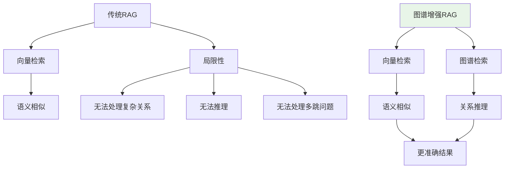
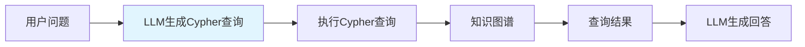
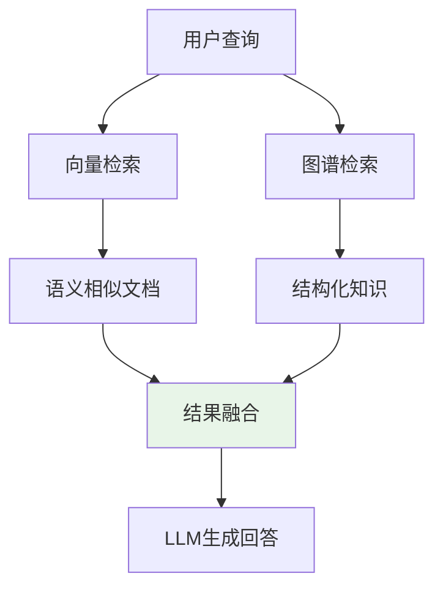

---

title: "图谱增强检索：LangChain GraphCypherQAChain + 向量+图谱混合检索"

tags:

  - graphrag

  - 技术学习

  - 学习笔记

created: "2026-07-21"

---

# 图谱增强检索：LangChain GraphCypherQAChain + 向量+图谱混合检索

> **一句话**：图谱增强检索是利用知识图谱来增强RAG的检索能力，通过结合向量检索和图谱检索，提供更准确、更全面的检索结果。

## 1. 图谱增强检索基础
### 1.1 为什么需要图谱增强？



**传统RAG的局限性**：

1. **无法处理复杂关系**：如“张三的老板是谁”

2. **无法推理**：如“张三和李四是什么关系”

3. **无法处理多跳问题**：如“张三的同事的老板是谁”

### 1.2 图谱增强的优势

| 优势 | 说明 | 示例 |

|------|------|------|

| 关系推理 | 可以处理实体间的关系 | 张三→工作于→腾讯 |

| 多跳查询 | 可以处理多跳关系 | 张三→同事→老板 |

| 结构化查询 | 可以执行精确查询 | 查询所有在腾讯工作的人 |

## 2. LangChain GraphCypherQAChain
### 2.1 什么是GraphCypherQAChain？



**GraphCypherQAChain**：LangChain提供的链，用于将自然语言问题转换为Cypher查询，然后在知识图谱上执行查询。

### 2.2 基础用法

```python

from langchain.graphs import Neo4jGraph

from langchain.chains import GraphCypherQAChain

from langchain.llms import OpenAI

# 连接知识图谱

graph = Neo4jGraph(

    url="bolt://localhost:7687",

    username="neo4j",

    password="password"

)

# 创建LLM

llm = OpenAI(temperature=0)

# 创建链

chain = GraphCypherQAChain.from_llm(

    llm=llm,

    graph=graph,

    verbose=True

)

# 查询

result = chain.invoke({"query": "张三在哪个公司工作？"})

print(result)

```

### 2.3 查询示例

```python

# 示例1：简单查询

result = chain.invoke({"query": "哪些人在腾讯工作？"})

# 示例2：多跳查询

result = chain.invoke({"query": "张三的同事有哪些？"})

# 示例3：聚合查询

result = chain.invoke({"query": "每个公司有多少员工？"})

```

## 3. 向量+图谱混合检索
### 3.1 混合检索架构



### 3.2 实现方案

```python

from langchain.vectorstores import Chroma

from langchain.embeddings import OpenAIEmbeddings

from langchain.graphs import Neo4jGraph

from langchain.chains import GraphCypherQAChain

from langchain.llms import OpenAI

# 向量检索

vectorstore = Chroma(embedding_function=OpenAIEmbeddings())

# 图谱检索

graph = Neo4jGraph(

    url="bolt://localhost:7687",

    username="neo4j",

    password="password"

)

graph_chain = GraphCypherQAChain.from_llm(OpenAI(temperature=0), graph)

class HybridRetriever:

    def __init__(self, vectorstore, graph_chain):

        self.vectorstore = vectorstore

        self.graph_chain = graph_chain

    def retrieve(self, query, k=3):

        # 1. 向量检索

        vector_results = self.vectorstore.similarity_search(query, k=k)

        # 2. 图谱检索

        graph_results = self.graph_chain.invoke({"query": query})

        # 3. 融合结果

        combined = []

        # 向量结果

        for doc in vector_results:

            combined.append({

                "content": doc.page_content,

                "source": "vector",

                "score": doc.metadata.get("score", 0)

            })

        # 图谱结果

        if graph_results.get("result"):

            combined.append({

                "content": graph_results["result"],

                "source": "graph",

                "score": 1.0  # 图谱结果权重较高

            })

        return combined

# 使用

retriever = HybridRetriever(vectorstore, graph_chain)

results = retriever.retrieve("张三在哪个公司工作？")

```

## 4. 高级特性
### 4.1 查询路由

```python

from langchain.chains import SequentialChain

# 查询路由：根据问题类型选择检索方式

def route_query(query):

    # 简单规则判断

    if "关系" in query or "谁" in query or "哪些" in query:

        return "graph"  # 图谱检索

    else:

        return "vector"  # 向量检索

# 使用路由

def hybrid_retrieve_with_routing(query):

    route = route_query(query)

    if route == "graph":

        return graph_chain.invoke({"query": query})

    else:

        return vectorstore.similarity_search(query, k=3)

```

### 4.2 结果重排

```python

def rerank_results(results, query):

    """重排检索结果"""

    # 使用LLM重排

    prompt = f"""

    根据查询"{query}"，对以下结果进行重排，按相关性从高到低排序：

    {results}

    返回重排后的结果：

    """

    reranked = llm.predict(prompt)

    return reranked

```

### 4.3 缓存优化

```python

from langchain.cache import SQLiteCache

# 设置缓存

import langchain

langchain.llm_cache = SQLiteCache(database_path=".langchain.db")

# 现在查询会自动缓存

result = chain.invoke({"query": "张三在哪个公司工作？"})

```

## 5. 实际应用案例
### 5.1 企业知识图谱问答

```python

# 4. "Python技能在哪些项目中使用？"

class EnterpriseKGQA:

    def __init__(self, graph):

        self.graph = graph

        self.chain = GraphCypherQAChain.from_llm(

            llm=OpenAI(temperature=0),

            graph=graph,

            verbose=True

        )

    def query(self, question):

        # 添加企业特定提示

        prompt = f"""

        你是企业知识图谱问答助手。

        问题：{question}

        请生成Cypher查询来回答这个问题。

        """

        return self.chain.invoke({"query": prompt})

```

### 5.2 电商产品推荐

```python

# 3. "苹果品牌的高端产品有哪些？"

class EcommerceKGQA:

    def __init__(self, graph):

        self.graph = graph

        self.chain = GraphCypherQAChain.from_llm(

            llm=OpenAI(temperature=0),

            graph=graph,

            verbose=True

        )

    def recommend(self, product_id):

        # 基于知识图谱的推荐

        query = f"""

        找到与产品ID {product_id} 相似的产品，

        考虑类别、品牌、用户购买记录等因素。

        """

        return self.chain.invoke({"query": query})

```

## 6. 性能优化
### 6.1 索引优化

```cypher

// 为常用查询创建索引

CREATE INDEX FOR (p:Person) ON (p.name)

CREATE INDEX FOR (c:Company) ON (c.name)

CREATE INDEX FOR (p:Person) ON (p.age)

// 创建全文索引

CREATE FULLTEXT INDEX personName FOR (p:Person) ON EACH [p.name]

```

### 6.2 查询优化

```python

# 优化1：限制返回结果数量

query = "MATCH (p:Person)-[:WORKS_AT]->(c:Company) RETURN p.name, c.name LIMIT 10"

# 优化2：使用参数化查询

query = """

MATCH (p:Person {name: $name})-[:WORKS_AT]->(c:Company)

RETURN c.name

"""

params = {"name": "张三"}

# 优化3：避免全图扫描

query = """

MATCH (p:Person)

WHERE p.name = $name

MATCH (p)-[:WORKS_AT]->(c:Company)

RETURN c.name

"""

```

## 7. 常见坑点
### 1. Cypher查询生成错误

```python

# 解决：添加查询验证和错误处理

def safe_query(chain, question):

    try:

        result = chain.invoke({"query": question})

        return result

    except Exception as e:

        # 回退到向量检索

        return vectorstore.similarity_search(question, k=3)

```

### 2. 知识图谱不完整

```python

# 解决：结合向量检索补充

def hybrid_retrieve_with_fallback(query):

    # 先尝试图谱检索

    graph_result = graph_chain.invoke({"query": query})

    if not graph_result.get("result"):

        # 图谱没有结果，使用向量检索

        return vectorstore.similarity_search(query, k=3)

    return graph_result

```

### 3. 性能问题

```python

# 3. 使用缓存

```

## 核心要点

```python

# GraphCypherQAChain基础

from langchain.chains import GraphCypherQAChain

chain = GraphCypherQAChain.from_llm(llm, graph)

# 混合检索

向量检索 + 图谱检索 → 结果融合 → LLM生成回答

# 查询路由

根据问题类型选择检索方式：

- 关系/谁/哪些 → 图谱检索

- 其他 → 向量检索

```

## 速记卡（面试闪卡）

**Q1：一句话讲清「图谱增强检索：LangChain GraphCypherQAChain + 向量+图谱混合检索」到底是什么？**

A：图谱增强检索 = 向量检索 + 知识图谱检索混合，补传统 RAG 不会的关系推理与多跳。

**Q2：一、为什么需要图谱增强 —— 怎么理解？**

A：传统 RAG 像只翻词典，查"张三的老板是谁"这类关系问题就懵。知识图谱像一张人物关系网，能顺藤摸瓜做多跳推理（multi-hop reasoning）。图谱增强 = 给 RAG 配个懂关系的导游。

**Q3：二、LangChain GraphCypherQAChain —— 怎么理解？**

A：这条链把自然语言问题变成 Cypher 查询，丢到 Neo4j 知识图谱上执行，再把结果交 LLM 生成回答。像把中文问句翻译成语法严谨的数据库查询指令，专治结构化关系问题。

**Q4：三、向量+图谱混合检索 —— 怎么理解？**

A：两条路并行：向量检索找语义相似的文档，图谱检索找结构化关系，结果融合（fusion）后给 LLM。像查资料时既翻书（向量）又问知情人（图谱），两条线索交叉验证更准。

**Q5：四、高级特性与坑点 —— 怎么理解？**

A：查询路由（route）按问题类型选检索方式：问关系/谁/哪些走图谱，其他走向量。坑：LLM 生成的 Cypher 可能写错，需加验证；图谱不全时回退（fallback）到向量检索兜底。

**Q6：核心速记主线有哪些？**

- 传统 RAG 短板：关系/推理/多跳

- GraphCypherQAChain：NL→Cypher→图谱

- 混合检索：向量 + 图谱，结果融合

- 路由分流；Cypher 出错需验证与回退

**口诀**

A：向量图谱两相融，关系推理不再懵；

NL 转 Cypher 查图谱，混合检索更从容。

路由按题选路径，出错回退莫硬冲；

多跳问题一拉通，答案靠谱不落空。

## 相关链接

- 📋 目录：[[00-GraphRAG]]

- 📚 学习清单：[[技术学习路线图#GraphRAG 入门]]

- 🔗 [[01-知识图谱构建基础|知识图谱构建基础]]

- 🔗 [[AI与Agent/知识/实战/06-RAG检索增强生成流程|RAG检索增强生成]]

- 🔗 [[AI与Agent/知识/实战/04-Embedding向量化原理+语义搜索场景|Embedding向量化]]

