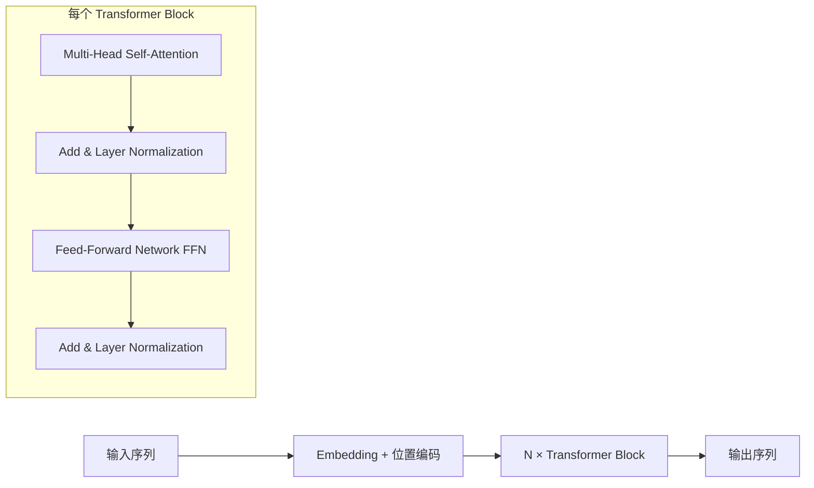

# 自注意力机制与 Transformer 基础

> **生活化类比**：Transformer 像一场"全员研讨会"——每个词（token）都能同时抬头看会场里所有其他词，并决定该听谁、该借鉴谁的观点，而不是像 RNN 那样只能挨个传话。

Transformer 是现代大语言模型的基石架构，由 Vaswani 等人在 2017 年论文 "Attention Is All You Need" 中提出。理解 Transformer 的注意力机制是 AI 岗位的**必考题**。

## 整体架构概览

Transformer 采用 **编码器-解码器（Encoder-Decoder）** 结构，核心是自注意力机制（Self-Attention）。BERT 只用 Encoder，GPT 只用 Decoder，T5 两者都用。



## Self-Attention 自注意力机制

Self-Attention 的核心思想：**让序列中的每个位置都能"关注"到其他所有位置**，从而捕获全局依赖关系。

### Q / K / V 三元组

| 符号 | 全称 | 直觉理解 | 计算方式 |
| ------ | ------ | ---------- | ---------- |
| Q (Query) | 查询向量 | "我在找什么信息？" | X · W_Q |
| K (Key) | 键向量 | "我能提供什么信息的索引？" | X · W_K |
| V (Value) | 值向量 | "我实际携带的信息内容" | X · W_V |

其中 X 是输入矩阵，W_Q、W_K、W_V 是可学习的参数矩阵。

### Attention 计算公式

```text
Attention(Q, K, V) = softmax(QK^T / √d_k) × V
```

**分步拆解：**

1. **QK^T**：计算查询与所有键的点积，得到注意力分数矩阵
2. **除以 √d_k**：防止点积值过大导致 softmax 梯度消失（缩放操作）
3. **softmax**：将分数归一化为概率分布（每行和为 1）
4. **乘以 V**：用注意力权重对值向量加权求和

### 直觉类比——图书馆查资料

- **Q** = 你脑子里的问题（"我想找关于注意力机制的论文"）
- **K** = 每本书脊上的标签（标记了这本书讲什么）
- **V** = 书的实际内容
- **Attention 过程** = 用你的问题去匹配所有书的标签，找到最相关的几本，然后综合阅读它们的内容

### 为什么除以 √d_k？

> **常见追问**：为什么要除以 √d_k？

当 d_k 较大时，QK^T 的方差会随 d_k 线性增长。假设 Q 和 K 的每个元素独立服从均值为 0、方差为 1 的分布，那么点积的方差为 d_k。过大的数值会导致 softmax 进入饱和区，梯度趋近于零，训练困难。除以 √d_k 使得方差回到 1 附近。

## Layer Normalization

Layer Norm 对每个样本在特征维度上做归一化，稳定训练过程。

### 与 Batch Norm 的区别

| 特性 | Layer Norm | Batch Norm |
| ------ | ----------- | ------------ |
| 归一化维度 | 特征维度（跨 hidden_size） | batch 维度 |
| 是否依赖 batch | 否 | 是 |
| 适用场景 | NLP / 序列模型 | CV / CNN |
| 推理一致性 | 训练和推理一致 | 需要 running mean/var |

### Pre-Norm vs Post-Norm

| 方案 | 公式 | 特点 |
| ------ | ------ | ------ |
| Post-Norm（原始） | x + LayerNorm(SubLayer(x)) | 训练不稳定，需要 warmup |
| Pre-Norm（现代主流） | x + SubLayer(LayerNorm(x)) | 训练更稳定，梯度流更好 |

Pre-Norm 使得残差路径上没有归一化操作，梯度可以无损地从深层传回浅层。

## Feed-Forward Network (FFN)

每个 Transformer Block 中的 FFN 是一个两层全连接网络：

```text
FFN(x) = W2 · activation(W1 · x + b1) + b2
```

- W1 的维度：d_model → 4 × d_model（升维）
- W2 的维度：4 × d_model → d_model（降维）

**现代变体：**

| 激活/变体 | 代表模型 | 特点 |
| ----------- | --------- | ------ |
| ReLU | 原始 Transformer | 简单但有死神经元问题 |
| GELU | BERT, GPT-2 | 平滑近似，效果更好 |
| SwiGLU | LLaMA, PaLM | 门控机制，效果最佳 |

SwiGLU 的公式：`SwiGLU(x) = (xW1 ⊙ SiLU(xW_gate)) W2`，其中 ⊙ 是逐元素乘法。

## 残差连接 (Residual Connection)

```text
output = x + SubLayer(x)
```

**作用：**
- 缓解深层网络的梯度消失问题
- 使得网络可以训练到很深（GPT-3 有 96 层）
- 每一层只需学习"增量"，而非完整映射

---

> ▶ 对应实操：[[03-多模型后端抽象|03-多模型后端抽象]]


## 速记卡（面试闪卡）

**Q1：一句话讲清「自注意力机制与 Transformer 基础」到底是什么？**
A：Transformer 靠自注意力让每个词同时关注全场，并行捕捉长程依赖。

**Q2：一、整体架构：Encoder-Decoder 与三大经典变体 —— 怎么理解？**
A：像一家"翻译工厂"：BERT 只占左车间（Encoder），GPT 只占右车间（Decoder），T5 两头都用——核心都是中间那台自注意力机器。英文：Encoder-Decoder。

**Q3：二、Q/K/V 三元组：注意力的三件套 —— 怎么理解？**
A：像图书馆找书：Q 是你脑子里的疑问，K 是每本书脊上的标签，V 是书的实际内容；用疑问匹配标签、再综合内容，就得到想要的"注意力"。英文：Query / Key / Value。

**Q4：三、缩放点积：为什么要除以 √d_k —— 怎么理解？**
A：像把过大的音量旋钮拧小：d_k 越大点积方差越大会让 softmax 进入饱和区、梯度消失；除以 √d_k 把方差拉回 1 附近，训练才稳。英文：Scaled Dot-Product Attention。

**Q5：四、Layer Norm 与 Pre-Norm：让百层网络训得动 —— 怎么理解？**
A：像给每层单独"称重归一"：Layer Norm 在特征维做归一、不依赖 batch 大小；Pre-Norm 把归一放到子层之前，残差路径畅通、梯度无损回流。英文：Layer Normalization。

**Q6：核心速记主线有哪些？**
- 核心公式：Attention(Q,K,V) = softmax(QKᵀ/√d_k)·V
- 三件套：Q 找信息、K 索引进、V 装内容
- 模块链：MHA → Add&Norm → FFN → Add&Norm
- 稳训关键：Pre-Norm + 残差连接，深层可堆叠

**口诀**
A：自注意力全员看全场，
QKV 三件配成行；
缩放根号防饱和，
Pre-Norm 残差更稳当。

相关链接
- [[八股文学习路线图]]
- [[00-全局导航|全局导航]]

---

## 快速问答

| 问题 | 参考答案 |
| ------ | --------- |
| Self-Attention 和 Cross-Attention 的区别？ | Self-Attention 的 Q/K/V 来自同一序列；Cross-Attention 的 Q 来自 Decoder，K/V 来自 Encoder |
| Transformer 相比 RNN/LSTM 的优势？ | ① 并行计算（RNN 需要逐步处理）② 长距离依赖（Attention 直接建立任意距离连接）③ 可扩展性好 |
| Pre-Norm 为什么比 Post-Norm 更好？ | Pre-Norm 使得残差路径上没有归一化操作，梯度可以无损地从深层传回浅层，训练更稳定 |
| Transformer 的参数量如何估算？ | 参数主要在 Embedding 和 FFN 中。FFN 占约 2/3：W1(768×3072) + W2(3072×768) × 层数；Attention 占约 1/3：4×(768×64)×12 × 层数 |
## 相关链接

- [[笔记/AI与Agent/知识/八股/06-MHA-MQA-GQA多头注意力变体|MHA-MQA-GQA多头注意力变体]]
- [[笔记/AI与Agent/知识/八股/44-Agent间通信机制|Agent间通信机制-共享上下文vs消息转发]]
- [[笔记/AI与Agent/知识/八股/42-记忆污染与纠错机制|记忆污染与纠错机制]]
- [[笔记/AI与Agent/知识/八股/05-Encoder-Only-vs-Decoder-Only架构对比|Encoder-Only-vs-Decoder-Only架构对比]]
- [[笔记/AI与Agent/知识/八股/57-自研Harness与框架选型|自研Harness与框架选型]]
