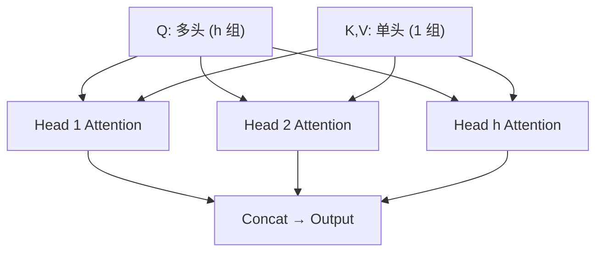
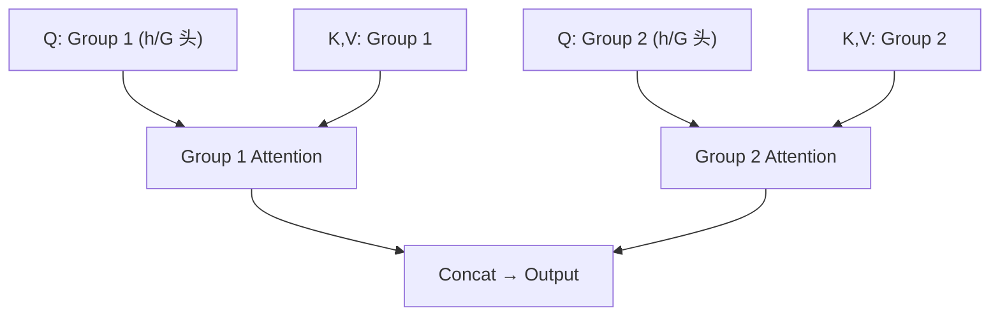

# MHA / MQA / GQA 多头注意力变体

> 单个注意力头只能捕获一种"关注模式"。多头注意力让模型**同时从不同角度**关注信息——这是 Transformer 表达能力强的关键。

## Multi-Head Attention (MHA)

### 核心思想

多头注意力将 Q/K/V 投影到多个子空间，每个子空间独立计算注意力：

| 头编号 | 可能捕获的关系 |
| -------- | --------------- |
| Head 1 | 语法依赖（主谓关系） |
| Head 2 | 指代消解（"它"指代谁） |
| Head 3 | 语义相似性（同义词匹配） |
| Head 4 | 位置局部性（相邻词的关系） |

**计算方式：**

```text
MultiHead(Q, K, V) = Concat(head_1, ..., head_h) · W_O

其中 head_i = Attention(Q·W_Qi, K·W_Ki, V·W_Vi)
```

典型配置：d_model = 768，h = 12 头，每头维度 d_k = 64。

### MHA 的问题

每个注意力头都有独立的 Q/K/V 投影矩阵，**KV 缓存随头数线性增长**：

```text
KV Cache 大小 = 2 × n_layers × n_heads × seq_len × d_head
```

对于长序列和大模型，KV 缓存可能占用数 GB 显存。

## Multi-Query Attention (MQA)

**核心思想**：所有注意力头**共享同一组 K 和 V**，只有 Q 保持多头。



### MQA 的优势

| 指标 | MHA | MQA |
| ------ | ----- | ----- |
| KV Cache 大小 | 2 × h × d_head | 2 × 1 × d_head |
| 显存节省 | 基准 | **h 倍压缩** |
| 推理速度 | 基准 | **显著提升**（减少内存带宽） |
| 模型质量 | 基准 | 略有下降 |

### 代表模型

PaLM、Falcon、StarCoder 等。

## Grouped-Query Attention (GQA)

**核心思想**：MHA 和 MQA 的折中——将 Q 头分成 G 组，每组共享一组 K/V。



### GQA 的优势

| 指标 | MHA | MQA | GQA |
| ------ | ----- | ----- | ----- |
| KV 头数 | h | 1 | G |
| KV Cache | 2 × h × d | 2 × 1 × d | 2 × G × d |
| 模型质量 | 基准 | 略降 | **接近 MHA** |
| 推理速度 | 基准 | 最快 | 快 |

### 代表模型

LLaMA-2 70B、LLaMA-3、Mistral、Qwen 等。

## 三者对比

| 特性 | MHA | MQA | GQA |
| ------ | ----- | ----- | ----- |
| KV 共享 | 无 | 所有头共享 | 分组共享 |
| KV Cache | 最大 | 最小 | 中间 |
| 模型质量 | 最好 | 略降 | 接近 MHA |
| 推理速度 | 最慢 | 最快 | 快 |
| 适用场景 | 训练时 | 推理优化 | **生产主流** |

> **常见题**：MQA 和 GQA 的区别？答：MQA 是所有头共享一组 KV，KV Cache 压缩 h 倍但质量略降；GQA 是分 G 组共享 KV，是 MHA 和 MQA 的折中，兼顾质量和效率。LLaMA-2 70B、LLaMA-3 均采用 GQA。

---

## 
> ▶ 对应实操：[[06-RAG检索增强生成流程|06-RAG检索增强生成流程]]


> ▶ 对应实操：[[02-LLM本质-API调用封装|02-LLM本质-API调用封装]]

相关链接
- [[八股文学习清单]]
- [[00-全局导航|全局导航]]

---

## 快速问答

| 问题 | 参考答案 |
| ------ | --------- |
| 为什么 Transformer 用 Multi-Head 而不是单头？ | 多头允许模型同时关注不同子空间的信息（语法、语义、位置等），表达能力更强 |
| MQA 的核心思想？ | 所有注意力头共享同一组 K 和 V，只有 Q 保持多头。KV Cache 压缩 h 倍，推理速度显著提升 |
| GQA 相比 MQA 的改进？ | GQA 将 Q 头分成 G 组，每组共享一组 KV。是 MHA 和 MQA 的折中，兼顾模型质量和推理效率 |
| 为什么 LLaMA 选择 GQA？ | GQA 在保持接近 MHA 模型质量的同时，显著减少 KV Cache 和提升推理速度，是生产环境的最佳选择 |

## 速记卡（面试闪卡）

**Q1：一句话讲清「MHA / MQA / GQA 多头注意力变体」到底是什么？**
A：多头注意力将 Q/K/V 投影到多个子空间，每个子空间独立计算注意力：
| 头编号 | 可能捕获的关系 |
| -------- | --------------- |
| Head 1 | 语法依赖（主谓关系） |
| Head 2 | 指代消解（"它"指代谁） |
| Head 3 | 语义相似性（同义词匹配） |
| Head 4 | 位置局部性（相邻词的关系） |
**计算方式：**

**Q2：Multi-Head Attention (MHA) —— 怎么理解？**
A：多头注意力将 Q/K/V 投影到多个子空间，每个子空间独立计算注意力：
| 头编号 | 可能捕获的关系 |
| -------- | --------------- |
| Head 1 | 语法依赖（主谓关系） |
| Head 2 | 指代消解（"它"指代谁） |
| Head 3 | 语义相似性（同义词匹配） |
| Head 4 | 位置局部性（相邻词的关系） |
**计算方式：**

**Q3：Multi-Query Attention (MQA) —— 怎么理解？**
A：**核心思想**：所有注意力头**共享同一组 K 和 V**，只有 Q 保持多头。
| 指标 | MHA | MQA |
| ------ | ----- | ----- |
| KV Cache 大小 | 2 × h × d_head | 2 × 1 × d_head |
| 显存节省 | 基准 | **h 倍压缩** |
| 推理速度 | 基准 | **显著提升**（减少内存带宽） |
| 模型质量 | 基准 | 略有下降 |

**Q4：Grouped-Query Attention (GQA) —— 怎么理解？**
A：**核心思想**：MHA 和 MQA 的折中——将 Q 头分成 G 组，每组共享一组 K/V。
| 指标 | MHA | MQA | GQA |
| ------ | ----- | ----- | ----- |
| KV 头数 | h | 1 | G |
| KV Cache | 2 × h × d | 2 × 1 × d | 2 × G × d |
| 模型质量 | 基准 | 略降 | **接近 MHA** |

**Q5：三者对比 —— 怎么理解？**
A：| 特性 | MHA | MQA | GQA |
| ------ | ----- | ----- | ----- |
| KV 共享 | 无 | 所有头共享 | 分组共享 |
| KV Cache | 最大 | 最小 | 中间 |
| 模型质量 | 最好 | 略降 | 接近 MHA |
| 推理速度 | 最慢 | 最快 | 快 |
| 适用场景 | 训练时 | 推理优化 | **生产主流** |

**Q6：核心速记主线有哪些？**
A：抓住这几根：Multi-Head Attention (MHA)、Multi-Query Attention (MQA)、Grouped-Query Attention (GQA)、三者对比、、快速问答。

