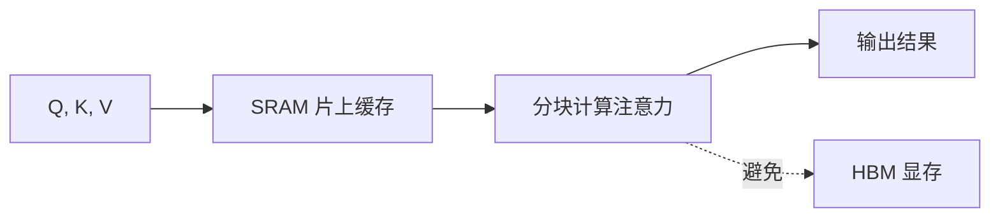

# KV Cache 原理与推理优化

> 在自回归生成时，每生成一个新 token 都需要重新计算所有位置的 K 和 V——这太浪费了。KV Cache 把已算过的 K/V 缓存起来，避免重复计算。

## KV Cache 原理

### 问题：重复计算

在自回归生成中，生成第 t 个 token 时需要计算 1~t 所有位置的注意力。如果不缓存，每步都要重新计算所有位置的 K 和 V：

```text
生成 token 1: 计算 K1, V1
生成 token 2: 计算 K1, V1, K2, V2  ← 重复计算 K1, V1
生成 token 3: 计算 K1, V1, K2, V2, K3, V3  ← 重复计算 K1, V1, K2, V2
```

### 解决方案：KV Cache

将已计算的 K/V 缓存起来，每步只计算新 token 的 Q/K/V：

```text
生成 token 1: 计算并缓存 K1, V1
生成 token 2: 缓存追加 K2, V2，只计算 Q2
生成 token 3: 缓存追加 K3, V3，只计算 Q3
```

### 计算量对比

| 阶段 | 计算量 |
| ------ | -------- |
| 无 KV Cache | O(n² × d)，每步都重新计算 |
| 有 KV Cache | O(n × d)，只需计算新 token 的 Q/K/V |

### KV Cache 的显存占用

```text
KV Cache 大小 = 2 × n_layers × n_heads × seq_len × d_head × dtype_bytes

示例（LLaMA-2 7B, seq_len=4096, FP16）:
= 2 × 32 × 32 × 4096 × 128 × 2 bytes
= 2 GB
```

> 对于大模型和长序列，KV Cache 可能占用数 GB 显存，成为推理瓶颈。

## FlashAttention 原理

FlashAttention 是一种 **IO 感知**的精确注意力算法，解决标准 Attention 的 HBM 访问瓶颈。

### 问题：HBM 访问

标准 Attention 需要将完整的 N×N 注意力矩阵写入 HBM（高带宽显存），这是主要的性能瓶颈。

### 解决方案：分块计算

FlashAttention 通过分块（tiling）计算和 kernel fusion，将中间结果保留在 SRAM（片上缓存）：



### 性能对比

| 指标 | 标准 Attention | FlashAttention |
| ------ | --------------- | ---------------- |
| HBM 访问次数 | O(N²) | O(N²/M)，M 为 SRAM 大小 |
| 显存占用 | O(N²) | O(N) |
| 计算复杂度 | O(N²d) | O(N²d)（相同） |
| 速度提升 | 基准 | **2-4x 加速** |

### FlashAttention-2 改进

| 改进 | 说明 |
| ------ | ------ |
| 减少非矩阵乘法运算 | 将 softmax 等操作融合到 kernel 中 |
| 优化并行化 | 在序列长度维度上并行，提升 GPU 利用率 |
| 改善工作分配 | 更均匀地分配计算任务到 GPU 线程块 |

## 其他推理优化技术

| 技术 | 说明 | 效果 |
| ------ | ------ | ------ |
| 量化 (Quantization) | FP16→INT8/INT4 | 减少显存，加速计算 |
| 稀疏注意力 | 只计算部分位置的注意力 | 降低计算量 |
| 线性注意力 | 用核函数近似 softmax | 将复杂度降到 O(n) |
| 投机解码 | 用小模型草拟，大模型验证 | 提升生成速度 |
| Continuous Batching | 动态批处理 | 提升吞吐量 |

---

## 
> ▶ 对应实操：[[07-分块策略：chunk_size overlap 选择、语义分块|07-分块策略：chunk_size overlap 选择、语义分块]]

相关链接
- [[八股文学习清单]]
- [[00-全局导航|全局导航]]

---

## 快速问答

| 问题 | 参考答案 |
| ------ | --------- |
| KV Cache 的原理？ | 将自回归生成中已计算的 K/V 缓存起来，每步只计算新 token 的 Q/K/V，避免重复计算。计算量从 O(n²d) 降到 O(nd) |
| Transformer 的计算复杂度是多少？ | Self-Attention 的时间复杂度和空间复杂度都是 O(n² × d)，其中 n 是序列长度，d 是模型维度 |
| FlashAttention 解决了什么问题？ | 传统 Attention 需要将完整的 N×N 矩阵写入 HBM，FlashAttention 通过分块计算和 kernel fusion 减少 HBM 访问，提升速度并降低显存占用 |
| KV Cache 的显存占用如何估算？ | 2 × n_layers × n_heads × seq_len × d_head × dtype_bytes。LLaMA-2 7B 在 4096 长度下约 2GB |
| 如何减少 KV Cache 的显存占用？ | ① 使用 MQA/GQA 减少 KV 头数 ② 量化 KV Cache 到 INT8/INT4 ③ 动态淘汰旧的 KV Cache |

## 速记卡（面试闪卡）

**Q1：一句话讲清「KV Cache 原理与推理优化」到底是什么？**
A：在自回归生成中，生成第 t 个 token 时需要计算 1~t 所有位置的注意力。如果不缓存，每步都要重新计算所有位置的 K 和 V：
将已计算的 K/V 缓存起来，每步只计算新 token 的 Q/K/V：
| 阶段 | 计算量 |
| ------ | -------- |
| 无 KV Cache | O(n² × d)，每步都重新计算 |

**Q2：KV Cache 原理 —— 怎么理解？**
A：在自回归生成中，生成第 t 个 token 时需要计算 1~t 所有位置的注意力。如果不缓存，每步都要重新计算所有位置的 K 和 V：
将已计算的 K/V 缓存起来，每步只计算新 token 的 Q/K/V：
| 阶段 | 计算量 |
| ------ | -------- |
| 无 KV Cache | O(n² × d)，每步都重新计算 |

**Q3：FlashAttention 原理 —— 怎么理解？**
A：FlashAttention 是一种 **IO 感知**的精确注意力算法，解决标准 Attention 的 HBM 访问瓶颈。
标准 Attention 需要将完整的 N×N 注意力矩阵写入 HBM（高带宽显存），这是主要的性能瓶颈。

**Q4：其他推理优化技术 —— 怎么理解？**
A：| 技术 | 说明 | 效果 |
| ------ | ------ | ------ |
| 量化 (Quantization) | FP16→INT8/INT4 | 减少显存，加速计算 |
| 稀疏注意力 | 只计算部分位置的注意力 | 降低计算量 |
| 线性注意力 | 用核函数近似 softmax | 将复杂度降到 O(n) |
| 投机解码 | 用小模型草拟，大模型验证 | 提升生成速度 |

**Q5： —— 怎么理解？**
A：▶ 对应实操：
相关链接
---

**Q6：核心速记主线有哪些？**
A：抓住这几根：KV Cache 原理、FlashAttention 原理、其他推理优化技术、、快速问答。

