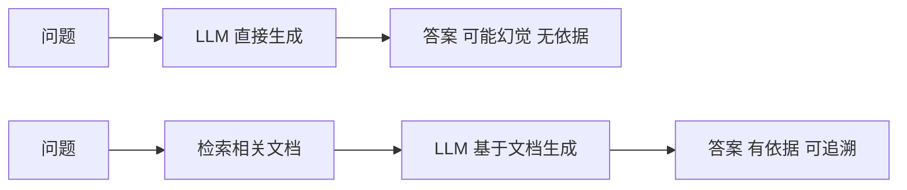

---

title: "LLM幻觉与可靠性"

created: "2026-07-13"

tags:

  - 八股文

  - ai

---

# LLM幻觉与可靠性

> **生活化类比**：幻觉就像一位"记性太好又太自信的同事"——他脑子里拼凑出的细节听起来头头是道，但其中一部分其实是他凭印象编造、现实中并不存在的。

## 核心概念

**幻觉（Hallucination）** 是指 LLM 生成的内容看似合理但实际上不正确、无依据或与事实不符的现象。幻觉是当前 LLM 应用中最关键的可靠性问题之一。

## 幻觉的类型

| 类型 | 定义 | 示例 |

| ------ | ------ | ------ |

| 事实性幻觉 | 生成与客观事实不符的内容 | "爱因斯坦于 1921 年获得诺贝尔物理学奖，因发现了相对论"（实际因光电效应） |

| 上下文幻觉 | 生成与输入上下文矛盾的内容 | 给定文本说"公司去年亏损"，模型却总结为"公司去年盈利" |

| 忠实度幻觉 | 生成与指令要求不符的内容 | 要求写一篇关于机器学习的文章，却写成了深度学习 |

| 推理幻觉 | 逻辑推理过程出现错误 | 数学证明中跳步或使用错误的前提 |

| 引用幻觉 | 编造不存在的引用来源 | "根据 Smith et al. (2023) 的研究..."（该论文不存在） |

## 幻觉产生的原因
### 训练数据层面

| 原因 | 描述 | 影响 |

| ------ | ------ | ------ |

| 训练数据过时 | 知识截止日期后的信息无法获取 | 无法回答最新事件 |

| 数据质量差 | 训练数据包含错误信息 | 学习到错误知识 |

| 数据偏见 | 训练数据分布不均衡 | 在某些领域更容易幻觉 |

| 知识边界模糊 | 模型无法区分"知道"和"不知道" | 在不确定时仍自信输出 |

### 模型架构层面

| 原因 | 描述 | 影响 |

| ------ | ------ | ------ |

| 自回归生成 | 逐步生成，无法回溯修正 | 错误会累积放大 |

| 注意力稀释 | 长序列中注意力分散 | 忽略关键上下文信息 |

| 参数化知识 | 知识编码在参数中，无法精确检索 | 可能混淆相似知识 |

### 解码策略层面

| 策略 | 幻觉风险 | 说明 |

| ------ | --------- | ------ |

| Greedy Decoding | 低 | 总是选概率最高的 token |

| Top-k Sampling | 中 | 引入随机性，可能偏离事实 |

| Top-p (Nucleus) Sampling | 中高 | 采样空间更大，幻觉风险增加 |

| Temperature > 1.0 | 高 | 高随机性增加幻觉概率 |

## 幻觉检测方法
### 基于外部知识

```text

检测流程：

  1. 从 LLM 输出中提取事实性声明

  2. 使用搜索引擎/知识库验证每个声明

  3. 标记无法验证或与知识库矛盾的声明

工具：FactScore, SelfCheckGPT, RARR

```

### 基于模型自身

| 方法 | 原理 | 特点 |

| ------ | ------ | ------ |

| SelfCheckGPT | 多次采样，比较一致性 | 无需外部知识库 |

| 基于困惑度 | 高困惑度区域更可能幻觉 | 简单但不够准确 |

| NLI 模型 | 判断生成内容是否被输入蕴含 | 需要 NLI 模型支持 |

| 校准（Calibration） | 估计模型置信度 | 需要额外校准数据 |

### 人工评估

| 维度 | 评估方法 |

| ------ | --------- |

| 事实准确性 | 领域专家验证 |

| 引用真实性 | 检查引用是否存在 |

| 逻辑一致性 | 检查推理过程 |

| 用户感知 | A/B 测试用户满意度 |

## 幻觉缓解策略
### RAG（检索增强生成，Retrieval-Augmented Generation）



**优势：**

- 提供外部知识作为生成依据，降低"凭空编造"的动机

- 知识可实时更新，缓解训练数据过时问题

- 输出可溯源到具体文档，便于验证与审计

> 关于 RAG 的完整检索/生成流程，详见 [[13-RAG检索增强生成]]（若本模块存在该笔记）。

### Chain-of-Thought（思维链）

```text

无 CoT：

  问题 → 直接回答（容易幻觉）

有 CoT：

  问题 → "让我一步步思考..." → 推理过程 → 最终答案

原理：

  - 强制模型展示推理过程

  - 中间步骤可以被验证

  - 减少跳步导致的错误

```

### Self-Consistency（自一致性）

```text

采样多个推理路径：

  路径1：A → B → C → 答案1

  路径2：A → D → E → 答案1

  路径3：A → F → G → 答案2

选择多数答案（答案1）

原理：

  - 正确的推理路径更可能收敛到相同答案

  - 通过多路径采样降低单次幻觉的影响

```

### 其他缓解策略

| 策略 | 原理 | 适用场景 |

| ------ | ------ | --------- |

| 知识图谱增强 | 结构化知识约束生成 | 知识密集型任务 |

| 声明级归因 | 为每个声明标注来源 | 新闻、学术写作 |

| 后处理验证 | 生成后检查事实性 | 高风险应用 |

| 人工审核 | 关键内容人工确认 | 高风险应用 |

| 置信度校准 | 让模型输出置信度 | 决策支持系统 |

## 可靠性工程实践
### 在生产环境中部署 LLM

| 措施 | 描述 |

| ------ | ------ |

| 输入过滤 | 过滤恶意或低质量输入 |

| 输出过滤 | 检测并过滤可能的幻觉内容 |

| 来源标注 | 要求模型标注信息来源 |

| 置信度阈值 | 低于阈值的输出标记为不可靠 |

| 人机协作 | 关键决策由人类审核 |

| 监控告警 | 监控幻觉率，异常时告警 |

### 评估幻觉的指标

| 指标 | 计算方式 | 说明 |

| ------ | --------- | ------ |

| 幻觉率 | 幻觉声明数 / 总声明数 | 直接反映幻觉比例 |

| 事实准确性 | 正确声明数 / 总声明数 | 衡量事实性 |

| 引用准确率 | 正确引用数 / 总引用数 | 衡量引用可靠性 |

| 用户满意度 | 用户评分 | 主观评估 |

##

> ▶ 对应实操：[[10-RAG评估：检索指标+生成指标|10-RAG 评估：检索指标 + 生成指标]]

## 速记卡（面试闪卡）

**Q1：一句话讲清「LLM幻觉与可靠性」到底是什么？**

A：幻觉是 LLM 生成看似合理却无依据或与事实不符的内容，是核心可靠性问题。

**Q2：核心概念 —— 怎么理解？**

A：像位记性太好又太自信的同事：拼凑出的细节头头是道，一部分却是凭印象编造、现实中不存在。幻觉（Hallucination）即生成内容无依据或与事实不符。

**Q3：幻觉的类型 —— 怎么理解？**

A：像五花八门的"假"：事实性（爱因斯坦获奖理由编错）、上下文（说反盈亏）、忠实度（跑题）、推理（逻辑跳步）、引用（编造论文）。分五类是定位问题的地图。

**Q4：幻觉产生的原因 —— 怎么理解？**

A：像三处漏水的管子：训练数据过时/有误/偏见、自回归无法回溯致错误累积、采样解码（Top-p/高温）引入随机性。模型还分不清"知道"和"不知道"。自回归叫 Autoregressive。

**Q5：幻觉检测方法 —— 怎么理解？**

A：像两路验真：基于外部知识（FactScore 用搜索/库验证每个声明）、基于模型自身（SelfCheckGPT 多次采样比一致性）。生产常多法结合 + 人工评估。

**Q6：核心速记主线有哪些？**

- 幻觉：看似合理却无依据，分事实/上下文/忠实/推理/引用五类

- 成因：数据过时、自回归累积、采样随机、知识边界模糊

- 检测：外部知识验证 + SelfCheckGPT 自一致性

- 缓解：RAG、CoT、Self-Consistency、知识图谱、人机协作

**口诀**

A：幻觉自信编假话，五类地图先记下；

数据过时自回归，采样随机也添岔；

外部验证 SelfCheck，多路验真不抓瞎；

RAG 加 CoT，可靠靠它俩。

相关链接

- [[八股文学习路线图]]

- [[00-全局导航|全局导航]]

## 常见问题

| 问题 | 回答要点 |

| ------ | --------- |

| 什么是 LLM 幻觉？为什么会产生？ | 幻觉是模型生成看似合理但实际不正确的内容。原因包括：训练数据过时或有误、自回归生成无法回溯修正、模型无法区分"知道"和"不知道"、解码策略引入随机性。 |

| RAG 如何缓解幻觉？ | RAG 为 LLM 提供外部知识作为生成依据，减少模型"编造"的动机。检索到的文档作为上下文输入，模型基于文档内容生成答案，使输出更可追溯和可验证。 |

| Chain-of-Thought 为什么能减少幻觉？ | CoT 强制模型展示推理过程，中间步骤可以被验证，减少跳步导致的错误。同时，逐步推理让模型更"谨慎"，在不确定时更可能表达不确定性。 |

| Self-Consistency 的原理是什么？ | 通过多次采样生成多个推理路径，选择多数投票的答案。正确推理更可能收敛到相同答案，单次幻觉的影响被多路径采样降低。 |

| 如何检测 LLM 幻觉？ | 主要有三类方法：(1) 基于外部知识验证（FactScore）；(2) 基于模型自身（SelfCheckGPT、困惑度）；(3) 人工评估。生产环境中通常结合多种方法。 |

| 为什么解码策略会影响幻觉？ | 采样类解码（Top-k、Top-p、高温度）增加随机性，可能导致模型偏离事实性高的 token。高温度下模型更"自由"，但也更容易产生幻觉。 |

| 如何在生产环境中降低幻觉风险？ | 多层防御：输入过滤、输出过滤、来源标注、置信度阈值、人机协作、监控告警。关键是建立完善的监控和回退机制。 |

| 幻觉评估指标有哪些？ | 幻觉率（幻觉声明/总声明）、事实准确性、引用准确率、用户满意度。实际应用中需要结合自动评估和人工评估。 |

## 相关链接

- [[笔记/AI与Agent/知识/八股/11-LLM评估与基准测试|LLM评估与基准测试]]

- [[笔记/AI与Agent/知识/八股/73-LLM推理优化|LLM推理优化]]

- [[笔记/AI与Agent/知识/八股/01-大语言模型LLM原理|大语言模型LLM原理]]

- [[笔记/AI与Agent/知识/八股/12-多模态模型|多模态模型]]

- [[笔记/AI与Agent/知识/八股/21-知识图谱与GraphRAG|知识图谱与GraphRAG]]

