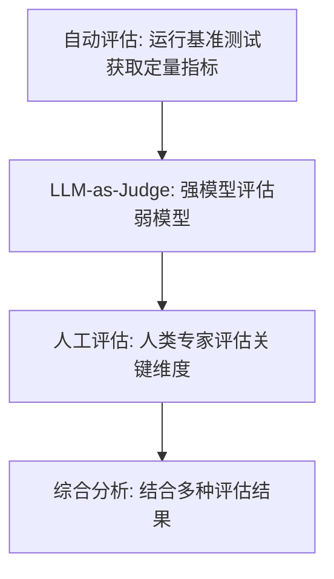

---

title: "LLM评估与基准测试"

created: "2026-07-13"

tags:

  - 八股文

  - ai

---

# LLM评估与基准测试

> **生活化类比**：评估 LLM 就像给企业招人——不能只看"笔试分数"（基准测试），还得看"实际干活表现"（人工/线上 A/B 测试），否则很容易招到一个会刷题但干不了活的候选人。

## 核心概念

**LLM 评估** 是衡量大语言模型能力、质量和适用性的系统化过程。评估是模型选型、优化和部署决策的基础。

## 主流基准测试
### 通用能力基准

| 基准 | 任务类型 | 评估维度 | 特点 |
| ------ | --------- | --------- | ------ |
| MMLU | 多选题（57个学科） | 知识广度和深度 | 覆盖 STEM、人文、社科等 |
| MMLU-Pro | 多选题（10选项） | 更难的 MMLU | 选项更多，更难猜测 |
| HellaSwag | 常识推理 | 常识理解 | 测试日常生活常识 |
| ARC | 科学问答 | 科学知识 | 分为 Easy 和 Challenge 两个版本 |
| WinoGrande | 常识推理 | 代词消歧 | 测试语言理解能力 |

### 代码能力基准

| 基准 | 任务类型 | 评估维度 | 特点 |
| ------ | --------- | --------- | ------ |
| HumanEval | 函数生成 | 代码生成 | 164 个 Python 编程题 |
| MBPP | 函数生成 | 代码生成 | 974 个 Python 编程题 |
| SWE-bench | 软件工程 | 代码修复 | 真实 GitHub Issue 修复 |
| CodeContests | 竞赛编程 | 算法能力 | Codeforces 竞赛题 |
| MultiPL-E | 多语言代码 | 多语言生成 | 支持 18 种编程语言 |

### 数学推理基准

| 基准 | 任务类型 | 评估维度 | 特点 |
| ------ | --------- | --------- | ------ |
| GSM8K | 小学数学 | 数学推理 | 8.5K 道小学数学题 |
| MATH | 高中数学 | 数学推理 | 12.5K 道高中数学题 |
| Minerva | STEM 数学 | 科学推理 | 数学和科学问题 |
| AIME | 竞赛数学 | 高级数学 | 美国数学邀请赛题目 |

### 对话与评估基准

| 基准 | 任务类型 | 评估维度 | 特点 |
| ------ | --------- | --------- | ------ |
| MT-Bench | 多轮对话 | 对话质量 | 80 个多轮对话问题 |
| AlpacaEval | 指令遵循 | 指令理解 | 805 个指令 |
| LMSYS Chatbot Arena | 人类偏好 | 综合能力 | 人类盲测对比 |
| Vicuna Bench | 对话 | 对话能力 | 多维度对话评估 |

## 评估框架
### 自动化评估

| 框架 | 特点 | 适用场景 |
| ------ | ------ | --------- |
| lm-evaluation-harness | 统一评估接口 | 标准基准测试 |
| OpenCompass | 全面评估体系 | 中文模型评估 |
| EleutherAI | 开源评估工具 | 研究和开发 |
| DeepEval | 框架化评估 | 生产环境评估 |

### 评估指标

| 指标类型 | 指标 | 说明 |
| --------- | ------ | ------ |
| 准确性 | Accuracy | 分类任务的正确率 |
| 生成质量 | BLEU, ROUGE | 文本相似度 |
| 语义相似度 | BERTScore | 语义层面的相似度 |
| 困惑度 | Perplexity | 语言模型的不确定性 |
| 人工评估 | 人类评分 | 主观质量评估 |

### 混合评估方法



## 人工评估 vs 自动化评估

| 维度 | 人工评估 | 自动化评估 |
| ------ | --------- | ----------- |
| 精度 | 高（主观判断） | 中（指标限制） |
| 成本 | 高（人力成本） | 低（计算成本） |
| 速度 | 慢 | 快 |
| 可复现性 | 低（主观差异） | 高（确定性） |
| 覆盖面 | 受限于评估者 | 可大规模覆盖 |
| 适用场景 | 最终质量把关 | 开发迭代 |

### LLM-as-Judge

```text

使用强模型（如 GPT-4）评估弱模型：

评估维度：

  1. 准确性：回答是否事实正确

  2. 完整性：回答是否全面

  3. 相关性：回答是否切题

  4. 流畅性：语言是否自然

  5. 有用性：回答是否有帮助

评估流程：

  1. 给出评估标准（rubric）

  2. 提供待评估的回答

  3. LLM 给出评分和理由

  4. 多次评估取平均

```

## LLM A/B 测试
### 测试设计

```text

A/B 测试流程：

  1. 随机分流：用户随机分配到 A 组或 B 组

  2. 不同处理：A 组使用模型 A，B 组使用模型 B

  3. 收集指标：记录用户行为和反馈

  4. 统计分析：比较两组指标差异

  5. 决策：选择表现更好的模型

```

### 关键指标

| 指标类型 | 指标 | 说明 |
| --------- | ------ | ------ |
| 行为指标 | 点击率、停留时间 | 用户行为 |
| 满意度 | 用户评分、反馈 | 主观评价 |
| 任务指标 | 任务完成率、错误率 | 任务效果 |
| 效率指标 | 响应时间、token 消耗 | 系统效率 |

### 统计显著性

```text

需要足够的样本量才能得出可靠结论：

样本量计算：

  n = (Z_α/2 + Z_β)² × 2σ² / δ²

  其中：

  - Z_α/2：显著性水平对应的 Z 值

  - Z_β：统计功效对应的 Z 值

  - σ：标准差

  - δ：最小可检测效应

实际考虑：

  - 显著性水平通常为 0.05

  - 统计功效通常为 0.8

  - 需要运行足够长时间（通常 1-2 周）

```

## 领域特定评估
### 中文能力评估

| 基准 | 描述 |
| ------ | ------ |
| C-Eval | 中文多学科评估（52个学科） |
| CMMLU | 中文多任务语言理解评估 |
| GAOKAO | 中国高考题目 |
| SuperCLUE | 中文综合评估 |

### 专业领域评估

| 领域 | 评估基准 | 特点 |
| ------ | --------- | ------ |
| 医疗 | MedQA, PubMedQA | 医学知识 |
| 法律 | LegalBench | 法律知识 |
| 金融 | FinEval | 金融知识 |
| 科学 | SciQ | 科学知识 |

## 评估最佳实践
### 评估清单

```text

1. 明确评估目标：评估什么能力？

2. 选择合适基准：基准是否覆盖目标能力？

3. 设置基线：与现有模型对比

4. 多维度评估：不要只看单一指标

5. 考虑成本：评估本身的计算成本

6. 可复现性：记录评估环境和参数

7. 持续评估：定期重新评估（模型更新后）

```

### 常见陷阱

| 陷阱 | 描述 | 解决方案 |
| ------ | ------ | --------- |
| 数据泄露 | 测试数据出现在训练中 | 使用新的、未见过的数据 |
| 过拟合基准 | 针对特定基准优化 | 使用多个基准综合评估 |
| 指标单一 | 只看准确率 | 多维度指标综合 |
| 忽略边缘情况 | 只关注平均性能 | 分析不同子集的表现 |
| 评估偏差 | 评估数据有偏见 | 多样化评估数据 |

##

> ▶ 对应实操：[[11-AgenticRAG：LLM主动决策多次检索vs传统单次被动检索|11-Agentic RAG：LLM 主动决策多次检索 vs 传统单次被动检索]]

## 速记卡（面试闪卡）

**Q1：一句话讲清「LLM评估与基准测试」到底是什么？**

A：LLM 评估是衡量模型能力、质量和适用性的系统化过程，是选型与部署决策的基础。

**Q2：核心概念 —— 怎么理解？**

A：像给企业招人——不能只看"笔试分数"(基准测试)，还得看"实际干活表现"(人工/线上 A/B)，否则招来会刷题却干不了活的候选人。评估是模型选型、优化、部署的基础。

**Q3：主流基准测试 —— 怎么理解？**

A：分四类：通用能力(MMLU 57 学科、HellaSwag 常识、WinoGrande 代词消歧)；代码(HumanEval、SWE-bench 真实 Issue 修复)；数学(GSM8K、MATH、AIME)；对话(MT-Bench 多轮、Chatbot Arena 人类盲测)。

**Q4：评估框架 —— 怎么理解？**

A：自动化框架：lm-evaluation-harness(统一接口)、OpenCompass(中文全面)、DeepEval(生产环境)。指标：Accuracy/BLEU/ROUGE 文本相似、BERTScore 语义相似、Perplexity 不确定性。混合=自动基准+LLM-as-Judge+人工。

**Q5：人工评估 vs 自动化评估 —— 怎么理解？**

A：人工精度高、成本高、慢、可复现低，用于最终把关；自动化精度中、成本低、快、可复现高，用于开发迭代。实际先用自动化筛，再用人工验关键场景。

**Q6：核心速记主线有哪些？**

- 评估像招人：笔试(基准)+ 实干(线上)都要看

- 基准分四类：通用 / 代码 / 数学 / 对话

- 框架与指标：harness/OpenCompass + Accuracy/BLEU/BERTScore

- 混合评估：自动基准 + LLM-as-Judge + 人工把关

**口诀**

A：评估模型像招人，笔试实干两手抓

MMLU 测通用，HumanEval 验码

自动快而人工准，混合才稳妥

单一指标会刷分，多维综合查

相关链接

- [[八股文学习路线图]]

- [[笔记/00-全局导航|全局导航]]

## 常见问题

| 问题 | 回答要点 |
| ------ | --------- |
| MMLU 是什么？评估什么能力？ | MMLU（Massive Multitask Language Understanding）是一个多选题基准，覆盖 57 个学科，评估模型的知识广度和深度。包括 STEM、人文、社科等领域，是评估 LLM 通用能力的重要基准。 |
| 代码能力如何评估？ | 主要基准：HumanEval（函数生成）、MBPP（函数生成）、SWE-bench（代码修复）。评估维度：代码生成的正确性、效率、可读性。HumanEval 通过 pass@k 指标评估，即 k 次生成中至少一次正确的概率。 |
| LLM-as-Judge 的原理是什么？ | 使用强模型（如 GPT-4）作为评估者，给定评估标准（rubric）和待评估的回答，让强模型给出评分和理由。优点是成本低、可扩展；缺点是可能存在偏差，需要多次评估取平均。 |
| A/B 测试在 LLM 中如何应用？ | 将用户随机分配到不同模型版本，比较关键指标（满意度、任务完成率等）。需要足够样本量和统计显著性。通常运行 1-2 周，考虑日间差异和用户群体差异。 |
| 自动化评估和人工评估如何结合？ | 自动化评估用于开发迭代（快速、低成本），人工评估用于最终质量把关（高质量、主观判断）。实际中通常先用自动化评估筛选，再用人工评估验证关键场景。 |
| 为什么不能只看单一指标？ | 不同指标反映不同维度：准确率反映正确性，流畅性反映语言质量，有用性反映实际价值。单一指标可能被"刷分"（针对特定指标优化），需要多维度综合评估。 |
| 评估数据泄露是什么问题？ | 如果测试数据出现在训练集中，评估结果会虚高。解决方法：使用新的、未见过的数据；定期更新评估集；检查训练数据和测试数据的重叠。 |
| 如何评估中文 LLM 能力？ | 中文基准：C-Eval（多学科）、CMMLU（多任务）、GAOKAO（高考题目）。评估维度：知识理解、推理能力、语言流畅度。还需要考虑中文特有的语言现象和文化背景。 |

## 相关链接

- [[笔记/AI与Agent/知识/八股/10-LLM幻觉与可靠性|LLM幻觉与可靠性]]

- [[笔记/AI与Agent/知识/八股/73-LLM推理优化|LLM推理优化]]

- [[笔记/AI与Agent/知识/八股/66-大模型安全与伦理|大模型安全与伦理]]

- [[笔记/AI与Agent/知识/八股/22-RAG评估指标|RAG评估指标]]

- [[笔记/AI与Agent/知识/八股/65-AI应用架构设计|AI应用架构设计]]

